# Chapter 1: Infrastructure & Building Blocks

> Core primitives that power every large-scale distributed system.

Every modern distributed system—from social networks serving billions of users to financial platforms processing millions of transactions per second—is built on a shared set of infrastructure primitives. These building blocks solve universal challenges: how to protect services from overload, how to distribute data across machines, how to generate identifiers without coordination, and how to serve content with minimal latency. This chapter dissects eight such primitives in depth, treating each as a self-contained system design case study complete with capacity math, API contracts, data models, and architecture diagrams. Master these, and you hold the keys to designing any large-scale system.

---

## 1. Rate Limiter

### Problem Statement

In any system exposed to the internet, uncontrolled traffic is the enemy of reliability. A single misbehaving client—whether a buggy script, an aggressive crawler, or a deliberate denial-of-service attack—can saturate your servers, starve legitimate users, and cascade failures across dependent services. Without a mechanism to enforce usage limits, your infrastructure is only as strong as its weakest link under peak load.

A **rate limiter** is a defensive component that controls the rate of requests a client can send to a server within a defined time window. It sits on the critical path of every request and must make allow/deny decisions in microseconds. Rate limiters are found at every layer of a modern stack: API gateways throttle per-API-key usage, microservices protect themselves from noisy neighbors, and databases guard connection pools from saturation.

Beyond protection, rate limiters enable **business policy enforcement**. A SaaS platform may offer 100 req/s on its free tier and 10,000 req/s on its enterprise tier. A payment processor may cap transaction attempts to prevent fraud. A messaging service may limit sends to comply with anti-spam regulations. The rate limiter is the enforcement engine for all of these policies.

### Use Cases

- **API throttling**: Enforce per-key or per-user request limits on public APIs (e.g., GitHub API: 5,000 req/hour for authenticated users).
- **DDoS mitigation**: Drop excessive traffic from a single IP before it reaches application servers.
- **Tiered pricing enforcement**: Apply different rate limits based on subscription plan (free, pro, enterprise).
- **Login brute-force protection**: Limit authentication attempts to 5 per minute per account.
- **Microservice protection**: Prevent a noisy upstream service from overloading a downstream dependency.
- **Cost control**: Cap calls to expensive third-party APIs (e.g., OpenAI, Twilio) to avoid bill shock.
- **Fair usage in multi-tenant systems**: Ensure no single tenant monopolizes shared resources.
- **Write throttling**: Limit write operations to protect database write capacity.

### Functional Requirements

- **FR1**: Allow or deny a request based on a configurable rate limit (requests per time window).
- **FR2**: Support multiple rate limit rules per client (e.g., 100/min AND 5,000/hour).
- **FR3**: Identify clients by API key, user ID, IP address, or a combination thereof.
- **FR4**: Return informative headers: `X-RateLimit-Limit`, `X-RateLimit-Remaining`, `X-RateLimit-Reset`.
- **FR5**: Support different throttling actions: reject (HTTP 429), queue, or degrade gracefully.
- **FR6**: Allow dynamic rule updates without service restart.
- **FR7**: Support both global (cluster-wide) and local (per-node) rate limiting.
- **FR8**: Provide an admin API to view current usage and override limits.

### Non-Functional Requirements

- **NFR1**: **Latency** — Decision must add < 1 ms to request path (p99).
- **NFR2**: **Throughput** — Handle 1M+ decisions/sec across the cluster.
- **NFR3**: **Availability** — 99.99% uptime; fail-open on limiter outage (allow traffic rather than block).
- **NFR4**: **Accuracy** — Overshoot by at most 1% of configured limit (minor race conditions acceptable).
- **NFR5**: **Scalability** — Scale horizontally with the number of distinct clients.
- **NFR6**: **Consistency** — Eventual consistency across nodes within a 1-second window is acceptable.
- **NFR7**: **Durability** — Rules are persisted; counters are ephemeral (in-memory or Redis).
- **NFR8**: **Observability** — Emit metrics for allowed, denied, and total requests per rule.

### Capacity Estimation

- **Clients**: 10 million distinct API keys
- **Traffic**: 500,000 requests/sec aggregate across all clients
- **Counter size**: Each counter = key (64 bytes) + count + timestamp (16 bytes) = ~80 bytes
- **Active counters**: Assume 1M clients active in any given minute
  - Memory = 1,000,000 × 80 bytes = **80 MB** (fits easily in Redis)
- **Sliding window log** (if used): Each request logs a timestamp (8 bytes)
  - Worst case: 100 req/min × 1M active clients = 100M entries × 8 bytes = **800 MB**
- **Redis throughput**: A single Redis instance handles ~100K ops/sec
  - For 500K req/sec, need **5-6 Redis shards** (with headroom)
- **Bandwidth**: 500K req/sec × ~200 bytes overhead per check = **100 MB/s**
- **Storage for rules**: 10M keys × 200 bytes/rule = **2 GB** (persisted in a database)

### API Design

```http
# Check rate limit (typically called internally by API Gateway)
POST /api/v1/rate-limit/check
Content-Type: application/json

{
  "client_id": "api_key_abc123",
  "resource": "/api/v1/messages",
  "method": "POST",
  "weight": 1
}

Response 200 (Allowed):
{
  "allowed": true,
  "limit": 100,
  "remaining": 73,
  "reset_at": "2025-01-15T10:01:00Z",
  "retry_after": null
}

Response 200 (Denied):
{
  "allowed": false,
  "limit": 100,
  "remaining": 0,
  "reset_at": "2025-01-15T10:01:00Z",
  "retry_after": 27
}
```

```http
# Manage rate limit rules
GET /api/v1/rate-limit/rules?client_id=api_key_abc123
POST /api/v1/rate-limit/rules
PUT /api/v1/rate-limit/rules/{rule_id}
DELETE /api/v1/rate-limit/rules/{rule_id}

# Example: Create a rule
POST /api/v1/rate-limit/rules
{
  "client_id": "api_key_abc123",
  "resource": "/api/v1/messages",
  "max_requests": 100,
  "window_seconds": 60,
  "action": "reject"
}

Response 201:
{
  "id": "rule_001",
  "client_id": "api_key_abc123",
  "resource": "/api/v1/messages",
  "max_requests": 100,
  "window_seconds": 60,
  "action": "reject",
  "created_at": "2025-01-15T09:00:00Z"
}
```

```http
# Error response (when the rate limiter itself is the gateway)
HTTP/1.1 429 Too Many Requests
X-RateLimit-Limit: 100
X-RateLimit-Remaining: 0
X-RateLimit-Reset: 1705312860
Retry-After: 27

{
  "error": "rate_limit_exceeded",
  "message": "Rate limit of 100 requests per 60 seconds exceeded.",
  "retry_after": 27
}
```

### Data Model

```sql
-- Rate limit rules (persisted in PostgreSQL)
CREATE TABLE rate_limit_rules (
    id              UUID PRIMARY KEY DEFAULT gen_random_uuid(),
    client_id       VARCHAR(128) NOT NULL,
    resource        VARCHAR(256) DEFAULT '*',
    method          VARCHAR(10) DEFAULT '*',
    max_requests    INT NOT NULL,
    window_seconds  INT NOT NULL,
    action          VARCHAR(20) DEFAULT 'reject',  -- reject | queue | degrade
    enabled         BOOLEAN DEFAULT TRUE,
    created_at      TIMESTAMPTZ DEFAULT NOW(),
    updated_at      TIMESTAMPTZ DEFAULT NOW()
);

CREATE INDEX idx_rules_client ON rate_limit_rules(client_id);
CREATE INDEX idx_rules_resource ON rate_limit_rules(resource, method);
```

```
# Redis data structures (ephemeral counters)

# Fixed Window Counter
Key:   rl:{client_id}:{resource}:{window_start}
Value: integer counter
TTL:   window_seconds

# Sliding Window Log
Key:   rl:log:{client_id}:{resource}
Type:  Sorted Set (score = Unix timestamp)
TTL:   window_seconds

# Token Bucket
Key:   rl:bucket:{client_id}:{resource}
Type:  Hash { tokens: float, last_refill: timestamp }
TTL:   2 × window_seconds
```

### High-Level Design

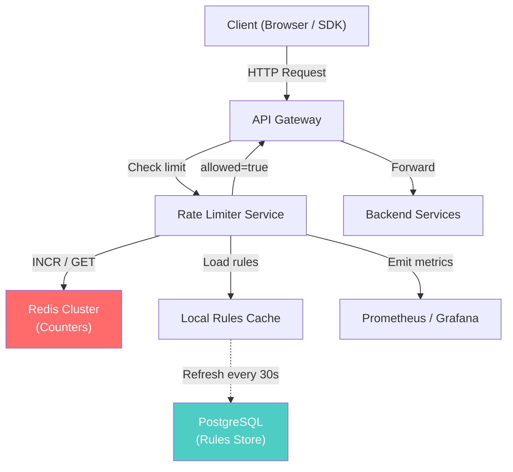

**Component Responsibilities:**

- **API Gateway**: Intercepts every request, calls the rate limiter before forwarding.
- **Rate Limiter Service**: Stateless service that evaluates rules against Redis counters.
- **Redis Cluster**: Stores ephemeral counters with automatic TTL expiry. Sharded by client_id.
- **Rules Store (PostgreSQL)**: Persistent storage for rate limit rules, updated via admin API.
- **Local Rules Cache**: In-memory cache refreshed every 30 seconds to avoid DB calls on every request.
- **Metrics**: Tracks allowed/denied rates, latency percentiles, and per-client usage.

### Deep Dive

#### Core Algorithms

**1. Token Bucket**
The most widely used algorithm (used by AWS, Stripe, and most API gateways). Each client has a "bucket" that holds tokens, refilled at a steady rate. Each request consumes one token. If the bucket is empty, the request is denied.

- **Parameters**: `bucket_size` (burst capacity), `refill_rate` (tokens/sec)
- **Pros**: Allows short bursts while enforcing average rate. Simple to implement.
- **Cons**: Requires atomic read-modify-write on the bucket state.

```
Lua script (atomic in Redis):
  local tokens = tonumber(redis.call('HGET', key, 'tokens'))
  local last = tonumber(redis.call('HGET', key, 'last_refill'))
  local now = tonumber(ARGV[1])
  local elapsed = now - last
  tokens = math.min(bucket_size, tokens + elapsed * refill_rate)
  if tokens >= 1 then
    tokens = tokens - 1
    redis.call('HMSET', key, 'tokens', tokens, 'last_refill', now)
    return 1  -- allowed
  else
    return 0  -- denied
  end
```

**2. Sliding Window Log**
Stores the timestamp of every request in a sorted set. To check the limit, count entries within the last `window_seconds`. Accurate but memory-intensive for high-rate clients.

**3. Sliding Window Counter (Hybrid)**
Combines fixed window counters with weighted overlap. For a 1-minute window at time 0:45, the effective count = `prev_window_count × 0.25 + current_window_count`. Offers a good trade-off between accuracy and memory.

**4. Fixed Window Counter**
Simplest approach: increment a counter keyed by `client_id + window_start`. The edge problem: two bursts at a window boundary can allow 2× the limit. Acceptable for non-critical use cases.

#### Distributed Rate Limiting

In a multi-node deployment, each node could maintain local counters, but this allows `N × limit` total requests (where N is the number of nodes). Solutions:

1. **Centralized counter (Redis)**: All nodes check a shared Redis. This is the standard approach. Use Redis Cluster for sharding and Lua scripts for atomicity.
2. **Sticky sessions**: Route all traffic from a client to the same node. Limits are local. Simpler but creates hot spots.
3. **Gossip-based sync**: Nodes periodically share counter state. Allows slight overshoot but avoids a single point of failure.

#### Failure Handling

- **Redis down**: Fail open (allow all traffic). The backend must have its own circuit breakers. Alternatively, fall back to local in-memory counters with relaxed accuracy.
- **Network partition**: Nodes may diverge. Accept temporary overshoot (1-5%) until connectivity is restored.
- **Clock skew**: Use Redis server time (`TIME` command) instead of client time to avoid inconsistencies.

#### Race Conditions

Concurrent requests from the same client can race on counter reads. Solutions:
- **Redis Lua scripts**: Atomic read-modify-write within Redis.
- **Redis `MULTI/EXEC`**: Transaction support, but less flexible than Lua.
- **Optimistic locking with `WATCH`**: Retry on conflict.

### Bottlenecks & Mitigations

| Bottleneck | Mitigation |
|---|---|
| Redis becomes a single point of failure | Use Redis Cluster with 3+ shards and replicas; fall back to local counters on failure |
| Hot keys (celebrity clients) | Shard counters by `client_id + resource`; use local aggregation before Redis write |
| Lua script latency under high load | Keep scripts minimal; pre-load with `SCRIPT LOAD` |
| Rule cache staleness | Use pub/sub or polling with 10-30s refresh; accept brief inconsistency |
| Network round-trip to Redis | Co-locate rate limiter with Redis in the same availability zone; use connection pooling |
| Memory growth with sliding window log | Use sliding window counter (hybrid) instead for high-rate clients |

### Key Takeaways

- **Token bucket** is the industry-standard algorithm—simple, memory-efficient, and burst-friendly.
- **Redis** is the de facto choice for distributed counters: atomic operations, TTL support, and sub-ms latency.
- Always design for **fail-open**: a rate limiter outage should not take down the entire system.
- **Sliding window counter** provides the best accuracy-to-memory ratio for most use cases.
- Rate limiting is a **policy enforcement mechanism**, not just protection—tie it to your business model.
- Use **Lua scripts** in Redis for atomic counter operations to avoid race conditions.

---

## 2. Consistent Hashing

### Problem Statement

When you distribute data across N servers using simple modular hashing (`hash(key) % N`), adding or removing a single server remaps nearly all keys. If you have 100 servers and add a 101st, roughly 99% of keys move. For a cache cluster, this means a near-total cache miss storm—every key must be re-fetched from the database, potentially bringing down the origin under a thundering herd.

**Consistent hashing** solves this by ensuring that when a node is added or removed, only `K/N` keys are remapped on average (where K is the total number of keys and N is the number of nodes). This property is critical for distributed caches (Memcached, Redis), distributed databases (Cassandra, DynamoDB), load balancers, and content delivery networks.

The technique was first described by Karger et al. in 1997 and has become a foundational building block for distributed systems. Variations like **virtual nodes (vnodes)** and **jump consistent hashing** extend the basic idea to handle heterogeneous hardware and improve load balancing.

### Use Cases

- **Distributed caching**: Memcached and Redis clusters use consistent hashing to route keys to cache nodes.
- **Database sharding**: Cassandra and DynamoDB assign partition ranges using consistent hash rings.
- **Load balancing**: Nginx and HAProxy use consistent hashing for sticky session routing.
- **CDN request routing**: Route content requests to the nearest cache node that owns the content.
- **Distributed file systems**: HDFS and Ceph use variants for block placement.
- **Service discovery**: Route requests to service instances based on request attributes.
- **Partitioned message queues**: Kafka assigns partitions to consumers using consistent hashing principles.

### Functional Requirements

- **FR1**: Map a key to one of N nodes deterministically.
- **FR2**: When a node is added, remap only ~`K/N` keys (minimal disruption).
- **FR3**: When a node is removed, redistribute its keys to remaining nodes.
- **FR4**: Support weighted nodes (nodes with more capacity get more keys).
- **FR5**: Support replication by mapping a key to `R` successive nodes on the ring.
- **FR6**: Provide O(log N) lookup time.
- **FR7**: Allow dynamic addition and removal of nodes without downtime.

### Non-Functional Requirements

- **NFR1**: **Load balance** — Standard deviation of load across nodes < 10% with virtual nodes.
- **NFR2**: **Latency** — Lookup in < 10 µs (in-memory ring traversal).
- **NFR3**: **Scalability** — Support up to 10,000 physical nodes.
- **NFR4**: **Availability** — Ring metadata replicated across all clients; no single point of failure.
- **NFR5**: **Consistency** — All clients must converge on the same ring view within seconds.
- **NFR6**: **Monotonicity** — Adding a node only moves keys to the new node, never between existing nodes.
- **NFR7**: **Determinism** — Same input key always maps to the same node given the same ring.

### Capacity Estimation

- **Nodes**: 200 physical servers
- **Virtual nodes per physical node**: 150 (standard for good distribution)
- **Total ring positions**: 200 × 150 = **30,000 virtual nodes**
- **Ring data structure**: Each vnode entry = hash (32 bytes) + node reference (64 bytes) = ~96 bytes
  - Total ring size = 30,000 × 96 bytes = **2.88 MB** (trivially fits in memory)
- **Keys**: 10 billion keys distributed across 200 nodes
  - Average keys per node = 10B / 200 = **50 million keys/node**
- **Lookup**: Binary search on sorted ring = O(log 30,000) ≈ **15 comparisons** → < 1 µs
- **Rebalancing on node addition**: ~1/200 = **0.5% of keys** migrate (50M keys)
  - At 10K keys/sec migration rate = ~83 minutes for full rebalance

### API Design

```http
# Consistent hashing is typically a library, not a service.
# However, if exposed as a coordination service:

# Get the node responsible for a key
GET /api/v1/ring/lookup?key=user:12345
Response 200:
{
  "key": "user:12345",
  "hash": "a3f2b8c1",
  "primary_node": "node-042",
  "replica_nodes": ["node-043", "node-067"],
  "ring_version": 47
}

# Register a new node
POST /api/v1/ring/nodes
{
  "node_id": "node-201",
  "address": "10.0.5.201:6379",
  "weight": 1.5,
  "virtual_nodes": 225
}
Response 201:
{
  "node_id": "node-201",
  "virtual_nodes_created": 225,
  "ring_version": 48,
  "estimated_keys_to_migrate": 51200000
}

# Remove a node (graceful decommission)
DELETE /api/v1/ring/nodes/node-042
Response 200:
{
  "node_id": "node-042",
  "status": "draining",
  "keys_to_redistribute": 49800000,
  "ring_version": 49
}

# Get ring status
GET /api/v1/ring/status
Response 200:
{
  "total_nodes": 200,
  "total_virtual_nodes": 30000,
  "ring_version": 49,
  "load_distribution": {
    "mean_keys_per_node": 50000000,
    "std_deviation": 2100000,
    "min": 45200000,
    "max": 55800000
  }
}
```

### Data Model

```sql
-- Ring membership (persisted in ZooKeeper / etcd / PostgreSQL)
CREATE TABLE ring_nodes (
    node_id         VARCHAR(64) PRIMARY KEY,
    address         VARCHAR(128) NOT NULL,
    port            INT NOT NULL,
    weight          FLOAT DEFAULT 1.0,
    num_vnodes      INT DEFAULT 150,
    status          VARCHAR(20) DEFAULT 'active', -- active | draining | down
    joined_at       TIMESTAMPTZ DEFAULT NOW(),
    last_heartbeat  TIMESTAMPTZ DEFAULT NOW()
);

CREATE TABLE virtual_nodes (
    hash_value      BIGINT NOT NULL,
    node_id         VARCHAR(64) NOT NULL REFERENCES ring_nodes(node_id),
    vnode_index     INT NOT NULL,
    PRIMARY KEY (hash_value)
);

CREATE INDEX idx_vnodes_sorted ON virtual_nodes(hash_value);
CREATE INDEX idx_vnodes_node ON virtual_nodes(node_id);
```

### High-Level Design

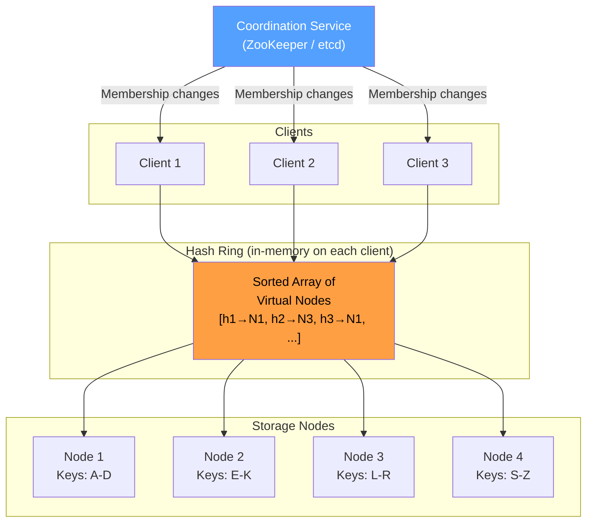

**Component Responsibilities:**

- **Clients**: Each client maintains a local copy of the hash ring and performs lookups locally (no network hop for routing decisions).
- **Hash Ring**: A sorted array of virtual node hashes. Lookup is a binary search for the first vnode hash ≥ `hash(key)`.
- **Storage Nodes**: The actual servers holding data. Each physical node owns multiple positions on the ring via virtual nodes.
- **Coordination Service**: Manages membership (joins, leaves, failures). Notifies clients of ring changes via watches/subscriptions.

### Deep Dive

#### The Hash Ring Concept

Imagine a circle (ring) with positions from 0 to 2³²−1. Each node is hashed to a position on this ring. Each key is also hashed, and it is assigned to the **first node encountered clockwise** from its hash position.

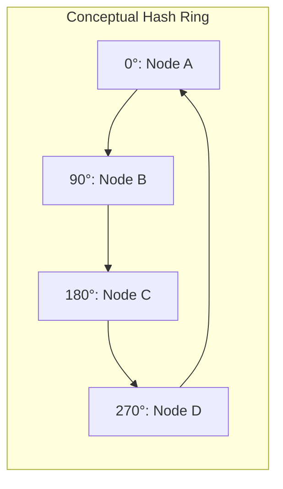

When Node C is removed, only keys between Node B (90°) and Node C (180°) are remapped—they move to Node D. All other keys are unaffected.

#### Virtual Nodes (Vnodes)

A naive consistent hash ring with few nodes produces uneven load distribution. Virtual nodes solve this:

- Each physical node is mapped to `V` positions on the ring (e.g., V = 150).
- Hash function: `hash(node_id + "#" + vnode_index)` for each index 0..V-1.
- More vnodes → smoother distribution but larger ring data structure.

**Impact of vnode count on balance:**

| Vnodes per Node | Std Dev of Load |
|---|---|
| 1 | ~60% |
| 10 | ~20% |
| 100 | ~6% |
| 150 | ~5% |
| 500 | ~2% |

150 vnodes per node is a common production choice—good balance with manageable ring size.

#### Weighted Nodes

Heterogeneous hardware (e.g., some nodes have 64 GB RAM, others 256 GB) can be accommodated by varying the number of virtual nodes:

```
vnodes_for_node = base_vnodes × node.weight
```

A node with `weight = 2.0` gets 300 vnodes (2× the keys) compared to a `weight = 1.0` node with 150 vnodes.

#### Replication Strategy

To replicate data for fault tolerance, a key is stored on the `R` nodes found by walking clockwise from the key's position. To avoid placing replicas on the same physical node (when using vnodes), skip virtual nodes belonging to the same physical node:

```
replicas = []
walk clockwise from hash(key):
  for each vnode encountered:
    if vnode.physical_node not in replicas:
      replicas.append(vnode.physical_node)
    if len(replicas) == R:
      break
```

#### Handling Node Failures

1. **Detection**: Coordination service detects failure via missed heartbeats (e.g., 3 consecutive misses at 10s intervals).
2. **Ring update**: Failed node's vnodes are removed. Keys are automatically routed to the next node clockwise.
3. **Data recovery**: Replica nodes already hold copies. A new replica is created on another node to restore replication factor.
4. **Hinted handoff**: If the destination node is temporarily down, a neighbor holds the data with a "hint" to forward it when the node recovers (used by Cassandra and DynamoDB).

### Bottlenecks & Mitigations

| Bottleneck | Mitigation |
|---|---|
| Uneven load distribution with few nodes | Use 100-200 virtual nodes per physical node |
| Ring convergence delay across clients | Use ZooKeeper watches or etcd leases for fast propagation (< 1s) |
| Hot keys (celebrity problem) | Replicate hot keys to multiple nodes; add read replicas |
| Large ring size with thousands of nodes | Use jump consistent hash (O(1) lookup, zero memory) for static clusters |
| Thundering herd during node addition | Migrate keys incrementally with backpressure; warm caches before cutover |
| Split-brain during network partition | Use quorum-based reads/writes; coordinate via consensus (Raft/Paxos) |

### Key Takeaways

- Consistent hashing remaps only **K/N keys** on membership changes vs. nearly all keys with modular hashing.
- **Virtual nodes** are essential for load balance—use 100-200 per physical node in production.
- The ring is a **client-side data structure**; lookups are local with O(log N) binary search.
- **Replication** is natural: walk clockwise to find R distinct physical nodes.
- Used by Cassandra, DynamoDB, Memcached, Akamai CDN, and Discord.
- For static clusters, **jump consistent hash** offers O(1) lookup with zero memory overhead.

---

## 3. Unique / Distributed ID Generator

### Problem Statement

Every entity in a distributed system—users, orders, messages, events—needs a unique identifier. In a single-database system, an auto-incrementing integer suffices. But in a distributed environment with multiple databases, microservices, and data centers, there is no single authority to hand out sequential IDs. Relying on a centralized ID service creates a bottleneck and a single point of failure.

A **distributed ID generator** must produce globally unique identifiers without coordination between nodes. These IDs often need to be **roughly time-ordered** (so they work as database primary keys with good index locality), **compact** (to minimize storage and network overhead), and generated at extremely high throughput (millions per second). The design space includes UUIDs, database-based sequences, Snowflake-style IDs, and ULID/KSUID variants.

The choice of ID scheme has far-reaching consequences. Random UUIDs fragment B-tree indexes, causing write amplification. Sequential IDs leak business information (competitor can estimate your order volume). Timestamp-based IDs require clock synchronization. Every trade-off matters at scale.

### Use Cases

- **Database primary keys**: Every row in every table needs a unique ID.
- **Distributed event ordering**: Kafka message keys, event sourcing IDs.
- **URL shorteners**: Generate short, unique slugs (e.g., bit.ly/abc123).
- **Distributed tracing**: Unique trace IDs and span IDs across microservices (e.g., Jaeger, Zipkin).
- **File/object naming**: S3 object keys, image uploads, log files.
- **Session tokens**: Unique session identifiers for authentication.
- **Idempotency keys**: Unique request identifiers to prevent duplicate processing.
- **Social media posts**: Twitter snowflake IDs for tweets, Instagram IDs for photos.

### Functional Requirements

- **FR1**: Generate globally unique 64-bit integer IDs (or 128-bit for UUID variants).
- **FR2**: IDs must be roughly time-ordered (sortable by creation time).
- **FR3**: Generate IDs without cross-node coordination.
- **FR4**: Support ID generation at 10,000+ IDs/sec per node.
- **FR5**: IDs must be parseable to extract embedded timestamp.
- **FR6**: Support multiple ID namespaces (e.g., users, orders, messages).
- **FR7**: IDs must not leak sensitive information (total count, generation rate).
- **FR8**: Provide both API-based and library-based generation.

### Non-Functional Requirements

- **NFR1**: **Throughput** — 100,000+ IDs/sec per node; 10M+ IDs/sec cluster-wide.
- **NFR2**: **Latency** — < 1 ms per ID generation (local operation).
- **NFR3**: **Uniqueness guarantee** — Zero collisions over the system's lifetime.
- **NFR4**: **Availability** — ID generation must never block; 99.999% uptime.
- **NFR5**: **Ordering** — IDs generated at time T1 < IDs generated at time T2 (within a node).
- **NFR6**: **Compactness** — 64 bits preferred for storage efficiency and index performance.
- **NFR7**: **Clock tolerance** — Handle clock skew of up to 5 seconds between nodes.
- **NFR8**: **Scalability** — Support 1,000+ generator nodes.

### Capacity Estimation

- **ID generation rate**: 100,000 IDs/sec per node × 100 nodes = **10 million IDs/sec**
- **ID size**: 64 bits = 8 bytes per ID
- **IDs per day**: 10M/sec × 86,400 sec = **864 billion IDs/day**
- **Storage for IDs (as PKs)**: 864B × 8 bytes = **6.9 TB/day** (just the ID column)
- **Snowflake bit allocation** (64-bit):
  - 1 bit: sign (always 0)
  - 41 bits: millisecond timestamp → 2⁴¹ ms = **69.7 years** from epoch
  - 10 bits: machine/datacenter ID → **1,024 nodes**
  - 12 bits: sequence number → **4,096 IDs per millisecond per node**
  - Max throughput per node = 4,096 × 1,000 = **4,096,000 IDs/sec**
- **Custom epoch**: Use a recent epoch (e.g., 2020-01-01) to extend the 41-bit timestamp life.

### API Design

```http
# Generate a single ID
POST /api/v1/ids/generate
{
  "namespace": "orders",
  "count": 1
}
Response 200:
{
  "ids": [7199254740992000001],
  "namespace": "orders",
  "generated_at": "2025-01-15T10:30:00.123Z"
}

# Generate a batch of IDs
POST /api/v1/ids/generate
{
  "namespace": "messages",
  "count": 1000
}
Response 200:
{
  "ids": [7199254740992000001, 7199254740992000002, ...],
  "namespace": "messages",
  "count": 1000,
  "generated_at": "2025-01-15T10:30:00.123Z"
}

# Parse an ID (extract components)
GET /api/v1/ids/parse/7199254740992000001
Response 200:
{
  "id": 7199254740992000001,
  "timestamp": "2025-01-15T10:30:00.123Z",
  "datacenter_id": 5,
  "machine_id": 12,
  "sequence": 1
}

# Get generator status
GET /api/v1/ids/status
Response 200:
{
  "node_id": "dc5-machine12",
  "ids_generated_total": 4829100423,
  "ids_generated_last_minute": 245000,
  "clock_offset_ms": -2
}
```

### Data Model

```sql
-- ID generator is mostly stateless; state is in the generator process.
-- Persistent metadata for node assignment:

CREATE TABLE id_generator_nodes (
    node_id         INT PRIMARY KEY,          -- 0-1023 (10-bit range)
    datacenter_id   INT NOT NULL,             -- 0-31 (5 bits)
    machine_id      INT NOT NULL,             -- 0-31 (5 bits)
    hostname        VARCHAR(128),
    registered_at   TIMESTAMPTZ DEFAULT NOW(),
    last_heartbeat  TIMESTAMPTZ DEFAULT NOW(),
    status          VARCHAR(20) DEFAULT 'active',
    UNIQUE (datacenter_id, machine_id)
);

-- Optional: ID range allocation (for DB-ticket approach)
CREATE TABLE id_ranges (
    namespace       VARCHAR(64) NOT NULL,
    range_start     BIGINT NOT NULL,
    range_end       BIGINT NOT NULL,
    allocated_to    VARCHAR(64),
    allocated_at    TIMESTAMPTZ DEFAULT NOW(),
    PRIMARY KEY (namespace, range_start)
);
```

### High-Level Design

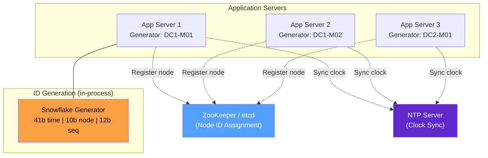

**Component Responsibilities:**

- **Snowflake Generator**: In-process library that combines timestamp, node ID, and sequence number. Zero network calls for ID generation.
- **ZooKeeper/etcd**: Assigns unique node IDs to generators at startup. Prevents two generators from having the same node ID.
- **NTP Server**: Keeps clocks synchronized across nodes. Critical because the 41-bit timestamp is the primary ordering mechanism.

### Deep Dive

#### Snowflake ID Anatomy (64-bit)

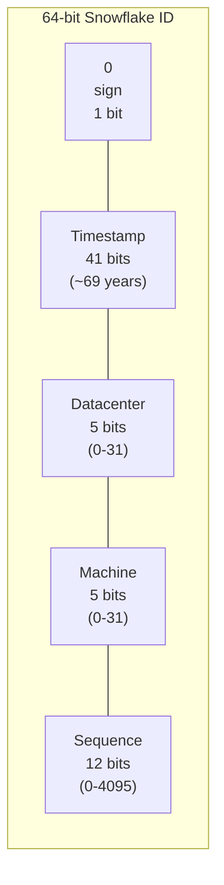

**Generation algorithm:**

```
function generate_id():
    now = current_time_ms() - CUSTOM_EPOCH
    if now == last_timestamp:
        sequence = (sequence + 1) & 0xFFF  // 12-bit mask
        if sequence == 0:
            now = wait_until_next_ms(last_timestamp)
    else:
        sequence = 0
    last_timestamp = now
    return (now << 22) | (datacenter_id << 17) | (machine_id << 12) | sequence
```

#### Clock Skew Handling

The biggest risk in Snowflake is **clock going backwards** (due to NTP correction or leap seconds). Strategies:

1. **Refuse to generate**: If `current_time < last_timestamp`, throw an error or block until time catches up. This is what Twitter's original Snowflake does.
2. **Logical clock extension**: Use the sequence bits as an overflow counter, advancing the logical timestamp when physical time goes backwards.
3. **Bounded tolerance**: Accept clock skew up to 5ms; reject larger skews and alert operations.

#### Alternative Approaches

| Approach | Size | Ordered | Coordination | Throughput |
|---|---|---|---|---|
| UUID v4 (random) | 128 bits | No | None | Unlimited |
| UUID v7 (time-based) | 128 bits | Yes | None | Unlimited |
| Snowflake | 64 bits | Yes | Node ID | 4M/node/sec |
| DB auto-increment | 64 bits | Yes | Per-shard | ~10K/sec |
| DB ticket server (Flickr) | 64 bits | Yes | Per-server | ~50K/sec |
| ULID | 128 bits | Yes | None | Unlimited |
| KSUID | 160 bits | Yes | None | Unlimited |

#### Database Ticket Server (Flickr Approach)

Two MySQL servers with different auto-increment offsets:
- Server 1: `auto_increment_increment = 2, auto_increment_offset = 1` → generates 1, 3, 5, ...
- Server 2: `auto_increment_increment = 2, auto_increment_offset = 2` → generates 2, 4, 6, ...

Clients round-robin between servers. If one server dies, the other continues (with only odd or even IDs). Simple but limited throughput.

### Bottlenecks & Mitigations

| Bottleneck | Mitigation |
|---|---|
| Clock skew causes duplicate IDs | Use NTP with tight synchronization (< 1ms); refuse generation on backward clock jump |
| Node ID exhaustion (10 bits = 1024 nodes) | Reclaim IDs from dead nodes via ZooKeeper ephemeral nodes; reallocate bit budget |
| Sequence overflow (4096/ms) | Wait for next millisecond; in practice, rarely hit except under extreme load |
| Single-point coordination for node ID assignment | Use ZooKeeper with ephemeral sequential znodes; pre-assign ranges |
| 64-bit ID space exhaustion | Custom epoch extends life; 41-bit timestamp covers ~69 years from epoch start |
| IDs leak creation time | Accept the trade-off or use encrypted/shuffled IDs at the cost of ordering |

### Key Takeaways

- **Snowflake** (or its variants) is the industry standard: 64-bit, time-ordered, no coordination at generation time.
- The only coordination needed is **one-time node ID assignment** at startup.
- **Clock skew** is the Achilles' heel—invest in NTP and handle backward jumps explicitly.
- **UUID v7** is the modern alternative when 128 bits is acceptable—no coordination needed at all.
- Embed enough bits for your scale: 10 bits for node ID supports 1,024 generators; 12 bits for sequence supports 4,096 IDs/ms/node.
- The choice between 64-bit and 128-bit IDs affects **index performance**—64-bit IDs have 2× better B-tree density.

---

## 4. Key-Value Store

### Problem Statement

At the heart of nearly every distributed system lies a key-value store—the simplest and most versatile data abstraction. From session stores and configuration services to feature flag systems and caching layers, key-value stores trade the rich querying capability of relational databases for extreme performance, scalability, and operational simplicity. When your access pattern is "get value by key" and "put value by key," a KV store is the right tool.

Building a **distributed key-value store** that is fault-tolerant, scalable, and consistent is one of the hardest problems in systems engineering. You must solve data partitioning (how to spread data across nodes), replication (how to survive node failures), consistency (what guarantees clients see), conflict resolution (what happens when replicas diverge), and failure detection (how to know a node is dead). The design decisions form the classic CAP theorem trade-offs.

Real-world examples include Amazon DynamoDB, Apache Cassandra, Redis Cluster, etcd, and Riak. Each makes different trade-offs: DynamoDB favors availability and partition tolerance (AP); etcd favors consistency and partition tolerance (CP); Redis favors low latency with optional persistence.

### Use Cases

- **Session storage**: Store user sessions across stateless web servers.
- **Shopping cart**: Amazon's original DynamoDB use case—always-writable cart data.
- **Configuration management**: etcd stores Kubernetes cluster state as key-value pairs.
- **Feature flags**: Store feature toggle states for rapid feature rollout/rollback.
- **Caching layer**: Redis as a primary cache for database query results.
- **Leaderboards and counters**: Atomic increment operations for real-time counters.
- **Rate limiter state**: Store per-client request counters (see Case Study 1).
- **Distributed locks**: Implement leader election and mutex using KV + TTL.

### Functional Requirements

- **FR1**: `PUT(key, value)` — Store a key-value pair.
- **FR2**: `GET(key)` — Retrieve the value for a given key.
- **FR3**: `DELETE(key)` — Remove a key-value pair.
- **FR4**: Support TTL (time-to-live) for automatic expiration.
- **FR5**: Support versioning / vector clocks for conflict detection.
- **FR6**: Provide batch get/put operations for efficiency.
- **FR7**: Support conditional writes (compare-and-swap).
- **FR8**: Key size up to 256 bytes; value size up to 1 MB.

### Non-Functional Requirements

- **NFR1**: **Latency** — p99 read < 10 ms; p99 write < 20 ms.
- **NFR2**: **Throughput** — 1M+ read ops/sec; 500K+ write ops/sec.
- **NFR3**: **Availability** — 99.99% (AP system) or 99.9% (CP system).
- **NFR4**: **Durability** — No data loss after acknowledged write (persisted to disk + replicated).
- **NFR5**: **Scalability** — Linear horizontal scaling; support petabytes of data.
- **NFR6**: **Consistency** — Tunable: eventual, strong, or read-your-writes.
- **NFR7**: **Partition tolerance** — Continue operating during network partitions.
- **NFR8**: **Data size** — Support 1 TB+ per node, 100+ nodes per cluster.

### Capacity Estimation

- **Data volume**: 100 TB total across the cluster
- **Average record size**: key (50 bytes) + value (500 bytes) + metadata (50 bytes) = ~600 bytes
- **Total records**: 100 TB / 600 bytes ≈ **170 billion records**
- **Replication factor**: 3 → raw storage = 100 TB × 3 = **300 TB**
- **Nodes**: 300 TB / 2 TB per node = **150 nodes** (with 2 TB SSD each)
- **Read traffic**: 1M reads/sec × 600 bytes = **600 MB/s** network read throughput
- **Write traffic**: 500K writes/sec × 600 bytes = **300 MB/s** network write throughput
- **Memory for bloom filters**: 10 bits per key × 170B keys / 150 nodes ≈ **1.4 GB/node**
- **Memory for index**: Hot key index (~10% of keys) in memory ≈ **7 GB/node**

### API Design

```http
# Store a key-value pair
PUT /api/v1/kv/{key}
Content-Type: application/octet-stream
X-TTL-Seconds: 3600
X-Consistency: quorum

<binary value>

Response 200:
{
  "key": "user:12345:session",
  "version": 3,
  "timestamp": "2025-01-15T10:30:00.123Z",
  "size_bytes": 482
}

# Retrieve a value
GET /api/v1/kv/{key}
X-Consistency: quorum

Response 200:
Content-Type: application/octet-stream
X-Version: 3
X-Timestamp: 2025-01-15T10:30:00.123Z

<binary value>

Response 404:
{
  "error": "key_not_found",
  "key": "user:12345:session"
}

# Delete a key
DELETE /api/v1/kv/{key}
Response 204 No Content

# Batch operations
POST /api/v1/kv/batch
{
  "operations": [
    {"op": "get", "key": "user:1:name"},
    {"op": "get", "key": "user:2:name"},
    {"op": "put", "key": "user:3:name", "value": "base64...", "ttl": 3600},
    {"op": "delete", "key": "user:4:name"}
  ]
}
Response 200:
{
  "results": [
    {"key": "user:1:name", "value": "base64...", "version": 5},
    {"key": "user:2:name", "error": "key_not_found"},
    {"key": "user:3:name", "version": 1, "status": "created"},
    {"key": "user:4:name", "status": "deleted"}
  ]
}

# Compare-and-swap
PUT /api/v1/kv/{key}?if_version=3
<value>

Response 409 Conflict:
{
  "error": "version_mismatch",
  "current_version": 5,
  "requested_version": 3
}
```

### Data Model

```sql
-- Logical data model per partition (stored as LSM-tree / SSTable on disk)
-- This SQL is conceptual; actual storage is a custom binary format.

CREATE TABLE kv_data (
    key             VARBINARY(256) NOT NULL,
    value           BLOB NOT NULL,         -- up to 1 MB
    version         BIGINT NOT NULL,
    vector_clock    JSONB,                 -- {node_id: counter, ...}
    ttl_expires_at  TIMESTAMPTZ,
    created_at      TIMESTAMPTZ NOT NULL,
    updated_at      TIMESTAMPTZ NOT NULL,
    tombstone       BOOLEAN DEFAULT FALSE, -- soft delete for replication
    PRIMARY KEY (key, version)
);

-- Partition mapping (which node owns which key range)
CREATE TABLE partition_map (
    partition_id    INT PRIMARY KEY,
    hash_range_start BIGINT NOT NULL,
    hash_range_end  BIGINT NOT NULL,
    primary_node    VARCHAR(64) NOT NULL,
    replica_nodes   VARCHAR(256) NOT NULL,  -- comma-separated
    status          VARCHAR(20) DEFAULT 'active'
);
```

### High-Level Design

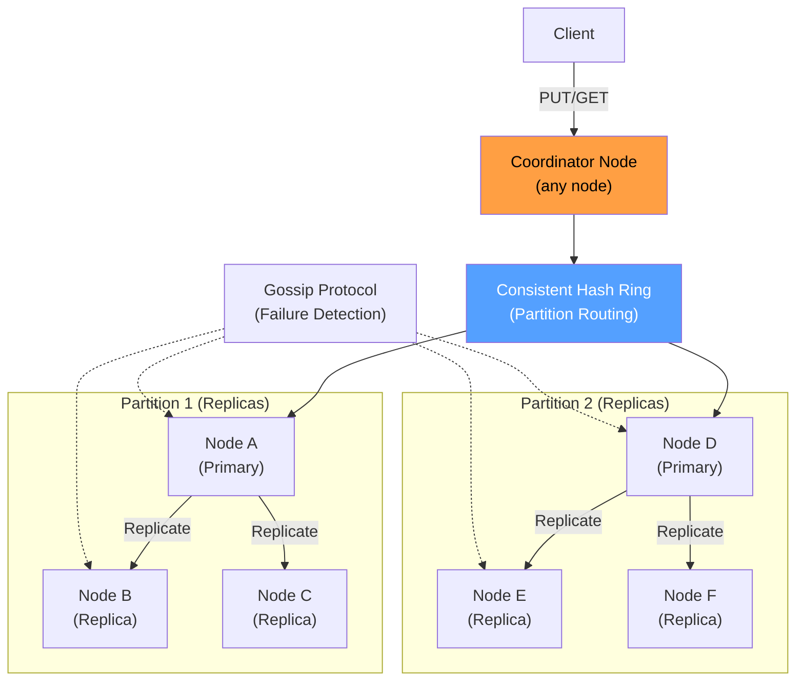

### Deep Dive

#### Storage Engine: LSM-Tree

Most distributed KV stores use a **Log-Structured Merge-Tree (LSM-Tree)**:

1. **Write path**: Write → WAL (Write-Ahead Log) → MemTable (in-memory sorted structure, e.g., Red-Black tree).
2. **Flush**: When MemTable exceeds a threshold (e.g., 64 MB), flush to disk as an immutable **SSTable** (Sorted String Table).
3. **Compaction**: Background process merges overlapping SSTables to reclaim space and improve read performance.
4. **Read path**: Check MemTable → Check Bloom filters for each SSTable level → Read from SSTable.

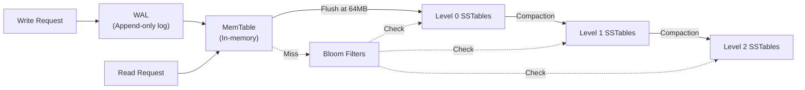

#### Replication & Consistency (Quorum)

With replication factor N = 3:
- **W (write quorum)** = 2: Write succeeds when 2 of 3 replicas acknowledge.
- **R (read quorum)** = 2: Read from 2 of 3 replicas and return the latest version.
- **Guarantee**: When W + R > N (2 + 2 > 3), at least one node in the read quorum has the latest write → **strong consistency**.

Tunable consistency:
| Config | W | R | Guarantee |
|---|---|---|---|
| Strong | 2 | 2 | Linearizable |
| Eventual (fast reads) | 2 | 1 | May read stale data |
| Eventual (fast writes) | 1 | 2 | May lose writes on failure |

#### Conflict Resolution

When replicas diverge (e.g., during a network partition), conflicts must be resolved:

1. **Last-Writer-Wins (LWW)**: Use wall-clock timestamp. Simple but can lose data.
2. **Vector Clocks**: Track causal dependencies with `{node_id: counter}` maps. Detect concurrent writes and let the application resolve.
3. **CRDTs**: Conflict-free Replicated Data Types that merge automatically (e.g., counters, sets).

#### Failure Detection with Gossip

Nodes periodically exchange heartbeats with random peers. If a node doesn't respond after T seconds, it's marked as suspected. After confirmation from multiple nodes, it's marked as down. Gossip scales to thousands of nodes with O(log N) propagation time.

### Bottlenecks & Mitigations

| Bottleneck | Mitigation |
|---|---|
| Write amplification from LSM compaction | Use leveled compaction; schedule during off-peak hours |
| Read amplification (checking multiple SSTable levels) | Bloom filters reduce unnecessary disk reads by 99%+ |
| Hot partitions (celebrity keys) | Split hot partitions; add read replicas; use client-side caching |
| Coordinator becomes bottleneck | Any node can be coordinator (client-side routing with token-aware driver) |
| Gossip protocol slow for large clusters | Use hierarchical gossip; separate failure detection from metadata propagation |
| Data skew across partitions | Use consistent hashing with virtual nodes (see Case Study 2) |

### Key Takeaways

- **LSM-Trees** are the dominant storage engine for write-heavy KV workloads—optimized for sequential writes.
- **Quorum reads/writes** (W + R > N) provide tunable consistency without centralized coordination.
- **Vector clocks** detect conflicts; **CRDTs** resolve them automatically.
- **Gossip protocol** enables decentralized failure detection at scale.
- The CAP theorem forces a choice: DynamoDB/Cassandra choose AP (availability); etcd/ZooKeeper choose CP (consistency).
- **Bloom filters** are essential for read performance in LSM-based stores—they eliminate 99%+ of unnecessary disk reads.

---

## 5. Distributed Cache

### Problem Statement

Databases are optimized for durability and complex queries, not for speed. A typical PostgreSQL query takes 1-10 ms; a Redis cache lookup takes 0.1-0.5 ms. For read-heavy workloads (which describe most internet applications—read:write ratios of 100:1 are common), placing a cache between the application and the database can reduce latency by 10-50× and offload 80-99% of read traffic from the database.

A **distributed cache** extends this concept across multiple machines, providing terabytes of fast in-memory storage. The challenges include: maintaining cache coherence (when does cached data become stale?), handling cache failures (what happens when a cache node dies?), avoiding thundering herds (when a popular key expires, thousands of requests simultaneously hit the database), and distributing data evenly across cache nodes.

Distributed caching is not optional at scale—it's a requirement. Every major internet company operates cache clusters with hundreds of nodes: Facebook's Memcached cluster serves billions of requests per second; Twitter's Redis cluster stores the home timeline for 400 million users. Without caching, their databases would need 100× the hardware.

### Use Cases

- **Database query caching**: Cache the results of expensive SQL queries.
- **Session storage**: Store user sessions in Redis for stateless web servers.
- **Page/fragment caching**: Cache rendered HTML fragments to avoid re-rendering.
- **API response caching**: Cache responses from upstream microservices.
- **Social media feeds**: Pre-compute and cache user timelines (Twitter, Instagram).
- **Leaderboards**: Use sorted sets for real-time ranking.
- **Rate limiter counters**: Store ephemeral counters with TTL (see Case Study 1).
- **Feature flag evaluation**: Cache feature flag states to avoid database lookups on every request.

### Functional Requirements

- **FR1**: `GET(key)` — Retrieve cached value; return miss on absence.
- **FR2**: `SET(key, value, TTL)` — Store a value with optional expiration.
- **FR3**: `DELETE(key)` — Invalidate a cached entry.
- **FR4**: `MGET(keys[])` — Batch retrieval for multiple keys in one round trip.
- **FR5**: Support multiple eviction policies: LRU, LFU, TTL-based.
- **FR6**: Support atomic operations: increment, decrement, compare-and-swap.
- **FR7**: Support pub/sub for cache invalidation notifications.
- **FR8**: Support data structures beyond simple strings: hashes, lists, sorted sets.

### Non-Functional Requirements

- **NFR1**: **Latency** — p99 < 1 ms for cache hits.
- **NFR2**: **Throughput** — 500K+ ops/sec per node; 50M+ ops/sec cluster-wide.
- **NFR3**: **Availability** — 99.99% uptime; graceful degradation on node failure.
- **NFR4**: **Hit ratio** — > 95% for well-tuned workloads.
- **NFR5**: **Scalability** — Scale to 100+ nodes, 10+ TB of cached data.
- **NFR6**: **Consistency** — Eventual consistency with the source of truth (database).
- **NFR7**: **Memory efficiency** — < 10% overhead per entry (metadata + fragmentation).
- **NFR8**: **Fault tolerance** — Automatic failover with < 1s detection; no data loss on single node failure.

### Capacity Estimation

- **Cached data**: 5 TB (hot dataset)
- **Average entry size**: key (50 bytes) + value (1 KB) + metadata (100 bytes) ≈ **1.15 KB**
- **Total entries**: 5 TB / 1.15 KB ≈ **4.5 billion entries**
- **Nodes**: 5 TB / 64 GB usable per node ≈ **80 nodes** (with 64 GB RAM each)
- **Read traffic**: 10M cache reads/sec
  - Hit ratio 95%: 9.5M hits/sec from cache, 500K misses → DB
  - Bandwidth: 9.5M × 1 KB = **9.5 GB/s** read throughput
- **Write traffic**: 500K cache writes/sec (from cache misses + explicit invalidations)
- **Network**: 10 GB/s aggregate → 125 MB/s per node (80 nodes)
- **Replication**: If replicated (R = 2), double the nodes → **160 nodes**, **10 TB** total memory

### API Design

```http
# Get a cached value
GET /api/v1/cache/{key}
Response 200:
{
  "key": "product:42:details",
  "value": { "name": "Widget", "price": 29.99 },
  "ttl_remaining": 245,
  "version": "v3"
}

Response 404:
{
  "error": "cache_miss",
  "key": "product:42:details"
}

# Set a cached value
PUT /api/v1/cache/{key}
Content-Type: application/json
X-TTL-Seconds: 300

{
  "value": { "name": "Widget", "price": 29.99 }
}

Response 201:
{
  "key": "product:42:details",
  "ttl": 300,
  "status": "stored"
}

# Delete (invalidate) a cached entry
DELETE /api/v1/cache/{key}
Response 204 No Content

# Batch get
POST /api/v1/cache/mget
{
  "keys": ["product:1:details", "product:2:details", "product:3:details"]
}
Response 200:
{
  "results": {
    "product:1:details": { "value": {...}, "ttl_remaining": 120 },
    "product:2:details": null,
    "product:3:details": { "value": {...}, "ttl_remaining": 280 }
  },
  "hits": 2,
  "misses": 1
}

# Cache statistics
GET /api/v1/cache/stats
Response 200:
{
  "total_entries": 4500000000,
  "memory_used_bytes": 5368709120000,
  "hit_rate": 0.957,
  "evictions_per_sec": 12400,
  "ops_per_sec": 10200000
}
```

### Data Model

```sql
-- Conceptual model for cache entries (actual storage is in-memory hash table)
-- Each cache node stores a partition of keys determined by consistent hashing.

-- In-memory structure per node:
-- HashMap<Key, CacheEntry>
-- where CacheEntry = {
--   value: bytes,
--   ttl_expires_at: timestamp,
--   created_at: timestamp,
--   access_count: int,       -- for LFU
--   last_accessed: timestamp, -- for LRU
--   version: int,
--   size_bytes: int
-- }

-- Metadata stored in a coordination service:
CREATE TABLE cache_cluster_nodes (
    node_id         VARCHAR(64) PRIMARY KEY,
    address         VARCHAR(128) NOT NULL,
    port            INT NOT NULL,
    memory_total    BIGINT NOT NULL,      -- bytes
    memory_used     BIGINT DEFAULT 0,
    status          VARCHAR(20) DEFAULT 'active',
    partition_range TEXT,                  -- hash range owned
    joined_at       TIMESTAMPTZ DEFAULT NOW()
);

CREATE TABLE cache_config (
    cluster_id      VARCHAR(64) PRIMARY KEY,
    eviction_policy VARCHAR(20) DEFAULT 'lru', -- lru | lfu | ttl | random
    replication     INT DEFAULT 1,
    max_entry_size  INT DEFAULT 1048576,        -- 1 MB
    default_ttl     INT DEFAULT 3600
);
```

### High-Level Design

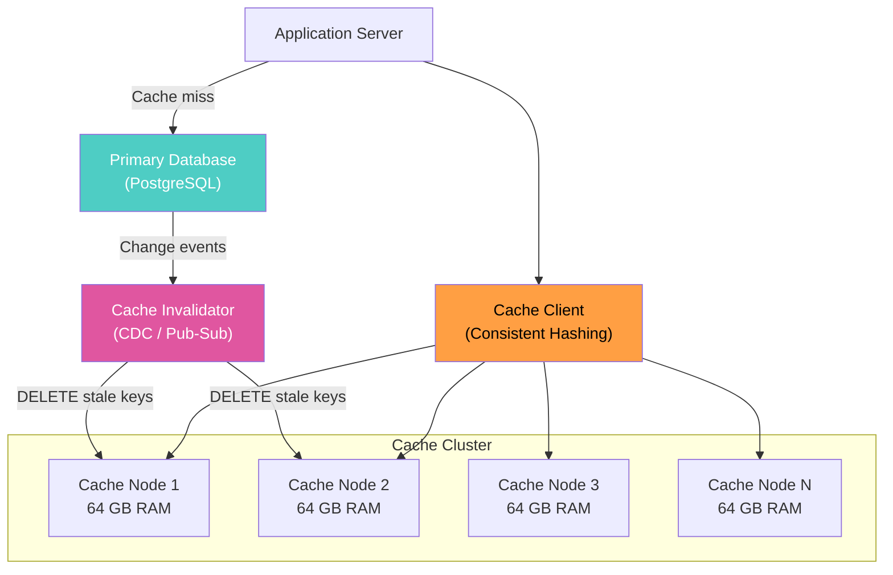

### Deep Dive

#### Caching Strategies

**1. Cache-Aside (Lazy Loading)**
The most common pattern. Application checks cache first; on miss, reads from DB and populates cache.

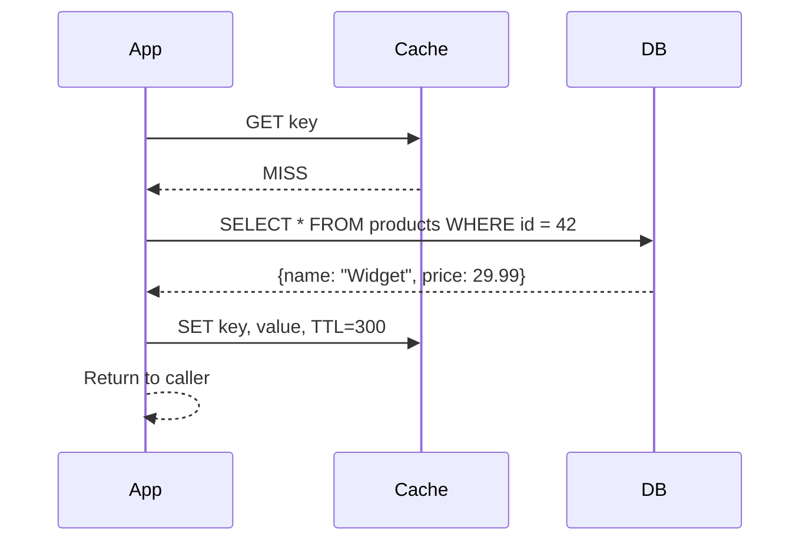

**Pros**: Only requested data is cached; cache failure doesn't break reads.
**Cons**: Cache miss penalty (3 network trips); stale data until TTL expires.

**2. Write-Through**
Application writes to cache and DB simultaneously. Cache is always up-to-date.
**Pros**: No stale reads. **Cons**: Write latency increases; unused data may be cached.

**3. Write-Behind (Write-Back)**
Application writes to cache; cache asynchronously writes to DB in batches.
**Pros**: Lowest write latency; batch DB writes. **Cons**: Risk of data loss if cache node fails before flush.

**4. Read-Through**
Cache itself fetches from DB on miss (cache-as-a-service). Simplifies application code.

#### Cache Invalidation Strategies

Cache invalidation is famously one of the "two hard things in computer science." Approaches:

1. **TTL-based expiry**: Set a reasonable TTL (e.g., 5 minutes). Simple but allows stale reads within the TTL window.
2. **Event-driven invalidation**: Use Change Data Capture (CDC) from the database (e.g., Debezium on PostgreSQL WAL) to trigger cache deletes. Near-real-time consistency.
3. **Application-driven invalidation**: Application explicitly deletes cache entries after writes. Requires discipline but is the most common approach.
4. **Versioned keys**: Include a version in the key (`product:42:v3`). On update, write a new version and let the old one expire.

#### Thundering Herd Prevention

When a popular key expires, hundreds of concurrent requests may all miss the cache and simultaneously query the database. Solutions:

1. **Locking (Lease)**: Only one request fetches from DB; others wait for the cache to be populated. Use Redis `SET key lock NX EX 5` as a distributed lock.
2. **Stale-while-revalidate**: Serve the stale cached value while one request refreshes it in the background.
3. **Early expiration**: Refresh the cache before the TTL actually expires (e.g., at 80% of TTL).
4. **Request coalescing**: Collapse duplicate in-flight requests into a single database query.

#### Eviction Policies

When memory is full, entries must be evicted:
- **LRU (Least Recently Used)**: Evict the entry accessed longest ago. Most common; good for temporal locality.
- **LFU (Least Frequently Used)**: Evict the least-accessed entry. Better for frequency-based workloads.
- **Random**: Simple and surprisingly effective for uniform access patterns.
- **TTL-based**: Evict entries closest to expiration first.

Redis uses an **approximated LRU**: samples 5 random keys and evicts the least recently used among them. This avoids the overhead of maintaining a full LRU linked list.

### Bottlenecks & Mitigations

| Bottleneck | Mitigation |
|---|---|
| Thundering herd on cache miss | Lease/lock on cache miss; stale-while-revalidate; request coalescing |
| Cache node failure causes mass DB load | Replication (R=2); consistent hashing minimizes remapping; circuit breaker on DB |
| Hot keys (celebrity problem) | Replicate hot keys to all nodes; local in-process cache (L1 cache) for top-100 keys |
| Stale data served after DB update | Event-driven invalidation via CDC; reduce TTL for critical data |
| Memory fragmentation | Use jemalloc allocator; fixed-size slab allocation (Memcached approach) |
| Network bandwidth saturation | Compress values > 1 KB; use binary protocol (not text); batch operations with MGET |

### Key Takeaways

- **Cache-aside** is the most common and safest caching pattern—use it by default.
- **Thundering herd** is the #1 operational risk—always implement locking or stale-while-revalidate.
- **Consistent hashing** distributes keys across cache nodes and minimizes disruption on node changes.
- **CDC-based invalidation** provides near-real-time cache coherence without application changes.
- A **two-level cache** (L1 in-process + L2 distributed) reduces network round trips for the hottest keys.
- **Hit ratio** is the most important metric—track it obsessively; > 95% means the cache is healthy.

---

## 6. Load Balancer

### Problem Statement

No single server can handle the traffic of a modern internet service. A search engine processes 100,000+ queries per second; a social network serves millions of concurrent users. To scale horizontally, you deploy fleets of servers behind a **load balancer** that distributes incoming requests across healthy backends.

A load balancer serves three critical functions: **distribution** (spreading traffic evenly), **health checking** (detecting and routing around failed servers), and **abstraction** (presenting a single endpoint to clients regardless of the number of backends). Without load balancing, you cannot achieve horizontal scalability, fault tolerance, or zero-downtime deployments.

Load balancers operate at different layers of the network stack. **L4 (transport layer)** load balancers route based on IP address and TCP port—they're extremely fast (millions of connections/sec) but application-unaware. **L7 (application layer)** load balancers inspect HTTP headers, URLs, and cookies—they enable content-based routing, SSL termination, and request transformation but add more latency. Most production architectures use both: an L4 balancer at the edge and L7 balancers in front of each service.

### Use Cases

- **Web traffic distribution**: Route HTTP requests across a fleet of web servers.
- **Microservice routing**: Direct API calls to the correct service instances.
- **SSL/TLS termination**: Offload encryption/decryption from application servers.
- **Blue-green deployments**: Route traffic between old and new versions during deployments.
- **Canary releases**: Send 1% of traffic to a new version for validation.
- **Geographic routing**: Route users to the nearest data center.
- **WebSocket connection balancing**: Distribute long-lived connections evenly.
- **Database read replicas**: Distribute read queries across multiple database replicas.

### Functional Requirements

- **FR1**: Distribute incoming requests across a pool of backend servers.
- **FR2**: Support multiple load balancing algorithms: round-robin, weighted round-robin, least connections, IP hash, consistent hashing.
- **FR3**: Perform health checks (active probes + passive monitoring) and remove unhealthy backends.
- **FR4**: Support L4 (TCP/UDP) and L7 (HTTP/HTTPS/gRPC) load balancing.
- **FR5**: Terminate SSL/TLS connections and forward decrypted traffic to backends.
- **FR6**: Support sticky sessions (route a user to the same backend across requests).
- **FR7**: Support traffic splitting for canary deployments (e.g., 95/5 split).
- **FR8**: Provide real-time metrics: request rate, error rate, latency per backend.

### Non-Functional Requirements

- **NFR1**: **Throughput** — Handle 1M+ concurrent connections; 500K+ requests/sec (L7).
- **NFR2**: **Latency** — Add < 0.5 ms (L4) or < 2 ms (L7) to request path.
- **NFR3**: **Availability** — 99.999% uptime; no single point of failure (active-passive or active-active).
- **NFR4**: **Scalability** — Scale to 10+ Gbps of traffic; support 10,000+ backend servers.
- **NFR5**: **Zero-downtime** — Backend additions/removals without dropping connections.
- **NFR6**: **Observability** — Per-backend metrics, access logs, distributed tracing integration.
- **NFR7**: **Security** — DDoS protection, rate limiting, IP allowlisting/denylisting.
- **NFR8**: **Configuration** — Dynamic reconfiguration without restart (hot reload).

### Capacity Estimation

- **Traffic**: 500,000 HTTP requests/sec
- **Average request size**: 2 KB; average response size: 10 KB
- **Bandwidth**: 500K × (2 KB + 10 KB) = **6 GB/s** throughput
- **Concurrent connections**: 1 million (with keep-alive)
- **Backend servers**: 500 instances across 3 availability zones
- **SSL handshakes**: 50,000/sec (new connections); each costs ~1 ms of CPU
- **LB instances**: 
  - L4: 2 instances (active-passive) with ECMP, handling 10 Gbps each
  - L7: 20 instances in a pool, each handling 25K req/sec
- **Memory per L7 instance**: Connection table for 50K connections × 10 KB state = **500 MB**
- **Health checks**: 500 backends × 1 check/10 sec = **50 checks/sec** (negligible)

### API Design

```http
# Load balancer configuration API (for management plane)

# List all backend pools
GET /api/v1/pools
Response 200:
{
  "pools": [
    {
      "id": "web-pool",
      "algorithm": "least_connections",
      "backends": 50,
      "healthy": 48,
      "requests_per_sec": 125000
    }
  ]
}

# Create a backend pool
POST /api/v1/pools
{
  "id": "api-pool",
  "algorithm": "weighted_round_robin",
  "health_check": {
    "protocol": "HTTP",
    "path": "/health",
    "interval_seconds": 10,
    "timeout_seconds": 3,
    "unhealthy_threshold": 3,
    "healthy_threshold": 2
  },
  "sticky_sessions": {
    "enabled": true,
    "cookie_name": "SERVERID",
    "ttl_seconds": 3600
  }
}

# Add a backend to a pool
POST /api/v1/pools/{pool_id}/backends
{
  "address": "10.0.1.42",
  "port": 8080,
  "weight": 100,
  "max_connections": 1000
}
Response 201:
{
  "id": "backend-042",
  "pool_id": "api-pool",
  "address": "10.0.1.42:8080",
  "status": "healthy",
  "weight": 100
}

# Update backend weight (for canary)
PATCH /api/v1/pools/{pool_id}/backends/{backend_id}
{
  "weight": 5
}

# Get backend health status
GET /api/v1/pools/{pool_id}/backends/{backend_id}/health
Response 200:
{
  "id": "backend-042",
  "status": "healthy",
  "last_check": "2025-01-15T10:30:00Z",
  "response_time_ms": 12,
  "consecutive_successes": 45,
  "active_connections": 234
}

# Traffic splitting rules
PUT /api/v1/pools/{pool_id}/traffic-split
{
  "rules": [
    {"backend_tag": "v2.1", "weight": 95},
    {"backend_tag": "v2.2-canary", "weight": 5}
  ]
}
```

### Data Model

```sql
-- Load balancer configuration (stored in etcd or PostgreSQL)
CREATE TABLE lb_pools (
    id                  VARCHAR(64) PRIMARY KEY,
    algorithm           VARCHAR(32) NOT NULL DEFAULT 'round_robin',
    health_check_path   VARCHAR(256) DEFAULT '/health',
    health_check_interval INT DEFAULT 10,
    sticky_sessions     BOOLEAN DEFAULT FALSE,
    sticky_cookie_name  VARCHAR(64),
    sticky_ttl          INT DEFAULT 3600,
    created_at          TIMESTAMPTZ DEFAULT NOW(),
    updated_at          TIMESTAMPTZ DEFAULT NOW()
);

CREATE TABLE lb_backends (
    id                  VARCHAR(64) PRIMARY KEY,
    pool_id             VARCHAR(64) NOT NULL REFERENCES lb_pools(id),
    address             VARCHAR(128) NOT NULL,
    port                INT NOT NULL,
    weight              INT DEFAULT 100,
    max_connections     INT DEFAULT 10000,
    status              VARCHAR(20) DEFAULT 'healthy',
    last_health_check   TIMESTAMPTZ,
    active_connections  INT DEFAULT 0,
    tag                 VARCHAR(64),          -- for canary/blue-green
    created_at          TIMESTAMPTZ DEFAULT NOW()
);

CREATE INDEX idx_backends_pool ON lb_backends(pool_id);
CREATE INDEX idx_backends_status ON lb_backends(pool_id, status);
```

### High-Level Design

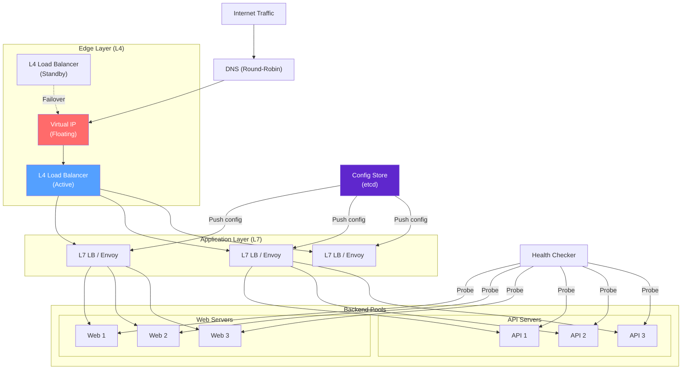

### Deep Dive

#### Load Balancing Algorithms

**1. Round Robin**: Requests distributed sequentially: 1→A, 2→B, 3→C, 4→A... Simple but ignores server capacity and current load.

**2. Weighted Round Robin**: Each backend has a weight proportional to its capacity. A server with weight 3 gets 3× the traffic of weight 1. Useful for heterogeneous fleets.

**3. Least Connections**: Route to the backend with the fewest active connections. Naturally adapts to slow servers (they accumulate connections and get fewer new ones). Best for long-lived connections (WebSocket, database).

**4. IP Hash**: Hash the client IP to select a backend. Provides sticky routing without cookies. But disrupted by client IP changes (mobile networks, proxies).

**5. Consistent Hashing**: Hash a request attribute (URL, header) to a ring of backends. Minimal disruption when backends are added/removed. Used when caching is involved (route same content to same server).

**6. Power of Two Random Choices (P2C)**: Pick 2 random backends, send to the one with fewer active requests. Surprisingly effective—exponentially better than random, simpler than least-connections. Used by Envoy and Nginx.

#### L4 vs. L7 Load Balancing

| Feature | L4 (Transport) | L7 (Application) |
|---|---|---|
| Operates on | TCP/UDP packets | HTTP/gRPC requests |
| Performance | 10M+ conn/sec | 500K+ req/sec |
| Added latency | < 0.1 ms | 1-5 ms |
| SSL termination | No (pass-through) | Yes |
| Content routing | No | Yes (URL, headers, cookies) |
| Health checks | TCP connect / ping | HTTP GET /health |
| Use case | Edge/entry point | Service mesh, API routing |

#### High Availability

A load balancer must not be a single point of failure:

1. **Active-Passive with VIP**: Two LB instances share a virtual IP via VRRP (Virtual Router Redundancy Protocol). The active instance handles all traffic; the passive takes over within seconds if the active fails.
2. **Active-Active with ECMP**: Multiple LB instances advertise the same IP via BGP. The upstream router uses Equal-Cost Multi-Path routing to distribute traffic across all instances.
3. **DNS-based**: Multiple LB IPs in DNS A records. Clients round-robin across them. Slowest failover (DNS TTL) but simplest.

#### Health Checking

- **Active checks**: LB periodically sends HTTP GET to `/health` on each backend. If N consecutive checks fail (e.g., 3 failures), mark as unhealthy.
- **Passive checks**: Monitor real traffic for errors. If a backend returns 5 consecutive 5xx errors, remove it from rotation.
- **Graceful drain**: Before removing a backend (for deployment), mark it as "draining"—stop sending new requests but allow existing connections to complete.

### Bottlenecks & Mitigations

| Bottleneck | Mitigation |
|---|---|
| Load balancer becomes the bottleneck | Use L4 at edge for raw throughput; scale L7 horizontally behind L4 |
| Single point of failure | Active-passive with VIP failover; active-active with ECMP |
| Uneven distribution with round-robin | Use least-connections or P2C for heterogeneous backends |
| SSL handshake CPU overhead | Hardware SSL acceleration; session resumption (TLS tickets); ECDSA certs (faster than RSA) |
| Long-lived connections (WebSocket) skew distribution | Use least-connections; periodic rebalancing; connection draining |
| Health check false positives | Require N consecutive failures before marking unhealthy; use both active and passive checks |

### Key Takeaways

- **L4 + L7** is the standard two-tier architecture: L4 at the edge for throughput, L7 per-service for smart routing.
- **Least connections** and **P2C** are the best general-purpose algorithms for most workloads.
- **High availability** requires at least active-passive failover; prefer active-active with ECMP.
- **Health checking** is as important as load balancing itself—a load balancer that sends traffic to dead servers is worse than no load balancer.
- **Zero-downtime deployments** require graceful connection draining and traffic splitting.
- Modern service meshes (Envoy, Istio) are L7 load balancers embedded as sidecars alongside every service.

---

## 7. API Gateway

### Problem Statement

In a microservices architecture, clients (web browsers, mobile apps, IoT devices) must communicate with dozens or hundreds of backend services. Without an intermediary, each client must know the address of every service, handle authentication independently, manage retries, and deal with protocol differences. This creates tight coupling, security risks, and operational nightmares.

An **API Gateway** is the single entry point for all client requests. It handles cross-cutting concerns—authentication, rate limiting, request routing, protocol translation, response aggregation, and observability—so that backend services can focus purely on business logic. Think of it as the "front door" of your microservices architecture.

The API gateway pattern is used by virtually every major platform: Netflix Zuul (now Spring Cloud Gateway), Amazon API Gateway, Kong, Envoy, and Apigee. The gateway absorbs complexity that would otherwise be duplicated across every service, but it also introduces a critical dependency—if the gateway goes down, everything goes down.

### Use Cases

- **Request routing**: Route `/api/v1/users/*` to the User Service and `/api/v1/orders/*` to the Order Service.
- **Authentication & authorization**: Validate JWT tokens, API keys, and OAuth2 flows before forwarding.
- **Rate limiting**: Apply per-client throttling (see Case Study 1).
- **Protocol translation**: Accept REST from mobile clients, convert to gRPC for internal services.
- **Response aggregation**: Combine responses from multiple services into a single client response.
- **Canary releases**: Route 5% of traffic to a new service version.
- **API versioning**: Route `/v1/` and `/v2/` to different service deployments.
- **Observability**: Centralized access logging, distributed tracing injection, and metrics collection.

### Functional Requirements

- **FR1**: Route requests to backend services based on path, headers, query parameters, or method.
- **FR2**: Authenticate requests (JWT validation, API key lookup, OAuth2 token introspection).
- **FR3**: Apply rate limiting rules per client, per route, or per service.
- **FR4**: Transform requests and responses (header manipulation, body transformation, protocol translation).
- **FR5**: Aggregate responses from multiple backend services into a single response.
- **FR6**: Support traffic management: canary routing, A/B testing, blue-green switches.
- **FR7**: Provide circuit breaker functionality for failing backends.
- **FR8**: Support WebSocket and gRPC proxying in addition to HTTP.
- **FR9**: Enable plugins/middleware for extensibility (custom auth, logging, transformation).

### Non-Functional Requirements

- **NFR1**: **Latency** — Add < 5 ms to request path (p99), excluding backend time.
- **NFR2**: **Throughput** — Handle 200K+ requests/sec per gateway instance.
- **NFR3**: **Availability** — 99.99% uptime; the gateway is the most critical infrastructure component.
- **NFR4**: **Scalability** — Scale horizontally; support 50+ gateway instances behind an L4 LB.
- **NFR5**: **Security** — TLS termination, request validation, IP filtering, CORS management.
- **NFR6**: **Observability** — Structured access logs, distributed trace propagation, per-route metrics.
- **NFR7**: **Configuration** — Hot-reloadable routing rules; no restart for rule changes.
- **NFR8**: **Extensibility** — Plugin system for custom middleware without modifying gateway code.

### Capacity Estimation

- **Requests**: 500,000 req/sec across all APIs
- **Gateway instances**: 500K / 25K per instance = **20 instances** (with 50% headroom = 30 instances)
- **Average request processing**: Auth check (0.5 ms) + routing (0.1 ms) + rate limit check (0.5 ms) + proxy overhead (1 ms) = ~**2 ms** added latency
- **Auth token cache**: 10M active users × 500 bytes/token = **5 GB** (distributed across instances or in Redis)
- **Configuration size**: 1,000 routes × 2 KB per route config = **2 MB** (trivially fits in memory)
- **Access logs**: 500K req/sec × 500 bytes/log = **250 MB/s** → **21.6 TB/day** of logs
- **Memory per instance**: Connection pools (200 MB) + routing table (50 MB) + auth cache (500 MB) = **~1 GB**
- **Network**: 500K req/sec × 15 KB avg (req + resp) = **7.5 GB/s** aggregate

### API Design

```http
# Gateway management API (admin plane, separate from data plane)

# List all routes
GET /admin/v1/routes?page=1&per_page=50
Response 200:
{
  "routes": [
    {
      "id": "route-users",
      "path": "/api/v1/users/**",
      "methods": ["GET", "POST", "PUT", "DELETE"],
      "upstream": "user-service.internal:8080",
      "plugins": ["jwt-auth", "rate-limit", "cors"],
      "strip_prefix": "/api/v1",
      "timeout_ms": 5000
    }
  ],
  "total": 156,
  "page": 1,
  "per_page": 50
}

# Create a route
POST /admin/v1/routes
{
  "id": "route-orders",
  "path": "/api/v1/orders/**",
  "methods": ["GET", "POST"],
  "upstream": "order-service.internal:8080",
  "plugins": [
    {
      "name": "jwt-auth",
      "config": { "required_claims": ["sub", "role"] }
    },
    {
      "name": "rate-limit",
      "config": { "requests_per_minute": 100 }
    },
    {
      "name": "circuit-breaker",
      "config": { "failure_threshold": 5, "recovery_timeout": 30 }
    }
  ],
  "retry": { "attempts": 3, "backoff_ms": 100 },
  "timeout_ms": 10000
}
Response 201:
{
  "id": "route-orders",
  "status": "active",
  "created_at": "2025-01-15T10:00:00Z"
}

# Traffic splitting for canary
PUT /admin/v1/routes/{route_id}/traffic
{
  "splits": [
    {"upstream": "order-service-v1.internal:8080", "weight": 95},
    {"upstream": "order-service-v2.internal:8080", "weight": 5}
  ]
}

# Plugin management
GET /admin/v1/plugins
POST /admin/v1/plugins
PUT /admin/v1/plugins/{plugin_id}

# Real-time metrics
GET /admin/v1/metrics/routes/{route_id}
Response 200:
{
  "route_id": "route-orders",
  "requests_per_sec": 12500,
  "latency_p50_ms": 45,
  "latency_p99_ms": 230,
  "error_rate": 0.002,
  "status_codes": { "200": 11250, "201": 980, "400": 150, "500": 25 }
}
```

### Data Model

```sql
-- Gateway configuration (stored in PostgreSQL / etcd)
CREATE TABLE gw_routes (
    id              VARCHAR(64) PRIMARY KEY,
    path_pattern    VARCHAR(512) NOT NULL,       -- /api/v1/users/**
    methods         VARCHAR(64) DEFAULT '*',      -- GET,POST,PUT,DELETE
    upstream_url    VARCHAR(256) NOT NULL,
    strip_prefix    VARCHAR(128),
    timeout_ms      INT DEFAULT 5000,
    retry_attempts  INT DEFAULT 0,
    retry_backoff   INT DEFAULT 100,
    priority        INT DEFAULT 0,               -- higher = matched first
    enabled         BOOLEAN DEFAULT TRUE,
    created_at      TIMESTAMPTZ DEFAULT NOW(),
    updated_at      TIMESTAMPTZ DEFAULT NOW()
);

CREATE TABLE gw_route_plugins (
    route_id        VARCHAR(64) REFERENCES gw_routes(id),
    plugin_name     VARCHAR(64) NOT NULL,
    config          JSONB DEFAULT '{}',
    execution_order INT DEFAULT 0,
    PRIMARY KEY (route_id, plugin_name)
);

CREATE TABLE gw_traffic_splits (
    route_id        VARCHAR(64) REFERENCES gw_routes(id),
    upstream_url    VARCHAR(256) NOT NULL,
    weight          INT NOT NULL DEFAULT 100,
    tag             VARCHAR(64),
    PRIMARY KEY (route_id, upstream_url)
);

CREATE TABLE gw_api_keys (
    key_hash        VARCHAR(128) PRIMARY KEY,   -- SHA-256 of the API key
    client_id       VARCHAR(128) NOT NULL,
    client_name     VARCHAR(256),
    scopes          TEXT[],                      -- {read, write, admin}
    rate_limit      INT DEFAULT 1000,            -- requests per minute
    expires_at      TIMESTAMPTZ,
    created_at      TIMESTAMPTZ DEFAULT NOW()
);

CREATE INDEX idx_routes_path ON gw_routes(path_pattern);
CREATE INDEX idx_api_keys_client ON gw_api_keys(client_id);
```

### High-Level Design

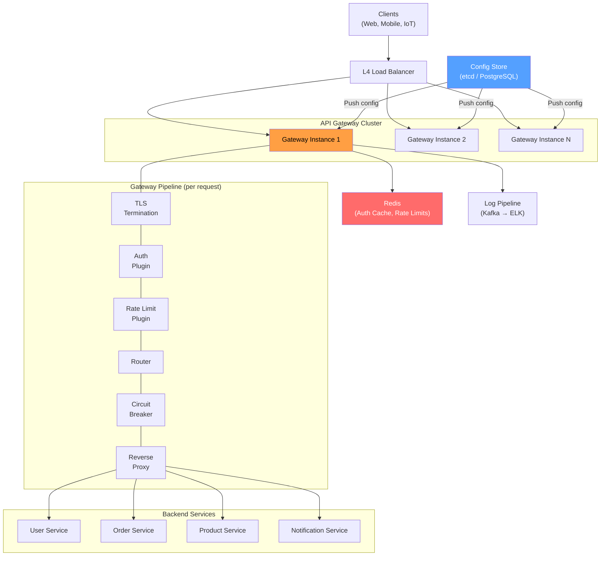

### Deep Dive

#### Request Processing Pipeline

Every request passes through a chain of middleware (plugins) in a fixed order:

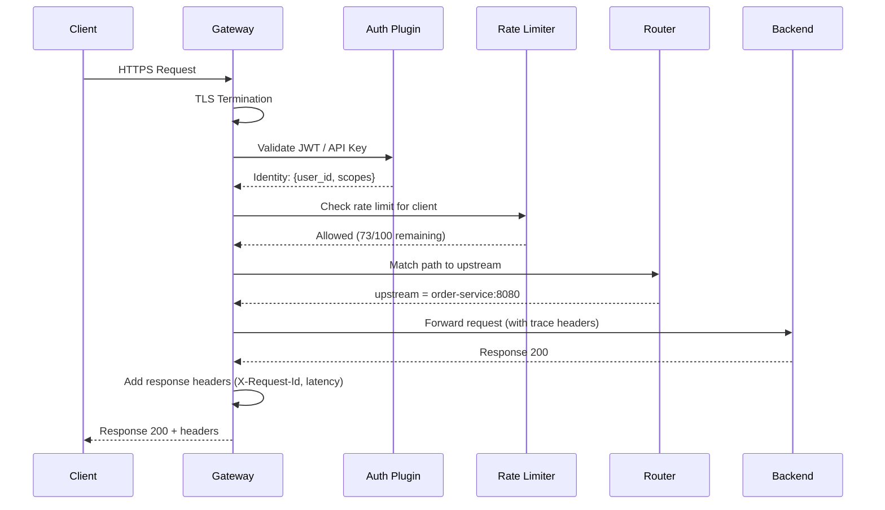

#### Authentication Patterns

1. **JWT Validation**: Gateway verifies the JWT signature using a public key (cached). No network call needed. Claims extracted and forwarded as headers (`X-User-Id`, `X-User-Role`).
2. **API Key Lookup**: Gateway hashes the API key and looks it up in Redis (or local cache). Returns client ID and scopes.
3. **OAuth2 Token Introspection**: Gateway calls the OAuth2 server to validate an opaque token. Cache the result for the token's lifetime to avoid repeated calls.
4. **mTLS (Mutual TLS)**: For service-to-service communication, verify the client certificate. Used in service meshes.

#### Circuit Breaker

The gateway protects backends with a circuit breaker pattern:

- **Closed** (normal): Requests flow through. Track error rate.
- **Open** (tripped): Error rate exceeds threshold (e.g., 50% failures in 10s). All requests immediately return 503 without hitting the backend. Prevents cascading failures.
- **Half-Open** (recovery): After a timeout (e.g., 30s), allow one probe request. If it succeeds, close the circuit. If it fails, re-open.

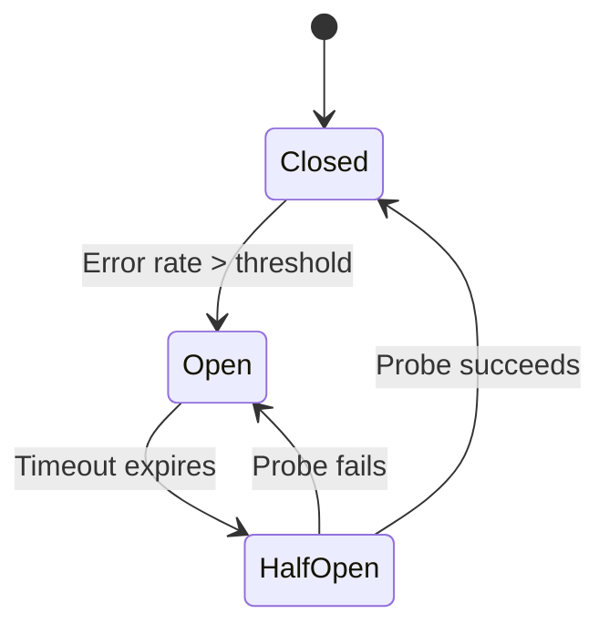

#### Response Aggregation (BFF Pattern)

For mobile clients with limited bandwidth, the gateway can aggregate multiple backend calls into one response:

```
Client → GET /api/v1/dashboard
Gateway fans out:
  → GET user-service/users/123         → {name, avatar}
  → GET order-service/users/123/recent → {orders: [...]}
  → GET notification-service/users/123 → {unread: 5}
Gateway merges:
  ← {user: {...}, recent_orders: [...], notifications: {unread: 5}}
```

This is the **Backend for Frontend (BFF)** pattern. It reduces mobile round trips from 3 to 1.

### Bottlenecks & Mitigations

| Bottleneck | Mitigation |
|---|---|
| Gateway is a single point of failure | Deploy 20+ instances behind L4 LB; active-active across AZs |
| Auth token validation adds latency | Cache validated tokens in local memory (5-minute TTL); use JWT (no network call) |
| Large response aggregation increases memory | Stream responses; set timeouts per backend; use async/non-blocking I/O |
| Configuration propagation delay | Use etcd watches for real-time push; fall back to periodic polling (10s) |
| Log volume overwhelms storage | Sample logs (e.g., 10% of 2xx, 100% of 4xx/5xx); use Kafka as buffer |
| Plugin chain adds latency | Optimize hot path plugins; use compiled plugins (not interpreted); parallelize independent plugins |

### Key Takeaways

- The API gateway is the **most critical** infrastructure component—if it goes down, all APIs are down.
- Use a **plugin/middleware architecture** for extensibility without modifying core gateway code.
- **JWT** is the preferred auth mechanism—it allows the gateway to validate tokens without network calls.
- **Circuit breakers** at the gateway prevent cascading failures across the entire microservices fleet.
- Separate the **data plane** (request proxying) from the **control plane** (configuration management).
- Modern gateways (Envoy, Kong) support **hot reload**—configuration changes apply without dropping connections.

---

## 8. Content Delivery Network (CDN)

### Problem Statement

The speed of light imposes a hard limit on network latency. A user in Tokyo requesting content from a server in Virginia faces ~150 ms of round-trip network delay—before the server even begins processing. For a web page requiring 50 resources, this translates to seconds of load time. Users are impatient: a 1-second delay reduces conversions by 7%, and 53% of mobile users abandon sites that take over 3 seconds to load.

A **Content Delivery Network (CDN)** solves this by caching content on edge servers distributed globally—hundreds of Points of Presence (PoPs) in cities worldwide. When a user requests content, it's served from the nearest PoP (5-20 ms away) rather than the origin server (100-300 ms away). CDNs reduce latency, offload traffic from origin servers, absorb traffic spikes, and provide DDoS protection.

CDNs serve far more than static files. Modern CDNs cache API responses, run serverless functions at the edge (edge computing), optimize images dynamically, and provide WAF (Web Application Firewall) capabilities. Major CDN providers include Cloudflare (300+ PoPs), Akamai (4,000+ PoPs), and AWS CloudFront (400+ PoPs). At scale, CDNs serve 50-90% of all internet traffic, making them one of the most impactful infrastructure investments.

### Use Cases

- **Static asset delivery**: Serve JavaScript, CSS, images, fonts, and videos from edge servers.
- **Video streaming**: Netflix, YouTube, and Disney+ use CDNs to deliver video segments from local PoPs.
- **API response caching**: Cache GET responses for public APIs at the edge.
- **Website acceleration**: Cache entire web pages, especially for content sites (news, blogs, e-commerce).
- **Software distribution**: Serve OS updates, app downloads, and game patches (multi-GB files).
- **Live event streaming**: Handle traffic spikes during sports events, product launches, or breaking news.
- **Edge computing**: Run serverless functions (Cloudflare Workers, Lambda@Edge) at the edge for personalization, A/B testing, and auth.
- **DDoS protection**: CDN absorbs volumetric attacks across its distributed network before traffic reaches the origin.

### Functional Requirements

- **FR1**: Cache static and dynamic content at edge PoPs closest to users.
- **FR2**: Route user requests to the optimal PoP (based on latency, geography, and server load).
- **FR3**: Serve cached content with configurable TTL; respect origin `Cache-Control` headers.
- **FR4**: Purge/invalidate cached content on demand (single URL, wildcard, or full purge).
- **FR5**: Fetch content from origin on cache miss and cache the response for future requests.
- **FR6**: Support HTTPS with custom SSL certificates (including wildcard and SAN certs).
- **FR7**: Transform content at the edge: image optimization, compression (Brotli/gzip), minification.
- **FR8**: Provide real-time analytics: cache hit ratio, bandwidth, latency, and error rates per PoP.

### Non-Functional Requirements

- **NFR1**: **Latency** — Cache hit served in < 10 ms (measured from PoP to user).
- **NFR2**: **Throughput** — Handle 100 Tbps+ of aggregate bandwidth (across all PoPs).
- **NFR3**: **Availability** — 99.99% uptime; automatic failover to alternate PoPs.
- **NFR4**: **Cache hit ratio** — > 95% for static content; > 70% for dynamic content.
- **NFR5**: **Scalability** — Absorb 10-100× traffic spikes without degradation (e.g., Black Friday).
- **NFR6**: **Global coverage** — PoPs in 50+ countries, < 30 ms from 95% of internet users.
- **NFR7**: **Purge latency** — Invalidate cached content globally in < 5 seconds.
- **NFR8**: **Security** — TLS 1.3, DDoS mitigation, WAF, bot detection.

### Capacity Estimation

- **Content volume**: 50 TB of unique cacheable content
- **Daily bandwidth**: 10 PB/day (serving cached content)
  - = 10,000 TB / 86,400 sec = **115 GB/s** average; peak 3× = **350 GB/s**
- **Requests**: 5 billion requests/day = **58,000 req/sec** average; peak = **200K req/sec**
- **PoPs**: 200 globally
- **Storage per PoP**: Hot content = 500 GB SSD; warm content = 5 TB HDD
  - Total edge storage: 200 × 5.5 TB = **1.1 PB**
- **Cache hit ratio**: 95% → only 5% of requests reach origin
  - Origin traffic: 58K × 5% = **2,900 req/sec** to origin
- **Origin bandwidth**: 2,900 req/sec × 500 KB avg = **1.45 GB/s** (manageable for origin)
- **DNS queries**: 5 billion/day = **58,000 DNS queries/sec** for CDN domain resolution
- **SSL certificates**: 100,000 customer domains with custom SSL certs

### API Design

```http
# CDN Configuration API

# Create a CDN distribution
POST /api/v1/distributions
{
  "domain": "static.example.com",
  "origin": {
    "type": "http",
    "address": "origin.example.com",
    "port": 443,
    "protocol": "https"
  },
  "cache_policy": {
    "default_ttl": 86400,
    "max_ttl": 2592000,
    "respect_origin_headers": true,
    "query_string_caching": "ignore"
  },
  "ssl": {
    "certificate_arn": "arn:aws:acm:us-east-1:123456:certificate/abc",
    "minimum_protocol": "TLSv1.2"
  },
  "compression": {
    "enabled": true,
    "types": ["text/html", "application/javascript", "text/css", "application/json"]
  }
}
Response 201:
{
  "id": "dist-abc123",
  "domain": "static.example.com",
  "cname": "d1234.cdn.example.net",
  "status": "deploying",
  "created_at": "2025-01-15T10:00:00Z"
}

# Purge cached content
POST /api/v1/distributions/{dist_id}/purge
{
  "paths": [
    "/images/hero.jpg",
    "/css/*",
    "/api/v1/products/42"
  ],
  "type": "wildcard"
}
Response 202:
{
  "purge_id": "purge-xyz789",
  "status": "in_progress",
  "paths_count": 3,
  "estimated_completion": "2025-01-15T10:00:05Z"
}

# Get purge status
GET /api/v1/distributions/{dist_id}/purges/{purge_id}
Response 200:
{
  "purge_id": "purge-xyz789",
  "status": "complete",
  "pops_purged": 200,
  "duration_ms": 3200
}

# Cache rules (path-specific overrides)
POST /api/v1/distributions/{dist_id}/cache-rules
{
  "path_pattern": "/api/v1/products/*",
  "ttl": 300,
  "cache_key_includes": ["query_string", "accept-language"],
  "stale_while_revalidate": 60,
  "stale_if_error": 3600
}

# Analytics
GET /api/v1/distributions/{dist_id}/analytics?period=24h
Response 200:
{
  "period": "24h",
  "total_requests": 245000000,
  "cache_hit_ratio": 0.962,
  "bandwidth_gb": 12400,
  "latency_p50_ms": 8,
  "latency_p99_ms": 42,
  "top_pops": [
    {"pop": "IAD", "requests": 32000000, "hit_ratio": 0.97},
    {"pop": "NRT", "requests": 28000000, "hit_ratio": 0.95}
  ],
  "status_codes": { "200": 230000000, "304": 10000000, "404": 3500000, "503": 50000 }
}
```

### Data Model

```sql
-- CDN distribution configuration (stored centrally, pushed to edge)
CREATE TABLE cdn_distributions (
    id                  VARCHAR(64) PRIMARY KEY,
    customer_id         VARCHAR(64) NOT NULL,
    domain              VARCHAR(256) NOT NULL UNIQUE,
    cname               VARCHAR(256) NOT NULL UNIQUE,
    origin_address      VARCHAR(256) NOT NULL,
    origin_protocol     VARCHAR(10) DEFAULT 'https',
    origin_port         INT DEFAULT 443,
    default_ttl         INT DEFAULT 86400,
    max_ttl             INT DEFAULT 2592000,
    compression_enabled BOOLEAN DEFAULT TRUE,
    ssl_cert_id         VARCHAR(256),
    status              VARCHAR(20) DEFAULT 'active',
    created_at          TIMESTAMPTZ DEFAULT NOW(),
    updated_at          TIMESTAMPTZ DEFAULT NOW()
);

CREATE TABLE cdn_cache_rules (
    id                  VARCHAR(64) PRIMARY KEY,
    distribution_id     VARCHAR(64) REFERENCES cdn_distributions(id),
    path_pattern        VARCHAR(512) NOT NULL,
    ttl                 INT NOT NULL,
    cache_key_params    TEXT[],
    stale_while_revalidate INT DEFAULT 0,
    stale_if_error      INT DEFAULT 0,
    priority            INT DEFAULT 0,
    created_at          TIMESTAMPTZ DEFAULT NOW()
);

-- Per-PoP cache metadata (stored locally at each PoP)
CREATE TABLE cdn_cache_entries (
    cache_key           VARCHAR(512) PRIMARY KEY,  -- hash of URL + vary headers
    distribution_id     VARCHAR(64) NOT NULL,
    content_type        VARCHAR(128),
    content_length      BIGINT,
    etag                VARCHAR(128),
    last_modified       TIMESTAMPTZ,
    cached_at           TIMESTAMPTZ NOT NULL,
    expires_at          TIMESTAMPTZ NOT NULL,
    hit_count           BIGINT DEFAULT 0,
    last_accessed       TIMESTAMPTZ NOT NULL,
    storage_path        VARCHAR(512)               -- path on local disk
);

CREATE INDEX idx_cache_distribution ON cdn_cache_entries(distribution_id);
CREATE INDEX idx_cache_expires ON cdn_cache_entries(expires_at);
CREATE INDEX idx_cache_lru ON cdn_cache_entries(last_accessed);
```

### High-Level Design

```mermaid
graph TB
    User["User (Tokyo)"]
    DNS["DNS Resolver<br/>(GeoDNS / Anycast)"]

    subgraph "PoP - Tokyo (NRT)"
        Edge1["Edge Server 1"]
        Edge2["Edge Server 2"]
        Cache1["SSD Cache<br/>500 GB hot"]
        HDD1["HDD Cache<br/>5 TB warm"]
    end

    subgraph "PoP - Singapore (SIN)"
        Edge3["Edge Server"]
        Cache2["SSD Cache"]
    end

    subgraph "Shield / Mid-Tier Cache"
        Shield["Origin Shield<br/>(Regional)"]
    end

    subgraph "Origin"
        Origin["Origin Server<br/>(Virginia)"]
        OriginDB["Origin Storage<br/>(S3 / Application)"]
    end

    Control["Control Plane<br/>(Config Distribution)"]
    Analytics["Analytics Pipeline<br/>(Real-time metrics)"]

    User -->|"1. DNS lookup"| DNS
    DNS -->|"2. Nearest PoP IP"| User
    User -->|"3. HTTPS request"| Edge1
    Edge1 -->|"Cache HIT"| User
    Edge1 -->|"Cache MISS"| Shield
    Shield -->|"Cache MISS"| Origin
    Origin --> OriginDB
    Control -->|"Push config"| Edge1 & Edge3
    Edge1 -->|"Access logs"| Analytics

    style Edge1 fill:#ff9f43,color:#000
    style Shield fill:#54a0ff,color:#fff
    style Origin fill:#4ecdc4,color:#fff
    style DNS fill:#5f27cd,color:#fff
```

### Deep Dive

#### Request Routing: How Users Reach the Nearest PoP

**1. GeoDNS**: The CDN's authoritative DNS server returns different IP addresses based on the resolver's geographic location. User in Tokyo gets the NRT PoP IP; user in London gets the LHR PoP IP.

**2. Anycast**: All PoPs advertise the same IP address via BGP. The internet's routing infrastructure naturally directs packets to the nearest PoP. Used by Cloudflare—simpler than GeoDNS and handles failover automatically.

**3. Client-side resolution**: The client library (SDK) performs latency probes to multiple PoPs and selects the fastest.

#### Cache Hierarchy: Multi-Tier Caching

A single PoP might not cache all content (long-tail problem). A multi-tier architecture solves this:

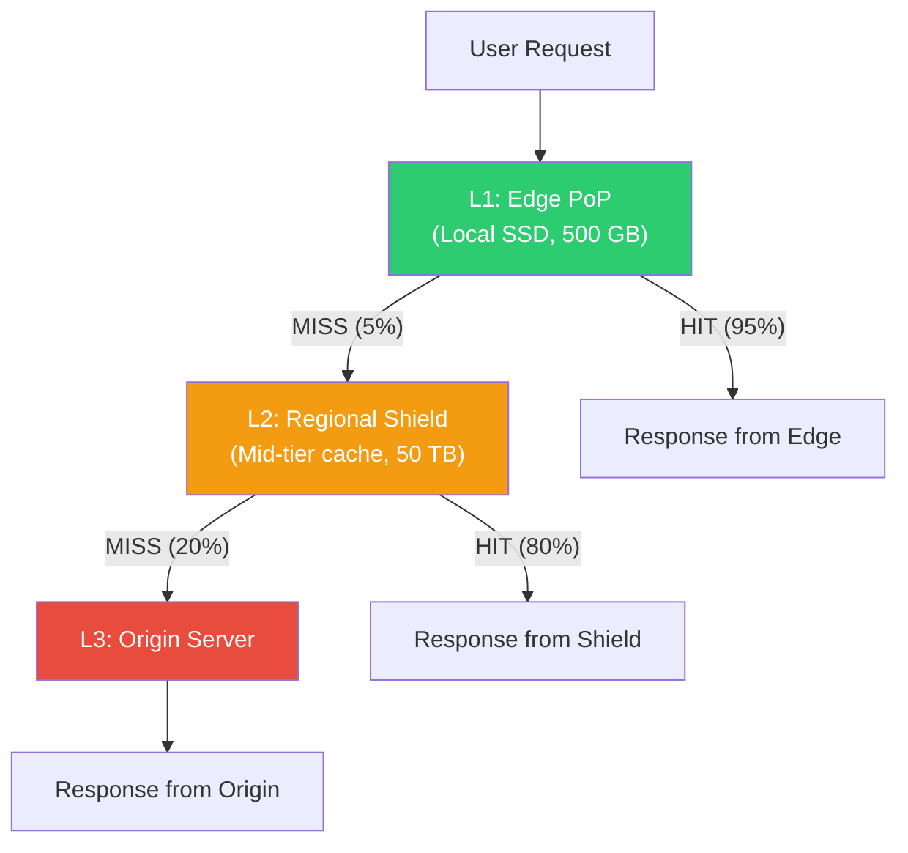

- **Edge PoP**: Closest to users. Caches the hottest content. High hit ratio for popular content.
- **Origin Shield**: A mid-tier cache (one per region). Collapses multiple edge misses into a single origin fetch. Reduces origin load by 80%.
- **Origin**: The source of truth. Only receives ~1% of total requests.

#### Cache Key Design

The cache key determines whether two requests share a cached response:

```
cache_key = hash(URL + relevant_headers)
```

Factors to include:
- **URL path and query string** (optionally ignore certain params like tracking IDs).
- **Vary headers**: `Accept-Encoding` (serve gzip vs. brotli), `Accept-Language` (localized content).
- **Device type**: Mobile vs. desktop (if serving different content).
- **Cookie**: Only if response varies by auth state (use with caution—reduces hit ratio).

#### Cache Invalidation at Global Scale

Purging content across 200+ PoPs within seconds requires a specialized propagation system:

1. **Purge request** received by control plane.
2. Control plane publishes purge event to a **global message bus** (Kafka or custom protocol).
3. Each PoP subscribes to the bus and deletes matching entries from local cache.
4. **Soft purge** (preferred): Mark entry as stale but still serveable. Revalidate on next request with `If-None-Match` (ETag). Avoids thundering herd to origin.
5. **Hard purge**: Delete immediately. Next request triggers a cache miss and origin fetch.

#### Stale-While-Revalidate

HTTP `Cache-Control: stale-while-revalidate=60` allows the CDN to:
1. Serve the stale cached version immediately (user gets fast response).
2. Asynchronously fetch a fresh copy from origin.
3. Update the cache for subsequent requests.

This is the **best practice for dynamic content**—users always get fast responses, and content freshness converges within the revalidation window.

#### Performance Optimizations

- **Connection reuse**: Keep persistent connections to origin (HTTP/2 multiplexing).
- **Compression**: Brotli for text assets (20-25% smaller than gzip).
- **Image optimization**: Convert images to WebP/AVIF on-the-fly based on `Accept` header.
- **HTTP/3 (QUIC)**: Eliminates head-of-line blocking; faster connection establishment.
- **Prefetching**: Parse HTML at the edge and prefetch linked assets before the browser requests them.
- **Edge computing**: Run logic at the PoP (A/B testing, personalization, auth) to avoid round-trips to origin.

### Bottlenecks & Mitigations

| Bottleneck | Mitigation |
|---|---|
| Cache miss storm on popular content | Origin shield collapses requests; request coalescing at edge |
| Long-tail content has low hit ratio | Multi-tier caching (edge → shield → origin); accept cache misses for rare content |
| Purge propagation delay | Global message bus with < 5s propagation; soft purge to avoid thundering herd |
| Origin overload during cache warm-up | Staggered warm-up; pre-warm popular content before traffic shift |
| SSL/TLS handshake latency | TLS 1.3 (1-RTT); session resumption; OCSP stapling; edge-terminated SSL |
| DNS resolution latency | Anycast DNS with < 5ms resolution; aggressive DNS TTLs (60s) |
| Large file delivery (video, software) | Byte-range caching; chunked delivery; peer-to-peer assist for massive files |
| Cache storage exhaustion at PoP | LRU eviction; tiered storage (SSD for hot, HDD for warm); predictive caching |

### Key Takeaways

- CDNs reduce latency from **100-300 ms** (origin) to **5-20 ms** (edge)—a 10-50× improvement.
- **Origin shield** is the most impactful optimization—it reduces origin load by 80%+ and prevents thundering herds.
- **Stale-while-revalidate** is the best strategy for dynamic content caching—fast responses with eventual freshness.
- **Anycast** routing is simpler and more resilient than GeoDNS for global request routing.
- Cache hit ratio is the **#1 metric**: 95%+ for static content, 70%+ for dynamic content.
- Modern CDNs are more than caches—they're **edge computing platforms** running serverless functions, WAFs, and bot detection.
- **Cache key design** is critical—too broad and you serve wrong content, too narrow and hit ratio plummets.

---

## Cross-Cutting Themes

The eight building blocks in this chapter share common principles that recur throughout system design:

1. **Horizontal scalability**: Every component scales by adding more nodes—not bigger nodes.
2. **Consistent hashing**: The universal tool for distributing data and routing requests.
3. **Caching at every layer**: From CPU caches to CDN edges, caching is the #1 performance lever.
4. **Fail-open vs. fail-closed**: Infrastructure components (rate limiters, gateways) should fail open; security components should fail closed.
5. **Observability**: Every component must emit metrics, logs, and traces. You cannot manage what you cannot measure.
6. **Tunable consistency**: Strong consistency is expensive; most systems benefit from tunable consistency that matches business requirements.

These primitives are the LEGO bricks of distributed systems. Master them, and you can assemble solutions to any system design problem—from URL shorteners to real-time messaging platforms to global-scale social networks.

> **Next: Chapter 2 — Data-Intensive Applications** — We'll dive into systems where the data model drives the architecture: URL shorteners, paste bins, notification systems, and search engines.
