# Chapter 2: Data & Storage Systems

> The backbone of any distributed architecture — storing, querying, and moving data at scale.

Data and storage systems form the foundation upon which all modern distributed applications are built. Whether you are streaming billions of events per day, searching through petabytes of logs, or coordinating distributed processes across thousands of nodes, the principles covered in this chapter are essential. We explore eight critical systems, each addressing a unique dimension of the data infrastructure landscape.

---

## 1. Distributed Message Queue

### Problem Statement

Modern distributed systems comprise dozens to hundreds of microservices that must communicate reliably. Direct synchronous communication (HTTP/RPC) creates tight coupling: if a downstream service is slow or unavailable, the caller blocks or fails. This cascading-failure problem becomes existential at scale — a single slow service can bring down an entire platform.

A distributed message queue decouples producers from consumers by introducing an intermediary broker that durably stores messages until consumers are ready to process them. This enables asynchronous communication, load leveling, and temporal decoupling. Producers fire-and-forget; consumers pull at their own pace.

Real-world systems like Apache Kafka process trillions of messages per day at companies like LinkedIn, Uber, and Netflix. Amazon SQS serves as the backbone for event-driven architectures across AWS. RabbitMQ powers complex routing topologies in financial services. The design of a message queue touches on durability, ordering guarantees, exactly-once semantics, and horizontal scalability — all fundamental distributed systems challenges.

### Use Cases

- **Event-driven microservices**: Decoupling order service from payment, inventory, and notification services
- **Log aggregation**: Collecting application logs from thousands of servers into a central pipeline
- **Stream processing**: Real-time analytics on clickstreams, sensor data, or financial transactions
- **Task distribution**: Distributing image processing, video transcoding, or ML inference jobs across workers
- **Change data capture (CDC)**: Streaming database changes to downstream systems for replication or indexing
- **Buffering & load leveling**: Absorbing traffic spikes between a web tier and a database tier
- **Event sourcing**: Storing immutable event streams as the source of truth for application state
- **Cross-region replication**: Replicating data between data centers for disaster recovery

### Functional Requirements

- **FR1**: Producers can publish messages to named topics/queues
- **FR2**: Consumers can subscribe to topics and receive messages in order
- **FR3**: Support both point-to-point (queue) and publish-subscribe (topic) delivery models
- **FR4**: Messages are durably persisted and survive broker restarts
- **FR5**: Support consumer groups — multiple consumers share the load of a single topic
- **FR6**: Provide at-least-once delivery guarantee by default, with optional exactly-once semantics
- **FR7**: Support message retention policies (time-based and size-based)
- **FR8**: Allow consumers to replay messages from any offset (seek capability)
- **FR9**: Support dead-letter queues for messages that fail processing repeatedly

### Non-Functional Requirements

- **NFR1**: **Throughput** — Handle ≥1 million messages/sec per cluster
- **NFR2**: **Latency** — End-to-end publish-to-consume latency <10ms at p99 for real-time use cases
- **NFR3**: **Durability** — Zero message loss once acknowledged (replicated to ≥2 replicas)
- **NFR4**: **Availability** — 99.99% uptime; survive single-node and single-rack failures
- **NFR5**: **Scalability** — Linearly scale throughput by adding brokers; support 10,000+ partitions
- **NFR6**: **Ordering** — Guarantee strict ordering within a partition
- **NFR7**: **Consistency** — Support configurable acks (acks=0, acks=1, acks=all)
- **NFR8**: **Operability** — Support rolling upgrades, online partition reassignment, and monitoring

### Capacity Estimation

Assume a large-scale deployment similar to a ride-sharing platform:

- **Producers**: 50,000 service instances publishing events
- **Message rate**: 1 million messages/sec aggregate
- **Average message size**: 1 KB
- **Retention**: 7 days

**Storage calculation:**
```
Messages/day = 1,000,000 msg/sec × 86,400 sec/day = 86.4 billion msg/day
Storage/day  = 86.4B × 1 KB = 86.4 TB/day
7-day retention = 86.4 TB × 7 = 604.8 TB
Replication factor = 3 → 604.8 TB × 3 = 1,814.4 TB ≈ 1.8 PB
```

**Bandwidth:**
```
Ingress  = 1,000,000 msg/sec × 1 KB = 1 GB/sec
Egress   = 1 GB/sec × 3 (replication) + 1 GB/sec × 2 (avg consumer fan-out) = 5 GB/sec
Total    = 6 GB/sec network throughput
```

**Broker count:**
```
Per-broker throughput ≈ 200 MB/sec sustained write
Brokers needed = 1 GB/sec ÷ 0.2 GB/sec = 5 brokers minimum
With headroom (50%) → 10 brokers
With replication overhead → 15 brokers
```

### API Design

#### Producer API

```http
POST /api/v1/topics/{topic_name}/messages
Content-Type: application/json
X-Idempotency-Key: 550e8400-e29b-41d4-a716-446655440000

{
  "key": "order-12345",
  "value": "eyJvcmRlcklkIjoiMTIzNDUiLCJhbW91bnQiOjk5Ljk5fQ==",
  "headers": {
    "source": "order-service",
    "event-type": "order.created",
    "timestamp": "2024-01-15T10:30:00Z"
  },
  "partition": null
}
```

**Response (201 Created):**
```json
{
  "topic": "orders",
  "partition": 7,
  "offset": 283947102,
  "timestamp": "2024-01-15T10:30:00.123Z"
}
```

#### Consumer API

```http
GET /api/v1/topics/{topic_name}/messages?consumer_group=payment-service&max_messages=100&timeout_ms=5000
Accept: application/json
```

**Response (200 OK):**
```json
{
  "messages": [
    {
      "key": "order-12345",
      "value": "eyJvcmRlcklkIjoiMTIzNDUiLCJhbW91bnQiOjk5Ljk5fQ==",
      "partition": 7,
      "offset": 283947102,
      "timestamp": "2024-01-15T10:30:00.123Z",
      "headers": { "source": "order-service" }
    }
  ],
  "count": 1
}
```

#### Commit Offsets

```http
POST /api/v1/topics/{topic_name}/offsets
Content-Type: application/json

{
  "consumer_group": "payment-service",
  "offsets": [
    { "partition": 7, "offset": 283947103 }
  ]
}
```

#### Topic Management

```http
POST /api/v1/topics
Content-Type: application/json

{
  "name": "orders",
  "partitions": 32,
  "replication_factor": 3,
  "retention_ms": 604800000,
  "config": {
    "compression.type": "lz4",
    "max.message.bytes": 1048576
  }
}
```

```http
GET /api/v1/topics
GET /api/v1/topics/{topic_name}
DELETE /api/v1/topics/{topic_name}
GET /api/v1/topics/{topic_name}/partitions
```

**Error Response (429 Too Many Requests):**
```json
{
  "error": {
    "code": "RATE_LIMIT_EXCEEDED",
    "message": "Producer rate limit exceeded for topic 'orders'",
    "retry_after_ms": 1000
  }
}
```

### Data Model

#### Broker Metadata (stored in ZooKeeper/KRaft)

```sql
CREATE TABLE topics (
    topic_name       VARCHAR(255) PRIMARY KEY,
    partition_count  INT NOT NULL,
    replication_factor INT NOT NULL,
    retention_ms     BIGINT DEFAULT 604800000,
    created_at       TIMESTAMP DEFAULT NOW()
);

CREATE TABLE partitions (
    topic_name    VARCHAR(255),
    partition_id  INT,
    leader_broker INT NOT NULL,
    isr           INT[] NOT NULL,           -- in-sync replica set
    epoch         BIGINT DEFAULT 0,
    PRIMARY KEY (topic_name, partition_id)
);

CREATE TABLE consumer_offsets (
    consumer_group VARCHAR(255),
    topic_name     VARCHAR(255),
    partition_id   INT,
    committed_offset BIGINT NOT NULL,
    metadata       VARCHAR(255),
    updated_at     TIMESTAMP,
    PRIMARY KEY (consumer_group, topic_name, partition_id)
);
```

#### On-Disk Segment Structure

Each partition is an append-only log split into segments:

```
/data/topics/orders/partition-7/
  ├── 00000000000000000000.log      # segment file (messages)
  ├── 00000000000000000000.index    # offset → file position
  ├── 00000000000000000000.timeindex # timestamp → offset
  ├── 00000000000283940000.log      # next segment
  ├── 00000000000283940000.index
  └── leader-epoch-checkpoint
```

Each `.log` file stores a sequence of records:

```
┌─────────┬──────────┬─────┬───────┬──────┬───────────┐
│ Offset  │ Msg Size │ CRC │ Magic │ Key  │   Value   │
│ (8 B)   │ (4 B)    │(4B) │ (1B)  │(var) │   (var)   │
└─────────┴──────────┴─────┴───────┴──────┴───────────┘
```

### High-Level Design

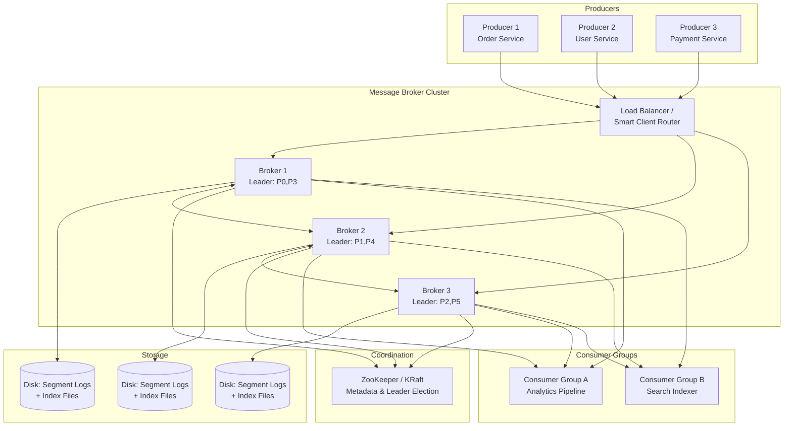

**Component Responsibilities:**

- **Producers**: Serialize messages, determine target partition (via key hashing or round-robin), and send to the partition leader.
- **Brokers**: Accept writes, replicate to followers, serve reads. Each broker leads some partitions and follows others.
- **Coordination Service (ZooKeeper/KRaft)**: Maintains cluster metadata, performs leader election, tracks ISR (in-sync replicas).
- **Segment Storage**: Append-only log files with sparse index for O(log n) offset lookup.
- **Consumer Groups**: Each partition is assigned to exactly one consumer in a group, enabling parallel processing.

### Deep Dive

#### Partitioning & Ordering

Messages with the same key always go to the same partition (via `hash(key) % num_partitions`), guaranteeing per-key ordering. This is critical for event sourcing — all events for order-12345 are processed in sequence. When no key is specified, the producer uses a sticky partitioner that batches to the same partition for efficiency, rotating periodically.

#### Replication & ISR

Each partition has one leader and N-1 followers. The ISR (In-Sync Replica) set contains followers that are caught up to the leader within a configurable lag threshold. With `acks=all`, the leader waits for all ISR members to acknowledge before confirming the write. If an ISR member falls behind, it is removed from the ISR set, and the leader proceeds with the remaining members. When a leader fails, a new leader is elected from the ISR.

**Replication protocol:**
1. Producer sends message to leader
2. Leader appends to local log, assigns offset
3. Followers fetch from leader (pull-based replication)
4. Each follower appends and sends ACK
5. Leader advances high-water mark when all ISR members catch up
6. Consumers only see messages up to the high-water mark

#### Write-Ahead Log & Segment Management

The log is the fundamental data structure. Writes are sequential appends — this is why Kafka achieves throughput close to raw disk I/O bandwidth. Segments are rolled when they hit a size limit (1 GB default) or time limit. Old segments are deleted or compacted based on retention policy.

**Log compaction** retains only the latest value per key, useful for changelog topics. A background thread scans old segments, removes superseded entries, and rewrites cleaned segments.

#### Exactly-Once Semantics

Achieved through idempotent producers (sequence numbers per partition) and transactional writes. The producer maintains a Producer ID (PID) and sequence number. Brokers deduplicate by tracking the last sequence per PID per partition. Transactions span multiple partitions using a two-phase commit coordinated by a Transaction Coordinator.

#### Zero-Copy Transfer

When serving reads, the broker uses `sendfile()` syscall to transfer data directly from the page cache to the network socket, bypassing user-space copying. This reduces CPU usage by ~50% and is a key reason for high throughput.

#### Consumer Rebalancing

When consumers join or leave a group, a rebalance assigns partitions to consumers. The **Cooperative Sticky Assignor** minimizes partition movement — only reassigning partitions that must move, avoiding stop-the-world pauses.

### Bottlenecks & Mitigations

| Bottleneck | Mitigation |
|---|---|
| Disk I/O saturation on hot partitions | Spread partitions across disks; use tiered storage (hot/cold) |
| Network bottleneck on leader brokers | Follower fetching from closest replica; rack-aware replication |
| Consumer lag during traffic spikes | Auto-scaling consumer groups; configurable fetch size |
| Rebalance storms (frequent consumer churn) | Cooperative sticky assignor; static group membership |
| Head-of-line blocking on slow consumers | Independent partitions; per-consumer backpressure |
| Metadata overhead with 100K+ partitions | KRaft (Raft-based metadata) replacing ZooKeeper |

### Key Takeaways

- The append-only log is the core abstraction — sequential I/O enables throughput close to hardware limits
- Partitioning provides horizontal scalability; key-based partitioning guarantees per-key ordering
- ISR-based replication balances durability and availability — a tunable consistency spectrum
- Exactly-once semantics require both idempotent producers and transactional writes
- Zero-copy I/O and page cache utilization are critical performance optimizations
- Consumer groups with cooperative rebalancing enable elastic scaling without downtime

---

## 2. Distributed Logging & Tracing System

### Problem Statement

In a microservices architecture with hundreds of services, a single user request may fan out to 20+ services. When something goes wrong — a request is slow, an error occurs, or data is inconsistent — engineers need to reconstruct the full journey of that request across all services. Without centralized logging and distributed tracing, debugging becomes a nightmare of SSH-ing into individual machines and grepping through local log files.

A distributed logging and tracing system collects, indexes, and correlates logs and traces from all services in real time. Logs capture discrete events ("user X logged in at time T"), while traces capture the causal chain of operations across services (service A called service B which called service C, each with timing information). Together, they provide observability — the ability to understand system behavior from external outputs.

Systems like the ELK stack (Elasticsearch, Logstash, Kibana), Jaeger, and Datadog ingest billions of log lines and millions of traces per day. The challenge is doing this with low overhead on application services, minimal data loss, and fast query response times for interactive debugging.

### Use Cases

- **Root cause analysis**: Tracing a failed request through 15 microservices to find the failing one
- **Performance debugging**: Identifying that 80% of latency comes from a single downstream service
- **Error rate monitoring**: Alerting when a service's error rate exceeds a threshold
- **Audit trails**: Immutable logs of security-sensitive operations for compliance (SOX, HIPAA)
- **Capacity planning**: Analyzing traffic patterns and resource usage over time
- **Service dependency mapping**: Auto-discovering which services communicate with which
- **SLA tracking**: Measuring p50/p95/p99 latency for each service and endpoint
- **Anomaly detection**: ML-based detection of unusual log patterns or trace anomalies

### Functional Requirements

- **FR1**: Ingest structured and unstructured logs from all services via agents or direct shipping
- **FR2**: Support distributed tracing with trace context propagation (W3C Trace Context / B3)
- **FR3**: Full-text search over log messages with filtering by service, severity, time range
- **FR4**: Visualize traces as waterfall/Gantt charts showing span hierarchy and timing
- **FR5**: Support log correlation — link logs to the trace/span that produced them
- **FR6**: Alerting rules on log patterns, error rates, and latency thresholds
- **FR7**: Retention policies — hot (recent, fast query), warm, cold (archived, slow query)
- **FR8**: Dashboard and visualization builder for operational metrics derived from logs

### Non-Functional Requirements

- **NFR1**: **Ingestion rate** — Handle ≥500,000 log lines/sec and ≥50,000 spans/sec
- **NFR2**: **Query latency** — Full-text search returns results in <2 seconds for 7-day window
- **NFR3**: **Ingestion latency** — Logs searchable within 5 seconds of emission (near real-time)
- **NFR4**: **Availability** — 99.9% uptime for writes; read degradation acceptable during failures
- **NFR5**: **Durability** — Zero log loss for ERROR/FATAL; best-effort for DEBUG/TRACE
- **NFR6**: **Scalability** — Linearly scale ingestion by adding collector nodes
- **NFR7**: **Low overhead** — Tracing agent adds <1% CPU and <5ms latency to instrumented services
- **NFR8**: **Cost efficiency** — Tiered storage; 90% of data on cheap cold storage after 7 days

### Capacity Estimation

Assume a platform with 500 microservices, each running 20 instances:

- **Service instances**: 500 × 20 = 10,000 instances
- **Logs per instance**: 50 log lines/sec average
- **Log ingestion**: 10,000 × 50 = 500,000 log lines/sec
- **Average log line size**: 500 bytes

**Storage:**
```
Log volume/day   = 500,000 lines/sec × 500 B × 86,400 sec = 21.6 TB/day
30-day hot store = 21.6 TB × 30 = 648 TB
90-day cold store= 21.6 TB × 60 = 1,296 TB (compressed 5:1 → 259.2 TB)
Index overhead   = ~15% of raw data → 648 TB × 0.15 = 97.2 TB
Total hot        = 648 + 97.2 ≈ 745 TB
```

**Tracing:**
```
Traces/sec        = 10,000 requests/sec (sampled at 10% → 1,000 traces/sec)
Spans per trace   = 15 average
Span ingestion    = 1,000 × 15 = 15,000 spans/sec
Span size         = 500 bytes average
Trace storage/day = 15,000 × 500 B × 86,400 = 648 GB/day
```

**Bandwidth:**
```
Ingress = 500,000 × 500 B = 250 MB/sec (logs) + 7.5 MB/sec (traces) ≈ 258 MB/sec
```

### API Design

#### Log Ingestion

```http
POST /api/v1/logs/ingest
Content-Type: application/json

{
  "logs": [
    {
      "timestamp": "2024-01-15T10:30:00.123Z",
      "severity": "ERROR",
      "service": "payment-service",
      "instance": "payment-7b4f9c-xk2j4",
      "trace_id": "4bf92f3577b34da6a3ce929d0e0e4736",
      "span_id": "00f067aa0ba902b7",
      "message": "Payment processing failed: insufficient funds",
      "attributes": {
        "user_id": "usr_12345",
        "order_id": "ord_67890",
        "amount": 99.99,
        "error_code": "INSUFFICIENT_FUNDS"
      }
    }
  ]
}
```

**Response (202 Accepted):**
```json
{
  "accepted": 1,
  "failed": 0
}
```

#### Log Search

```http
GET /api/v1/logs/search?q=payment+failed&service=payment-service&severity=ERROR&from=2024-01-15T00:00:00Z&to=2024-01-15T23:59:59Z&limit=50&offset=0
Accept: application/json
```

**Response (200 OK):**
```json
{
  "total_hits": 1342,
  "took_ms": 187,
  "logs": [
    {
      "timestamp": "2024-01-15T10:30:00.123Z",
      "severity": "ERROR",
      "service": "payment-service",
      "message": "Payment processing failed: insufficient funds",
      "trace_id": "4bf92f3577b34da6a3ce929d0e0e4736"
    }
  ],
  "pagination": {
    "limit": 50,
    "offset": 0,
    "has_more": true
  }
}
```

#### Trace APIs

```http
POST /api/v1/traces/ingest
Content-Type: application/json

{
  "spans": [
    {
      "trace_id": "4bf92f3577b34da6a3ce929d0e0e4736",
      "span_id": "00f067aa0ba902b7",
      "parent_span_id": "a3ce929d0e0e4736",
      "operation": "POST /api/payments",
      "service": "payment-service",
      "start_time": "2024-01-15T10:30:00.100Z",
      "duration_ms": 45,
      "status": "ERROR",
      "tags": {
        "http.method": "POST",
        "http.status_code": 500
      }
    }
  ]
}
```

```http
GET /api/v1/traces/{trace_id}
GET /api/v1/traces?service=payment-service&operation=POST+/api/payments&min_duration_ms=100&limit=20
```

### Data Model

#### Log Storage (Elasticsearch Index)

```json
{
  "mappings": {
    "properties": {
      "timestamp":  { "type": "date" },
      "severity":   { "type": "keyword" },
      "service":    { "type": "keyword" },
      "instance":   { "type": "keyword" },
      "trace_id":   { "type": "keyword" },
      "span_id":    { "type": "keyword" },
      "message":    { "type": "text", "analyzer": "standard" },
      "attributes": { "type": "object", "dynamic": true }
    }
  },
  "settings": {
    "number_of_shards": 10,
    "number_of_replicas": 1,
    "index.lifecycle.name": "logs-hot-warm-cold"
  }
}
```

Indexes are time-partitioned: `logs-2024.01.15`, `logs-2024.01.16`, etc. This enables efficient time-range queries and simple retention (delete old indexes).

#### Trace Storage

```sql
CREATE TABLE spans (
    trace_id       CHAR(32) NOT NULL,
    span_id        CHAR(16) NOT NULL,
    parent_span_id CHAR(16),
    service_name   VARCHAR(128) NOT NULL,
    operation_name VARCHAR(256) NOT NULL,
    start_time     TIMESTAMP NOT NULL,
    duration_us    BIGINT NOT NULL,
    status_code    SMALLINT,
    tags           JSONB,
    PRIMARY KEY (trace_id, span_id)
) PARTITION BY RANGE (start_time);

CREATE INDEX idx_spans_service_time ON spans (service_name, start_time);
CREATE INDEX idx_spans_duration ON spans (duration_us) WHERE duration_us > 1000000;
```

### High-Level Design

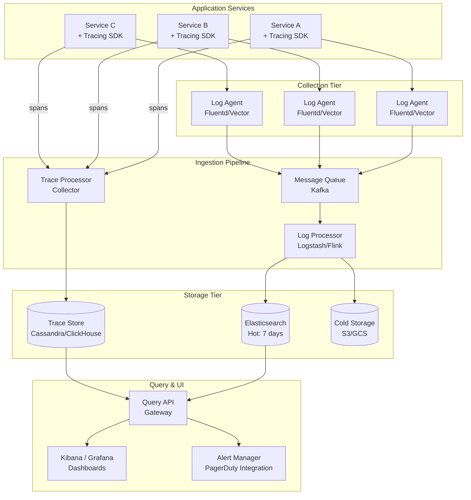

**Component details:**
- **Tracing SDK**: Injected into each service; propagates trace context (trace_id, span_id) through headers; reports spans to the collector with minimal overhead using async batching.
- **Log Agents (Fluentd/Vector)**: Run as sidecars or daemonsets; tail log files, parse/enrich, and forward to Kafka. Provide backpressure and local buffering.
- **Kafka**: Decouples collection from processing. Handles ingestion bursts without dropping logs.
- **Log Processor**: Parses unstructured logs, enriches with metadata, and writes to Elasticsearch. Can do sampling and filtering.
- **Elasticsearch**: Full-text indexed log storage for interactive querying.
- **Cold Storage**: Compressed old logs in object storage for compliance/audit.

### Deep Dive

#### Trace Context Propagation

The W3C Trace Context standard defines two headers propagated on every cross-service call:
- `traceparent: 00-{trace_id}-{parent_span_id}-{flags}` — carries the trace identity
- `tracestate: vendor=value` — vendor-specific data

When Service A calls Service B, the SDK creates a child span, injects the headers, and the receiving SDK extracts them to continue the trace. This works across HTTP, gRPC, and messaging systems.

#### Adaptive Sampling

Ingesting 100% of traces is prohibitively expensive. Sampling strategies include:
- **Head-based sampling**: Decide at the root span whether to sample (e.g., 10%). Simple but misses rare errors.
- **Tail-based sampling**: Buffer complete traces, then decide based on attributes (errors, high latency). Catches interesting traces but requires more memory.
- **Rate-limiting per service**: Ensure each service contributes proportionally.

The collector implements tail-based sampling with a trace buffer that holds spans for 30 seconds, awaiting the root span to make a decision.

#### Index Lifecycle Management (ILM)

Elasticsearch uses ILM policies to move indexes through phases:
1. **Hot** (0–3 days): Fast SSDs, all replicas, full indexing
2. **Warm** (3–30 days): HDDs, force-merge to 1 segment, read-only
3. **Cold** (30–90 days): Frozen indexes on shared storage, searchable snapshots
4. **Delete**: Remove after 90 days

This reduces storage costs by ~80% compared to keeping all data on hot storage.

#### Log Correlation

Every log line emitted within a traced request includes the `trace_id` and `span_id`. This enables "click-to-trace" — from a log line in Kibana, jump directly to the full trace waterfall in Jaeger/Tempo. This is the most powerful debugging workflow: search logs for errors → find trace → see the full request journey.

### Bottlenecks & Mitigations

| Bottleneck | Mitigation |
|---|---|
| Elasticsearch indexing bottleneck under spike | Kafka buffering decouples ingestion from indexing |
| Query slowness on large time ranges | Time-partitioned indexes; force users to narrow time range |
| Trace collector memory for tail-based sampling | Probabilistic data structures; cap buffer size with LRU eviction |
| Agent overhead on application hosts | Async batching; binary protocol (OTLP/gRPC); CPU/memory limits |
| Cardinality explosion in tags/labels | Tag value limits; drop high-cardinality tags at ingestion |
| Cross-service clock skew in traces | Use monotonic clocks for duration; NTP sync requirement |

### Key Takeaways

- Logs and traces are complementary — logs are events, traces are causal chains; correlate them via trace_id
- Decouple ingestion from indexing with a message queue to handle bursts
- Sampling is essential for tracing — tail-based sampling catches the interesting traces
- Tiered storage (hot/warm/cold) makes retention affordable
- Context propagation (W3C Trace Context) is the foundation of distributed tracing
- Keep agent overhead minimal — observability must not degrade the observed system

---

## 3. Object Storage

### Problem Statement

Modern applications generate massive amounts of unstructured data — images, videos, documents, backups, ML training datasets, and log archives. Traditional file systems struggle beyond a single machine's capacity and cannot provide the durability guarantees needed for critical data. Block storage is expensive and requires manual volume management.

Object storage provides a flat namespace of objects (blobs of data identified by keys), accessible via HTTP APIs. It decouples storage from compute, allowing unlimited scale. Objects are immutable once written, simplifying replication and caching. Amazon S3 stores over 100 trillion objects and serves tens of millions of requests per second. It has become the de facto standard for data lakes, static asset serving, and archival storage.

The key design challenge is providing 11 nines of durability (99.999999999%) — meaning if you store 10 million objects, you statistically lose one every 10,000 years — while maintaining high throughput and low cost. This requires sophisticated data placement, erasure coding, and integrity verification across thousands of storage nodes.

### Use Cases

- **Static asset hosting**: Serving images, CSS, JS for web and mobile applications via CDN
- **Data lake storage**: Storing raw and processed data for analytics (Spark, Presto, Hive)
- **Backup & disaster recovery**: Nightly database backups stored across multiple regions
- **ML training data**: Storing petabytes of labeled images, text, and video for model training
- **Video streaming**: Storing and serving video-on-demand content
- **Compliance archival**: Long-term retention of financial records, healthcare data (WORM)
- **Log archival**: Cold storage for logs beyond the hot retention window
- **Software artifact storage**: Container images, build artifacts, package registries

### Functional Requirements

- **FR1**: PUT/GET/DELETE objects identified by a bucket + key pair
- **FR2**: Support objects from 1 byte to 5 TB with multipart upload for large objects
- **FR3**: Bucket-level namespace isolation and access control
- **FR4**: Object versioning — maintain history of all versions of an object
- **FR5**: Lifecycle policies — auto-transition to cheaper storage classes, auto-delete
- **FR6**: List objects with prefix filtering and pagination (lexicographic ordering)
- **FR7**: Pre-signed URLs for time-limited access without credentials
- **FR8**: Server-side encryption (SSE-S3, SSE-KMS) and client-side encryption support

### Non-Functional Requirements

- **NFR1**: **Durability** — 99.999999999% (11 nines) annual durability per object
- **NFR2**: **Availability** — 99.99% for reads, 99.9% for writes
- **NFR3**: **Throughput** — Support 100,000+ requests/sec per bucket
- **NFR4**: **Latency** — First-byte latency <100ms for reads, <200ms for writes
- **NFR5**: **Scalability** — Unlimited objects per bucket; unlimited total storage
- **NFR6**: **Consistency** — Strong read-after-write consistency
- **NFR7**: **Cost efficiency** — Storage cost <$0.023/GB/month; infrequent access tier <$0.01/GB/month
- **NFR8**: **Integrity** — End-to-end checksums; automatic corruption detection and repair

### Capacity Estimation

Assume a large SaaS platform (photo sharing + data lake):

- **Objects stored**: 50 billion objects
- **Total storage**: 500 PB
- **Average object size**: 10 KB (metadata, small files) to 100 MB (media) → weighted avg 10 MB
- **PUT requests**: 50,000/sec
- **GET requests**: 200,000/sec

**Storage with erasure coding:**
```
Raw data        = 500 PB
Erasure coding  = Reed-Solomon (10,4) → 1.4x overhead
Total disk      = 500 PB × 1.4 = 700 PB
Metadata        = 50B objects × 1 KB/object = 50 TB
```

**Bandwidth:**
```
Write bandwidth = 50,000 req/sec × 10 MB avg = 500 GB/sec (peak, not all large)
Read bandwidth  = 200,000 req/sec × 10 MB avg = 2,000 GB/sec (peak)
Realistic (size distribution): Write ~50 GB/sec, Read ~200 GB/sec
```

**Node count:**
```
Storage per node  = 100 TB (36 disks × 3 TB)
Nodes for storage = 700 PB / 100 TB = 7,000 storage nodes
```

### API Design

#### Object Operations

```http
PUT /api/v1/buckets/{bucket}/objects/{key}
Content-Type: image/jpeg
Content-Length: 2048576
Content-MD5: Q2hlY2tzdW0=
x-storage-class: STANDARD
x-server-side-encryption: AES256

<binary data>
```

**Response (200 OK):**
```json
{
  "bucket": "user-photos",
  "key": "users/12345/profile.jpg",
  "version_id": "v3_2024011510300",
  "etag": "\"d41d8cd98f00b204e9800998ecf8427e\"",
  "size": 2048576,
  "storage_class": "STANDARD"
}
```

```http
GET /api/v1/buckets/{bucket}/objects/{key}
Range: bytes=0-1023

GET /api/v1/buckets/{bucket}/objects/{key}?version_id=v3_2024011510300

DELETE /api/v1/buckets/{bucket}/objects/{key}

HEAD /api/v1/buckets/{bucket}/objects/{key}
```

#### Multipart Upload

```http
POST /api/v1/buckets/{bucket}/objects/{key}/uploads
```

**Response (200 OK):**
```json
{
  "upload_id": "upl_abc123xyz",
  "bucket": "data-lake",
  "key": "datasets/training/batch-001.parquet"
}
```

```http
PUT /api/v1/buckets/{bucket}/objects/{key}/uploads/{upload_id}/parts/{part_number}
Content-Length: 104857600

<binary data — 100MB chunk>
```

```http
POST /api/v1/buckets/{bucket}/objects/{key}/uploads/{upload_id}/complete
Content-Type: application/json

{
  "parts": [
    { "part_number": 1, "etag": "\"a54357aff0632cce46d942af68356b38\"" },
    { "part_number": 2, "etag": "\"0dc9841d5c1e56e0a7b283eb7e8e5c23\"" }
  ]
}
```

#### Listing & Bucket Management

```http
GET /api/v1/buckets/{bucket}/objects?prefix=users/12345/&delimiter=/&max_keys=1000&continuation_token=abc123

POST /api/v1/buckets
{ "name": "user-photos", "region": "us-east-1" }

GET /api/v1/buckets
DELETE /api/v1/buckets/{bucket}
```

#### Pre-Signed URLs

```http
POST /api/v1/buckets/{bucket}/objects/{key}/presign
{
  "method": "GET",
  "expires_in_seconds": 3600
}
```

**Response:**
```json
{
  "url": "https://storage.example.com/user-photos/users/12345/profile.jpg?X-Signature=abc&X-Expires=1705315800"
}
```

### Data Model

#### Metadata Store (Distributed KV / DynamoDB-style)

```sql
CREATE TABLE object_metadata (
    bucket_name   VARCHAR(63) NOT NULL,
    object_key    VARCHAR(1024) NOT NULL,
    version_id    VARCHAR(64) NOT NULL,
    is_latest     BOOLEAN DEFAULT TRUE,
    size_bytes    BIGINT NOT NULL,
    etag          CHAR(32) NOT NULL,
    content_type  VARCHAR(256),
    storage_class VARCHAR(32) DEFAULT 'STANDARD',
    encryption    VARCHAR(32),
    created_at    TIMESTAMP NOT NULL,
    is_delete_marker BOOLEAN DEFAULT FALSE,
    chunk_map     JSONB NOT NULL,  -- maps to physical chunk locations
    PRIMARY KEY (bucket_name, object_key, version_id)
);

CREATE INDEX idx_bucket_prefix ON object_metadata (bucket_name, object_key);
```

#### Chunk Placement Table

```sql
CREATE TABLE chunks (
    chunk_id       UUID PRIMARY KEY,
    object_key     VARCHAR(1024),
    part_number    INT,
    erasure_group  UUID NOT NULL,       -- group of data + parity shards
    shard_index    INT NOT NULL,        -- 0-9 data, 10-13 parity
    storage_node   VARCHAR(128) NOT NULL,
    disk_path      VARCHAR(512) NOT NULL,
    checksum       CHAR(64) NOT NULL,   -- SHA-256
    size_bytes     BIGINT NOT NULL
);

CREATE INDEX idx_chunks_node ON chunks (storage_node);
CREATE INDEX idx_chunks_erasure ON chunks (erasure_group);
```

### High-Level Design

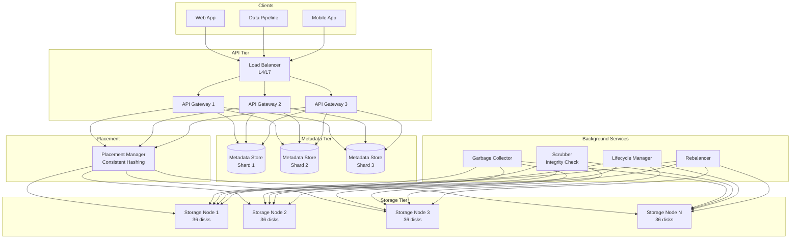

**Write path:** Client → API Gateway → Metadata Store (reserve key) → Placement Manager (determine nodes) → Stream data to storage nodes (erasure-coded) → Update metadata with chunk locations → ACK to client.

**Read path:** Client → API Gateway → Metadata Store (lookup chunk locations) → Parallel read from storage nodes → Reassemble and stream to client.

### Deep Dive

#### Erasure Coding vs. Replication

Simple 3x replication provides durability but at 3x storage cost. Erasure coding (e.g., Reed-Solomon 10,4) splits an object into 10 data chunks and 4 parity chunks. Any 10 of the 14 chunks can reconstruct the object. This tolerates up to 4 simultaneous chunk losses at only 1.4x storage overhead.

**Durability calculation (RS 10,4):**
- Probability of a single disk failure per year: 2%
- Need 5+ failures in same erasure group for data loss
- P(data loss) = C(14,5) × (0.02)^5 × (0.98)^9 ≈ 10^-11 → 11 nines

#### Data Integrity (Scrubbing)

A background scrubber continuously reads chunks and verifies checksums. When corruption is detected:
1. Mark the chunk as damaged
2. Read remaining healthy chunks from the erasure group
3. Reconstruct the damaged chunk using erasure coding math
4. Write the repaired chunk to a new storage node
5. Update the placement record

This self-healing process runs continuously, repairing bitrot before it can accumulate.

#### Consistent Hashing for Placement

Objects are assigned to erasure groups using consistent hashing on the object key. Each storage node owns a range of the hash ring. When nodes are added/removed, only a fraction of chunks need to move. Virtual nodes ensure uniform distribution — each physical node has 100-200 virtual nodes on the ring.

#### Strong Consistency

Achieving strong read-after-write consistency requires that reads always reflect the latest write. The metadata store uses a consensus protocol (Paxos/Raft) to ensure that once a PUT is acknowledged, all subsequent GETs will see the new version. This was a landmark feature when S3 added it in 2020, eliminating many subtle application bugs.

### Bottlenecks & Mitigations

| Bottleneck | Mitigation |
|---|---|
| Small object overhead (metadata > data) | Batch small objects into aggregate files; metadata caching |
| LIST operations on millions of objects | B-tree indexes on key prefixes; pagination with continuation tokens |
| Hot key/bucket (viral content) | Request rate partitioning; auto-split hot prefix ranges |
| Cross-rack data transfer during repair | Rack-aware placement; minimize cross-rack repair traffic |
| Metadata store becoming bottleneck | Shard by bucket+key prefix; cache frequently accessed metadata |
| Multipart upload failures | Resumable uploads; automatic cleanup of abandoned uploads |

### Key Takeaways

- Erasure coding provides 11-nines durability at 1.4x overhead vs. 3x for replication
- Separate metadata from data — metadata is small, critical, and needs strong consistency
- Background scrubbing provides self-healing against bitrot and disk failures
- Consistent hashing enables smooth scaling and minimal data movement
- Immutable objects simplify caching, CDN integration, and versioning
- The flat namespace (bucket + key) enables unlimited scale by avoiding directory hierarchies

---

## 4. Distributed File System

### Problem Statement

While object storage excels at storing blobs with simple PUT/GET semantics, many workloads need POSIX-like file system semantics — hierarchical directories, random reads/writes, append operations, and file locking. Big data processing frameworks (MapReduce, Spark) need to read and write massive files in parallel across a cluster, with data locality optimization to minimize network transfer.

A distributed file system (DFS) provides a unified file namespace across hundreds or thousands of machines, enabling applications to work with files that are far larger than a single disk. Google File System (GFS) and its open-source descendant HDFS store exabytes of data and serve as the foundation for the entire big data ecosystem.

The core challenge is coordinating metadata (which blocks are where) with data (the actual bytes) at massive scale, while handling the constant failure of commodity hardware. In a 10,000-node cluster, multiple disks fail every day — the system must automatically re-replicate data without human intervention.

### Use Cases

- **MapReduce/Spark processing**: Reading input splits in parallel, writing output files
- **Data warehouse storage**: Storing columnar data files (Parquet, ORC) for Hive/Presto
- **Log storage**: Append-only storage of massive log files from thousands of servers
- **ML training pipelines**: Storing and shuffling training datasets across GPU clusters
- **Backup and archival**: Storing large backup sets that must be split across many machines
- **Media processing**: Storing raw video/image files for batch processing pipelines

### Functional Requirements

- **FR1**: Create, read, write, delete, and rename files and directories
- **FR2**: Support files up to petabytes in size via chunking
- **FR3**: Append-optimized writes — support concurrent appenders to the same file
- **FR4**: Hierarchical namespace with POSIX-like directory structure
- **FR5**: Data locality exposure — clients can request blocks close to their compute node
- **FR6**: Automatic data replication (configurable factor, default 3)
- **FR7**: Snapshots for point-in-time consistent views of directories
- **FR8**: Rack-aware replica placement for fault tolerance

### Non-Functional Requirements

- **NFR1**: **Throughput** — Sustain ≥10 GB/sec aggregate read throughput per cluster
- **NFR2**: **Scalability** — Support 100,000+ nodes and exabytes of data
- **NFR3**: **Fault tolerance** — Tolerate simultaneous loss of a full rack (30+ nodes)
- **NFR4**: **Availability** — Automatic failover of NameNode (HA) in <30 seconds
- **NFR5**: **Consistency** — Single-writer semantics; strong consistency for metadata
- **NFR6**: **Data locality** — Schedule compute on nodes that hold the data blocks
- **NFR7**: **Recovery time** — Re-replicate under-replicated blocks within minutes
- **NFR8**: **Namespace scale** — Support billions of files/directories in the namespace

### Capacity Estimation

Assume a large data platform:

- **Cluster size**: 5,000 DataNodes
- **Storage per node**: 12 disks × 10 TB = 120 TB per node
- **Raw capacity**: 5,000 × 120 TB = 600 PB
- **Replication factor**: 3
- **Usable capacity**: 600 PB / 3 = 200 PB

**Block calculations:**
```
Block size          = 128 MB (default)
Total blocks        = 200 PB / 128 MB = 1.6 billion blocks
Replicated blocks   = 1.6B × 3 = 4.8 billion block replicas
Metadata per block  = ~150 bytes
NameNode memory     = 4.8B × 150 B = 720 GB (needs large heap!)
```

**Throughput:**
```
Per-node read throughput = 500 MB/sec (disk sequential read)
Cluster read throughput  = 5,000 × 500 MB/sec = 2.5 TB/sec theoretical max
```

### API Design

```http
PUT /api/v1/filesystem/files/{path}
Content-Type: application/octet-stream
x-block-size: 134217728
x-replication: 3

<binary data>
```

```http
GET /api/v1/filesystem/files/{path}?offset=0&length=134217728

DELETE /api/v1/filesystem/files/{path}

POST /api/v1/filesystem/files/{path}/append
Content-Type: application/octet-stream

<binary data>
```

**Directory Operations:**

```http
PUT /api/v1/filesystem/directories/{path}

GET /api/v1/filesystem/directories/{path}?recursive=false&limit=1000

DELETE /api/v1/filesystem/directories/{path}?recursive=true
```

**Block Location Query (for data-local scheduling):**

```http
GET /api/v1/filesystem/files/{path}/block-locations?offset=0&length=268435456
```

**Response:**
```json
{
  "blocks": [
    {
      "block_id": "blk_1073741825",
      "offset": 0,
      "length": 134217728,
      "locations": [
        { "host": "dn-042.cluster.local", "rack": "/rack-07" },
        { "host": "dn-118.cluster.local", "rack": "/rack-12" },
        { "host": "dn-203.cluster.local", "rack": "/rack-21" }
      ]
    },
    {
      "block_id": "blk_1073741826",
      "offset": 134217728,
      "length": 134217728,
      "locations": [
        { "host": "dn-007.cluster.local", "rack": "/rack-02" },
        { "host": "dn-091.cluster.local", "rack": "/rack-09" },
        { "host": "dn-155.cluster.local", "rack": "/rack-16" }
      ]
    }
  ]
}
```

### Data Model

#### NameNode Metadata (In-Memory + Journal)

```sql
-- Inode table (files and directories)
CREATE TABLE inodes (
    inode_id        BIGINT PRIMARY KEY AUTO_INCREMENT,
    parent_id       BIGINT REFERENCES inodes(inode_id),
    name            VARCHAR(255) NOT NULL,
    is_directory    BOOLEAN NOT NULL,
    replication     SMALLINT DEFAULT 3,
    block_size      INT DEFAULT 134217728,
    file_size       BIGINT DEFAULT 0,
    permission      VARCHAR(9) DEFAULT 'rwxr-xr-x',
    owner           VARCHAR(64),
    group_name      VARCHAR(64),
    mtime           TIMESTAMP,
    atime           TIMESTAMP,
    UNIQUE(parent_id, name)
);

-- Block mapping table
CREATE TABLE blocks (
    block_id     BIGINT PRIMARY KEY,
    inode_id     BIGINT REFERENCES inodes(inode_id),
    block_index  INT NOT NULL,
    num_bytes    BIGINT NOT NULL,
    generation_stamp BIGINT NOT NULL
);

-- Block location (reported by DataNodes, not persisted)
-- Reconstructed at startup from DataNode block reports
CREATE TABLE block_locations (
    block_id      BIGINT,
    datanode_id   VARCHAR(128),
    rack          VARCHAR(64),
    PRIMARY KEY (block_id, datanode_id)
);
```

### High-Level Design

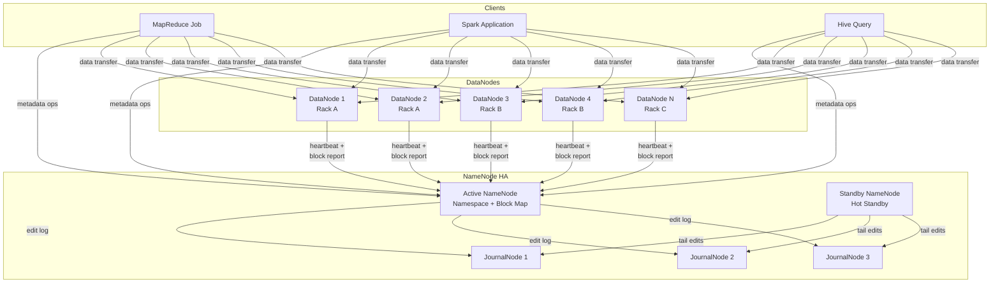

**Write pipeline:** Client asks NameNode to create file → NameNode allocates block IDs and picks DataNodes (rack-aware) → Client streams data to first DataNode → DataNode pipelines data to second and third replicas → ACKs propagate back → Client reports completion to NameNode.

**Read path:** Client asks NameNode for block locations → NameNode returns sorted by proximity → Client reads from closest DataNode directly → If node fails, client transparently retries with next replica.

### Deep Dive

#### Rack-Aware Replica Placement

The default placement policy for 3 replicas:
1. First replica on the same node as the writer (data locality)
2. Second replica on a different rack (rack fault tolerance)
3. Third replica on a different node in the same rack as the second (minimize cross-rack traffic)

This provides tolerance for both single-node and single-rack failures while minimizing network traffic.

#### NameNode High Availability

The NameNode is a single point of failure. HA uses:
- **Active/Standby NameNodes**: Only one active at a time
- **JournalNodes** (Quorum Journal Manager): The active NN writes edit logs to a quorum of JNs (typically 3 or 5). The standby tails these logs to stay in sync.
- **Fencing**: ZooKeeper-based fencing ensures only one NN is active (prevents split-brain)
- **Failover**: If the active NN fails, the standby replays any remaining edits and becomes active in <30 seconds

#### Block Reports & Heartbeats

Every DataNode sends:
- **Heartbeats** every 3 seconds — "I'm alive" with capacity info
- **Block reports** every 6 hours — full list of all blocks on the node
- **Incremental block reports** — changes since last full report

The NameNode uses this information to build the block-to-DataNode mapping entirely in memory (not persisted — reconstructed on restart from block reports).

#### Balancer & Replication

A background balancer process moves blocks between DataNodes to maintain uniform disk utilization. When under-replicated blocks are detected (e.g., a DataNode died), a replication monitor prioritizes re-replication based on:
1. How many replicas remain (1 remaining = critical priority)
2. Whether the block is in active use

### Bottlenecks & Mitigations

| Bottleneck | Mitigation |
|---|---|
| NameNode memory (billion files = TB of heap) | HDFS Federation — multiple NameNodes, each managing a portion of the namespace |
| NameNode single point of failure | HA with JournalNodes + ZooKeeper fencing |
| Small files problem (many tiny files waste metadata) | HAR files (Hadoop Archives); CombineFileInputFormat |
| Cross-rack traffic during writes | Rack-aware placement; local-first scheduling |
| DataNode disk failures | Automatic block re-replication; disk-level health monitoring |
| Startup time (loading FSImage + replaying edits) | Periodic checkpointing; standby NN pre-loads namespace |

### Key Takeaways

- Separate metadata (NameNode) from data (DataNodes) — this is the fundamental architectural insight
- The NameNode is the bottleneck — all metadata operations are centralized in memory
- Rack-aware placement trades write bandwidth for fault tolerance
- Data locality is a first-class concept — compute moves to data, not vice versa
- Append-optimized, write-once semantics simplify consistency
- Federation addresses namespace scalability by partitioning across multiple NameNodes

---

## 5. Search Engine

### Problem Statement

Modern applications need to search through billions of documents in milliseconds. Traditional relational databases can handle exact-match queries well (via B-tree indexes), but fall apart for full-text search: finding all documents containing "distributed consensus algorithm" requires scanning every row. Even with LIKE queries and trigram indexes, the performance is unacceptable beyond millions of rows.

A search engine builds inverted indexes — a mapping from every unique term to the list of documents containing that term. When you search for "distributed consensus", the engine intersects the posting lists for "distributed" and "consensus" to find matching documents, then ranks them by relevance (TF-IDF, BM25). This lookup is O(1) per term regardless of corpus size.

Systems like Elasticsearch and Solr power search for Wikipedia, GitHub, Stack Overflow, and thousands of e-commerce platforms. Beyond text search, modern search engines support vector search (semantic similarity), faceted navigation, aggregations, and geo-spatial queries. The design challenge is maintaining index freshness (new documents searchable within seconds) while providing millisecond query response times over petabytes of data.

### Use Cases

- **E-commerce product search**: "red running shoes size 10" with facets for brand, price, rating
- **Log search**: Grep through billions of log lines by keyword, time range, and service
- **Code search**: Finding functions, classes, and patterns across millions of repositories
- **Document search**: Enterprise search across emails, documents, wikis, and chat transcripts
- **Autocomplete & suggestions**: Type-ahead suggestions as the user types
- **Geo-spatial search**: "restaurants within 5 miles" using geo-point and geo-shape queries
- **Vector / semantic search**: Finding conceptually similar documents using embedding vectors
- **Analytics & aggregations**: Real-time dashboards from aggregation queries over time-series data

### Functional Requirements

- **FR1**: Index JSON documents with configurable field mappings (text, keyword, numeric, date, geo)
- **FR2**: Full-text search with relevance ranking (BM25), phrase matching, fuzzy matching
- **FR3**: Boolean queries (AND, OR, NOT) with nested and filter clauses
- **FR4**: Faceted search — return aggregation buckets (brand counts, price ranges) alongside results
- **FR5**: Near-real-time indexing — documents searchable within 1 second of ingestion
- **FR6**: Highlight matching terms in search results
- **FR7**: Pagination, sorting by relevance or field values
- **FR8**: Support for index aliases, reindexing, and schema evolution

### Non-Functional Requirements

- **NFR1**: **Query latency** — p95 < 50ms for simple queries, p95 < 200ms for complex aggregations
- **NFR2**: **Indexing throughput** — ≥50,000 documents/sec per cluster
- **NFR3**: **Scalability** — Scale to billions of documents by adding shards and nodes
- **NFR4**: **Availability** — 99.99% for reads with replica shards handling failover
- **NFR5**: **Freshness** — Near-real-time: documents searchable within 1 second of indexing
- **NFR6**: **Relevance** — BM25 scoring with customizable boosting and re-ranking
- **NFR7**: **Multi-tenancy** — Index-per-tenant or filtered aliases for data isolation
- **NFR8**: **Fault tolerance** — Survive node failures with automatic shard reallocation

### Capacity Estimation

Assume an e-commerce platform with 200 million products:

- **Documents**: 200 million products, average 2 KB each
- **Raw data**: 200M × 2 KB = 400 GB
- **Index overhead**: ~1.5x raw data (inverted index + stored fields + doc values)
- **Total index size**: 400 GB × 1.5 = 600 GB

**With sharding and replication:**
```
Primary shards   = 10 (60 GB per shard)
Replica factor   = 1
Total shards     = 10 × 2 = 20 shards
Storage needed   = 600 GB × 2 = 1.2 TB
Nodes (30GB heap each) = 5 nodes (each handling 4 shards)
```

**Query traffic:**
```
Search queries  = 5,000/sec average, 20,000/sec peak
Index updates   = 1,000/sec (price changes, new products)
```

**For log search (different profile):**
```
Daily log volume = 20 TB/day
Index size       = 20 TB × 1.3 (compression + index) = 26 TB/day
7-day retention  = 182 TB
Shards           = 182 TB / 50 GB per shard = 3,640 shards
Nodes            = 3,640 / 20 shards per node = 182 nodes
```

### API Design

#### Index a Document

```http
POST /api/v1/indexes/{index_name}/documents
Content-Type: application/json

{
  "id": "prod_789012",
  "title": "Nike Air Max 270 React Running Shoes",
  "description": "Lightweight running shoe with React foam cushioning...",
  "brand": "Nike",
  "category": ["shoes", "running", "athletic"],
  "price": 149.99,
  "rating": 4.5,
  "in_stock": true,
  "color": "black",
  "size": [8, 9, 10, 11, 12],
  "location": { "lat": 37.7749, "lon": -122.4194 },
  "created_at": "2024-01-10T00:00:00Z"
}
```

**Response (201 Created):**
```json
{
  "id": "prod_789012",
  "index": "products",
  "version": 1,
  "result": "created",
  "shard": { "total": 2, "successful": 2, "failed": 0 }
}
```

#### Search

```http
POST /api/v1/indexes/{index_name}/search
Content-Type: application/json

{
  "query": {
    "bool": {
      "must": [
        { "match": { "title": "running shoes" } }
      ],
      "filter": [
        { "term": { "brand": "Nike" } },
        { "range": { "price": { "gte": 50, "lte": 200 } } },
        { "term": { "in_stock": true } }
      ]
    }
  },
  "aggregations": {
    "brand_counts": { "terms": { "field": "brand", "size": 10 } },
    "price_ranges": {
      "range": {
        "field": "price",
        "ranges": [
          { "to": 50 },
          { "from": 50, "to": 100 },
          { "from": 100, "to": 200 },
          { "from": 200 }
        ]
      }
    }
  },
  "highlight": {
    "fields": { "title": {}, "description": {} }
  },
  "from": 0,
  "size": 20,
  "sort": [
    { "_score": "desc" },
    { "price": "asc" }
  ]
}
```

**Response (200 OK):**
```json
{
  "took_ms": 23,
  "total_hits": 1456,
  "max_score": 12.34,
  "hits": [
    {
      "id": "prod_789012",
      "score": 12.34,
      "source": {
        "title": "Nike Air Max 270 React Running Shoes",
        "brand": "Nike",
        "price": 149.99
      },
      "highlight": {
        "title": ["Nike Air Max 270 React <em>Running</em> <em>Shoes</em>"]
      }
    }
  ],
  "aggregations": {
    "brand_counts": {
      "buckets": [
        { "key": "Nike", "doc_count": 523 },
        { "key": "Adidas", "doc_count": 411 }
      ]
    }
  }
}
```

```http
GET /api/v1/indexes/{index_name}/documents/{doc_id}
DELETE /api/v1/indexes/{index_name}/documents/{doc_id}
PUT /api/v1/indexes/{index_name}/documents/{doc_id}
```

### Data Model

#### Inverted Index Structure

```
Term Dictionary (sorted, stored in SST/FST):
┌─────────────┬──────────────┬───────────┐
│    Term      │ Doc Frequency│ Pointer   │
├─────────────┼──────────────┼───────────┤
│ "nike"       │    52,301    │ → PostList│
│ "running"    │   104,872    │ → PostList│
│ "shoes"      │   287,443    │ → PostList│
└─────────────┴──────────────┴───────────┘

Posting List for "running":
[doc_3, doc_17, doc_42, doc_156, doc_203, ...]
 │       │       │       │        │
 ├─ tf=2 ├─ tf=1 ├─ tf=3 ├─ tf=1  ├─ tf=2
 └─ positions: [5,23]    └─ [12,34,67]
```

#### Index Metadata

```sql
CREATE TABLE indexes (
    index_name      VARCHAR(255) PRIMARY KEY,
    num_shards      INT NOT NULL,
    num_replicas    INT DEFAULT 1,
    mapping         JSONB NOT NULL,
    settings        JSONB,
    created_at      TIMESTAMP DEFAULT NOW()
);

CREATE TABLE shards (
    index_name      VARCHAR(255),
    shard_id        INT,
    is_primary      BOOLEAN,
    node_id         VARCHAR(128),
    status          VARCHAR(32),  -- STARTED, RELOCATING, INITIALIZING
    docs_count      BIGINT DEFAULT 0,
    size_bytes      BIGINT DEFAULT 0,
    PRIMARY KEY (index_name, shard_id, is_primary, node_id)
);
```

#### Segment Structure (Lucene-based)

Each shard contains multiple immutable segments:

```
shard-0/
  ├── _0.cfs          # compound segment file
  │   ├── .tim        # term dictionary (FST)
  │   ├── .tip        # term index (FST prefix)
  │   ├── .doc        # posting lists (doc IDs + freqs)
  │   ├── .pos        # positions (for phrase queries)
  │   ├── .fdt        # stored fields
  │   ├── .dvd        # doc values (for sorting/aggregations)
  │   └── .nvm        # norms (field length normalization)
  ├── _1.cfs
  ├── segments_N      # commit point
  └── write.lock
```

### High-Level Design

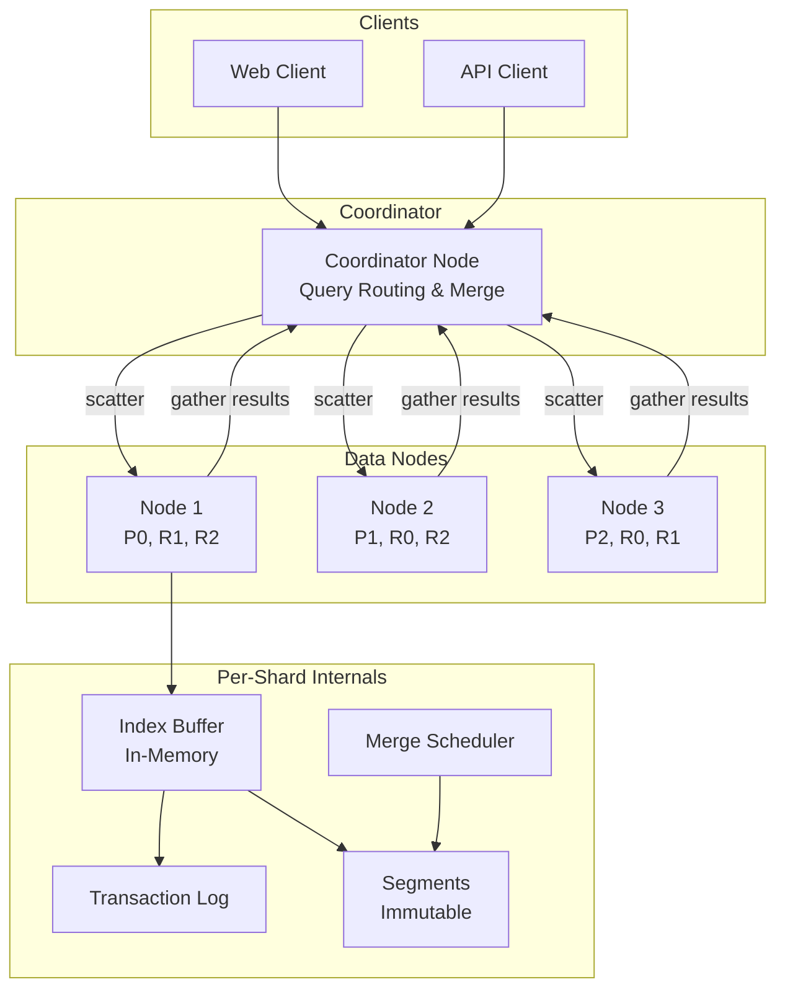

**Query execution (scatter-gather):**
1. Coordinator receives query
2. Routes to one copy of each shard (primary or replica)
3. Each shard executes query locally, returns top-N results with scores
4. Coordinator merges results globally, re-ranks, and returns final top-N

### Deep Dive

#### Inverted Index Construction

When a document is indexed:
1. **Analyzer pipeline**: text → character filter → tokenizer → token filters (lowercase, stemming, stop words)
2. Example: "Running Shoes!" → ["running", "shoe"] (lowercased + stemmed)
3. Add document to the in-memory index buffer
4. Write to the transaction log (WAL) for durability
5. Periodically **refresh** (every 1 second): flush buffer to a new immutable segment
6. New segment becomes searchable — this is "near-real-time" search

#### Segment Merging

Over time, many small segments accumulate. The merge scheduler (TieredMergePolicy) periodically merges small segments into larger ones. This is critical because:
- Fewer segments = fewer files to open per query
- Deletes are physically removed (previously just marked)
- Compression improves with larger segments

#### BM25 Scoring

The default relevance algorithm:
```
score(q,d) = Σ IDF(t) × (tf(t,d) × (k1 + 1)) / (tf(t,d) + k1 × (1 - b + b × |d|/avgdl))
```
Where:
- **IDF(t)** — inverse document frequency (rare terms score higher)
- **tf(t,d)** — term frequency in document d
- **k1** (1.2) — term frequency saturation parameter
- **b** (0.75) — document length normalization
- **|d|/avgdl** — document length relative to average

#### Doc Values & Column Store

For sorting and aggregations, per-document field values are stored in a column-oriented format called doc values. When you aggregate by "brand", the engine reads only the brand column — not the entire document — enabling fast aggregations over millions of documents.

### Bottlenecks & Mitigations

| Bottleneck | Mitigation |
|---|---|
| Large segment merges blocking indexing | Concurrent merge scheduler; throttle merge I/O |
| Deep pagination (from: 10000, size: 20) | search_after (keyset pagination); PIT (point-in-time) searches |
| High-cardinality aggregations (millions of unique values) | Approximate aggregations; pre-computed rollups |
| Query fan-out latency (scatter to many shards) | Reduce shard count; shard-level caching |
| Mapping explosion (thousands of dynamic fields) | Strict mapping mode; field limit per index |
| Cluster state overhead (10K+ shards) | Reduce shard count; use data streams with ILM |

### Key Takeaways

- The inverted index is the fundamental data structure enabling sub-second full-text search
- Near-real-time search is achieved by the 1-second refresh cycle (buffer → segment)
- Immutable segments enable lock-free concurrent reads; merging reclaims space
- Scatter-gather query execution enables horizontal scaling across shards
- BM25 relevance scoring balances term frequency, document frequency, and document length
- Doc values (columnar storage) enable fast sorting and aggregations without loading full documents

---

## 6. Distributed Locking Service

### Problem Statement

In distributed systems, multiple processes often need to coordinate access to shared resources. Without coordination, two nodes might simultaneously modify the same database record, two cron jobs might process the same batch, or two services might acquire the same limited resource (like a license). This leads to data corruption, duplicate processing, and race conditions that are difficult to reproduce and debug.

A distributed locking service provides mutual exclusion primitives that work across processes, machines, and data centers. Beyond simple locks, it typically offers leader election (only one node is the "leader" at a time), configuration management (a consistent view of cluster configuration), and service discovery (knowing which instances of a service are alive).

ZooKeeper powers coordination for Kafka, HBase, and Hadoop. etcd is the backbone of Kubernetes, storing all cluster state. Consul provides service mesh capabilities. The key challenge is providing strong consistency guarantees (via consensus protocols like Raft or ZAB) while maintaining low latency and high availability — a tension formalized by the CAP theorem.

### Use Cases

- **Leader election**: Ensuring exactly one scheduler, exactly one primary in a primary-backup system
- **Distributed locking**: Mutual exclusion for database migrations, batch job deduplication
- **Configuration management**: Storing and distributing cluster configuration with change notifications
- **Service discovery**: Registering service instances and detecting failures via health checks
- **Distributed barriers**: Synchronizing phases in multi-stage distributed computations
- **Sequence number generation**: Globally unique, monotonically increasing IDs
- **Resource allocation**: Coordinating access to limited external resources (API rate limits, licenses)

### Functional Requirements

- **FR1**: Create, acquire, release, and delete named locks with configurable TTL
- **FR2**: Atomic compare-and-swap (CAS) operations on key-value pairs
- **FR3**: Leader election — elect and monitor a single leader among candidates
- **FR4**: Watch/subscribe to key changes with real-time event notifications
- **FR5**: Hierarchical key namespace with prefix listing
- **FR6**: Lease-based ephemeral nodes — automatically delete when the client session expires
- **FR7**: Sequential nodes for implementing fair queuing and distributed barriers
- **FR8**: Multi-key transactions (mini-transactions) for atomic multi-key updates

### Non-Functional Requirements

- **NFR1**: **Consistency** — Linearizable reads and writes (strongest consistency guarantee)
- **NFR2**: **Latency** — Lock acquire/release <10ms at p99 within a region
- **NFR3**: **Availability** — Available as long as a majority of nodes are up (3 of 5, or 2 of 3)
- **NFR4**: **Throughput** — ≥10,000 write operations/sec, ≥100,000 read operations/sec
- **NFR5**: **Durability** — All committed writes survive any minority of node failures
- **NFR6**: **Lease enforcement** — Locks automatically released if holder fails (no deadlocks)
- **NFR7**: **Fairness** — Lock waiters served in FIFO order
- **NFR8**: **Scalability** — Support 10,000+ concurrent lock holders and watchers

### Capacity Estimation

Distributed locking services handle small metadata, so storage is tiny but consistency is paramount:

- **Keys**: 1 million active keys (locks, config values, service registrations)
- **Average value size**: 500 bytes
- **Total data**: 1M × 500 B = 500 MB (fits in memory on a single node)
- **Write rate**: 10,000 writes/sec (lock acquires + releases + config updates)
- **Read rate**: 100,000 reads/sec (lock checks, config reads, watches)
- **Watch events**: 50,000 events/sec delivered to subscribers

**Cluster sizing:**
```
Nodes       = 5 (tolerates 2 failures)
Memory/node = 4 GB (data + index + watch state)
Disk/node   = 100 GB SSD (WAL + snapshots)
Network     = 1 Gbps (Raft replication + client traffic)
```

**Raft replication overhead:**
```
Write amplification = 5x (leader writes + 4 followers)
WAL write rate      = 10,000 × 500 B × 5 = 25 MB/sec
```

### API Design

#### Lock Operations

```http
POST /api/v1/locks
Content-Type: application/json

{
  "name": "/services/payment/batch-processor-lock",
  "holder": "worker-node-042",
  "ttl_seconds": 30,
  "wait_timeout_seconds": 10
}
```

**Response (201 Created / 200 OK):**
```json
{
  "lock_id": "lock_7f3a9b2c",
  "name": "/services/payment/batch-processor-lock",
  "holder": "worker-node-042",
  "acquired": true,
  "fence_token": 1583,
  "expires_at": "2024-01-15T10:30:30Z",
  "revision": 458291
}
```

**Response (409 Conflict — lock held by another):**
```json
{
  "acquired": false,
  "holder": "worker-node-017",
  "retry_after_ms": 5000
}
```

```http
PUT /api/v1/locks/{lock_id}/renew
{ "ttl_seconds": 30 }

DELETE /api/v1/locks/{lock_id}
X-Fence-Token: 1583
```

#### Key-Value Operations

```http
PUT /api/v1/kv/{key}
Content-Type: application/json
If-Match: 458290

{
  "value": "eyJjbHVzdGVyIjoicHJvZC11cy1lYXN0LTEiLCJub2RlcyI6NX0=",
  "lease_id": "lease_abc123"
}
```

**Response (200 OK):**
```json
{
  "key": "/config/database/primary",
  "value": "eyJjbHVzdGVyIjoicHJvZC11cy1lYXN0LTEiLCJub2RlcyI6NX0=",
  "revision": 458291,
  "mod_revision": 458291,
  "version": 3,
  "lease_id": "lease_abc123"
}
```

```http
GET /api/v1/kv/{key}
GET /api/v1/kv/{prefix}?prefix=true&keys_only=false&limit=100
DELETE /api/v1/kv/{key}
```

#### Watch API

```http
GET /api/v1/watch?key=/services/payment/&prefix=true&start_revision=458290
Accept: text/event-stream
```

**Response (SSE stream):**
```
data: {"type":"PUT","key":"/services/payment/node-1","value":"alive","revision":458291}

data: {"type":"DELETE","key":"/services/payment/node-3","revision":458295}
```

#### Leader Election

```http
POST /api/v1/elections/{election_name}/candidates
{ "candidate_id": "scheduler-node-01", "lease_id": "lease_xyz" }

GET /api/v1/elections/{election_name}/leader
```

**Response:**
```json
{
  "election": "task-scheduler",
  "leader": "scheduler-node-01",
  "since": "2024-01-15T10:00:00Z",
  "lease_id": "lease_xyz"
}
```

### Data Model

```sql
CREATE TABLE kv_store (
    key             VARCHAR(2048) PRIMARY KEY,
    value           BYTEA,
    create_revision BIGINT NOT NULL,
    mod_revision    BIGINT NOT NULL,
    version         BIGINT DEFAULT 1,
    lease_id        BIGINT,
    is_deleted      BOOLEAN DEFAULT FALSE
);

CREATE TABLE leases (
    lease_id    BIGINT PRIMARY KEY,
    ttl_seconds INT NOT NULL,
    granted_at  TIMESTAMP NOT NULL,
    expires_at  TIMESTAMP NOT NULL,
    holder      VARCHAR(256)
);

CREATE TABLE watchers (
    watcher_id     BIGINT PRIMARY KEY AUTO_INCREMENT,
    key_pattern    VARCHAR(2048) NOT NULL,
    is_prefix      BOOLEAN DEFAULT FALSE,
    start_revision BIGINT NOT NULL,
    client_id      VARCHAR(256) NOT NULL
);

-- Revision history for watches
CREATE TABLE revisions (
    revision    BIGINT PRIMARY KEY AUTO_INCREMENT,
    key         VARCHAR(2048) NOT NULL,
    value       BYTEA,
    event_type  VARCHAR(10) NOT NULL,  -- PUT, DELETE
    timestamp   TIMESTAMP DEFAULT NOW()
);

CREATE INDEX idx_revisions_key ON revisions (key, revision);
```

### High-Level Design

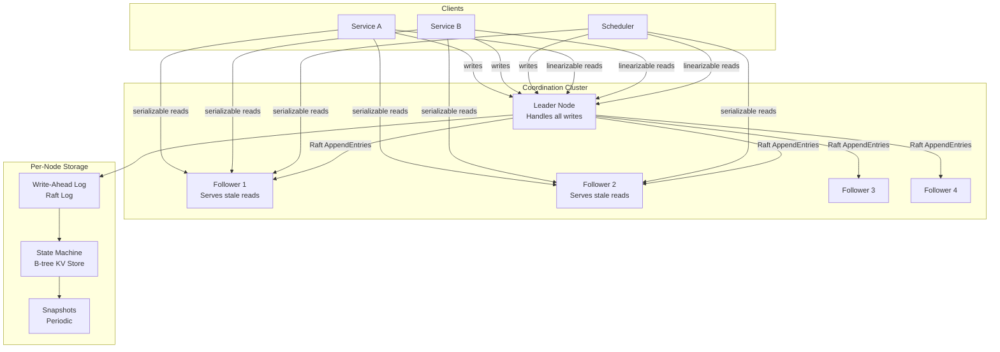

### Deep Dive

#### Raft Consensus Protocol

Raft ensures all nodes agree on the same sequence of operations:

1. **Leader Election**: Nodes start as followers. If a follower doesn't hear from the leader within a timeout (150-300ms randomized), it becomes a candidate and requests votes. A candidate with a majority of votes becomes leader. The randomized timeout prevents split votes.

2. **Log Replication**: The leader receives writes, appends them to its log, and sends AppendEntries RPCs to followers. Once a majority acknowledges, the entry is committed and applied to the state machine.

3. **Safety**: Raft guarantees that if a log entry is committed, it will be present in the logs of all future leaders. This is ensured by the election restriction — a candidate must have all committed entries to win an election.

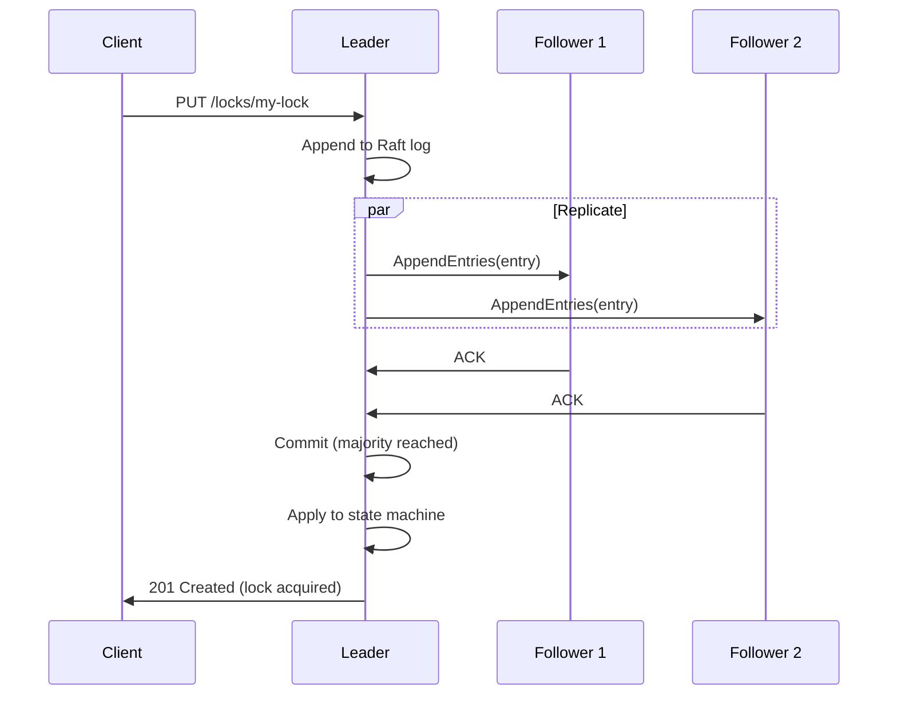

#### Fencing Tokens

A critical problem with distributed locks: a lock holder might pause (GC, network partition), the lock expires, another node acquires it, but the original node resumes and thinks it still holds the lock. **Fencing tokens** solve this:

1. Every lock acquisition returns a monotonically increasing fence token
2. The lock holder includes the fence token in all operations on the protected resource
3. The resource rejects operations with tokens older than the latest it has seen

This ensures that even if a stale lock holder acts, its operations are rejected.

#### Lease-Based Session Management

Clients maintain a session with the server via periodic heartbeats (keepalive RPCs). Each session has a lease with a TTL. If the server doesn't receive a keepalive within the TTL, the session expires and all ephemeral keys (locks, service registrations) associated with the session are deleted.

This prevents zombie locks — if a node crashes, its locks are automatically released after the TTL expires.

### Bottlenecks & Mitigations

| Bottleneck | Mitigation |
|---|---|
| Leader bottleneck (all writes through one node) | Raft learners for read scaling; client-side caching with watches |
| Leader election disruption during failover | Pre-vote mechanism; learner nodes for faster catch-up |
| Watch notification storms (many watchers on hot keys) | Coalesce notifications; rate-limit per watcher |
| Large snapshots blocking operations | Incremental snapshots; stream snapshot transfer |
| Clock skew causing premature lease expiry | Use logical clocks for lease duration; generous TTLs |
| Network partition causing split-brain | Raft quorum requirement prevents split-brain by design |

### Key Takeaways

- Linearizable consistency (via Raft/ZAB) is the defining property — it's what makes distributed coordination correct
- Fencing tokens are essential for lock safety in asynchronous networks
- Lease-based ephemeral nodes prevent zombie locks and enable failure detection
- The leader handles all writes — this limits write throughput but simplifies consistency
- Watches enable reactive programming — services respond to config changes in real time
- Keep the data set small (fits in memory) — this is a coordination service, not a general-purpose database

---

## 7. Distributed Task Scheduler

### Problem Statement

Modern data platforms run millions of tasks daily — ETL pipelines, ML model training, report generation, data quality checks, and infrastructure maintenance. These tasks have complex dependencies (task B can't start until tasks A and C complete), varying resource requirements (CPU, GPU, memory), and diverse scheduling needs (cron-based, event-triggered, priority queuing).

A naive approach of cron jobs on individual servers fails at scale: no dependency management, no retry logic, no visibility, no resource optimization, and cron jobs on a single machine are a single point of failure. A distributed task scheduler provides a centralized control plane for defining, scheduling, executing, and monitoring tasks across a fleet of workers.

Systems like Apache Airflow orchestrate data pipelines at Airbnb, Uber, and Spotify. Celery distributes millions of asynchronous tasks across worker pools. Kubernetes CronJobs handle containerized periodic tasks. The design challenge is ensuring exactly-once task execution, handling worker failures gracefully, providing sub-second scheduling latency, and scaling to millions of tasks per day.

### Use Cases

- **ETL pipelines**: Extract data from source → Transform → Load into data warehouse (daily)
- **ML pipelines**: Data preprocessing → Feature engineering → Model training → Evaluation → Deployment
- **Report generation**: Generate daily/weekly business reports with dependencies on upstream data
- **Data quality checks**: Validate data completeness and accuracy after each ETL run
- **Infrastructure automation**: Database backups, log rotation, certificate renewal
- **Event-driven processing**: Trigger tasks when files land in S3, messages arrive in Kafka, or APIs are called
- **Batch processing**: Process millions of records in parallel chunks with fan-out/fan-in patterns
- **SLA monitoring**: Ensure critical pipelines complete by their deadline, alert on delays

### Functional Requirements

- **FR1**: Define tasks as directed acyclic graphs (DAGs) with dependency edges
- **FR2**: Support cron-based scheduling, event triggers, and manual execution
- **FR3**: Automatic retry with configurable policies (max retries, backoff, retry delay)
- **FR4**: Task prioritization — critical pipelines preempt best-effort jobs
- **FR5**: Resource-aware scheduling — match task requirements to worker capabilities
- **FR6**: Real-time task status monitoring (pending, running, success, failed, retrying)
- **FR7**: Support parameterized task runs (backfills, date-partitioned runs)
- **FR8**: Dead letter handling — capture and surface permanently failed tasks
- **FR9**: SLA alerting — notify when tasks miss their expected completion time

### Non-Functional Requirements

- **NFR1**: **Throughput** — Schedule and dispatch ≥10,000 tasks/sec
- **NFR2**: **Latency** — Task dispatch latency <1 second from trigger to worker pickup
- **NFR3**: **Reliability** — Exactly-once task execution semantics (no duplicate runs)
- **NFR4**: **Availability** — Scheduler HA; no single point of failure
- **NFR5**: **Scalability** — Scale to 1 million tasks/day with 10,000+ concurrent tasks
- **NFR6**: **Fault tolerance** — Automatically reschedule tasks from failed workers
- **NFR7**: **Observability** — Full audit trail of task executions with logs and metrics
- **NFR8**: **Isolation** — Task failures don't impact other tasks or the scheduler itself

### Capacity Estimation

Assume a data platform running 500 DAGs with an average of 50 tasks each:

- **Total tasks**: 500 DAGs × 50 tasks = 25,000 task definitions
- **Daily runs**: 500 DAGs × 2 runs/day average = 1,000 DAG runs → 50,000 task instances/day
- **Peak hour**: 40% of tasks run in a 4-hour window → 20,000 tasks in 4 hours → ~1.4 tasks/sec
- **Concurrent tasks**: 500 at peak

**Storage:**
```
Task instance record size = 2 KB (metadata + status + logs reference)
Daily storage    = 50,000 × 2 KB = 100 MB/day
90-day retention = 100 MB × 90 = 9 GB
Task logs        = 50,000 × 100 KB avg = 5 GB/day
90-day logs      = 450 GB
```

**Workers:**
```
Average task duration = 5 minutes
Tasks/hour (peak)     = 5,000
Worker capacity       = 12 tasks/hour (5 min each)
Workers needed        = 5,000 / 12 ≈ 417 workers (peak)
With headroom (30%)   = 542 workers
```

### API Design

#### DAG Management

```http
POST /api/v1/dags
Content-Type: application/json

{
  "dag_id": "daily-revenue-pipeline",
  "description": "Daily revenue ETL and reporting pipeline",
  "schedule": "0 6 * * *",
  "default_args": {
    "retries": 3,
    "retry_delay_seconds": 300,
    "execution_timeout_seconds": 3600,
    "owner": "data-eng-team"
  },
  "tasks": [
    {
      "task_id": "extract_orders",
      "type": "python",
      "command": "python etl/extract_orders.py --date {{ ds }}",
      "resources": { "cpu": 2, "memory_mb": 4096 },
      "dependencies": []
    },
    {
      "task_id": "extract_payments",
      "type": "python",
      "command": "python etl/extract_payments.py --date {{ ds }}",
      "resources": { "cpu": 2, "memory_mb": 4096 },
      "dependencies": []
    },
    {
      "task_id": "transform_revenue",
      "type": "python",
      "command": "python etl/transform_revenue.py --date {{ ds }}",
      "resources": { "cpu": 4, "memory_mb": 8192 },
      "dependencies": ["extract_orders", "extract_payments"]
    },
    {
      "task_id": "load_warehouse",
      "type": "python",
      "command": "python etl/load_warehouse.py --date {{ ds }}",
      "dependencies": ["transform_revenue"]
    },
    {
      "task_id": "generate_report",
      "type": "python",
      "command": "python reports/daily_revenue.py --date {{ ds }}",
      "dependencies": ["load_warehouse"]
    }
  ],
  "sla_deadline": "08:00:00"
}
```

```http
GET /api/v1/dags
GET /api/v1/dags/{dag_id}
PUT /api/v1/dags/{dag_id}
DELETE /api/v1/dags/{dag_id}
PATCH /api/v1/dags/{dag_id}  { "is_paused": true }
```

#### DAG Run & Task Instance APIs

```http
POST /api/v1/dags/{dag_id}/runs
{
  "run_id": "manual__2024-01-15T10:00:00",
  "execution_date": "2024-01-15",
  "conf": { "full_refresh": true }
}
```

```http
GET /api/v1/dags/{dag_id}/runs?start_date=2024-01-01&end_date=2024-01-31&state=failed&limit=50

GET /api/v1/dags/{dag_id}/runs/{run_id}/tasks
GET /api/v1/dags/{dag_id}/runs/{run_id}/tasks/{task_id}
GET /api/v1/dags/{dag_id}/runs/{run_id}/tasks/{task_id}/logs
```

**Response (Task Instance):**
```json
{
  "task_id": "transform_revenue",
  "dag_id": "daily-revenue-pipeline",
  "run_id": "scheduled__2024-01-15T06:00:00",
  "state": "running",
  "try_number": 1,
  "start_date": "2024-01-15T06:12:34Z",
  "worker": "worker-node-042",
  "duration_seconds": 245,
  "log_url": "/api/v1/dags/daily-revenue-pipeline/runs/.../tasks/transform_revenue/logs"
}
```

#### Task Actions

```http
POST /api/v1/dags/{dag_id}/runs/{run_id}/tasks/{task_id}/retry
POST /api/v1/dags/{dag_id}/runs/{run_id}/tasks/{task_id}/mark_success
POST /api/v1/dags/{dag_id}/runs/{run_id}/tasks/{task_id}/clear
```

### Data Model

```sql
CREATE TABLE dags (
    dag_id          VARCHAR(256) PRIMARY KEY,
    description     TEXT,
    schedule        VARCHAR(128),
    is_paused       BOOLEAN DEFAULT FALSE,
    default_args    JSONB,
    sla_deadline    TIME,
    owner           VARCHAR(128),
    created_at      TIMESTAMP DEFAULT NOW(),
    updated_at      TIMESTAMP DEFAULT NOW()
);

CREATE TABLE tasks (
    dag_id          VARCHAR(256),
    task_id         VARCHAR(256),
    type            VARCHAR(64) NOT NULL,
    command         TEXT NOT NULL,
    resources       JSONB,
    retries         INT DEFAULT 3,
    retry_delay_sec INT DEFAULT 300,
    timeout_sec     INT DEFAULT 3600,
    priority        INT DEFAULT 0,
    PRIMARY KEY (dag_id, task_id)
);

CREATE TABLE task_dependencies (
    dag_id             VARCHAR(256),
    task_id            VARCHAR(256),
    depends_on_task_id VARCHAR(256),
    PRIMARY KEY (dag_id, task_id, depends_on_task_id)
);

CREATE TABLE dag_runs (
    run_id          VARCHAR(256) PRIMARY KEY,
    dag_id          VARCHAR(256) NOT NULL,
    execution_date  TIMESTAMP NOT NULL,
    state           VARCHAR(32) DEFAULT 'running',
    conf            JSONB,
    start_date      TIMESTAMP,
    end_date        TIMESTAMP,
    UNIQUE(dag_id, execution_date)
);

CREATE INDEX idx_dag_runs_state ON dag_runs (dag_id, state);

CREATE TABLE task_instances (
    run_id          VARCHAR(256),
    task_id         VARCHAR(256),
    dag_id          VARCHAR(256),
    state           VARCHAR(32) DEFAULT 'pending',
    try_number      INT DEFAULT 0,
    worker_id       VARCHAR(256),
    start_date      TIMESTAMP,
    end_date        TIMESTAMP,
    duration_sec    FLOAT,
    log_url         TEXT,
    PRIMARY KEY (run_id, task_id)
);

CREATE INDEX idx_task_state ON task_instances (state, dag_id);
CREATE INDEX idx_task_worker ON task_instances (worker_id) WHERE state = 'running';
```

### High-Level Design

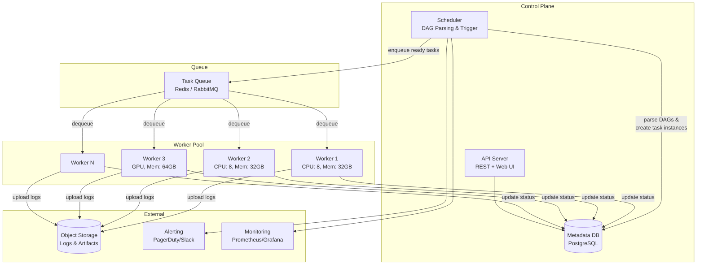

### Deep Dive

#### Scheduler Loop

The scheduler runs a continuous loop:

1. **Parse DAGs**: Read DAG definitions from a code repository or database
2. **Create DAG runs**: For each DAG whose schedule has triggered, create a new DAG run and corresponding task instances in `pending` state
3. **Evaluate dependencies**: For each pending task instance, check if all upstream dependencies are in `success` state. If yes, mark as `queued`.
4. **Dispatch**: Send queued tasks to the task queue, ordered by priority
5. **Monitor**: Check for timed-out tasks, SLA violations, and failed workers

**Scheduler HA**: Run multiple scheduler instances with database-level locking. Each scheduler instance acquires a row-level lock before processing a DAG run, preventing duplicate scheduling.

#### Exactly-Once Task Execution

Achieving exactly-once in the scheduler:
1. **Idempotent task dispatch**: Before enqueuing, check `(run_id, task_id)` isn't already queued/running
2. **Database as source of truth**: Task state transitions are guarded by optimistic concurrency (version column)
3. **Worker heartbeats**: Workers send periodic heartbeats. If a heartbeat is missed, the task is marked as `up_for_retry`
4. **Atomic state transitions**: `UPDATE task_instances SET state='running', worker_id=? WHERE run_id=? AND task_id=? AND state='queued'` — only one worker wins

#### DAG Dependency Resolution (Topological Sort)

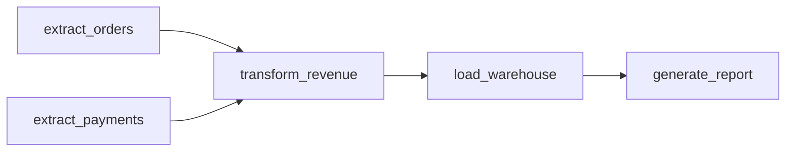

The scheduler performs a topological sort to determine execution order. Tasks with no pending dependencies are eligible for dispatch. This enables maximum parallelism — `extract_orders` and `extract_payments` run concurrently.

#### Backfill & Catchup

When a DAG is created or re-enabled, the scheduler can "backfill" — create DAG runs for all missed execution dates. Each backfill run processes historical data. The scheduler limits concurrency to avoid overwhelming workers.

### Bottlenecks & Mitigations

| Bottleneck | Mitigation |
|---|---|
| Scheduler becomes bottleneck with 1000s of DAGs | Multiple scheduler instances with database-level partitioning |
| Task queue overflow during backfills | Rate-limiting backfill concurrency; priority queuing |
| Worker failure mid-task | Heartbeat-based detection; automatic retry with idempotent tasks |
| Database contention on task_instances table | Batch status updates; read replicas for UI queries |
| Large DAGs with 1000+ tasks | Lazy evaluation; only materialize runnable tasks |
| Long-running tasks blocking worker slots | Separate worker pools by task type; preemption for high-priority tasks |

### Key Takeaways

- DAGs (directed acyclic graphs) are the natural abstraction for task dependencies
- The scheduler is the brain — it must be HA and avoid duplicate task dispatch
- Database-backed state with optimistic locking ensures exactly-once execution semantics
- Worker heartbeats provide failure detection without single-point-of-failure coordinators
- Separate the control plane (scheduler + DB) from the data plane (workers)
- Backfill capability is essential for data pipelines — historical data must be processable

---

## 8. Time-Series Database

### Problem Statement

Time-series data — metrics, sensor readings, financial ticks, IoT telemetry — is generated continuously and is always associated with a timestamp. Traditional relational databases are poorly suited for this workload: they can't handle the write rates (millions of data points per second), they waste storage on redundant timestamps, and they lack built-in support for time-based queries (downsample to 1-hour averages, compute moving averages, detect anomalies).

A time-series database (TSDB) is purpose-built for ingesting, storing, and querying timestamped data. It exploits the unique properties of time-series data: writes are append-only (data is rarely updated), queries are almost always time-range-based, recent data is accessed far more frequently than old data, and data can be aggressively compressed because consecutive values are often similar (delta encoding, run-length encoding).

Systems like InfluxDB, Prometheus, and TimescaleDB power monitoring for millions of servers, IoT platforms with billions of sensors, and financial trading systems. The design challenge is achieving million-point-per-second ingestion while providing millisecond query response times for dashboards that visualize months of data.

### Use Cases

- **Infrastructure monitoring**: CPU, memory, disk, network metrics from every server, container, and pod
- **Application performance monitoring (APM)**: Request latency, error rate, throughput per endpoint
- **IoT telemetry**: Temperature, pressure, vibration readings from millions of sensors
- **Financial market data**: Stock prices, trading volumes, order book changes at tick level
- **Business metrics**: Revenue, user signups, conversion rates tracked over time
- **Network monitoring**: Packet rates, bandwidth utilization, error counts per interface
- **Energy & utilities**: Smart meter readings, grid load, generation output
- **DevOps alerting**: Threshold-based and anomaly-based alerts on any metric

### Functional Requirements

- **FR1**: Ingest data points as `(metric_name, tags, timestamp, value)` tuples
- **FR2**: Query by metric name, tag filters, and time range
- **FR3**: Built-in aggregation functions: avg, sum, min, max, count, percentile, rate, derivative
- **FR4**: Downsampling — automatically reduce resolution for older data (1s → 1m → 1h)
- **FR5**: Tag-based filtering — e.g., `cpu.usage WHERE host=web-01 AND region=us-east`
- **FR6**: Retention policies — automatically delete data older than a threshold
- **FR7**: Continuous queries / recording rules — pre-compute expensive aggregations
- **FR8**: Support for PromQL or SQL-like query language for dashboards and alerting

### Non-Functional Requirements

- **NFR1**: **Write throughput** — ≥1 million data points/sec per cluster
- **NFR2**: **Query latency** — Dashboard queries (24h range) return in <100ms
- **NFR3**: **Compression ratio** — ≥10:1 compression vs. raw storage (leverage temporal patterns)
- **NFR4**: **Availability** — 99.9% for writes (metrics must not be lost during incidents)
- **NFR5**: **Scalability** — Scale to billions of active time series (high cardinality)
- **NFR6**: **Retention** — Support multi-year retention with tiered resolution
- **NFR7**: **Consistency** — Eventual consistency acceptable; queries may miss very recent points
- **NFR8**: **Cardinality handling** — Handle millions of unique tag combinations without degradation

### Capacity Estimation

Assume a cloud platform monitoring 100,000 servers:

- **Servers**: 100,000
- **Metrics per server**: 200 (CPU, memory, disk per mount, network per interface, app metrics)
- **Active time series**: 100,000 × 200 = 20 million time series
- **Scrape interval**: 15 seconds
- **Data points/sec**: 20,000,000 / 15 = 1,333,333 points/sec

**Storage (raw):**
```
Point size (uncompressed) = 16 bytes (8B timestamp + 8B float64 value)
Raw storage/day = 1,333,333 × 16 B × 86,400 = 1.84 TB/day
```

**Storage (compressed):**
```
Compression ratio = 12:1 (Gorilla encoding: delta-of-delta + XOR)
Compressed/day    = 1.84 TB / 12 = 153 GB/day
30-day retention  = 153 GB × 30 = 4.6 TB
1-year (downsampled to 1 min after 30 days):
  Downsampled volume = (1.84 TB / 4) × 335 days / 12 = 12.8 TB
Total 1-year = 4.6 TB + 12.8 TB = 17.4 TB
```

**With replication (factor 2):**
```
Total storage = 17.4 TB × 2 = 34.8 TB
Nodes (4TB usable each) = 9 nodes
```

### API Design

#### Write (Ingest)

```http
POST /api/v1/write
Content-Type: application/json
X-Precision: ms

{
  "points": [
    {
      "metric": "cpu.usage",
      "tags": {
        "host": "web-042",
        "region": "us-east-1",
        "env": "production"
      },
      "timestamp": 1705312200000,
      "value": 73.5
    },
    {
      "metric": "memory.used_bytes",
      "tags": {
        "host": "web-042",
        "region": "us-east-1",
        "env": "production"
      },
      "timestamp": 1705312200000,
      "value": 6442450944
    }
  ]
}
```

**Response (204 No Content)** — success with no body for write efficiency.

**Error (400 Bad Request):**
```json
{
  "error": "INVALID_TIMESTAMP",
  "message": "Timestamp 0 is outside acceptable range",
  "line": 2
}
```

#### Line Protocol (Efficient Alternative)

```http
POST /api/v1/write/line
Content-Type: text/plain

cpu.usage,host=web-042,region=us-east-1,env=production value=73.5 1705312200000
memory.used_bytes,host=web-042,region=us-east-1,env=production value=6442450944 1705312200000
```

#### Query

```http
POST /api/v1/query
Content-Type: application/json

{
  "query": "SELECT mean(value) FROM cpu.usage WHERE host='web-042' AND time >= now() - 24h GROUP BY time(5m), region",
  "format": "json"
}
```

**Response (200 OK):**
```json
{
  "results": [
    {
      "metric": "cpu.usage",
      "tags": { "region": "us-east-1" },
      "columns": ["time", "mean"],
      "values": [
        ["2024-01-14T10:00:00Z", 65.2],
        ["2024-01-14T10:05:00Z", 72.8],
        ["2024-01-14T10:10:00Z", 68.1]
      ]
    }
  ],
  "took_ms": 34
}
```

```http
GET /api/v1/metrics
GET /api/v1/metrics/{metric_name}/tags
GET /api/v1/metrics/{metric_name}/tags/{tag_key}/values
```

#### Retention & Downsampling

```http
POST /api/v1/retention-policies
{
  "name": "default",
  "duration": "30d",
  "replication": 2,
  "shard_duration": "1d"
}

POST /api/v1/continuous-queries
{
  "name": "downsample_cpu_1h",
  "source_policy": "default",
  "target_policy": "long_term",
  "query": "SELECT mean(value) INTO cpu.usage_1h FROM cpu.usage GROUP BY time(1h), *",
  "interval": "1h"
}
```

### Data Model

#### Time Series Structure

```
Time Series Identity:
  metric_name + sorted(tags) → unique series ID

Example:
  cpu.usage{host=web-042, region=us-east-1, env=production} → series_id: 847291
```

```sql
-- Series index (metadata)
CREATE TABLE series (
    series_id    BIGINT PRIMARY KEY AUTO_INCREMENT,
    metric_name  VARCHAR(256) NOT NULL,
    tags         JSONB NOT NULL,
    tags_hash    CHAR(32) NOT NULL,  -- MD5(sorted canonical tag string)
    created_at   TIMESTAMP DEFAULT NOW(),
    UNIQUE(metric_name, tags_hash)
);

CREATE INDEX idx_series_metric ON series (metric_name);
CREATE INDEX idx_series_tags ON series USING GIN (tags);

-- Shards (time-partitioned chunks)
CREATE TABLE shards (
    shard_id     BIGINT PRIMARY KEY,
    start_time   TIMESTAMP NOT NULL,
    end_time     TIMESTAMP NOT NULL,
    retention    VARCHAR(64) NOT NULL,
    size_bytes   BIGINT DEFAULT 0,
    status       VARCHAR(32) DEFAULT 'active'
);
```

#### On-Disk Storage (Columnar Chunks)

```
/data/shards/shard_20240115/
  ├── series_847291/
  │   ├── timestamps.bin    # Delta-of-delta encoded
  │   ├── values.bin        # XOR float compression (Gorilla)
  │   └── meta.json         # Series metadata
  ├── series_847292/
  │   ├── timestamps.bin
  │   ├── values.bin
  │   └── meta.json
  └── index/
      ├── postings/         # tag_value → [series_ids]  (inverted index)
      └── symbols/          # string table for tag keys/values
```

#### Gorilla Compression

Timestamps use delta-of-delta encoding:
```
Raw:      1705312200, 1705312215, 1705312230, 1705312245
Deltas:              15,          15,          15
Delta-of-delta:      0,           0,           0
Encoded: header(1705312200) + 15 + [0-bit markers for each subsequent point]
Result: ~1.37 bits per timestamp (vs 64 bits raw) = 46x compression
```

Values use XOR-based encoding (consecutive float values often share many bits):
```
Raw:   73.5, 73.8, 73.2, 74.1
XOR:        (differs in few bits) → encode only the changed bits
Result: ~1.08 bits per value on average for smooth metrics
```

### High-Level Design

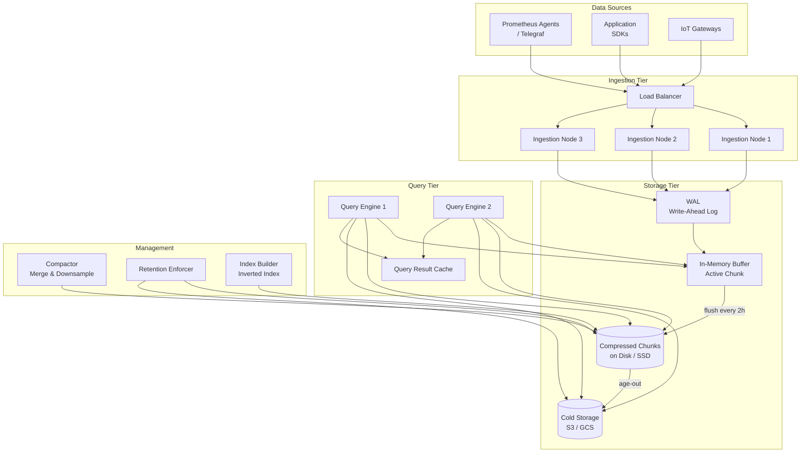

### Deep Dive

#### Write Path (Prometheus-style)

1. **Ingestion**: Data points arrive at an ingestion node via HTTP push or scrape pull
2. **WAL**: Every incoming point is first written to a write-ahead log on disk (for crash recovery)
3. **In-Memory Buffer (Head Block)**: Points are appended to an in-memory chunk per series. The head block covers the most recent 2 hours.
4. **Flush**: Every 2 hours, the head block is compressed and flushed to disk as an immutable chunk
5. **Compaction**: Background compactor merges small chunks into larger ones, improving query efficiency

#### Inverted Index for Tag Queries

To find all series matching `host=web-042 AND region=us-east-1`:

```
Postings for host=web-042:      [847291, 847292, 847293, ...]
Postings for region=us-east-1:  [847291, 847295, 847300, ...]
Intersection:                    [847291]
```

Posting lists are stored sorted, enabling efficient intersection using merge-join. This is the same technique as search engines (Section 5) applied to metric labels.

#### Query Execution

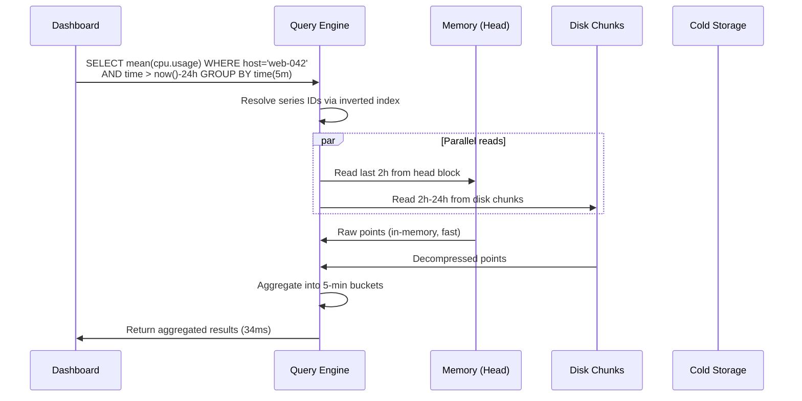

#### Handling High Cardinality

High cardinality (e.g., tagging by `user_id` with millions of users) explodes the number of unique series, causing:
- Memory bloat in the series index
- Slow posting list intersection
- Too many small chunks

**Mitigations:**
- Set cardinality limits per metric (reject series beyond limit)
- Use relabeling rules to drop high-cardinality tags before ingestion
- Pre-aggregate at ingestion (combine per-user metrics into per-cohort)
- Use separate storage for high-cardinality data (columnar stores like ClickHouse)

#### Downsampling

A background process produces lower-resolution representations of data:

```
Raw (15s interval):  [73.5, 73.8, 73.2, 74.1, 73.9, 73.5, 74.2, 73.8] (8 points in 2 min)
1-minute avg:        [73.65, 73.85] (2 points — 4x reduction)
5-minute avg:        [73.75] (1 point — 8x reduction)
```

The downsampled data preserves statistical properties (min, max, sum, count) to enable accurate queries at any resolution. Dashboards automatically select the appropriate resolution based on the time range.

### Bottlenecks & Mitigations

| Bottleneck | Mitigation |
|---|---|
| Write amplification from WAL + memory + disk | Batch writes; WAL segment rotation with async flush |
| Series cardinality explosion | Cardinality limits; relabeling; pre-aggregation at ingestion |
| Query scanning too many chunks | Time-based partitioning; bloom filters on series IDs per chunk |
| Memory pressure from head block (millions of series) | Limit active series; offload dormant series to disk early |
| Cold storage query latency | Aggressive downsampling; cache recent cold data; pre-compute dashboards |
| Compaction I/O spikes | Throttle compaction rate; schedule during low-traffic windows |

### Key Takeaways

- Time-series data has unique properties that enable massive compression (delta-of-delta, XOR encoding)
- The write path is append-only and heavily optimized: WAL → in-memory head → immutable disk chunks
- Inverted indexes on tags enable fast series lookup, just like search engines enable fast document lookup
- Downsampling is essential for long-term retention — store full resolution for recent data, aggregates for historical
- Cardinality (number of unique series) is the primary scalability challenge, not data volume
- Separate ingestion, storage, and query tiers to scale each independently

---

## Cross-Cutting Themes

Looking across all eight systems, several fundamental patterns emerge:

### 1. Append-Only Writes
Message queues, file systems, search engines, and TSDBs all use append-only write paths. Sequential I/O is 100-1000x faster than random I/O, making this the single most impactful design choice for write-heavy systems.

### 2. Immutable Data Structures
Kafka log segments, Lucene segments, TSDB chunks, and object storage blobs are all immutable after creation. Immutability simplifies concurrency (no locks needed for reads), enables caching, and makes replication straightforward.

### 3. Write-Ahead Logs
Every system that must survive crashes uses a WAL — message queues, search engines, file systems, TSDBs, and coordination services. The WAL captures intent before the data is applied to the main data structure.

### 4. Separation of Metadata and Data
Object storage, distributed file systems, and message queues all separate metadata (small, critical, needs strong consistency) from data (large, can use weaker consistency). This allows independent scaling and optimization.

### 5. Inverted Indexes
Search engines and TSDBs both use inverted indexes — mapping from attribute values to document/series IDs. This transforms expensive scans into cheap lookups.

### 6. Consensus for Coordination
Every system needing strong consistency (distributed locks, message queue leaders, file system NameNodes) relies on consensus protocols — Raft, Paxos, or ZAB. Understanding these protocols is fundamental.

### 7. Compression Everywhere
Object storage uses erasure coding, TSDBs use Gorilla encoding, message queues use LZ4/Snappy, and search engines use variable-byte encoding for posting lists. Data-aware compression is a multiplier for both storage cost and query performance.

---

*Next Chapter: [Chapter 3 — Compute & Processing Systems →]*
