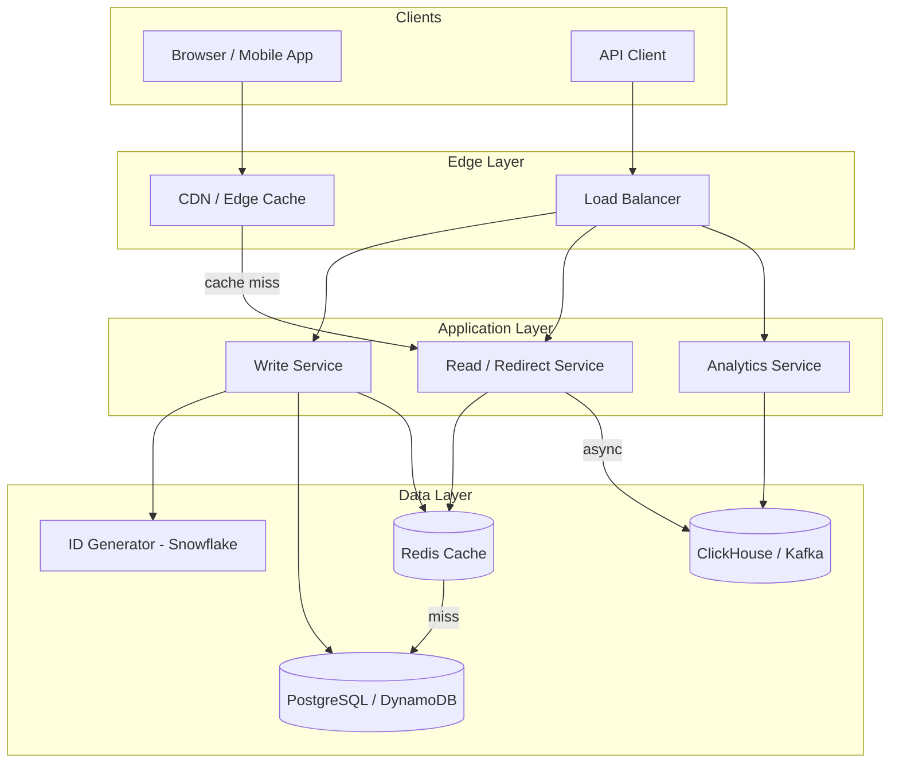
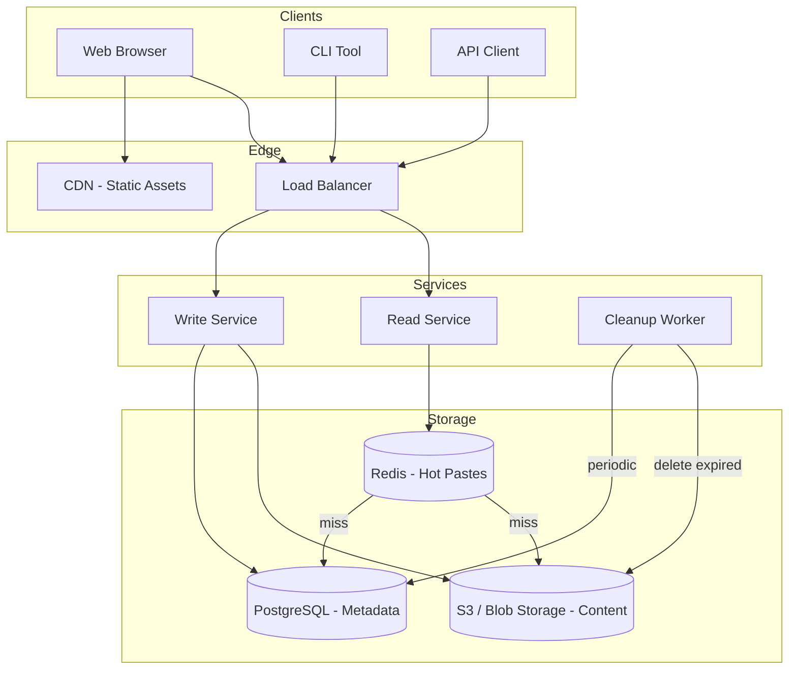
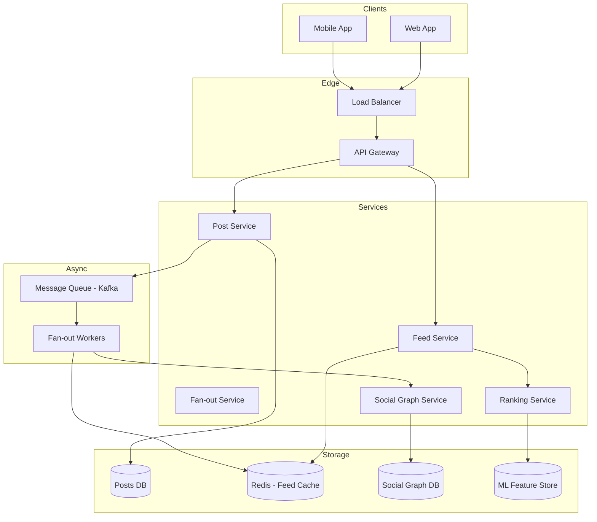
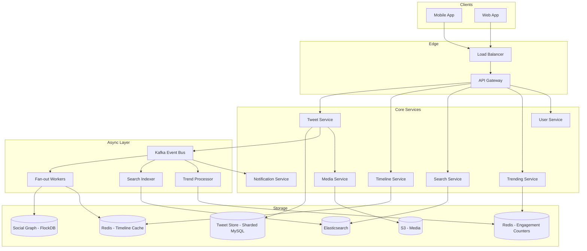
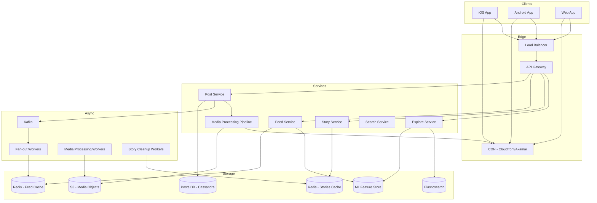
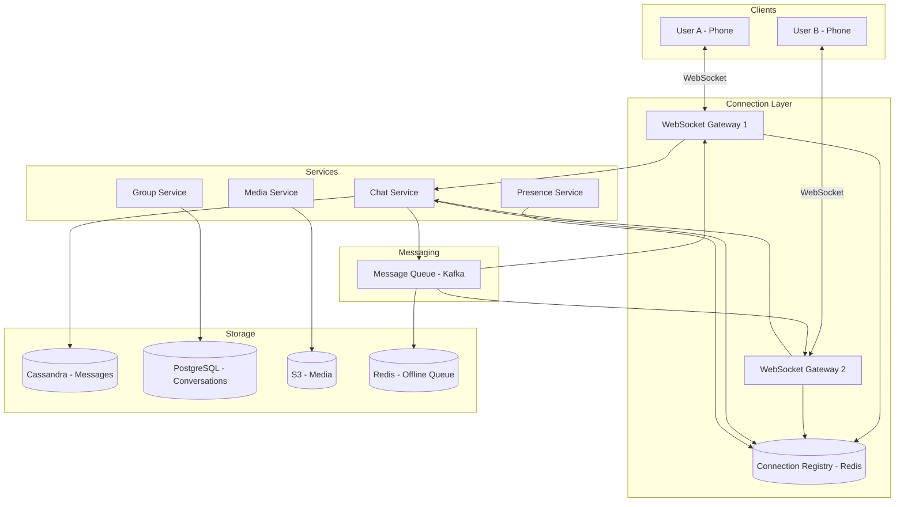
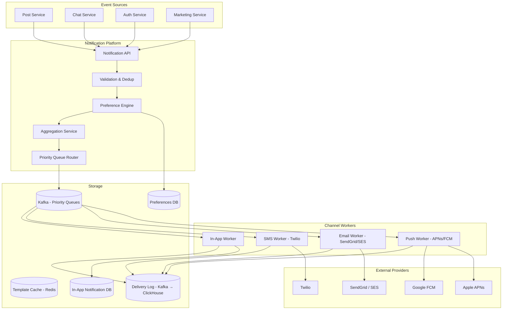
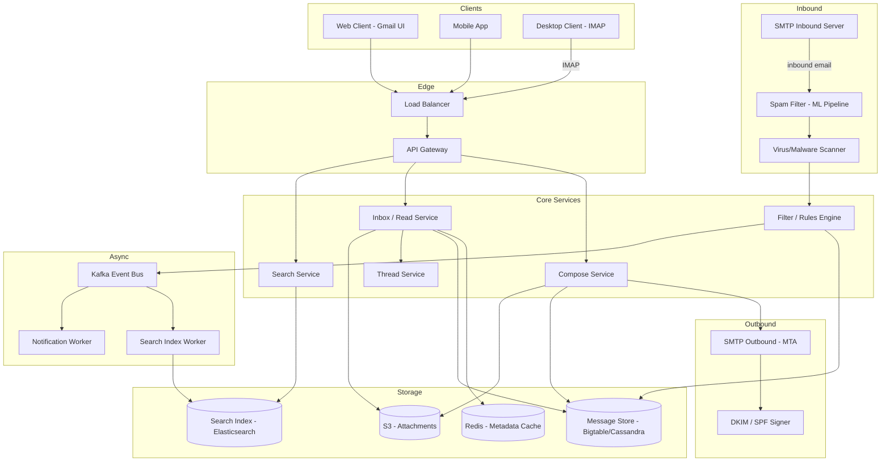

# Chapter 3: Social & Communication Platforms

> Connecting billions of users in real-time — the systems behind modern social networks and messaging.

This chapter covers eight critical system design case studies spanning URL shortening, content sharing, social networking, real-time messaging, notifications, and email. Each system is explored from problem statement through capacity estimation, API design, data modeling, architecture, and deep-dive trade-offs.

---

## 1. URL Shortener

### Problem Statement

A URL shortener converts long, unwieldy URLs into short, memorable links that redirect users to the original destination. Services like bit.ly and TinyURL handle billions of redirects daily, serving as critical infrastructure for marketing campaigns, social media sharing, and analytics tracking.

The core challenge is deceptively simple — generate a unique short code for each URL and redirect when that code is visited. However, at scale, this system must handle massive read-heavy traffic (100:1 read-to-write ratio), guarantee uniqueness of short codes across distributed servers, provide sub-millisecond redirect latency, and maintain high availability since a broken short link means lost traffic and revenue.

Beyond basic shortening, modern URL shorteners provide click analytics (geographic distribution, referrer tracking, device types), custom aliases, link expiration, and abuse detection. The system must also handle adversarial inputs — spam links, phishing URLs, and link-based attacks — while maintaining the trust of billions of daily redirects.

### Use Cases

- User submits a long URL and receives a shortened link (e.g., `https://short.ly/abc123`)
- User visits a short URL and is redirected (HTTP 301/302) to the original destination
- User creates a custom vanity alias (e.g., `short.ly/my-brand-launch`)
- System tracks click analytics: timestamp, IP, user-agent, referrer, geo-location
- User sets an expiration time for a short link
- System detects and blocks malicious or spam URLs
- User views an analytics dashboard for their short links
- API consumers programmatically shorten URLs in bulk

### Functional Requirements

- **FR1**: Given a long URL, generate a unique short URL
- **FR2**: Given a short URL, redirect to the original long URL
- **FR3**: Support custom aliases chosen by the user
- **FR4**: Links should expire after a configurable time (default: 5 years)
- **FR5**: Track click analytics (timestamp, IP, geo, device, referrer)
- **FR6**: Provide an analytics dashboard/API for link creators
- **FR7**: Rate-limit URL creation to prevent abuse
- **FR8**: Detect and block malicious/phishing URLs

### Non-Functional Requirements

- **NFR1**: Very low redirect latency — p99 < 10ms
- **NFR2**: High availability — 99.99% uptime (redirects are critical)
- **NFR3**: Read-heavy system — optimize for 100:1 read-to-write ratio
- **NFR4**: Scalable to 100B+ redirects per month
- **NFR5**: Short codes must be globally unique — no collisions
- **NFR6**: Eventually consistent is acceptable for analytics; strong consistency for redirect mappings
- **NFR7**: Durable — once a link is created, it must not be lost
- **NFR8**: Minimal storage footprint per URL mapping

### Capacity Estimation

- **Users**: 500 million total users, 100 million DAU
- **Write traffic**: 100 million new URLs/day ≈ ~1,160 writes/sec
- **Read traffic**: 100:1 ratio → 10 billion redirects/day ≈ ~116,000 reads/sec
- **Storage per record**: short_code (7B) + long_url (avg 200B) + metadata (100B) ≈ 307 bytes
- **Storage/year**: 100M/day × 365 × 307B ≈ **11.2 TB/year**
- **Cache**: Top 20% of URLs drive 80% of traffic. 20% × 10B daily unique URLs ≈ 2B entries × 307B ≈ **614 GB cache** (distribute across nodes)
- **Bandwidth**: 116K reads/sec × 307B ≈ **35.6 MB/s** outbound (redirect responses are tiny)

### API Design

```http
# Create a short URL
POST /api/v1/urls
Authorization: Bearer <token>
Content-Type: application/json

{
  "long_url": "https://example.com/very/long/path?query=param",
  "custom_alias": "my-link",        // optional
  "expires_at": "2029-01-01T00:00:00Z" // optional
}

Response 201 Created:
{
  "id": "abc123x",
  "short_url": "https://short.ly/abc123x",
  "long_url": "https://example.com/very/long/path?query=param",
  "created_at": "2024-07-01T12:00:00Z",
  "expires_at": "2029-01-01T00:00:00Z"
}
```

```http
# Redirect (handled by edge/CDN, not API gateway)
GET /{short_code}
Response 301 Moved Permanently
Location: https://example.com/very/long/path?query=param
```

```http
# Get analytics for a short URL
GET /api/v1/urls/{short_code}/analytics?start=2024-01-01&end=2024-07-01&granularity=day
Authorization: Bearer <token>

Response 200 OK:
{
  "short_code": "abc123x",
  "total_clicks": 152340,
  "data": [
    {"date": "2024-07-01", "clicks": 1230, "unique_visitors": 980},
    ...
  ],
  "top_referrers": [{"referrer": "twitter.com", "count": 45000}],
  "top_countries": [{"country": "US", "count": 78000}]
}
```

```http
# Delete a short URL
DELETE /api/v1/urls/{short_code}
Authorization: Bearer <token>

Response 204 No Content
```

**Error Responses:**
```json
{ "error": { "code": "URL_NOT_FOUND", "message": "Short code does not exist" } }
{ "error": { "code": "ALIAS_TAKEN", "message": "Custom alias already in use" } }
{ "error": { "code": "RATE_LIMITED", "message": "Too many requests" } }
```

**Rate Limit Headers:**
```
X-RateLimit-Limit: 100
X-RateLimit-Remaining: 42
X-RateLimit-Reset: 1719849600
```

### Data Model

```sql
CREATE TABLE urls (
    short_code  VARCHAR(7) PRIMARY KEY,     -- Base62 encoded ID
    long_url    TEXT NOT NULL,
    user_id     BIGINT,
    created_at  TIMESTAMP DEFAULT NOW(),
    expires_at  TIMESTAMP,
    is_active   BOOLEAN DEFAULT TRUE
);
-- Index for cleanup job
CREATE INDEX idx_urls_expires ON urls(expires_at) WHERE is_active = TRUE;
-- Index for user lookups
CREATE INDEX idx_urls_user ON urls(user_id, created_at DESC);

CREATE TABLE click_events (
    event_id    UUID PRIMARY KEY,
    short_code  VARCHAR(7) NOT NULL,
    clicked_at  TIMESTAMP NOT NULL,
    ip_address  INET,
    user_agent  TEXT,
    referrer    TEXT,
    country     VARCHAR(2),
    city        VARCHAR(100)
);
-- Partition by month for efficient time-range queries
-- PARTITION BY RANGE (clicked_at)
CREATE INDEX idx_clicks_code_time ON click_events(short_code, clicked_at DESC);
```

### High-Level Design



**Write Path:** Client → Load Balancer → Write Service → ID Generator (Snowflake/Counter) → Base62 encode → Write to DB → Populate Cache → Return short URL.

**Read Path:** Client → CDN (check edge cache) → Read Service → Redis Cache → (on miss) DB → Return 301 redirect. Asynchronously log the click event to Kafka → ClickHouse for analytics.

### Deep Dive

#### Short Code Generation Strategies

1. **Counter-based (Recommended):** Use a distributed counter (e.g., Snowflake ID or a dedicated ID service with pre-allocated ranges). Each server gets a range (e.g., Server A: 1-1M, Server B: 1M-2M). Convert the counter to Base62 (a-z, A-Z, 0-9) to get a 7-character code. 7 chars in Base62 = 62^7 ≈ 3.5 trillion unique codes — sufficient for decades.

2. **Hash-based:** MD5/SHA256 the long URL, take the first 7 characters of the Base62-encoded hash. Risk of collision — requires a check-and-retry loop. Simpler but less predictable.

3. **Pre-generated keys:** A Key Generation Service (KGS) pre-generates millions of unique keys and stores them in a key pool. Workers pull keys from the pool. Eliminates real-time generation latency but adds operational complexity.

#### Caching Strategy

Use **cache-aside** pattern with Redis. On redirect, check Redis first. On cache miss, fetch from DB and populate cache with TTL matching the link's remaining lifetime. For hot links (viral content), the CDN edge cache handles the majority of traffic — we use HTTP `Cache-Control: max-age=3600` on 301 responses.

#### Handling Hot Keys

A viral short URL can receive millions of hits per second. Mitigations:
- CDN-level caching handles 95%+ of traffic for hot URLs
- Redis cluster with read replicas distributes cache reads
- Local in-process caches (Caffeine/Guava) on redirect servers with 60s TTL

#### Analytics Pipeline

Click events are sent to Kafka (fire-and-forget from the redirect path to avoid adding latency). A stream processor (Flink/Spark Streaming) enriches events with geo-IP data and writes to ClickHouse (columnar store optimized for analytics aggregations). Pre-aggregated rollups (hourly/daily) are materialized for dashboard queries.

### Bottlenecks & Mitigations

| Bottleneck | Mitigation |
|---|---|
| Single point of failure in ID generation | Use range-based allocation; each server owns a range |
| Hot key (viral URL) overwhelming cache | CDN edge caching + local in-process cache + Redis replicas |
| Database write throughput | Batch writes, use SSD-backed storage, shard by short_code hash |
| Analytics write volume (billions/day) | Kafka buffering → ClickHouse batch inserts, not real-time DB writes |
| Custom alias collisions | Synchronous uniqueness check against DB with retry |
| Link spam/abuse | Rate limiting + URL reputation scoring + async malware scanning |

### Key Takeaways

- Read-heavy systems benefit enormously from multi-layer caching (CDN → Redis → DB)
- Base62 encoding of sequential IDs gives predictable, collision-free short codes
- Separate the analytics pipeline from the redirect hot path to maintain low latency
- Pre-allocated ID ranges eliminate coordination overhead in distributed ID generation
- 301 (permanent) vs 302 (temporary) redirect choice affects cacheability and analytics accuracy

---

## 2. Pastebin

### Problem Statement

Pastebin is a content-hosting service that allows users to store and share plain text or code snippets via unique URLs. Services like pastebin.com and GitHub Gist serve millions of developers and users who need quick, shareable text storage without the overhead of creating a full repository or document.

The core engineering challenges revolve around efficient storage of variable-size text content (from a few bytes to several megabytes), content-addressable lookups, syntax highlighting, paste expiration, and abuse prevention. Unlike a URL shortener where records are tiny and uniform, pastebin must handle content that varies by orders of magnitude in size.

At scale, the system must support high write throughput (millions of pastes per day), fast retrieval with low latency, configurable access control (public, unlisted, private), and reliable content expiration. The read-to-write ratio is more moderate than a URL shortener (approximately 5:1) since many pastes are created for one-time sharing.

### Use Cases

- Developer pastes a code snippet and shares the link with a colleague
- User creates a paste with an expiration time (10 minutes, 1 hour, 1 day, never)
- User sets a paste as private (requires authentication to view)
- System provides syntax highlighting for 100+ programming languages
- API consumers create and retrieve pastes programmatically
- User browses recent public pastes
- System automatically deletes expired pastes to reclaim storage
- User forks/edits an existing paste to create a new version

### Functional Requirements

- **FR1**: Create a paste with text content (up to 10 MB)
- **FR2**: Retrieve a paste by its unique key
- **FR3**: Support paste expiration (configurable TTL or never-expire)
- **FR4**: Support visibility levels: public, unlisted, private
- **FR5**: Provide syntax highlighting for major languages
- **FR6**: Allow anonymous paste creation (no account required)
- **FR7**: Support paste editing (creates a new version)
- **FR8**: Provide a raw text endpoint (no HTML rendering)

### Non-Functional Requirements

- **NFR1**: Paste retrieval latency p99 < 50ms (for content < 1 MB)
- **NFR2**: High availability — 99.9% uptime
- **NFR3**: Durable — content must not be lost before expiration
- **NFR4**: Read-to-write ratio ~5:1
- **NFR5**: Scalable to 10M+ pastes created per day
- **NFR6**: Efficient storage — deduplicate identical content where possible
- **NFR7**: Rate limiting to prevent abuse (spam, illegal content)
- **NFR8**: Support content sizes from 1 byte to 10 MB without degradation

### Capacity Estimation

- **Users**: 10 million DAU, 50 million total users
- **Write traffic**: 10 million new pastes/day ≈ ~116 writes/sec
- **Read traffic**: 5:1 ratio → 50 million reads/day ≈ ~580 reads/sec
- **Average paste size**: 10 KB (code snippets average); max 10 MB
- **Storage/year**: 10M/day × 365 × 10 KB = **36.5 TB/year** for content
- **Metadata storage**: 10M/day × 365 × 200B ≈ **730 GB/year**
- **Bandwidth**: 580 reads/sec × 10 KB ≈ **5.8 MB/s** outbound
- **Cache**: Top 20% of pastes (hot) → cache ~2M pastes × 10 KB = **20 GB** (fits in RAM)

### API Design

```http
# Create a paste
POST /api/v1/pastes
Authorization: Bearer <token>  # optional for anonymous
Content-Type: application/json

{
  "content": "def hello():\n    print('Hello, World!')",
  "title": "Hello World Example",        // optional
  "language": "python",                   // optional, for syntax highlighting
  "visibility": "unlisted",              // public | unlisted | private
  "expires_in": 86400                    // seconds; null for never
}

Response 201 Created:
{
  "id": "aB3kQ9x",
  "url": "https://paste.example.com/aB3kQ9x",
  "raw_url": "https://paste.example.com/raw/aB3kQ9x",
  "title": "Hello World Example",
  "language": "python",
  "visibility": "unlisted",
  "created_at": "2024-07-01T12:00:00Z",
  "expires_at": "2024-07-02T12:00:00Z",
  "size_bytes": 42
}
```

```http
# Get a paste
GET /api/v1/pastes/{paste_id}
Authorization: Bearer <token>  # required for private pastes

Response 200 OK:
{
  "id": "aB3kQ9x",
  "content": "def hello():\n    print('Hello, World!')",
  "title": "Hello World Example",
  "language": "python",
  "visibility": "unlisted",
  "created_at": "2024-07-01T12:00:00Z",
  "expires_at": "2024-07-02T12:00:00Z",
  "views": 142
}
```

```http
# Get raw content (plain text, no JSON wrapper)
GET /api/v1/pastes/{paste_id}/raw
Response 200 OK
Content-Type: text/plain

def hello():
    print('Hello, World!')
```

```http
# List user's pastes (cursor-based pagination)
GET /api/v1/users/{user_id}/pastes?cursor=eyJjIjoiMjAyNC0wNy0wMSJ9&limit=20
Authorization: Bearer <token>

Response 200 OK:
{
  "data": [ { "id": "aB3kQ9x", "title": "...", "language": "python", ... } ],
  "pagination": {
    "next_cursor": "eyJjIjoiMjAyNC0wNi0xNSJ9",
    "has_more": true
  }
}
```

```http
# Delete a paste
DELETE /api/v1/pastes/{paste_id}
Authorization: Bearer <token>
Response 204 No Content
```

### Data Model

```sql
CREATE TABLE pastes (
    paste_id      VARCHAR(10) PRIMARY KEY,
    user_id       BIGINT,                        -- NULL for anonymous
    title         VARCHAR(255),
    language      VARCHAR(50),
    visibility    VARCHAR(10) DEFAULT 'unlisted', -- public, unlisted, private
    content_key   VARCHAR(64) NOT NULL,           -- S3/blob storage key
    size_bytes    INTEGER NOT NULL,
    view_count    INTEGER DEFAULT 0,
    created_at    TIMESTAMP DEFAULT NOW(),
    expires_at    TIMESTAMP,
    is_deleted    BOOLEAN DEFAULT FALSE
);

CREATE INDEX idx_pastes_user ON pastes(user_id, created_at DESC);
CREATE INDEX idx_pastes_expiry ON pastes(expires_at) WHERE is_deleted = FALSE;
CREATE INDEX idx_pastes_public ON pastes(created_at DESC) WHERE visibility = 'public';
```

**Content stored in object storage (S3/Azure Blob):**
- Key: `pastes/{paste_id}/content.txt`
- Content-addressable option: key = SHA256(content) — enables deduplication

### High-Level Design



**Write Path:** Client → LB → Write Service → Generate paste_id → Upload content to S3 → Write metadata to PostgreSQL → Return response.

**Read Path:** Client → LB → Read Service → Check Redis cache → (miss) Fetch metadata from PostgreSQL + content from S3 → Populate cache → Return response.

### Deep Dive

#### Content Storage Strategy

Paste content is stored in object storage (S3), not in the database. This separation provides several benefits:
- **Cost efficiency**: S3 is ~$0.023/GB/month vs. $0.10+/GB for database storage
- **Scalability**: S3 scales to exabytes without schema changes
- **CDN integration**: S3 objects can be served directly via CDN for raw content

For content deduplication, compute SHA256 of the content before upload. If the hash already exists in S3, reuse the existing object and only create a new metadata record. This can save 15-30% storage for popular code snippets.

#### Cleanup Service

A background worker runs periodically (every minute) to find and delete expired pastes:
1. Query: `SELECT paste_id, content_key FROM pastes WHERE expires_at < NOW() AND is_deleted = FALSE LIMIT 1000`
2. Delete objects from S3 in batches
3. Mark metadata as deleted: `UPDATE pastes SET is_deleted = TRUE WHERE paste_id IN (...)`

Use a database index on `expires_at` for efficient scanning. Process in batches to avoid long-running transactions.

#### Rate Limiting and Abuse Prevention

- Anonymous users: 10 pastes/hour, 50 pastes/day (by IP)
- Authenticated users: 100 pastes/hour
- Content scanning: async pipeline checks for malware signatures, illegal content
- Size limits: 10 MB hard cap, 512 KB for anonymous users

### Bottlenecks & Mitigations

| Bottleneck | Mitigation |
|---|---|
| Large pastes (10 MB) slow to serve | CDN caching for popular pastes; stream content from S3 |
| S3 latency on cache miss | Redis cache for hot pastes; pre-warm cache for public trending pastes |
| Database growth (metadata) | Archive old deleted records; partition by created_at month |
| Expired paste cleanup lag | Multiple cleanup workers; index on expires_at |
| Abuse (spam pastes) | Rate limiting by IP/user; CAPTCHA for anonymous; content scanning |
| Hot paste (viral link) | CDN handles static content; Redis cluster for metadata |

### Key Takeaways

- Separate metadata (small, structured) from content (large, variable) into different storage systems
- Object storage (S3) is ideal for variable-size, immutable content
- Content-addressable storage enables deduplication at the storage layer
- Background cleanup workers with batch processing handle expiration efficiently
- Cache-aside pattern with Redis is effective for moderate read-to-write ratios

---

## 3. News Feed / Timeline

### Problem Statement

The news feed is the centerpiece of social platforms like Facebook and Twitter. It aggregates content from hundreds or thousands of sources a user follows and presents a ranked, personalized timeline. Building a news feed at scale — serving billions of users with constantly changing, real-time content — is one of the hardest problems in distributed systems.

The fundamental challenge is the fan-out problem: when a user posts content, it must appear in the feeds of all their followers. A celebrity with 50 million followers creates a massive write amplification problem. Conversely, when a user opens their app, their feed must be assembled from potentially thousands of followed accounts in real-time, creating a read amplification problem.

Modern news feeds also incorporate ranking algorithms (not just chronological order), support multiple content types (text, images, videos, links, ads), handle real-time updates, and must feel instantaneous to the user — all while serving hundreds of thousands of feed requests per second.

### Use Cases

- User opens app and sees a personalized feed of posts from followed accounts
- User publishes a post that appears in all followers' feeds
- Feed ranks posts by relevance (engagement signals, recency, relationship strength)
- User scrolls infinitely, loading older content on demand (pagination)
- Real-time feed updates when new posts are available ("3 new posts" banner)
- Feed includes mixed content: text posts, images, videos, shared links, ads
- User unfollows someone and their posts disappear from feed
- System handles celebrity accounts (millions of followers) without degradation

### Functional Requirements

- **FR1**: Generate a personalized feed for each user from followed accounts
- **FR2**: Support posting content that propagates to followers' feeds
- **FR3**: Rank feed items by relevance (not just chronological)
- **FR4**: Support infinite scroll with cursor-based pagination
- **FR5**: Show real-time updates for new posts
- **FR6**: Support different content types (text, image, video, link, poll)
- **FR7**: Include sponsored/ad content in the feed at configured positions
- **FR8**: Allow users to hide/report posts (feedback loop for ranking)

### Non-Functional Requirements

- **NFR1**: Feed load latency p99 < 200ms
- **NFR2**: Near real-time propagation — new posts appear in followers' feeds within 5 seconds
- **NFR3**: High availability — 99.99% uptime
- **NFR4**: Support 500M+ DAU
- **NFR5**: Handle celebrity fan-out (50M+ followers) without system degradation
- **NFR6**: Feeds should feel fresh — stale content is a poor UX
- **NFR7**: Scalable to billions of feed items generated per day
- **NFR8**: Eventual consistency acceptable (a few seconds delay is fine)

### Capacity Estimation

- **Users**: 500 million DAU, 2 billion total users
- **Posts/day**: Each active user posts ~0.5 times/day → 250 million posts/day
- **Feed requests**: Each user checks feed ~10 times/day → 5 billion feed reads/day ≈ **~58,000 reads/sec**
- **Average followers**: 200 followers per user (median); some have 50M+
- **Fan-out writes**: 250M posts × 200 avg followers = **50 billion feed-item writes/day** ≈ **~580,000 writes/sec** (to precomputed feed cache)
- **Storage**: Each feed item pointer = ~100 bytes. Keep last 1,000 items per user → 2B users × 1000 × 100B = **200 TB** for feed cache
- **Post storage**: 250M posts/day × 1 KB avg = **250 GB/day** ≈ **91 TB/year**

### API Design

```http
# Get personalized feed
GET /api/v1/feeds/me?cursor=eyJ0IjoiMjAyNC0wNy0wMSJ9&limit=20
Authorization: Bearer <token>

Response 200 OK:
{
  "data": [
    {
      "post_id": "p_abc123",
      "author": { "id": "u_456", "name": "Jane Smith", "avatar_url": "..." },
      "content": { "text": "Great morning!", "media": [{"type": "image", "url": "..."}] },
      "engagement": { "likes": 142, "comments": 23, "shares": 7 },
      "ranked_score": 0.89,
      "created_at": "2024-07-01T08:30:00Z"
    }
  ],
  "pagination": {
    "next_cursor": "eyJ0IjoiMjAyNC0wNi0zMCJ9",
    "has_more": true
  },
  "new_posts_available": 3
}
```

```http
# Create a post
POST /api/v1/posts
Authorization: Bearer <token>
Content-Type: application/json

{
  "text": "Great morning!",
  "media_ids": ["m_789"],
  "visibility": "public"
}

Response 201 Created:
{
  "post_id": "p_abc123",
  "created_at": "2024-07-01T08:30:00Z"
}
```

```http
# Mark feed items as seen (for ranking feedback)
POST /api/v1/feeds/me/seen
Authorization: Bearer <token>
Content-Type: application/json

{
  "post_ids": ["p_abc123", "p_def456"],
  "viewport_time_ms": [3200, 1500]
}

Response 204 No Content
```

### Data Model

```sql
-- Posts table (source of truth)
CREATE TABLE posts (
    post_id     BIGINT PRIMARY KEY,
    author_id   BIGINT NOT NULL,
    content     JSONB NOT NULL,          -- {text, media_ids, link, poll}
    visibility  VARCHAR(10) DEFAULT 'public',
    created_at  TIMESTAMP DEFAULT NOW(),
    is_deleted  BOOLEAN DEFAULT FALSE
);
CREATE INDEX idx_posts_author ON posts(author_id, created_at DESC);

-- Social graph
CREATE TABLE follows (
    follower_id  BIGINT NOT NULL,
    followee_id  BIGINT NOT NULL,
    created_at   TIMESTAMP DEFAULT NOW(),
    PRIMARY KEY (follower_id, followee_id)
);
CREATE INDEX idx_follows_followee ON follows(followee_id);

-- Precomputed feed (in Redis or Cassandra, not SQL)
-- Key: feed:{user_id}
-- Value: Sorted set of (post_id, timestamp) — last 1000 items
```

**Feed Cache (Redis Sorted Set):**
```
ZADD feed:user_123 1719820200 "p_abc123"
ZADD feed:user_123 1719819000 "p_def456"
ZREVRANGE feed:user_123 0 19   -- get top 20 items
```

### High-Level Design



### Deep Dive

#### Fan-out on Write vs. Fan-out on Read

This is the most critical architectural decision for a news feed system.

**Fan-out on Write (Push Model):**
When a user publishes a post, the system immediately writes the post reference to every follower's precomputed feed cache. Pros: Feed reads are extremely fast (just read from cache). Cons: Celebrity posts create massive write amplification — a user with 50M followers triggers 50M cache writes.

**Fan-out on Read (Pull Model):**
When a user requests their feed, the system fetches recent posts from all followed accounts in real-time and merges/ranks them. Pros: No write amplification. Cons: Feed reads are slow (must query N sources and merge).

**Hybrid Approach (Recommended):**
- For normal users (< 10K followers): Fan-out on write. Precompute their followers' feeds.
- For celebrities (> 10K followers): Fan-out on read. When assembling a feed, merge the precomputed cache with real-time fetches from followed celebrities.
- Threshold is configurable and can be tuned based on system load.

#### Feed Ranking

The ranking service scores each candidate post using an ML model with features including:
- **Engagement signals**: Like/comment/share probability
- **Relationship**: Interaction frequency between viewer and author
- **Recency**: Time decay function
- **Content type**: User's preference for photos vs. text vs. video
- **Diversity**: Avoid showing too many posts from the same author

The ranking pipeline: Candidate generation (from feed cache) → Feature extraction → ML scoring → Re-ranking (diversity, ad insertion) → Final feed.

#### Real-time Updates

Use a lightweight **long-polling** or **Server-Sent Events (SSE)** connection. When new posts arrive in a user's feed cache, a notification service pushes a "new posts available" signal. The client can then pull the delta. Full WebSocket connections are expensive at 500M DAU scale — SSE is more cost-effective for unidirectional feed updates.

### Bottlenecks & Mitigations

| Bottleneck | Mitigation |
|---|---|
| Celebrity fan-out (50M writes per post) | Hybrid model: fan-out on read for celebrities |
| Feed cache memory (200 TB) | Shard across Redis cluster; evict inactive users' feeds |
| Ranking latency | Pre-compute features; use lightweight models; cache ranked feeds for 30s |
| Thundering herd (millions open app simultaneously) | Stagger cache TTLs; request coalescing; pre-warm caches |
| Social graph size | Graph-optimized DB (TAO at Facebook); shard by user_id |
| Feed consistency (user sees own post immediately) | Read-after-write consistency: always include own posts |

### Key Takeaways

- The hybrid fan-out model (push for normal users, pull for celebrities) is the industry-standard approach
- Precomputed feed caches in Redis make reads fast but require significant memory
- Feed ranking is an ML problem — engagement features, relationship signals, and diversity constraints
- Real-time updates can use SSE instead of full WebSocket for better scalability
- Read-after-write consistency ensures users always see their own posts immediately

---

## 4. Twitter / Social Network

### Problem Statement

Twitter (now X) is a microblogging platform where users post short messages (tweets), follow other users, engage through likes/retweets/replies, search content, and discover trending topics. It serves as both a social network and a real-time information network — breaking news often appears on Twitter before traditional media.

Designing Twitter requires solving several interrelated problems: a timeline/feed system (covered in the previous section but with Twitter-specific nuances), a real-time search engine that indexes millions of tweets per day, a trending topics system that identifies popular subjects in near real-time, a social graph with asymmetric follow relationships, and a media handling pipeline for images and videos attached to tweets.

The system handles extreme scale — 500M+ tweets per day, 200M+ DAU, and spiky traffic during major events (Super Bowl, elections, breaking news). The real-time nature of Twitter means content must be searchable within seconds of being posted, and trending topics must update within minutes.

### Use Cases

- User posts a tweet (text, images, videos, polls — up to 280 characters)
- User views their home timeline (tweets from followed accounts)
- User likes, retweets, quotes, or replies to a tweet
- User follows/unfollows other users
- User searches tweets by keyword, hashtag, or user
- User views trending topics (global and location-based)
- User receives notifications for mentions, likes, retweets
- User views another user's profile and tweet history

### Functional Requirements

- **FR1**: Post tweets (text up to 280 chars, optional media, polls)
- **FR2**: Home timeline — personalized feed from followed accounts
- **FR3**: User timeline — all tweets by a specific user
- **FR4**: Follow/unfollow users (asymmetric relationship)
- **FR5**: Like, retweet, quote-tweet, reply
- **FR6**: Full-text search across tweets with filters (date, user, hashtag)
- **FR7**: Trending topics — globally and per-region
- **FR8**: Notifications — mentions, likes, retweets, new followers

### Non-Functional Requirements

- **NFR1**: Tweet posting latency p99 < 200ms
- **NFR2**: Timeline load latency p99 < 300ms
- **NFR3**: Search results available within 10 seconds of tweet creation
- **NFR4**: Trending topics update within 5 minutes
- **NFR5**: 99.99% availability
- **NFR6**: Handle traffic spikes of 3-5x during major events
- **NFR7**: Support 200M+ DAU, 500M+ tweets/day
- **NFR8**: Media upload and processing within 30 seconds

### Capacity Estimation

- **Users**: 200 million DAU, 400 million total users
- **Tweets/day**: 500 million ≈ **~5,800 tweets/sec** (peak: ~20K/sec)
- **Timeline reads**: 200M × 10 opens/day = 2B reads/day ≈ **~23,000 reads/sec**
- **Average tweet size**: 280 chars (~300 bytes text) + metadata (~200 bytes) = 500 bytes
- **Tweet storage/year**: 500M/day × 365 × 500B = **91 TB/year** (text only)
- **Media**: 20% of tweets have media. 100M media items/day × 2 MB avg = **200 TB/day**
- **Search index**: 500M tweets/day × 500B ≈ **250 GB/day** index growth
- **Fan-out**: Average user has 200 followers → 500M × 200 = 100B feed writes/day
- **Bandwidth**: Timeline reads: 23K/sec × 50KB (20 tweets + metadata) ≈ **1.15 GB/s**

### API Design

```http
# Post a tweet
POST /api/v1/tweets
Authorization: Bearer <token>
Content-Type: application/json

{
  "text": "Hello, Twitter! #SystemDesign",
  "media_ids": ["m_abc123"],
  "reply_to": null,
  "poll": null
}

Response 201 Created:
{
  "id": "t_987654",
  "text": "Hello, Twitter! #SystemDesign",
  "author": { "id": "u_123", "username": "johndoe", "display_name": "John Doe" },
  "media": [{"id": "m_abc123", "url": "https://media.twitter.com/..."}],
  "engagement": { "likes": 0, "retweets": 0, "replies": 0 },
  "created_at": "2024-07-01T12:00:00Z"
}
```

```http
# Get home timeline
GET /api/v1/timelines/home?cursor=eyJ0IjoiMTcxOTgyMDIwMCJ9&limit=20
Authorization: Bearer <token>

Response 200 OK:
{
  "data": [ { "id": "t_987654", "text": "...", "author": {...}, ... } ],
  "pagination": { "next_cursor": "eyJ0IjoiMTcxOTgxOTAwMCJ9", "has_more": true }
}
```

```http
# Search tweets
GET /api/v1/search/tweets?q=SystemDesign+since:2024-01-01&cursor=xxx&limit=20
Authorization: Bearer <token>

Response 200 OK:
{
  "data": [ { "id": "t_111", "text": "...", "author": {...}, "relevance_score": 0.95 } ],
  "pagination": { "next_cursor": "...", "has_more": true }
}
```

```http
# Get trending topics
GET /api/v1/trends?location=US
Authorization: Bearer <token>

Response 200 OK:
{
  "data": [
    { "rank": 1, "name": "#SystemDesign", "tweet_count": 125000, "context": "Technology" },
    { "rank": 2, "name": "World Cup", "tweet_count": 890000, "context": "Sports" }
  ],
  "as_of": "2024-07-01T12:00:00Z"
}
```

```http
# Follow a user
POST /api/v1/users/{user_id}/follow
Authorization: Bearer <token>
Response 200 OK: { "following": true }

# Like a tweet
POST /api/v1/tweets/{tweet_id}/like
Authorization: Bearer <token>
Response 200 OK: { "liked": true, "like_count": 143 }
```

### Data Model

```sql
CREATE TABLE tweets (
    tweet_id    BIGINT PRIMARY KEY,       -- Snowflake ID (time-sorted)
    author_id   BIGINT NOT NULL,
    text        VARCHAR(280),
    reply_to    BIGINT,                   -- NULL if not a reply
    retweet_of  BIGINT,                   -- NULL if original
    media_ids   BIGINT[],
    hashtags    TEXT[],
    created_at  TIMESTAMP DEFAULT NOW(),
    is_deleted  BOOLEAN DEFAULT FALSE
);
CREATE INDEX idx_tweets_author ON tweets(author_id, created_at DESC);
CREATE INDEX idx_tweets_reply ON tweets(reply_to) WHERE reply_to IS NOT NULL;

CREATE TABLE follows (
    follower_id  BIGINT,
    followee_id  BIGINT,
    created_at   TIMESTAMP DEFAULT NOW(),
    PRIMARY KEY (follower_id, followee_id)
);
CREATE INDEX idx_follows_followee ON follows(followee_id);  -- "who follows me"

CREATE TABLE likes (
    user_id   BIGINT,
    tweet_id  BIGINT,
    created_at TIMESTAMP DEFAULT NOW(),
    PRIMARY KEY (user_id, tweet_id)
);
CREATE INDEX idx_likes_tweet ON likes(tweet_id);  -- count likes

CREATE TABLE tweet_engagement_counts (
    tweet_id      BIGINT PRIMARY KEY,
    like_count    INTEGER DEFAULT 0,
    retweet_count INTEGER DEFAULT 0,
    reply_count   INTEGER DEFAULT 0,
    view_count    BIGINT DEFAULT 0
);
```

### High-Level Design



### Deep Dive

#### Tweet Fan-out (Hybrid Model)

Twitter uses the hybrid fan-out model described in the News Feed section, but with Twitter-specific optimizations:

- **Regular users (< 5K followers)**: Fan-out on write. When they tweet, push the tweet_id to each follower's timeline cache (Redis sorted set).
- **High-profile users (> 5K followers)**: Fan-out on read. Their tweets are not pre-distributed. When a follower reads their timeline, the system merges the pre-built timeline with real-time queries for followed celebrities.
- **Mixed timelines**: The timeline service fetches the precomputed feed from Redis, fetches recent tweets from each followed celebrity, merges and ranks, then returns the result.

#### Real-time Search Architecture

Twitter's search must index 500M tweets/day and make them searchable within seconds. The architecture uses an **inverted index** in Elasticsearch:

1. New tweet → Kafka → Search Indexer
2. Search Indexer tokenizes the tweet text, extracts hashtags, mentions, URLs
3. Writes to Elasticsearch with tweet_id, author_id, timestamp, tokens
4. Elasticsearch returns results ranked by relevance + recency

**Early Bird architecture**: Twitter's original approach used an in-memory inverted index on each search node. Each node indexes a partition of real-time tweets. Search queries are scattered to all nodes, gathered, and merged.

#### Trending Topics

The trending system identifies topics that are spiking in popularity relative to their baseline:

1. **Data collection**: Every tweet's hashtags, keywords, and entities are streamed to Kafka.
2. **Windowed counting**: A stream processor (Flink) counts occurrences in sliding windows (5-min, 15-min, 1-hour).
3. **Anomaly detection**: Compare current count to historical baseline. A hashtag trending is not just about volume — it's about **acceleration** (rate of increase relative to norm).
4. **Geo-segmentation**: Maintain separate counters per country/city for localized trends.
5. **Filtering**: Remove spam, offensive content, and manipulated trends.

#### Snowflake ID Generation

Twitter uses Snowflake IDs — 64-bit unique IDs that are roughly time-sorted:
- Bit 0: unused sign bit
- Bits 1-41: Millisecond timestamp (69 years of IDs)
- Bits 42-51: Machine ID (1024 machines)
- Bits 52-63: Sequence number (4096 IDs per millisecond per machine)

This gives time-ordering for free, enables efficient range queries, and requires no coordination between servers.

### Bottlenecks & Mitigations

| Bottleneck | Mitigation |
|---|---|
| Celebrity tweet fan-out | Hybrid model: pull for celebrities, push for normal users |
| Engagement counter hot spots | Sharded Redis counters; batch increment (every 5s) |
| Search index lag | In-memory real-time index segment + periodic merge to persistent index |
| Trending manipulation (bot attacks) | Anomaly detection; bot scoring; rate limiting per pattern |
| Thundering herd during events | Timeline cache with jittered TTL; pre-compute event-related feeds |
| Media processing latency | Async pipeline; return tweet immediately, process media in background |

### Key Takeaways

- Snowflake IDs provide globally unique, time-sortable identifiers without coordination
- Hybrid fan-out is essential for social networks with asymmetric follower distributions
- Real-time search requires specialized inverted index infrastructure, not just a database
- Trending detection is about rate-of-change anomaly detection, not just raw counts
- Event-driven architecture (Kafka) decouples write path from fan-out, search indexing, and trending

---

## 5. Instagram / Photo Sharing

### Problem Statement

Instagram is a photo and video sharing platform where users upload visual content, curate their profiles, browse personalized feeds, watch ephemeral stories, and discover new content through an algorithmic explore page. With over 2 billion monthly active users and 100+ million photos uploaded daily, Instagram represents one of the most media-intensive applications on the internet.

The core challenges include: building a reliable, fast media upload and processing pipeline that handles billions of images/videos; generating personalized feeds and explore pages using ML-driven ranking; implementing ephemeral content (stories that disappear after 24 hours); and managing the storage economics of petabytes of media. Unlike text-heavy platforms, Instagram's infrastructure is dominated by media storage, CDN delivery, and image/video processing.

The system must feel instantaneous — users expect uploads to complete in seconds, feeds to load instantly with high-resolution images, and stories to play seamlessly. This requires a sophisticated media pipeline from upload through processing, CDN distribution, and client-side prefetching.

### Use Cases

- User uploads a photo with filters, caption, location tag, and user tags
- User uploads a video (up to 60 seconds for feed, 15 seconds for stories/reels)
- User views their home feed — personalized content from followed accounts
- User views and posts stories (ephemeral 24-hour content)
- User explores trending/recommended content on the Explore page
- User likes, comments, saves, and shares posts
- User sends direct messages with media
- User searches for accounts, hashtags, and locations

### Functional Requirements

- **FR1**: Upload photos and videos with captions, tags, location, and filters
- **FR2**: Generate a personalized home feed from followed accounts
- **FR3**: Stories — post and view 24-hour ephemeral content
- **FR4**: Explore page — discover content based on interests
- **FR5**: Engagement — like, comment, save, share posts
- **FR6**: User profiles — grid of posts, follower/following counts, bio
- **FR7**: Direct messaging with text and media
- **FR8**: Search by user, hashtag, and location

### Non-Functional Requirements

- **NFR1**: Photo upload p99 < 3 seconds (including processing)
- **NFR2**: Feed load latency p99 < 200ms
- **NFR3**: 99.99% availability
- **NFR4**: Support 500M+ DAU
- **NFR5**: Efficient storage for 100M+ daily uploads (petabyte-scale)
- **NFR6**: CDN delivery for global low-latency media access
- **NFR7**: Stories auto-expire after exactly 24 hours
- **NFR8**: Media should never be lost once upload is confirmed (high durability)

### Capacity Estimation

- **Users**: 500 million DAU, 2 billion total
- **Photo uploads**: 100 million photos/day ≈ **~1,160 uploads/sec**
- **Video uploads**: 20 million videos/day ≈ **~230 uploads/sec**
- **Story posts**: 300 million stories/day ≈ **~3,470 stories/sec**
- **Feed reads**: 500M × 8 opens/day = 4B reads/day ≈ **~46,300 reads/sec**
- **Storage per photo**: Original (5 MB) + 4 resized versions (200KB + 500KB + 1MB + 2MB) ≈ 8.7 MB total
- **Photo storage/day**: 100M × 8.7 MB = **870 TB/day** ≈ **317 PB/year**
- **Video storage/day**: 20M × 50 MB (transcoded) = **1 PB/day**
- **Bandwidth**: 46K reads/sec × 500 KB avg media = **23 GB/s** (CDN absorbs 95%+)
- **CDN bandwidth**: ~22 GB/s served from edge

### API Design

```http
# Upload media (step 1: get upload URL)
POST /api/v1/media/upload
Authorization: Bearer <token>
Content-Type: application/json

{
  "type": "photo",
  "file_size": 5242880,
  "content_type": "image/jpeg"
}

Response 200 OK:
{
  "upload_id": "up_abc123",
  "upload_url": "https://upload.instagram.com/presigned/...",
  "expires_at": "2024-07-01T12:30:00Z"
}
```

```http
# Create a post (after media upload completes)
POST /api/v1/posts
Authorization: Bearer <token>
Content-Type: application/json

{
  "media_ids": ["up_abc123"],
  "caption": "Beautiful sunset! #photography #nature",
  "location": { "lat": 37.7749, "lng": -122.4194, "name": "San Francisco" },
  "tagged_users": ["u_456", "u_789"],
  "filter": "clarendon"
}

Response 201 Created:
{
  "post_id": "p_xyz789",
  "media": [{"url": "https://cdn.instagram.com/...", "width": 1080, "height": 1080}],
  "created_at": "2024-07-01T12:00:00Z"
}
```

```http
# Get home feed
GET /api/v1/feeds/home?cursor=eyJ0IjoiMTcxOTgyMCJ9&limit=10
Authorization: Bearer <token>

Response 200 OK:
{
  "data": [
    {
      "post_id": "p_xyz789",
      "author": { "id": "u_123", "username": "janedoe", "avatar_url": "..." },
      "media": [{ "url": "https://cdn.instagram.com/...", "type": "photo" }],
      "caption": "Beautiful sunset!",
      "engagement": { "likes": 1423, "comments": 89, "saved": false, "liked": false },
      "created_at": "2024-07-01T12:00:00Z"
    }
  ],
  "pagination": { "next_cursor": "eyJ0IjoiMTcxOTcwMCJ9", "has_more": true }
}
```

```http
# Get stories for a user's feed
GET /api/v1/stories/feed
Authorization: Bearer <token>

Response 200 OK:
{
  "data": [
    {
      "user": { "id": "u_456", "username": "johndoe", "avatar_url": "..." },
      "stories": [
        { "story_id": "s_001", "media_url": "...", "type": "photo", "created_at": "...", "expires_at": "..." }
      ],
      "has_unseen": true
    }
  ]
}
```

```http
# Get Explore page
GET /api/v1/explore?cursor=xxx&limit=30
Authorization: Bearer <token>

Response 200 OK:
{
  "data": [
    { "post_id": "p_trending1", "media": [...], "engagement": {...}, "explore_reason": "Based on your likes" }
  ],
  "pagination": { "next_cursor": "...", "has_more": true }
}
```

### Data Model

```sql
CREATE TABLE posts (
    post_id      BIGINT PRIMARY KEY,
    author_id    BIGINT NOT NULL,
    caption      TEXT,
    location_id  BIGINT,
    filter       VARCHAR(50),
    created_at   TIMESTAMP DEFAULT NOW(),
    is_deleted   BOOLEAN DEFAULT FALSE
);
CREATE INDEX idx_posts_author ON posts(author_id, created_at DESC);

CREATE TABLE post_media (
    media_id     BIGINT PRIMARY KEY,
    post_id      BIGINT NOT NULL,
    media_type   VARCHAR(10),              -- photo, video
    storage_key  TEXT NOT NULL,             -- S3 key
    width        INTEGER,
    height       INTEGER,
    duration_sec FLOAT,                    -- for video
    cdn_urls     JSONB                     -- {"thumb": "...", "small": "...", "medium": "...", "large": "..."}
);
CREATE INDEX idx_media_post ON post_media(post_id);

CREATE TABLE stories (
    story_id    BIGINT PRIMARY KEY,
    author_id   BIGINT NOT NULL,
    media_type  VARCHAR(10),
    storage_key TEXT NOT NULL,
    cdn_url     TEXT,
    created_at  TIMESTAMP DEFAULT NOW(),
    expires_at  TIMESTAMP NOT NULL          -- created_at + 24 hours
);
CREATE INDEX idx_stories_author ON stories(author_id, created_at DESC);
CREATE INDEX idx_stories_expiry ON stories(expires_at);

CREATE TABLE post_engagement (
    post_id       BIGINT PRIMARY KEY,
    like_count    INTEGER DEFAULT 0,
    comment_count INTEGER DEFAULT 0,
    save_count    INTEGER DEFAULT 0,
    share_count   INTEGER DEFAULT 0,
    view_count    BIGINT DEFAULT 0
);
```

### High-Level Design



### Deep Dive

#### Media Upload and Processing Pipeline

The upload pipeline is critical for user experience:

1. **Client-side**: Image is compressed and resized on-device before upload to reduce bandwidth.
2. **Presigned URL**: Client requests a presigned S3 URL, uploads directly to S3 (bypassing app servers).
3. **Upload notification**: S3 triggers a Lambda/event notification to the media processing pipeline.
4. **Processing queue**: Kafka/SQS message triggers processing workers.
5. **Image processing**: Workers generate multiple resolutions (150×150 thumbnail, 320×320, 640×640, 1080×1080), apply filters, strip EXIF data (privacy), generate blurhash for placeholder.
6. **Video processing**: Transcode to H.264 in multiple bitrates (360p, 480p, 720p, 1080p) for adaptive streaming.
7. **CDN push**: Processed media is pushed to CDN edge locations.
8. **Post finalization**: Once processing completes, the post is marked as published and pushed to followers' feeds.

#### Stories Architecture

Stories are ephemeral and have unique characteristics:
- **TTL-based storage**: Stories expire after exactly 24 hours. Use Redis with TTL keys for the active story ring.
- **Story ring**: Each user's active stories are cached as a sorted list in Redis. The feed's story tray is built by fetching story rings from all followed users.
- **Cleanup**: A background worker periodically scans for expired stories and archives them (for the user's story archive feature) or deletes them.
- **Delivery optimization**: Stories are prefetched on the client — when a user views one story, the next 2-3 stories are preloaded.

#### Explore Page

The Explore page is entirely ML-driven:
1. **Candidate generation**: Pull top-performing posts from the last 24-48 hours (high engagement rate relative to author's follower count).
2. **Collaborative filtering**: "Users who liked posts you liked also liked these posts."
3. **Content-based filtering**: Visual similarity (using embeddings from a CNN), caption similarity, hashtag overlap.
4. **Ranking**: An ML model scores each candidate based on predicted engagement (P(like), P(save), P(follow author)).
5. **Diversity**: Ensure variety in content type, author, and topic within a single explore page load.

### Bottlenecks & Mitigations

| Bottleneck | Mitigation |
|---|---|
| Media storage cost (petabytes/year) | Tiered storage: hot (SSD) → warm (HDD) → cold (Glacier); compress aggressively |
| Upload latency (large files) | Presigned URLs for direct S3 upload; client-side compression; chunked uploads |
| CDN bandwidth cost | Aggressive caching; WebP/AVIF format for smaller sizes; adaptive quality |
| Feed generation for power users | Hybrid fan-out; limit precomputed feed to last 500 items |
| Story ring computation | Cache story tray per user with 60s TTL; batch prefetch |
| Explore page cold start | Popular/trending fallback for new users; demographic-based initial recommendations |

### Key Takeaways

- Presigned URLs allow direct client-to-S3 upload, removing app servers from the upload data path
- Multiple image resolutions serve different devices efficiently (thumbnail, medium, full)
- Stories leverage TTL-based caching (Redis) for automatic expiration
- The Explore page is an ML recommendation system — candidate generation, scoring, and diversity
- Media-heavy systems require tiered storage strategies to manage petabyte-scale costs

---

## 6. Real-time Chat System / WhatsApp

### Problem Statement

A real-time chat system like WhatsApp enables instant messaging between users — one-to-one conversations and group chats with message delivery guarantees, read receipts, media sharing, and end-to-end encryption. WhatsApp serves over 2 billion users sending 100+ billion messages per day, making it one of the most demanding real-time systems in the world.

The core challenges are: maintaining persistent WebSocket connections for millions of concurrent users, guaranteeing message ordering and exactly-once delivery, implementing end-to-end encryption (E2E) so that even the server cannot read messages, handling offline users with store-and-forward semantics, and supporting group messaging with efficient fan-out. Unlike social media feeds where seconds of delay are acceptable, chat messages must be delivered within milliseconds.

The system must also handle presence (online/offline/typing indicators), media messages (images, videos, documents, voice notes), message search, and synchronization across multiple devices — all while maintaining the strong privacy guarantees that users expect from a messaging platform.

### Use Cases

- User sends a text message to another user (1:1 chat)
- User sends a message in a group chat (up to 1024 members)
- User sends media (photo, video, document, voice note)
- User sees message delivery status (sent → delivered → read)
- User sees typing indicators and online/offline presence
- User receives messages while offline (delivered when they reconnect)
- Messages are end-to-end encrypted (server cannot read content)
- User searches message history within a conversation

### Functional Requirements

- **FR1**: Send and receive text messages in real-time (1:1 and group)
- **FR2**: Message delivery guarantees: sent, delivered, read receipts
- **FR3**: Support group chats with up to 1024 members
- **FR4**: Send media messages (images, video, documents, voice notes)
- **FR5**: End-to-end encryption for all messages
- **FR6**: Offline message delivery (store-and-forward)
- **FR7**: Typing indicators and online/offline presence
- **FR8**: Message history sync across devices
- **FR9**: Message search within conversations

### Non-Functional Requirements

- **NFR1**: Message delivery latency p99 < 100ms (when both users are online)
- **NFR2**: 99.999% availability (five nines — messaging is critical infrastructure)
- **NFR3**: Messages must never be lost (high durability)
- **NFR4**: Support 2B+ total users, 500M+ concurrent connections
- **NFR5**: Message ordering guaranteed within a conversation
- **NFR6**: Exactly-once delivery semantics
- **NFR7**: End-to-end encryption — server cannot decrypt messages
- **NFR8**: Support 100B+ messages per day

### Capacity Estimation

- **Users**: 500 million concurrent users, 2 billion total
- **Messages/day**: 100 billion ≈ **~1.16 million messages/sec**
- **Average message size**: 100 bytes (text) + 100 bytes (metadata/encryption) = 200 bytes
- **Text message storage/day**: 100B × 200B = **20 TB/day** ≈ **7.3 PB/year**
- **Media messages**: 5% of messages have media → 5B media/day × 200 KB avg = **1 PB/day**
- **Concurrent WebSocket connections**: 500 million
- **Connection servers needed**: At ~100K connections/server → **5,000 servers** for connection handling
- **Bandwidth**: 1.16M msg/sec × 200B = **232 MB/s** for text; media adds significantly more
- **Memory for connection state**: 500M connections × 10 KB state = **5 TB** (distributed)

### API Design

Chat systems use **WebSocket** for real-time messaging, not REST. However, REST APIs handle non-real-time operations.

**WebSocket Protocol Messages:**
```json
// Client → Server: Send message
{
  "type": "message.send",
  "request_id": "req_001",
  "conversation_id": "conv_abc",
  "content": {
    "type": "text",
    "body": "encrypted_base64_payload",
    "nonce": "random_nonce_for_e2e"
  },
  "client_timestamp": "2024-07-01T12:00:00.000Z"
}

// Server → Client: Message received acknowledgment
{
  "type": "message.ack",
  "request_id": "req_001",
  "message_id": "msg_xyz789",
  "status": "sent",
  "server_timestamp": "2024-07-01T12:00:00.050Z"
}

// Server → Client: New message delivery
{
  "type": "message.new",
  "message_id": "msg_xyz789",
  "conversation_id": "conv_abc",
  "sender_id": "u_456",
  "content": {
    "type": "text",
    "body": "encrypted_base64_payload",
    "nonce": "random_nonce_for_e2e"
  },
  "server_timestamp": "2024-07-01T12:00:00.050Z"
}

// Client → Server: Delivery receipt
{
  "type": "message.delivered",
  "message_id": "msg_xyz789"
}

// Client → Server: Read receipt
{
  "type": "message.read",
  "conversation_id": "conv_abc",
  "read_up_to": "msg_xyz789"
}

// Server → Client: Typing indicator
{
  "type": "typing.start",
  "conversation_id": "conv_abc",
  "user_id": "u_456"
}

// Server → Client: Presence update
{
  "type": "presence.update",
  "user_id": "u_456",
  "status": "online",
  "last_seen": "2024-07-01T12:00:00Z"
}
```

**REST APIs for non-real-time operations:**
```http
# Get conversation history (cursor-based)
GET /api/v1/conversations/{conv_id}/messages?cursor=eyJtIjoibXNnXzEwMCJ9&limit=50&direction=before
Authorization: Bearer <token>

Response 200 OK:
{
  "data": [
    {
      "message_id": "msg_xyz789",
      "sender_id": "u_456",
      "content": { "type": "text", "body": "encrypted_payload" },
      "status": "read",
      "server_timestamp": "2024-07-01T12:00:00Z"
    }
  ],
  "pagination": { "prev_cursor": "...", "next_cursor": "...", "has_more": true }
}
```

```http
# Create a group conversation
POST /api/v1/conversations
Authorization: Bearer <token>
Content-Type: application/json

{
  "type": "group",
  "name": "Project Team",
  "member_ids": ["u_123", "u_456", "u_789"],
  "avatar_upload_id": "up_abc"
}

Response 201 Created:
{
  "conversation_id": "conv_group_001",
  "type": "group",
  "name": "Project Team",
  "members": [...],
  "created_at": "2024-07-01T12:00:00Z"
}
```

### Data Model

```sql
-- Conversations (1:1 and group)
CREATE TABLE conversations (
    conversation_id  BIGINT PRIMARY KEY,
    type             VARCHAR(10),           -- 'direct' or 'group'
    name             VARCHAR(255),          -- group name (NULL for direct)
    created_at       TIMESTAMP DEFAULT NOW()
);

-- Conversation membership
CREATE TABLE conversation_members (
    conversation_id  BIGINT,
    user_id          BIGINT,
    role             VARCHAR(10) DEFAULT 'member',  -- admin, member
    joined_at        TIMESTAMP DEFAULT NOW(),
    muted_until      TIMESTAMP,
    PRIMARY KEY (conversation_id, user_id)
);
CREATE INDEX idx_member_user ON conversation_members(user_id);

-- Messages (partitioned by conversation_id for locality)
CREATE TABLE messages (
    message_id       BIGINT,
    conversation_id  BIGINT,
    sender_id        BIGINT NOT NULL,
    content_type     VARCHAR(20),           -- text, image, video, document, voice
    encrypted_body   BYTEA NOT NULL,        -- E2E encrypted content
    server_timestamp TIMESTAMP DEFAULT NOW(),
    PRIMARY KEY (conversation_id, message_id)  -- Clustered by conversation
);
-- Messages within a conversation are ordered by message_id (Snowflake = time-sorted)

-- Message delivery status
CREATE TABLE message_status (
    message_id    BIGINT,
    user_id       BIGINT,
    status        VARCHAR(10),             -- delivered, read
    timestamp     TIMESTAMP,
    PRIMARY KEY (message_id, user_id)
);
```

**Cassandra is preferred** for messages table due to:
- Partition key: `conversation_id` (all messages in a conversation on same node)
- Clustering key: `message_id` DESC (efficient time-ordered reads)
- Wide-row model perfectly fits chat history (one row per conversation with sorted messages)

### High-Level Design



### Deep Dive

#### WebSocket Connection Management

Each user maintains a persistent WebSocket connection to a gateway server. The system must track which gateway server each user is connected to:

1. **Connection Registry (Redis)**: Maps `user_id → {gateway_server_id, connection_id, connected_at}`. Updated on connect/disconnect.
2. **Message routing**: When User A sends a message to User B, the chat service looks up User B's gateway in Redis and routes the message to that specific gateway server, which pushes it over the WebSocket.
3. **Connection scaling**: Each gateway server handles ~100K concurrent connections. At 500M concurrent users, we need ~5,000 gateway servers. Use consistent hashing to distribute users across gateways.

#### Message Delivery Flow (1:1)

```
User A types message → E2E encrypt on device → WebSocket → Gateway A →
Chat Service → Write to Cassandra → Lookup User B's gateway in Redis →
If online: Route to Gateway B → WebSocket → User B's device → Delivery receipt back
If offline: Write to offline queue (Redis) → When User B connects, drain queue → Deliver
```

#### Message Ordering Guarantees

Within a conversation, messages must be ordered. Use **Snowflake IDs** as message_id — they are monotonically increasing within a millisecond. The chat service assigns the message_id (not the client) to ensure server-side ordering. For concurrent messages from different users in a group, the server serializes them through a partition-level lock (one writer per conversation partition).

#### End-to-End Encryption (Signal Protocol)

WhatsApp uses the Signal Protocol for E2E encryption:

1. **Key generation**: Each device generates a long-term identity key pair and ephemeral pre-keys. Pre-keys are uploaded to the server.
2. **Session setup (X3DH)**: When User A first messages User B, A fetches B's pre-keys from the server and performs an X3DH (Extended Triple Diffie-Hellman) key agreement to establish a shared secret.
3. **Message encryption (Double Ratchet)**: Each message is encrypted with a unique key derived from a ratcheting chain. Forward secrecy — compromising one key doesn't compromise past messages.
4. **Group encryption**: Uses Sender Keys — each group member distributes a sender key to all other members. Messages are encrypted once with the sender key (not per-recipient).
5. **Server's role**: The server never has access to plaintext. It stores and forwards encrypted blobs.

#### Group Message Fan-out

For a group with N members:
1. Sender encrypts message once with their Sender Key
2. Chat service writes the encrypted message to Cassandra (once)
3. Chat service looks up all N-1 other members' gateways
4. Routes message to each member's gateway (or offline queue)
5. This is O(N) fan-out per group message, but N ≤ 1024

#### Presence System

Presence (online/offline/last seen) is a high-frequency signal:
- **Heartbeat-based**: Clients send a heartbeat every 30 seconds. If no heartbeat for 60 seconds, mark offline.
- **Scalability**: Don't broadcast presence to all contacts. Only push presence to users who have an active conversation open with the user.
- **Last seen**: Updated on disconnect. Stored in Redis with TTL.

### Bottlenecks & Mitigations

| Bottleneck | Mitigation |
|---|---|
| 500M concurrent WebSocket connections | 5,000+ gateway servers; lightweight connection state |
| Connection registry hotspot | Sharded Redis cluster; local caching on gateway servers |
| Group message fan-out (1024 members) | Parallel routing; batched delivery to same gateway |
| Message ordering in groups | Server-assigned Snowflake IDs; single writer per partition |
| Offline message queue growth | TTL on offline queue (30 days); paginated drain on reconnect |
| Presence thundering herd | Rate-limit presence updates; only push to active conversations |

### Key Takeaways

- WebSocket is essential for real-time chat — HTTP polling is too expensive at scale
- A connection registry (Redis) maps users to their WebSocket gateway for message routing
- Cassandra's wide-row model (partition by conversation_id) is ideal for chat message storage
- E2E encryption (Signal Protocol) means the server handles only encrypted blobs — not plaintext
- Sender Keys optimize group encryption — one encryption per message instead of per-recipient
- Presence is expensive at scale — limit broadcasts to active conversation partners only

---

## 7. Notification System

### Problem Statement

A notification system is the bridge between platform events and user awareness. It delivers timely, relevant notifications across multiple channels — push notifications (mobile/desktop), SMS, email, and in-app notifications. Services like Facebook, Uber, and Amazon send billions of notifications daily, and the notification system is often a shared platform service used by dozens of internal teams.

The challenge is building a unified, multi-channel notification platform that handles diverse notification types (transactional, marketing, social, alerts), respects user preferences and quiet hours, deduplicates redundant notifications, prioritizes urgent notifications, and provides reliable delivery across unreliable channels (push notifications have variable delivery rates, SMS has carrier-level throttling, email has spam filters).

A poorly designed notification system either overwhelms users (leading to notification fatigue and opt-outs) or fails to deliver critical alerts (leading to missed deliveries, security breaches, or lost revenue). The system must balance between too many and too few notifications while maintaining reliability, low latency for time-sensitive alerts, and observability for debugging delivery issues.

### Use Cases

- User receives a push notification when someone likes their post
- User receives an SMS with a one-time password (OTP) for login
- User receives an email digest of weekly activity
- User sets preferences: push ON, email OFF for social notifications
- System batches multiple rapid-fire events into a single notification ("John and 5 others liked your photo")
- System respects quiet hours (no push between 10 PM and 8 AM local time)
- System retries failed deliveries with exponential backoff
- Internal teams register new notification types via a self-service portal

### Functional Requirements

- **FR1**: Send notifications across channels: push (iOS/Android/Web), SMS, email, in-app
- **FR2**: User preference management (per-channel, per-notification-type opt-in/out)
- **FR3**: Template management — each notification type has templates per channel
- **FR4**: Notification batching and aggregation ("X and N others liked your post")
- **FR5**: Priority levels: critical (OTP), high (new message), medium (social), low (marketing)
- **FR6**: Quiet hours / Do Not Disturb respect
- **FR7**: Delivery tracking and analytics (sent, delivered, opened, clicked)
- **FR8**: Rate limiting per user to prevent notification fatigue

### Non-Functional Requirements

- **NFR1**: Critical notifications (OTP, security alerts) delivered within 5 seconds
- **NFR2**: Standard notifications delivered within 30 seconds
- **NFR3**: 99.99% system availability
- **NFR4**: At-least-once delivery guarantee (with deduplication on the client)
- **NFR5**: Support 10B+ notifications per day across all channels
- **NFR6**: Horizontally scalable — handle 10x traffic spikes during events
- **NFR7**: Extensible — easy to add new channels and notification types
- **NFR8**: Observable — every notification traceable from trigger to delivery

### Capacity Estimation

- **Total notifications/day**: 10 billion → **~116,000 notifications/sec**
- **Channel breakdown**: Push: 6B (60%), Email: 2B (20%), In-app: 1.5B (15%), SMS: 0.5B (5%)
- **Push notification size**: ~4 KB (payload + metadata)
- **Email size**: ~50 KB average (HTML + text)
- **SMS size**: ~160 bytes
- **Bandwidth**: Push: 116K/sec × 0.6 × 4KB = **278 MB/s**; Email: 116K/sec × 0.2 × 50KB = **1.16 GB/s**
- **Template storage**: 10,000 notification types × 4 channels × 5 KB = **200 MB** (fits in memory)
- **Preference storage**: 2B users × 100 bytes avg preferences = **200 GB**
- **Delivery log storage**: 10B/day × 200 bytes = **2 TB/day** logs

### API Design

```http
# Send a notification (internal service-to-service API)
POST /api/v1/notifications
X-Service-Auth: service_token_abc
Content-Type: application/json

{
  "notification_type": "social.post_liked",
  "recipient_id": "u_123",
  "data": {
    "liker_name": "Jane Smith",
    "liker_id": "u_456",
    "post_id": "p_789",
    "post_thumbnail": "https://cdn.example.com/thumb/p_789.jpg"
  },
  "priority": "medium",
  "channels": ["push", "in_app"],    // optional override; default uses user prefs
  "idempotency_key": "like_u456_p789"
}

Response 202 Accepted:
{
  "notification_id": "n_abc123",
  "status": "queued",
  "estimated_channels": ["push", "in_app"]
}
```

```http
# Get user notification preferences
GET /api/v1/users/{user_id}/notification-preferences
Authorization: Bearer <token>

Response 200 OK:
{
  "global": { "quiet_hours": { "start": "22:00", "end": "08:00", "timezone": "America/New_York" } },
  "channels": {
    "push": { "enabled": true },
    "email": { "enabled": true, "frequency": "daily_digest" },
    "sms": { "enabled": false }
  },
  "types": {
    "social.post_liked": { "push": true, "email": false, "in_app": true },
    "social.new_follower": { "push": true, "email": true, "in_app": true },
    "marketing.weekly_digest": { "push": false, "email": true, "in_app": false }
  }
}
```

```http
# Update notification preferences
PATCH /api/v1/users/{user_id}/notification-preferences
Authorization: Bearer <token>
Content-Type: application/json

{
  "types": {
    "social.post_liked": { "push": false }
  }
}

Response 200 OK: { ... updated preferences ... }
```

```http
# List user's in-app notifications (cursor-based)
GET /api/v1/users/{user_id}/notifications?cursor=xxx&limit=20
Authorization: Bearer <token>

Response 200 OK:
{
  "data": [
    {
      "id": "n_abc123",
      "type": "social.post_liked",
      "title": "Jane Smith liked your post",
      "body": "Your photo from yesterday got a new like",
      "image_url": "https://cdn.example.com/...",
      "action_url": "/posts/p_789",
      "is_read": false,
      "created_at": "2024-07-01T12:00:00Z"
    }
  ],
  "pagination": { "next_cursor": "...", "has_more": true },
  "unread_count": 14
}
```

```http
# Mark notifications as read
POST /api/v1/users/{user_id}/notifications/mark-read
Authorization: Bearer <token>
Content-Type: application/json

{ "notification_ids": ["n_abc123", "n_def456"] }
Response 204 No Content
```

### Data Model

```sql
-- Notification types registry
CREATE TABLE notification_types (
    type_id     VARCHAR(100) PRIMARY KEY,   -- e.g., "social.post_liked"
    name        VARCHAR(255) NOT NULL,
    category    VARCHAR(50),                -- social, transactional, marketing
    default_channels TEXT[],                -- default channels if user has no pref
    default_priority VARCHAR(10)
);

-- User notification preferences
CREATE TABLE notification_preferences (
    user_id     BIGINT,
    type_id     VARCHAR(100),
    channel     VARCHAR(20),                -- push, email, sms, in_app
    enabled     BOOLEAN DEFAULT TRUE,
    PRIMARY KEY (user_id, type_id, channel)
);

-- Notification templates
CREATE TABLE notification_templates (
    type_id     VARCHAR(100),
    channel     VARCHAR(20),
    locale      VARCHAR(10) DEFAULT 'en',
    title_template   TEXT,                  -- "{{liker_name}} liked your post"
    body_template    TEXT,
    data_template    JSONB,                 -- channel-specific payload template
    PRIMARY KEY (type_id, channel, locale)
);

-- In-app notification store
CREATE TABLE in_app_notifications (
    notification_id  BIGINT PRIMARY KEY,
    user_id          BIGINT NOT NULL,
    type_id          VARCHAR(100),
    title            TEXT,
    body             TEXT,
    image_url        TEXT,
    action_url       TEXT,
    is_read          BOOLEAN DEFAULT FALSE,
    created_at       TIMESTAMP DEFAULT NOW()
);
CREATE INDEX idx_inapp_user ON in_app_notifications(user_id, created_at DESC);
CREATE INDEX idx_inapp_unread ON in_app_notifications(user_id) WHERE is_read = FALSE;

-- Delivery log (append-only, for tracking/debugging)
CREATE TABLE delivery_log (
    notification_id  BIGINT,
    channel          VARCHAR(20),
    status           VARCHAR(20),           -- queued, sent, delivered, failed, bounced
    provider         VARCHAR(50),           -- apns, fcm, twilio, sendgrid
    provider_id      TEXT,                  -- external message ID
    error_message    TEXT,
    timestamp        TIMESTAMP DEFAULT NOW(),
    PRIMARY KEY (notification_id, channel, timestamp)
);
```

### High-Level Design



### Deep Dive

#### Notification Processing Pipeline

1. **Ingestion**: Service sends a notification request to the API. Idempotency key prevents duplicates.
2. **Validation**: Check that notification type exists, recipient exists, and required data fields are present.
3. **Preference lookup**: Fetch user's channel preferences for this notification type. Filter out disabled channels.
4. **Quiet hours check**: If within quiet hours and notification is not critical priority, queue for later delivery.
5. **Aggregation check**: For batchable notification types (likes, follows), check if a recent notification of the same type exists. If so, aggregate ("Jane, John, and 3 others liked your photo") instead of sending a new one.
6. **Template rendering**: For each target channel, render the appropriate template with the provided data.
7. **Priority queuing**: Route to the appropriate Kafka topic based on priority. Critical notifications go to a high-priority topic with more consumers.
8. **Channel delivery**: Workers consume from Kafka, send via the appropriate provider (APNs, FCM, SendGrid, Twilio), and log the result.
9. **Retry**: On failure, retry with exponential backoff (1s, 2s, 4s, 8s, ..., max 1 hour). After max retries, mark as permanently failed.

#### Notification Aggregation

Rapid-fire events (e.g., 50 likes in 1 minute) should not generate 50 push notifications. The aggregation service:
- Maintains a time window (e.g., 5 minutes) per (user, notification_type) pair
- First event in the window: send immediately
- Subsequent events: aggregate into a counter
- At window close: send a single aggregated notification ("Jane and 49 others liked your photo")
- Implementation: Redis key with TTL for the aggregation window, atomic increment for the counter

#### Push Notification Delivery

- **iOS (APNs)**: Maintain persistent HTTP/2 connections to Apple's push notification service. Handle token expiration and device unregistration.
- **Android (FCM)**: Send via Firebase Cloud Messaging HTTP v1 API. Support topic-based push for broadcast notifications.
- **Web Push**: Use the Web Push protocol (VAPID) for browser notifications.
- **Device token management**: Users may have multiple devices. Store all active device tokens and send to all of them. Prune stale tokens when APNs/FCM reports them as invalid.

#### Rate Limiting and Fatigue Prevention

- Per-user rate limits: Max 50 push notifications/day (configurable per category)
- Per-channel rate limits: SMS is expensive — max 5/day for non-critical
- Fatigue scoring: ML model predicts if sending this notification will cause the user to disable notifications. Suppress low-value notifications for at-risk users.

### Bottlenecks & Mitigations

| Bottleneck | Mitigation |
|---|---|
| Provider rate limits (APNs, FCM) | Connection pooling; multiple provider accounts; queue backpressure |
| Thundering herd (breaking news) | Staggered delivery; priority queues; shed low-priority during spikes |
| Preference lookup per notification | Cache preferences in Redis with TTL; batch lookups |
| SMS cost at scale | Use push as primary; SMS only for critical (OTP, security) |
| Aggregation accuracy | Tunable time windows per notification type; eventual consistency acceptable |
| Delivery log volume (10B/day) | Kafka → ClickHouse pipeline; retain raw logs for 30 days, aggregates for 1 year |

### Key Takeaways

- A notification platform is a shared service — design for multi-tenancy and self-service onboarding
- Priority queues ensure critical notifications (OTP) are never delayed by marketing floods
- Aggregation prevents notification fatigue by batching rapid-fire events
- Multi-channel delivery requires understanding each provider's quirks (APNs vs FCM vs SMS)
- Idempotency keys at the API layer prevent duplicate notifications from upstream retries
- Delivery tracking (sent → delivered → opened → clicked) is essential for debugging and optimization

---

## 8. Email System

### Problem Statement

An email system like Gmail handles the sending, receiving, storing, and searching of emails for billions of users. Email remains the backbone of professional communication, authentication (password resets, verification), and transactional notifications. Gmail alone serves 1.8+ billion users, processing hundreds of billions of emails daily.

Building an email system is one of the most complex system design challenges because it spans multiple protocols (SMTP, IMAP, POP3), requires reliable delivery across a federated network of mail servers, must implement sophisticated spam filtering (over 50% of all email is spam), needs full-text search across potentially decades of email history, and must handle large attachments efficiently. Unlike a closed messaging system, email is an open protocol — your system must interoperate with every other email server on the internet.

The system must also support modern email features: threading/conversations, labels/folders, filters/rules, rich HTML rendering, calendar integration, and real-time push notifications for new mail — all while maintaining security against phishing, spoofing, malware, and account compromise.

### Use Cases

- User composes and sends an email to one or more recipients
- User receives emails from external senders (other email providers)
- User searches emails by keyword, sender, date range, attachment type
- User organizes emails with labels, folders, and filters
- User views a conversation thread (all related emails grouped)
- System automatically filters spam and phishing emails
- User manages attachments (upload, download, preview)
- User accesses email via web client, mobile app, and desktop client (IMAP)

### Functional Requirements

- **FR1**: Send emails (to, cc, bcc) with text, HTML body, and attachments
- **FR2**: Receive emails from internal and external senders
- **FR3**: Full-text search across email body, subject, sender, and attachments
- **FR4**: Organize with labels/folders, archive, star, and filters/rules
- **FR5**: Conversation threading (group related emails)
- **FR6**: Attachment handling (upload, download, inline display) up to 25 MB
- **FR7**: Spam and phishing detection with quarantine
- **FR8**: Push notifications for new email arrival
- **FR9**: Draft saving (auto-save and manual)

### Non-Functional Requirements

- **NFR1**: Email send latency p99 < 5 seconds (within system)
- **NFR2**: Inbox load latency p99 < 200ms
- **NFR3**: Search latency p99 < 500ms for queries across millions of emails
- **NFR4**: 99.99% availability (email is business-critical)
- **NFR5**: Zero data loss — emails must never be lost once accepted
- **NFR6**: Spam detection accuracy > 99.5% with < 0.1% false positive rate
- **NFR7**: Support 1B+ active mailboxes
- **NFR8**: Storage efficient — many users have 10+ years of email history

### Capacity Estimation

- **Users**: 1 billion active users
- **Emails sent/day**: 100 billion total internet email; our system handles 10 billion ≈ **~116,000 emails/sec**
- **Emails received/day**: 10 billion (some users receive 100+/day)
- **Average email size**: 50 KB (body + metadata); 10% have attachments averaging 500 KB
- **Storage/year**: 10B/day × 365 × 50KB = **182 PB/year** (body+metadata)
- **Attachment storage/year**: 10B × 0.1 × 365 × 500KB = **182 PB/year**
- **Total storage growth**: ~**364 PB/year**
- **Search index**: ~30% of body storage = **55 PB/year**
- **Bandwidth**: 116K emails/sec × 50KB = **5.8 GB/s** inbound
- **Spam rate**: ~50% of inbound email = 5 billion spam/day to filter

### API Design

```http
# Send an email
POST /api/v1/emails/send
Authorization: Bearer <token>
Content-Type: application/json

{
  "to": [{"email": "bob@example.com", "name": "Bob Smith"}],
  "cc": [{"email": "carol@example.com"}],
  "bcc": [],
  "subject": "Q3 Planning Meeting",
  "body_html": "<h1>Meeting Notes</h1><p>Attached is the agenda...</p>",
  "body_text": "Meeting Notes\nAttached is the agenda...",
  "attachment_ids": ["att_001", "att_002"],
  "reply_to_message_id": "msg_parent_123",       // for threading
  "in_reply_to": "<parent-msgid@example.com>"    // RFC Message-ID for threading
}

Response 202 Accepted:
{
  "message_id": "msg_xyz789",
  "thread_id": "thr_abc123",
  "status": "queued",
  "rfc_message_id": "<msg_xyz789@oursystem.com>"
}
```

```http
# List inbox (cursor-based pagination)
GET /api/v1/mailboxes/inbox?cursor=eyJ0IjoiMTcxOTgyMCJ9&limit=50
Authorization: Bearer <token>

Response 200 OK:
{
  "data": [
    {
      "thread_id": "thr_abc123",
      "subject": "Q3 Planning Meeting",
      "snippet": "Meeting Notes - Attached is the agenda...",
      "participants": [
        {"email": "alice@example.com", "name": "Alice"},
        {"email": "bob@example.com", "name": "Bob"}
      ],
      "last_message_at": "2024-07-01T14:30:00Z",
      "message_count": 5,
      "is_read": false,
      "is_starred": false,
      "labels": ["inbox", "work"],
      "has_attachments": true
    }
  ],
  "pagination": { "next_cursor": "...", "has_more": true },
  "total_unread": 23
}
```

```http
# Search emails
GET /api/v1/emails/search?q=from:alice+subject:planning+has:attachment+after:2024-01-01&cursor=xxx&limit=20
Authorization: Bearer <token>

Response 200 OK:
{
  "data": [ { "thread_id": "...", "subject": "...", "snippet": "...", "highlights": ["...planning..."] } ],
  "pagination": { "next_cursor": "...", "has_more": true },
  "estimated_results": 142
}
```

```http
# Get a full thread
GET /api/v1/threads/{thread_id}
Authorization: Bearer <token>

Response 200 OK:
{
  "thread_id": "thr_abc123",
  "subject": "Q3 Planning Meeting",
  "labels": ["inbox", "work"],
  "messages": [
    {
      "message_id": "msg_001",
      "from": {"email": "alice@example.com", "name": "Alice"},
      "to": [{"email": "bob@example.com"}],
      "date": "2024-07-01T10:00:00Z",
      "body_html": "...",
      "attachments": [{"id": "att_001", "filename": "agenda.pdf", "size": 524288, "content_type": "application/pdf"}]
    },
    { "message_id": "msg_002", "..." : "..." }
  ]
}
```

```http
# Upload attachment (before sending)
POST /api/v1/attachments/upload
Authorization: Bearer <token>
Content-Type: multipart/form-data

Response 200 OK:
{
  "attachment_id": "att_001",
  "filename": "agenda.pdf",
  "size": 524288,
  "content_type": "application/pdf"
}
```

```http
# Apply labels
POST /api/v1/threads/{thread_id}/labels
Authorization: Bearer <token>
Content-Type: application/json

{ "add": ["important", "project-x"], "remove": ["inbox"] }
Response 200 OK
```

### Data Model

```sql
-- User mailboxes
CREATE TABLE mailboxes (
    user_id         BIGINT PRIMARY KEY,
    email_address   VARCHAR(255) UNIQUE NOT NULL,
    display_name    VARCHAR(255),
    storage_used    BIGINT DEFAULT 0,     -- bytes
    storage_limit   BIGINT DEFAULT 16106127360,  -- 15 GB default
    created_at      TIMESTAMP DEFAULT NOW()
);

-- Email messages (immutable once received)
CREATE TABLE messages (
    message_id      BIGINT PRIMARY KEY,
    user_id         BIGINT NOT NULL,       -- mailbox owner
    thread_id       BIGINT NOT NULL,
    rfc_message_id  TEXT,                  -- RFC 2822 Message-ID
    from_address    VARCHAR(255) NOT NULL,
    from_name       VARCHAR(255),
    to_addresses    JSONB,
    cc_addresses    JSONB,
    subject         TEXT,
    body_text       TEXT,
    body_html       TEXT,
    snippet         VARCHAR(200),          -- preview text
    has_attachments BOOLEAN DEFAULT FALSE,
    is_draft        BOOLEAN DEFAULT FALSE,
    spam_score      FLOAT,
    received_at     TIMESTAMP DEFAULT NOW()
);
-- Partition by user_id for data locality
CREATE INDEX idx_messages_user_thread ON messages(user_id, thread_id, received_at DESC);

-- Threads (conversation grouping)
CREATE TABLE threads (
    thread_id       BIGINT,
    user_id         BIGINT,
    subject         TEXT,
    last_message_at TIMESTAMP,
    message_count   INTEGER DEFAULT 1,
    snippet         VARCHAR(200),
    PRIMARY KEY (user_id, thread_id)
);
CREATE INDEX idx_threads_user_time ON threads(user_id, last_message_at DESC);

-- Labels (many-to-many with threads)
CREATE TABLE thread_labels (
    user_id    BIGINT,
    thread_id  BIGINT,
    label      VARCHAR(100),
    PRIMARY KEY (user_id, label, thread_id)
);
-- This primary key allows efficient "list all threads with label X for user Y"

-- Attachments (stored in object storage, metadata in DB)
CREATE TABLE attachments (
    attachment_id  BIGINT PRIMARY KEY,
    message_id     BIGINT NOT NULL,
    user_id        BIGINT NOT NULL,
    filename       VARCHAR(255),
    content_type   VARCHAR(100),
    size_bytes     INTEGER,
    storage_key    TEXT NOT NULL           -- S3/blob key
);
CREATE INDEX idx_attachments_message ON attachments(message_id);
```

### High-Level Design



### Deep Dive

#### Email Receiving Pipeline (Inbound)

When an external server sends an email to a user on our system:

1. **SMTP reception**: Our MX (Mail Exchange) servers accept the SMTP connection. Perform initial checks: valid recipient, connection throttling, TLS.
2. **Authentication checks**: Verify SPF (Sender Policy Framework), DKIM (DomainKeys Identified Mail), and DMARC (Domain-based Message Authentication) to detect spoofing.
3. **Spam filtering**: Multi-layer ML pipeline:
   - **Content analysis**: Bayesian classifier + neural network on email body, subject, URLs
   - **Sender reputation**: Historical spam rate from this sender/domain/IP
   - **Pattern matching**: Known spam signatures, phishing URL databases
   - **User signals**: User's previous spam/not-spam markings train per-user models
4. **Virus scanning**: Scan attachments for malware using signature-based and heuristic detection.
5. **Rule engine**: Apply user-defined filters (e.g., "emails from boss@company.com → label: important").
6. **Threading**: Match the email to an existing thread using the `In-Reply-To` and `References` headers (RFC 2822). If no match, create a new thread.
7. **Storage**: Write the email to the message store (partitioned by user_id). Update thread metadata. Store attachments in S3.
8. **Indexing**: Publish to Kafka → search index worker updates Elasticsearch.
9. **Notification**: Push notification to the user's devices for new email.

#### Email Sending Pipeline (Outbound)

1. **Compose**: User writes email, attaches files (stored in S3).
2. **Send request**: API server queues the email for outbound delivery via Kafka.
3. **DKIM signing**: The outbound MTA signs the email with our domain's DKIM key.
4. **SMTP delivery**: MTA looks up the recipient's MX record via DNS and establishes an SMTP connection. Handle retry logic for temporary failures (4xx responses).
5. **Bounce handling**: If the email is permanently undeliverable (5xx), generate a bounce notification back to the sender.
6. **Sent copy**: Store a copy in the sender's "Sent" folder.

#### Email Search Architecture

Email search must handle:
- Queries across millions of emails per user, spanning years
- Structured filters: `from:`, `to:`, `subject:`, `has:attachment`, `before:`, `after:`
- Full-text search on body content, including within attachments (PDF, DOC text extraction)

Architecture:
- Each user's emails are indexed in Elasticsearch, partitioned by user_id.
- Index fields: from, to, cc, subject, body_text, attachment_names, labels, date, has_attachment.
- For large mailboxes (100K+ emails), use a tiered index: recent emails (last 1 year) in a hot index, older emails in a warm index.
- Text extraction pipeline processes attachments asynchronously (PDF → text, DOCX → text) and adds to the search index.

#### Conversation Threading

Emails are grouped into threads using the RFC 2822 threading model:
- `Message-ID`: Unique identifier assigned by the sending system
- `In-Reply-To`: Message-ID of the email being replied to
- `References`: Chain of Message-IDs in the conversation

Algorithm: When a new email arrives, look for matching `In-Reply-To` or `References` in existing threads. If found, append to that thread. If not found but the subject matches (with Re:/Fwd: stripped) a recent email, create a tentative thread match. Otherwise, create a new thread.

#### Spam Filtering Architecture

Spam filtering is a multi-stage ML pipeline:

1. **Connection-level**: Block known spam IPs (real-time blackhole lists — RBLs). Greylist suspicious new senders.
2. **Envelope-level**: Check SPF/DKIM/DMARC. Verify sender domain exists.
3. **Content-level**: 
   - Bayesian text classifier (trained on billions of labeled spam/ham emails)
   - Deep learning model analyzing email structure, URL patterns, HTML anomalies
   - URL reputation check against phishing databases (Google Safe Browsing)
4. **User-level**: Per-user classifier that learns from individual "Report spam" / "Not spam" actions.
5. **Scoring**: Each stage produces a score. Combined score determines: inbox, spam folder, or reject.

False positives (legitimate email marked as spam) are far worse than false negatives. The system is tuned for < 0.1% false positive rate, even if it means some spam leaks through.

### Bottlenecks & Mitigations

| Bottleneck | Mitigation |
|---|---|
| Storage volume (364 PB/year) | Tiered storage (hot/warm/cold); compression; deduplication of attachments |
| Spam volume (50% of inbound) | Reject at SMTP level before accepting full message body; IP reputation |
| Search index size | Per-user index partitioning; tiered hot/warm indexes; limit old email indexing |
| SMTP delivery failures | Exponential backoff retry; dead letter queue; bounce notification |
| Attachment processing | Async pipeline; virus scan in parallel with spam filter; size limits |
| Thundering herd (marketing blasts) | Rate limiting inbound per sender domain; queuing with backpressure |

### Key Takeaways

- Email is a federated protocol — your system must interoperate with every SMTP server on the internet
- Spam filtering is the most critical component — without it, the inbox is unusable
- SPF, DKIM, and DMARC are essential for both inbound authentication and outbound deliverability
- Conversation threading uses RFC 2822 headers (Message-ID, In-Reply-To, References)
- Email search requires per-user index partitioning and tiered hot/warm storage
- Storage optimization is critical at email scale — tiered storage, compression, and deduplication
- The inbound pipeline (SMTP → spam filter → virus scan → rules → store → index → notify) is the core architecture

---

## Cross-Cutting Themes

Across all eight case studies in this chapter, several recurring system design themes emerge:

### Event-Driven Architecture
Every system uses message queues (Kafka) to decouple the write path from downstream processing — whether it's fan-out for news feeds, search indexing for Twitter, notification delivery, or email indexing.

### Caching at Multiple Layers
From CDN edge caching (URL shortener, Instagram) to Redis application caching (news feed, chat, notifications), multi-layer caching is essential for low-latency reads.

### The Celebrity / Hot-Key Problem
Social systems must handle extreme asymmetry — a user with 50M followers, a viral URL, or a breaking news event. Hybrid strategies (fan-out on write for normal users, fan-out on read for celebrities) are the industry-standard solution.

### Storage Tiering
Media-heavy systems (Instagram, email) require tiered storage: hot (SSD), warm (HDD), cold (archival). Object storage (S3) is the default for unstructured content.

### Real-Time vs. Batch Processing
Real-time paths (chat messages, redirects) need sub-100ms latency. Analytics, search indexing, and trending computation use batch/stream processing pipelines that can tolerate seconds to minutes of delay.

---

*Next Chapter: [Chapter 4: Storage & Content Delivery Systems] — Covering distributed file storage, object storage, CDN design, and video streaming platforms.*
