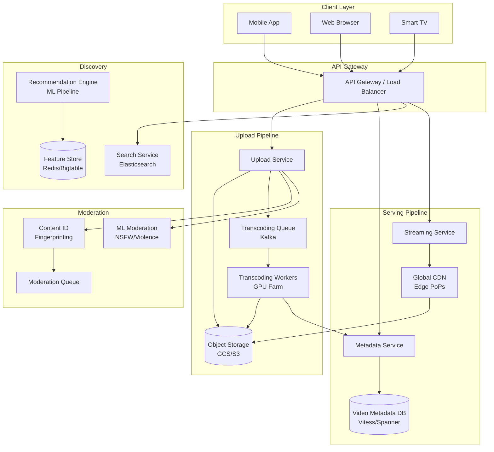
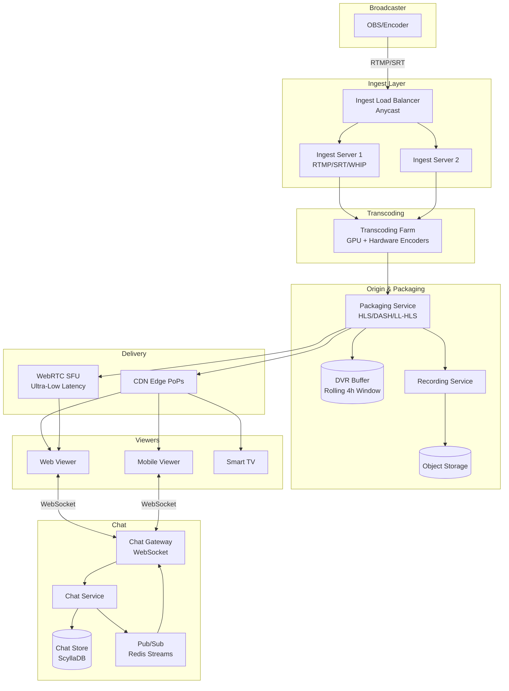
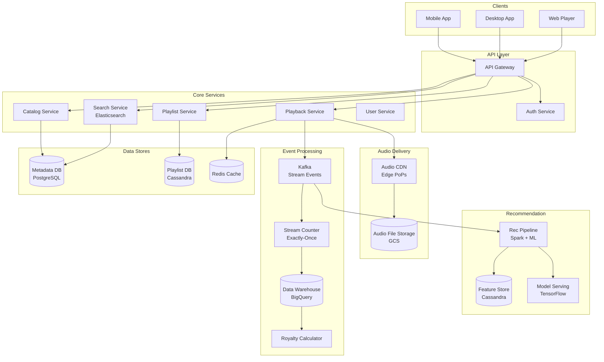
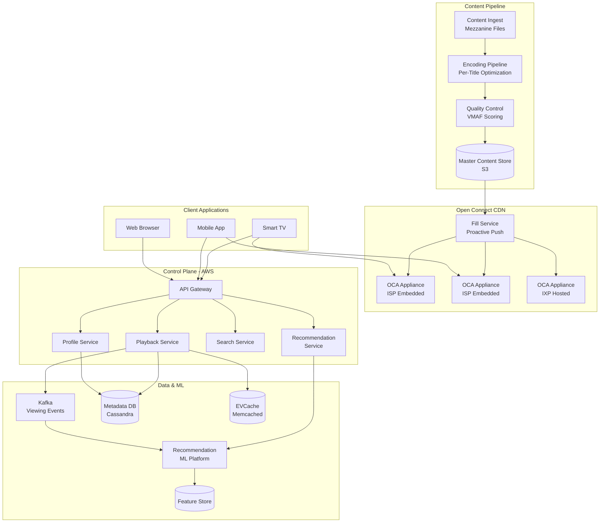
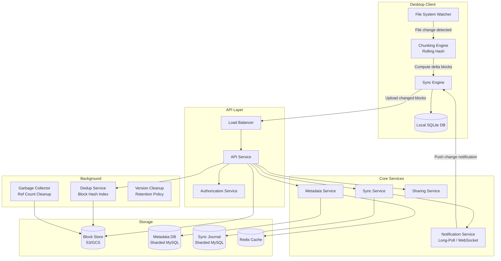
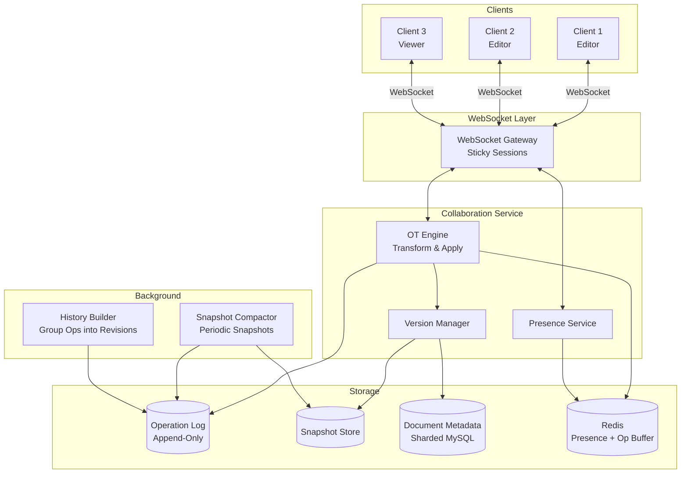
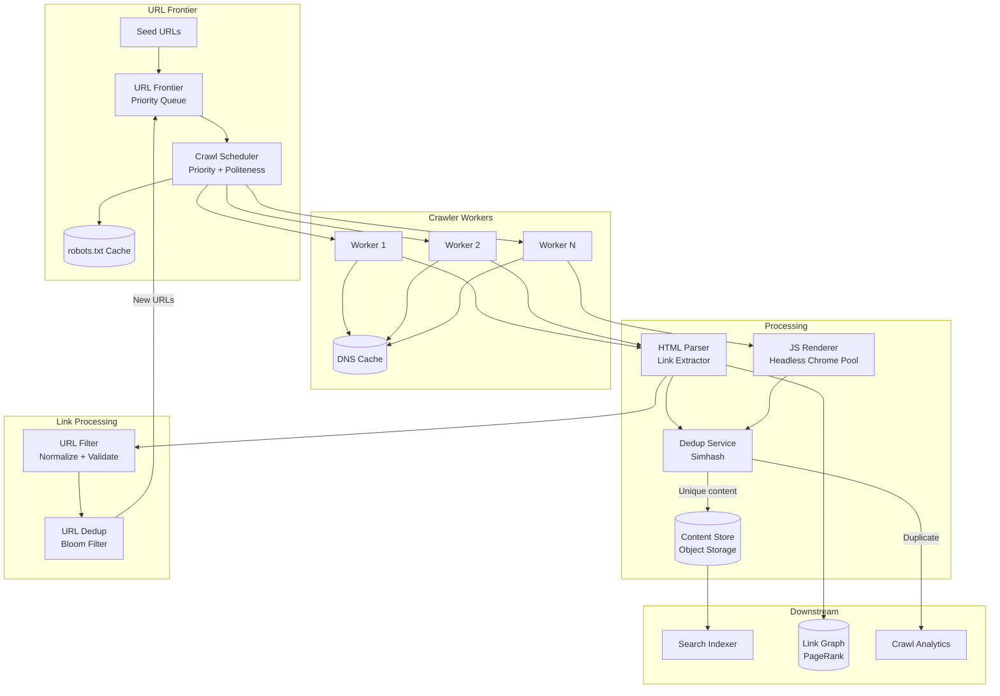
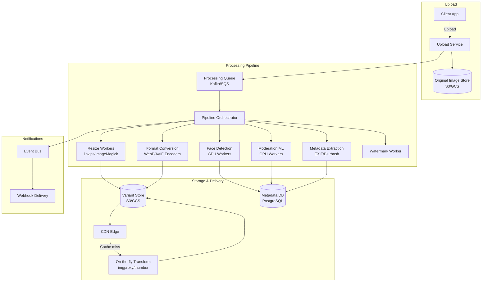
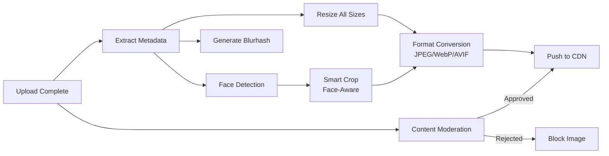

# Chapter 4: Media, Content & Streaming

> Delivering rich media experiences at planetary scale — from upload to playback and everything in between.

Media and content systems are among the most demanding distributed systems ever built. They combine massive storage requirements, compute-intensive processing pipelines, real-time delivery constraints, and sophisticated personalization — all while serving billions of users across unreliable networks. This chapter dissects eight foundational systems that power the modern internet's richest experiences.

---

## 1. YouTube / Video Upload & Sharing Platform

### Problem Statement

YouTube processes over 500 hours of video uploaded every minute, serves billions of views per day, and must deliver smooth playback across devices ranging from 2G phones in rural India to 8K smart TVs in fiber-connected homes. The platform must handle the full lifecycle of video: upload, validation, transcoding into dozens of format/resolution combinations, storage, distribution via a global CDN, and real-time recommendation to keep users engaged.

The engineering challenge is staggering. A single 10-minute 4K video can be 3-6 GB raw. Multiply by hundreds of hours per minute and you need petabytes of new storage daily. Each video must be transcoded into multiple resolutions (144p through 4K) and codecs (H.264, VP9, AV1), producing 20-40 renditions per video. These renditions must be segmented for adaptive bitrate streaming, distributed globally, and served with sub-second start times.

Beyond raw infrastructure, the system must handle content moderation (copyright detection, harmful content filtering), metadata indexing for search, thumbnail generation, closed caption extraction, and a recommendation engine that matches each user with relevant content from a catalog of over a billion videos.

### Use Cases

- A creator uploads a 4K 30-minute video from a mobile phone on a flaky connection (resumable upload)
- A viewer in Tokyo watches a trending US video with <2s start time (CDN, edge caching)
- Adaptive bitrate switches from 1080p to 480p mid-stream when the viewer enters a tunnel
- A copyright holder's content is detected and monetized or blocked within minutes of upload
- The recommendation engine surfaces a 3-year-old video to a new audience based on watch patterns
- A viewer searches for "how to change a tire" and gets relevant results ranked by quality and freshness
- Live view counts and comments update in real-time during a viral video
- A creator checks their analytics dashboard for watch time, demographics, and revenue

### Functional Requirements

- **FR1**: Users can upload videos up to 12 hours long and 256 GB in size via resumable, chunked upload
- **FR2**: System transcodes each video into multiple resolutions (144p, 240p, 360p, 480p, 720p, 1080p, 1440p, 2160p) and codecs (H.264, VP9, AV1)
- **FR3**: Viewers can stream videos with adaptive bitrate switching (HLS/DASH)
- **FR4**: Users can search videos by title, description, tags, and captions
- **FR5**: System generates thumbnails (auto + custom), extracts closed captions, detects language
- **FR6**: Content ID system detects copyrighted material within minutes of upload
- **FR7**: Users can like, comment, subscribe, create playlists, and share videos
- **FR8**: Recommendation engine provides personalized home feed, up-next suggestions, and trending content

### Non-Functional Requirements

- **NFR1**: Upload availability ≥ 99.9% — creators must never lose an upload
- **NFR2**: Video start time (time to first frame) < 2 seconds at p95
- **NFR3**: Transcoding latency: SD renditions available within 10 minutes, all renditions within 2 hours for a 30-min video
- **NFR4**: Storage durability: 11 nines (99.999999999%) — no video ever lost
- **NFR5**: Global CDN serves 100+ Tbps aggregate bandwidth
- **NFR6**: Search index updated within 5 minutes of upload completion
- **NFR7**: System handles 500+ hours of video uploaded per minute
- **NFR8**: Recommendations refresh within seconds of user interaction for real-time personalization

### Capacity Estimation

- **Users**: 2 billion monthly active users, ~800 million DAU
- **Video uploads**: 500 hours/minute = 720,000 hours/day
- **Average upload**: 10 minutes, 500 MB (after initial client-side compression)
- **Daily uploads**: 720,000 hours × 6 videos/hour = 4.32 million videos/day
- **Raw upload storage**: 4.32M × 500 MB = 2.16 PB/day
- **Transcoded storage**: Each video → ~30 renditions, avg 3× raw size = 6.48 PB/day
- **Annual storage growth**: ~3,150 PB/year ≈ 3.15 EB/year
- **Transcoding compute**: 720,000 hours of video × avg 5× real-time per rendition × 30 renditions = 108 million compute-hours/day
- **Viewing bandwidth**: 800M DAU × avg 40 min/day × avg 3 Mbps = ~1.6 Pbps peak (with CDN caching, origin serves ~5%)
- **Metadata storage**: 4.32M videos/day × 10 KB metadata = 43 GB/day (trivial vs video)

### API Design

```http
# --- Upload Flow ---
POST /api/v1/videos
Content-Type: application/json
Authorization: Bearer {token}
Body: { "title": "My Video", "description": "...", "tags": ["tech"], "visibility": "public" }
Response: 201 Created
{
  "videoId": "v_abc123",
  "uploadUrl": "https://upload.yt.internal/v_abc123",
  "chunkSize": 8388608,
  "resumableUploadId": "ru_xyz789"
}

# Chunked resumable upload
PUT /api/v1/videos/{videoId}/upload
Content-Range: bytes 0-8388607/524288000
Content-Type: application/octet-stream
Body: <binary chunk data>
Response: 308 Resume Incomplete
  Range: 0-8388607

# Check upload status (resume after failure)
GET /api/v1/videos/{videoId}/upload/status
Response: { "bytesReceived": 8388608, "totalBytes": 524288000 }

# Complete upload
POST /api/v1/videos/{videoId}/upload/complete
Response: 200 OK { "status": "processing", "estimatedReady": "2024-01-15T10:30:00Z" }

# --- Streaming ---
GET /api/v1/videos/{videoId}/manifest
Accept: application/vnd.apple.mpegurl
Response: 200 OK (HLS master playlist with multiple quality levels)

GET /api/v1/videos/{videoId}/segments/{quality}/{segmentNumber}.ts
Response: 200 OK (MPEG-TS segment, served from CDN edge)

# --- Metadata & Interaction ---
GET /api/v1/videos/{videoId}
GET /api/v1/videos?q=search+term&sort=relevance&page=1&limit=20
POST /api/v1/videos/{videoId}/comments
POST /api/v1/videos/{videoId}/reactions  { "type": "like" }
GET /api/v1/users/{userId}/feed?page=1&limit=20

# --- Presigned URL for direct-to-storage upload ---
POST /api/v1/videos/{videoId}/presigned-upload-url
Response: { "url": "https://storage.gcs.internal/bucket/v_abc123?X-Goog-Signature=...", "expiresIn": 3600 }
```

### Data Model

```sql
CREATE TABLE videos (
    video_id        VARCHAR(16) PRIMARY KEY,       -- short unique ID (Base62)
    user_id         BIGINT NOT NULL,
    title           VARCHAR(500) NOT NULL,
    description     TEXT,
    visibility      ENUM('public','unlisted','private') DEFAULT 'private',
    status          ENUM('uploading','processing','ready','failed','removed') DEFAULT 'uploading',
    duration_ms     INT,
    original_codec  VARCHAR(20),
    original_width  INT,
    original_height INT,
    file_size_bytes BIGINT,
    upload_url      VARCHAR(2048),
    thumbnail_url   VARCHAR(2048),
    captions_lang   JSON,                          -- ["en","es","fr"]
    view_count      BIGINT DEFAULT 0,
    like_count      BIGINT DEFAULT 0,
    created_at      TIMESTAMP DEFAULT NOW(),
    updated_at      TIMESTAMP DEFAULT NOW(),
    INDEX idx_user_id (user_id),
    INDEX idx_status (status),
    INDEX idx_created (created_at)
) PARTITION BY HASH(video_id) PARTITIONS 256;

CREATE TABLE video_renditions (
    rendition_id    BIGINT AUTO_INCREMENT PRIMARY KEY,
    video_id        VARCHAR(16) NOT NULL,
    codec           ENUM('h264','vp9','av1') NOT NULL,
    resolution      ENUM('144p','240p','360p','480p','720p','1080p','1440p','2160p'),
    bitrate_kbps    INT NOT NULL,
    segment_count   INT,
    manifest_path   VARCHAR(2048),                 -- path in object store
    storage_bytes   BIGINT,
    status          ENUM('pending','transcoding','ready','failed') DEFAULT 'pending',
    created_at      TIMESTAMP DEFAULT NOW(),
    INDEX idx_video_rendition (video_id, codec, resolution)
);

CREATE TABLE video_segments (
    segment_id      BIGINT AUTO_INCREMENT PRIMARY KEY,
    video_id        VARCHAR(16) NOT NULL,
    rendition_id    BIGINT NOT NULL,
    segment_number  INT NOT NULL,
    start_time_ms   INT NOT NULL,
    duration_ms     INT NOT NULL,
    storage_path    VARCHAR(2048),
    size_bytes      INT,
    UNIQUE KEY uk_segment (rendition_id, segment_number)
) PARTITION BY HASH(video_id) PARTITIONS 256;

-- View counts: use Redis HyperLogLog for unique views, 
-- batch flush to this table periodically
CREATE TABLE video_analytics (
    video_id        VARCHAR(16) NOT NULL,
    date            DATE NOT NULL,
    views           BIGINT DEFAULT 0,
    unique_views    BIGINT DEFAULT 0,
    watch_time_sec  BIGINT DEFAULT 0,
    likes           INT DEFAULT 0,
    shares          INT DEFAULT 0,
    PRIMARY KEY (video_id, date)
) PARTITION BY RANGE(date);
```

### High-Level Design



### Deep Dive

#### Chunked & Resumable Upload Protocol

The upload service implements a protocol inspired by the TUS resumable upload standard. When a client initiates an upload, the server returns a unique `resumableUploadId` and a recommended chunk size (typically 8 MB). The client splits the file and uploads chunks sequentially, each with a `Content-Range` header. The server tracks received byte ranges in Redis. If the connection drops, the client queries the upload status endpoint to learn which bytes were received, and resumes from the last confirmed offset. This is critical for mobile users on unreliable networks uploading multi-gigabyte files.

For very large files (>5 GB), the system uses presigned URLs to upload directly to object storage (GCS/S3), bypassing the upload service entirely. The upload service generates time-limited presigned URLs for each chunk, and the client uploads in parallel. A completion callback triggers the transcoding pipeline.

#### Video Transcoding Pipeline

Transcoding is the most compute-intensive operation. Each uploaded video passes through:

1. **Probe**: FFprobe extracts metadata (codec, resolution, duration, frame rate, audio channels)
2. **Split**: The source video is split into 4-10 second GOPs (Group of Pictures) for parallel transcoding
3. **Transcode**: Each GOP is transcoded independently across the resolution/codec matrix. A 30-min video with 30 renditions produces ~5,400 tasks. Workers use FFmpeg with hardware acceleration (NVENC on GPUs).
4. **Merge**: Transcoded GOPs are concatenated per rendition and segmented into HLS/DASH chunks (typically 4-6 seconds)
5. **Manifest Generation**: Master and variant playlists are generated linking all quality levels
6. **Publish**: Renditions are registered in the metadata DB; the video status moves to "ready"

Priority queues ensure popular creators and time-sensitive content (news) are transcoded first. The system uses spot/preemptible instances for cost efficiency, with on-demand fallback for SLA compliance.

#### Adaptive Bitrate Streaming (ABR)

Videos are served using HLS (HTTP Live Streaming) or DASH (Dynamic Adaptive Streaming over HTTP). The master manifest lists available quality levels with bandwidth requirements. The client's ABR algorithm (e.g., buffer-based BBA or throughput-based BOLA) selects the appropriate quality for each segment based on:

- Current network throughput (measured from recent segment downloads)
- Buffer occupancy (how many seconds of video are buffered)
- Device capabilities (screen resolution, decoder support)

Segments are 4-6 seconds long, allowing quality switches every few seconds. The CDN caches segments at edge PoPs; popular videos achieve >95% cache hit rates. Origin shields (mid-tier caches) protect the origin storage from thundering herd effects on viral content.

#### CDN Architecture

YouTube operates a private CDN with thousands of edge PoPs, many co-located inside ISPs (Google Global Cache). The CDN uses a tiered caching architecture:

- **Edge PoP**: Closest to user, caches popular segments, 50-100 TB SSD per PoP
- **Regional Hub**: Aggregates misses from 10-50 edge PoPs, 1-5 PB HDD
- **Origin**: GCS buckets across multiple regions

Cache warming proactively pushes trending content to edge PoPs before demand spikes. Long-tail content (99% of videos get <1% of views) is served from regional hubs or origin.

### Bottlenecks & Mitigations

| Bottleneck | Mitigation |
|---|---|
| Transcoding backlog during upload spikes | Auto-scaling GPU worker fleet; priority queues; spot instances |
| CDN cache misses for long-tail content | Tiered caching; origin shields; predictive cache warming |
| Thundering herd on viral videos | Edge caching; request coalescing; stale-while-revalidate |
| Upload failures on slow networks | Resumable chunked uploads; client-side retry with exponential backoff |
| Metadata DB hotspots for viral videos | Read replicas; view count aggregation via Redis + batch flush |
| Storage cost for rarely-watched renditions | Lazy transcoding (only popular codecs eagerly; AV1 on-demand); cold storage tiering |
| Video start latency | Preload first segments; smaller initial segment; CDN edge prefetch |

### Key Takeaways

- Resumable, chunked uploads are non-negotiable for a video platform — users upload over unreliable networks
- Transcoding is embarrassingly parallel at the GOP level — split the source and fan out across a GPU farm
- Adaptive bitrate streaming (HLS/DASH) is the standard for smooth playback across varying network conditions
- A tiered CDN with ISP-embedded caches is essential for cost-effective global delivery
- Separate the upload pipeline (write-heavy, async) from the streaming pipeline (read-heavy, latency-sensitive)
- Use async processing with priority queues to handle the enormous transcoding workload without blocking uploads

---

## 2. Live Streaming & Broadcast System

### Problem Statement

Live streaming platforms like Twitch, YouTube Live, and Instagram Live must ingest video from millions of concurrent broadcasters, transcode it in real-time, and deliver it to tens of millions of concurrent viewers — all with latency low enough for meaningful real-time interaction. Unlike video-on-demand, live streaming has no luxury of preprocessing: every frame must be encoded, segmented, distributed, and played back within seconds of capture.

The core tension in live streaming is between latency and scalability. Traditional HLS/DASH adds 15-30 seconds of latency due to segment buffering. Viewers chatting with a streamer need sub-5-second latency for conversation to feel natural. Ultra-low-latency use cases (auctions, sports betting, interactive shows) need sub-1-second latency via WebRTC — but WebRTC doesn't scale to millions of viewers natively.

The system must also handle massive viewership spikes (a popular streamer going live can attract millions of viewers within seconds), stream recording for DVR and VOD, real-time chat at scale, and monetization features like subscriptions, donations, and ad insertion.

### Use Cases

- A gaming streamer broadcasts 1080p60 to 50,000 concurrent viewers with real-time chat
- A music festival live streams to 2 million concurrent viewers with DVR (rewind) capability
- Instagram Live allows two users to co-broadcast (split screen) with audience participation
- A sports event is broadcast with sub-1-second latency for in-play betting integration
- A streamer's broadcast is automatically recorded and available as VOD within minutes of ending
- Real-time chat messages from 100,000 viewers are displayed without overwhelming the interface
- An ad break is inserted server-side into the live stream for monetized content
- A clip is created from the live stream and shared instantly on social media

### Functional Requirements

- **FR1**: Broadcasters can stream via RTMP, SRT, or WebRTC ingest protocols
- **FR2**: System transcodes live streams into multiple quality levels in real-time
- **FR3**: Viewers receive HLS/DASH streams with adaptive bitrate; low-latency mode available via LL-HLS or WebRTC
- **FR4**: DVR/rewind allows viewers to seek backward in a live stream up to 4 hours
- **FR5**: Streams are automatically recorded and converted to VOD
- **FR6**: Real-time chat system supports 100K+ messages/minute per channel
- **FR7**: Server-side ad insertion (SSAI) splices ads into the live stream
- **FR8**: Co-streaming allows multiple broadcasters in a single session

### Non-Functional Requirements

- **NFR1**: Glass-to-glass latency < 5 seconds for standard mode, < 1 second for ultra-low-latency mode
- **NFR2**: Ingest availability ≥ 99.99% — dropping a live stream is catastrophic
- **NFR3**: Support 10 million concurrent viewers for a single popular stream
- **NFR4**: Scale to 500,000 concurrent broadcasters
- **NFR5**: Stream start time < 3 seconds for viewers joining a live stream
- **NFR6**: Chat message delivery < 500ms
- **NFR7**: Zero-downtime deployments — never interrupt an active live stream
- **NFR8**: Automatic failover: if an ingest server fails, the broadcaster reconnects within 2 seconds

### Capacity Estimation

- **Concurrent broadcasters**: 200,000 average, 500,000 peak
- **Concurrent viewers**: 50 million average, 150 million peak (major events)
- **Average broadcast bitrate (ingest)**: 6 Mbps (1080p60)
- **Ingest bandwidth**: 500K × 6 Mbps = 3 Tbps peak ingest
- **Transcoded renditions per stream**: 5 (160p, 360p, 480p, 720p, source)
- **Total transcode output**: 500K × 5 renditions × avg 3 Mbps = 7.5 Tbps
- **Viewer bandwidth (CDN egress)**: 150M viewers × avg 4 Mbps = 600 Tbps peak (served from CDN edge)
- **Storage for DVR buffer**: 500K streams × 4 hours × 6 Mbps ÷ 8 = 1.35 PB rolling buffer
- **Chat messages**: 50M viewers × avg 1 msg/min = 833K messages/second peak
- **Transcoding servers**: 500K streams × 5 renditions, ~2 streams per GPU = 1.25 million GPU-equivalents (heavily optimized with hardware encoders)

### API Design

```http
# --- Broadcast (Streamer) ---
POST /api/v1/streams
Body: { "title": "Friday Night Gaming", "category": "gaming", "tags": ["fps"] }
Response: 201 Created
{
  "streamId": "s_abc123",
  "ingestEndpoints": {
    "rtmp": "rtmp://ingest-us-west.live.internal/live/s_abc123?key=sk_xyz",
    "srt": "srt://ingest-us-west.live.internal:9000?streamid=s_abc123&passphrase=sk_xyz",
    "webrtc": "wss://ingest-us-west.live.internal/whip/s_abc123"
  },
  "streamKey": "sk_xyz789"
}

PATCH /api/v1/streams/{streamId}
Body: { "title": "Updated Title" }

DELETE /api/v1/streams/{streamId}  (end broadcast)

# --- Viewer ---
GET /api/v1/streams/{streamId}/manifest.m3u8
Response: HLS master playlist with quality variants and LL-HLS hints

GET /api/v1/streams/{streamId}/segments/{quality}/{segmentNumber}.ts

# Low-latency WebRTC playback (WHEP)
POST /api/v1/streams/{streamId}/whep
Content-Type: application/sdp
Body: <SDP offer>
Response: 201 Created, Body: <SDP answer>

# --- DVR ---
GET /api/v1/streams/{streamId}/manifest.m3u8?dvr=true&from=2024-01-15T10:00:00Z

# --- Chat ---
WebSocket: wss://chat.live.internal/ws?streamId={streamId}&token={jwt}
Messages: { "type": "message", "text": "GG!", "userId": "u_123" }

GET /api/v1/streams/{streamId}/chat/history?before={messageId}&limit=50

# --- Discovery ---
GET /api/v1/streams?category=gaming&sort=viewers&limit=20
GET /api/v1/streams/featured
```

### Data Model

```sql
CREATE TABLE streams (
    stream_id       VARCHAR(16) PRIMARY KEY,
    user_id         BIGINT NOT NULL,
    title           VARCHAR(300),
    category        VARCHAR(100),
    status          ENUM('created','live','ended') DEFAULT 'created',
    ingest_server   VARCHAR(255),
    ingest_protocol ENUM('rtmp','srt','webrtc'),
    viewer_count    INT DEFAULT 0,
    peak_viewers    INT DEFAULT 0,
    started_at      TIMESTAMP NULL,
    ended_at        TIMESTAMP NULL,
    vod_video_id    VARCHAR(16) NULL,              -- link to VOD after stream ends
    created_at      TIMESTAMP DEFAULT NOW(),
    INDEX idx_status_viewers (status, viewer_count DESC),
    INDEX idx_user (user_id)
);

CREATE TABLE stream_segments (
    segment_id      BIGINT AUTO_INCREMENT PRIMARY KEY,
    stream_id       VARCHAR(16) NOT NULL,
    quality         VARCHAR(10) NOT NULL,
    segment_number  INT NOT NULL,
    timestamp_ms    BIGINT NOT NULL,
    duration_ms     INT NOT NULL,
    storage_path    VARCHAR(2048),
    size_bytes      INT,
    UNIQUE KEY uk_seg (stream_id, quality, segment_number)
) PARTITION BY HASH(stream_id) PARTITIONS 128;

-- Chat stored in Cassandra/ScyllaDB for write throughput
-- Schema (CQL):
-- CREATE TABLE chat_messages (
--     stream_id   TEXT,
--     bucket      INT,              -- time bucket (hourly) for partition management
--     message_id  TIMEUUID,
--     user_id     BIGINT,
--     text        TEXT,
--     emotes      LIST<TEXT>,
--     PRIMARY KEY ((stream_id, bucket), message_id)
-- ) WITH CLUSTERING ORDER BY (message_id ASC);
```

### High-Level Design



### Deep Dive

#### RTMP Ingest to HLS/DASH Delivery

The dominant live streaming pipeline works as follows:

1. **Ingest**: The broadcaster's encoder (OBS, mobile app) sends an RTMP or SRT stream to the nearest ingest PoP. SRT is preferred for its built-in FEC (Forward Error Correction) and better performance on lossy networks. Anycast DNS routes broadcasters to the nearest ingest server.

2. **Real-time Transcoding**: The ingest server forwards the raw stream to a transcoding farm. Each stream is transcoded into 4-6 quality levels using hardware encoders (NVIDIA NVENC or dedicated FPGAs). Key settings: keyframe interval = 2 seconds (aligned with segment duration), CBR encoding for consistent bitrate. The transcode must happen in real-time — a 2-second segment must be encoded in <2 seconds.

3. **Packaging**: Transcoded frames are packaged into HLS segments (typically 2-6 seconds). The packaging service maintains a sliding window manifest listing the last N segments. For LL-HLS, partial segments (200-500ms) are served immediately, reducing latency.

4. **CDN Distribution**: Segments are pushed to CDN edge PoPs. For popular streams, the CDN pull model works well. For the long tail, the origin pushes segments proactively to nearby PoPs.

#### Low-Latency Approaches

| Approach | Latency | Scale | Trade-off |
|---|---|---|---|
| Standard HLS (6s segments) | 15-30s | Unlimited (CDN) | High latency |
| LL-HLS (partial segments) | 2-5s | Unlimited (CDN) | More HTTP requests |
| WebRTC (WHEP) | 0.5-1s | ~100K per SFU cluster | CPU-intensive, no CDN |
| WebTransport + LL-DASH | 1-3s | CDN-compatible | Emerging standard |

For ultra-low-latency, the system uses a WebRTC SFU (Selective Forwarding Unit) cascading architecture. The origin SFU receives the transcoded stream and forwards to regional SFU clusters, which relay to viewer-facing SFUs. This creates a tree of SFUs that scales to hundreds of thousands of viewers while maintaining sub-second latency.

#### Real-Time Chat at Scale

Chat for a stream with 100,000+ concurrent viewers requires:

- **Fan-out**: Each message must reach all connected viewers. Using Redis Pub/Sub, chat servers subscribe to a channel per stream. When a message arrives, it's published to the channel and relayed to all WebSocket connections on subscribed servers.
- **Rate limiting**: Per-user rate limits (e.g., 1 message per second) prevent spam. Slow mode throttles all users during peak activity.
- **Sharding**: For very popular streams, the chat is sharded across multiple Pub/Sub channels, and viewers are assigned to shards. Client-side merging ensures a consistent view.

### Bottlenecks & Mitigations

| Bottleneck | Mitigation |
|---|---|
| Ingest server failure drops the live stream | Redundant ingest with automatic SRT reconnect; multi-path ingest |
| Transcoding latency adds to glass-to-glass delay | Hardware encoders (NVENC/FPGA); pre-warmed transcoder pools |
| CDN propagation delay for segments | Push-based CDN; edge pre-positioning; persistent HTTP/2 connections |
| Chat message fan-out for 1M+ viewer streams | Sharded pub/sub; sampled chat display; server-side message aggregation |
| Thundering herd when popular streamer goes live | CDN edge caching; request coalescing; pre-warmed manifest endpoints |
| DVR buffer storage costs | Time-limited rolling buffer; tiered storage (SSD for recent, HDD for older) |

### Key Takeaways

- Live streaming is fundamentally different from VOD: real-time transcoding and ultra-low-latency delivery add enormous complexity
- The RTMP ingest → real-time transcode → HLS/DASH segment → CDN pipeline is the industry standard
- LL-HLS and WebRTC SFU cascading address the latency-scalability trade-off
- Chat at scale requires pub/sub fan-out with aggressive rate limiting and sharding
- Ingest reliability is paramount — a dropped stream is the worst user experience

---

## 3. Spotify / Music Streaming Service

### Problem Statement

A music streaming service like Spotify must deliver instant playback of over 100 million tracks to 500+ million users worldwide, with seamless transitions between songs, offline download capability, and hyper-personalized recommendations that keep users engaged for hours. Unlike video, music streaming demands gapless playback (no silence between tracks), instant seek, and extremely low startup latency — users expect music to start playing within 200ms of tapping a song.

The catalog is massive but the individual files are small (3-10 MB per track). The challenge shifts from raw bandwidth to metadata management, recommendation quality, playlist curation, social features, and rights management. Every stream must be tracked for royalty calculation — Spotify pays rights holders per-stream, requiring an auditable, exactly-once counting system processing billions of events daily.

The recommendation engine is arguably the product's most critical differentiator. Discover Weekly, Release Radar, and Daily Mixes must surface relevant music from a catalog of 100M+ tracks, balancing exploitation (songs the user will like) with exploration (new artists and genres that broaden taste).

### Use Cases

- A user taps a song and hears it within 200ms, with gapless transition to the next track
- A commuter downloads a playlist for offline listening on the subway
- Discover Weekly generates a personalized 30-song playlist every Monday for each of 500M users
- A user creates a collaborative playlist that friends can add songs to
- The system crossfades between tracks with configurable overlap duration
- A podcast episode resumes from the exact timestamp where the user stopped
- Royalty reporting system attributes every stream to the correct rights holders
- Audio quality adapts from 96kbps on 3G to 320kbps on Wi-Fi

### Functional Requirements

- **FR1**: Stream any track from a catalog of 100M+ songs with <200ms startup latency
- **FR2**: Support multiple audio qualities: 24kbps (low), 96kbps (normal), 160kbps (high), 320kbps (very high), lossless FLAC
- **FR3**: Offline download for playlists and albums with DRM protection
- **FR4**: Gapless playback and crossfade between tracks
- **FR5**: User-created and collaborative playlists, liked songs, queue management
- **FR6**: Personalized recommendations: Discover Weekly, Daily Mixes, Radio, autoplay
- **FR7**: Search across tracks, artists, albums, playlists, podcasts, and lyrics
- **FR8**: Social features: follow artists/friends, share tracks, see friend activity

### Non-Functional Requirements

- **NFR1**: Playback start latency < 200ms at p95 (first audio byte to speaker)
- **NFR2**: Availability ≥ 99.99% for playback, ≥ 99.9% for metadata/search
- **NFR3**: Support 30 million concurrent streaming sessions
- **NFR4**: Exactly-once stream counting for royalty accuracy
- **NFR5**: Offline content available without network for up to 30 days
- **NFR6**: Recommendation pipeline refreshes personalized playlists weekly for 500M users within 24 hours
- **NFR7**: Search latency < 100ms at p95
- **NFR8**: Zero audio artifacts (clicks, pops, gaps) during playback and track transitions

### Capacity Estimation

- **Users**: 600 million registered, 250 million DAU
- **Concurrent streams**: 30 million peak
- **Catalog size**: 100 million tracks × avg 7 MB (OGG 160kbps) = 700 TB for one quality
- **All qualities storage**: 700 TB × 5 quality tiers = 3.5 PB
- **Streaming bandwidth**: 30M concurrent × 160kbps avg = 4.8 Tbps peak
- **Daily streams**: 250M DAU × avg 25 tracks/day = 6.25 billion streams/day
- **Stream events for royalty**: 6.25B events/day = ~72,000 events/second avg, 200K/sec peak
- **Search queries**: 250M DAU × avg 5 searches/day = 1.25 billion searches/day ≈ 14,500 QPS avg
- **Recommendation compute**: 500M users × weekly playlist = 500M inference jobs/week ≈ 830/second sustained
- **Download bandwidth**: assume 10% users download 1 playlist/day × 30 tracks × 7 MB = 5.25 PB/day download

### API Design

```http
# --- Playback ---
GET /api/v1/tracks/{trackId}/stream?quality=high
Response: 302 Redirect to CDN URL with signed token
  Location: https://cdn-audio.svc.internal/tracks/{trackId}/high?token=...&expires=...

# Prefetch next track for gapless playback
GET /api/v1/tracks/{trackId}/stream?quality=high&prefetch=true
Response: 200 OK { "cdnUrl": "...", "durationMs": 234000, "normalizationGain": -3.2 }

# --- Playlists ---
POST /api/v1/playlists
Body: { "name": "Road Trip", "description": "...", "collaborative": false }

GET /api/v1/playlists/{playlistId}
GET /api/v1/playlists/{playlistId}/tracks?offset=0&limit=50

POST /api/v1/playlists/{playlistId}/tracks
Body: { "trackIds": ["t_1", "t_2"], "position": 5 }

DELETE /api/v1/playlists/{playlistId}/tracks
Body: { "trackIds": ["t_1"], "snapshotId": "snap_abc" }

# --- Search ---
GET /api/v1/search?q=bohemian+rhapsody&type=track,artist,album&limit=10
Response: { "tracks": [...], "artists": [...], "albums": [...] }

# --- Recommendations ---
GET /api/v1/me/discover-weekly
GET /api/v1/me/daily-mixes
GET /api/v1/recommendations?seedTracks=t_1,t_2&seedArtists=a_1&limit=30

# --- Offline Download ---
POST /api/v1/offline/playlists/{playlistId}
Response: 202 Accepted { "downloadId": "dl_xyz", "trackCount": 30, "estimatedSizeMb": 210 }

GET /api/v1/offline/playlists/{playlistId}/status
Response: { "downloaded": 18, "total": 30, "sizeMb": 126 }

# --- User Library ---
PUT /api/v1/me/tracks/{trackId}         (like/save a track)
DELETE /api/v1/me/tracks/{trackId}      (unlike a track)
GET /api/v1/me/tracks?offset=0&limit=50
GET /api/v1/me/recently-played?limit=20
```

### Data Model

```sql
CREATE TABLE tracks (
    track_id        VARCHAR(22) PRIMARY KEY,       -- Spotify-style Base62 ID
    title           VARCHAR(500) NOT NULL,
    album_id        VARCHAR(22) NOT NULL,
    artist_ids      JSON NOT NULL,                 -- ["a_1","a_2"]
    duration_ms     INT NOT NULL,
    explicit        BOOLEAN DEFAULT FALSE,
    isrc            VARCHAR(12),                   -- International Standard Recording Code
    popularity      SMALLINT DEFAULT 0,            -- 0-100
    preview_url     VARCHAR(2048),
    release_date    DATE,
    normalization   JSON,                          -- { "gain": -3.2, "peak": 0.98 }
    INDEX idx_album (album_id),
    INDEX idx_popularity (popularity DESC),
    FULLTEXT idx_search (title)
);

CREATE TABLE track_files (
    track_id        VARCHAR(22) NOT NULL,
    quality         ENUM('low','normal','high','very_high','lossless') NOT NULL,
    codec           ENUM('ogg_vorbis','aac','flac') NOT NULL,
    file_path       VARCHAR(2048) NOT NULL,
    file_size_bytes INT NOT NULL,
    bitrate_kbps    INT NOT NULL,
    PRIMARY KEY (track_id, quality)
);

CREATE TABLE playlists (
    playlist_id     VARCHAR(22) PRIMARY KEY,
    owner_id        BIGINT NOT NULL,
    name            VARCHAR(300) NOT NULL,
    description     TEXT,
    collaborative   BOOLEAN DEFAULT FALSE,
    public          BOOLEAN DEFAULT TRUE,
    snapshot_id     VARCHAR(32) NOT NULL,          -- changes on every modification
    follower_count  INT DEFAULT 0,
    track_count     INT DEFAULT 0,
    image_url       VARCHAR(2048),
    created_at      TIMESTAMP DEFAULT NOW(),
    updated_at      TIMESTAMP DEFAULT NOW(),
    INDEX idx_owner (owner_id)
);

CREATE TABLE playlist_tracks (
    playlist_id     VARCHAR(22) NOT NULL,
    position        INT NOT NULL,
    track_id        VARCHAR(22) NOT NULL,
    added_by        BIGINT NOT NULL,
    added_at        TIMESTAMP DEFAULT NOW(),
    PRIMARY KEY (playlist_id, position),
    INDEX idx_track (track_id)
);

-- Stream event log (Kafka topic, materialized into data warehouse)
-- Used for royalty calculation, analytics, and recommendation training
-- Schema: stream_id | user_id | track_id | timestamp | duration_ms | 
--          completed | quality | country | platform | shuffle | context_uri
```

### High-Level Design



### Deep Dive

#### Gapless Playback & Audio Prefetch

The client prefetches the next track while the current one is playing. When the current track has ~10 seconds remaining, the client requests the CDN URL for the next track and begins buffering. Audio decoders on the client handle crossfade by mixing the tail of the current track with the head of the next track. Normalization gain metadata (stored per track) ensures consistent volume across tracks from different albums and eras.

The audio files include encoder padding metadata (e.g., OGG Vorbis `ENCODER_PADDING`) that tells the decoder exactly how many samples to trim from the start and end, eliminating the silent gaps that encoders introduce.

#### Recommendation Engine Architecture

Spotify's recommendation system combines multiple approaches:

1. **Collaborative Filtering**: Matrix factorization on the user-track interaction matrix. Users who listen to similar tracks are considered similar; tracks listened to by similar users are recommended. Implemented using ALS (Alternating Least Squares) on Spark.

2. **Content-Based Filtering**: Audio features (tempo, key, energy, valence) extracted by ML models from raw audio. Tracks with similar audio characteristics to the user's favorites are recommended.

3. **Natural Language Processing**: Analysis of blog posts, reviews, and social media mentions to understand cultural context and genre associations.

4. **Reinforcement Learning**: The system models playlist generation as a sequential decision problem, balancing familiar tracks with discovery to maximize long-term engagement.

Discover Weekly runs as a batch pipeline every Monday: for each of 500M users, the system generates 30 recommendations by blending collaborative filtering candidates with content-based re-ranking. The pipeline runs on a Spark cluster processing petabytes of listening history.

#### Royalty & Stream Counting

Every stream event flows through Kafka to the stream counting service. A stream "counts" for royalty purposes only if the user listens to at least 30 seconds. The system uses Kafka's exactly-once semantics (idempotent producers + transactional consumers) to guarantee every stream is counted exactly once. Stream events are aggregated daily by territory, track, and rights holder, then fed into the royalty calculation engine that distributes payments according to complex licensing agreements.

### Bottlenecks & Mitigations

| Bottleneck | Mitigation |
|---|---|
| Playback startup latency | CDN edge caching; prefetch next track; persistent connections |
| Catalog search at scale | Elasticsearch sharded by first letter; query caching in Redis |
| Recommendation freshness vs compute cost | Weekly batch + real-time re-ranking hybrid; incremental model updates |
| Stream counting exactly-once | Kafka transactions; idempotent consumers; reconciliation jobs |
| Collaborative playlist conflicts | Snapshot-based versioning; last-write-wins with conflict detection |
| Offline DRM enforcement | License tokens with expiry; periodic online check-in required |
| Audio CDN costs for long-tail tracks | Tiered caching; intelligent prefetch based on playlist analysis |

### Key Takeaways

- Music streaming is latency-obsessed: 200ms to first audio is the bar
- Gapless playback requires encoder-level metadata and client-side audio mixing
- Recommendation quality is the primary differentiator — batch collaborative filtering + real-time re-ranking
- Exactly-once stream counting is a hard distributed systems problem, solved with Kafka transactions
- Small file sizes (3-10 MB) shift the challenge from bandwidth to metadata management and personalization

---

## 4. Netflix / Video-on-Demand Platform

### Problem Statement

Netflix serves 250+ million subscribers in 190 countries, delivering personalized video-on-demand (VOD) across thousands of device types. Every aspect of the experience is personalized: the titles shown on the home screen, the artwork displayed for each title, the row ordering, and even the synopsis. Netflix's CDN (Open Connect) handles over 15% of all downstream internet traffic during peak hours.

The core technical challenges are: (1) encoding each title into hundreds of renditions optimized for specific device/network combinations, (2) distributing petabytes of content to thousands of edge servers worldwide, (3) personalizing the experience for each subscriber using real-time ML models, and (4) ensuring instant, buffer-free playback on devices from smartphones to 4K TVs.

Netflix pioneered per-title encoding optimization, where each title gets its own encoding ladder (bitrate/resolution combinations) based on visual complexity. A simple animation might look great at 720p/1.5Mbps, while an action movie needs 4Mbps for the same quality. This saves significant bandwidth and storage while improving visual quality.

### Use Cases

- A subscriber opens Netflix and sees a personalized home screen in under 1 second
- A user starts watching a movie on their phone, then switches to their TV mid-scene
- Adaptive streaming adjusts quality seamlessly as the user's network fluctuates
- A new original series launches globally and 50M subscribers watch the first episode within 48 hours
- Content is pre-positioned on ISP-embedded servers before a major launch
- A/B tests compare two different thumbnails for the same title to optimize click-through rate
- Parental controls restrict content based on maturity ratings per profile
- Subtitle and audio track selection in 30+ languages

### Functional Requirements

- **FR1**: Browse and search a catalog of 15,000+ titles with personalized ranking
- **FR2**: Stream titles in adaptive quality up to 4K HDR with Dolby Atmos audio
- **FR3**: Multi-profile support per account with individual watch history and preferences
- **FR4**: Resume playback across devices (continue watching)
- **FR5**: Download titles for offline viewing with time-limited DRM licenses
- **FR6**: Content personalization: personalized artwork, row ordering, title ranking
- **FR7**: Subtitle/audio track selection in 30+ languages per title
- **FR8**: Parental controls and content maturity ratings per profile

### Non-Functional Requirements

- **NFR1**: Playback start time < 3 seconds at p99
- **NFR2**: Availability ≥ 99.99% for streaming, ≥ 99.9% for browse/search
- **NFR3**: Rebuffer rate < 0.5% of all viewing sessions
- **NFR4**: Support 250M subscribers, 100M concurrent streams during peak
- **NFR5**: Content available in 190 countries with local CDN PoPs
- **NFR6**: Per-title encoding completes within 24 hours of content ingest
- **NFR7**: A/B test framework supports 100+ concurrent experiments
- **NFR8**: 11 nines durability for master content copies

### Capacity Estimation

- **Subscribers**: 250 million
- **DAU**: 150 million (60% daily engagement)
- **Concurrent streams (peak)**: 100 million
- **Catalog**: 15,000 titles × avg 500 renditions × avg 2 GB per rendition = 15 PB total encoded content
- **Peak bandwidth**: 100M streams × avg 5 Mbps = 500 Tbps (served from Open Connect appliances)
- **Monthly viewing**: 250M subs × avg 2 hours/day × 30 days = 15 billion viewing hours/month
- **New content ingested**: ~100 titles/week × avg 90 min × ~500 renditions
- **Encoding compute**: 100 titles × 500 renditions × avg 3× real-time = 225,000 compute-hours/week
- **Personalization compute**: 250M users × home page load × ML inference = ~50,000 QPS for recommendation API
- **Event tracking**: 100M concurrent sessions × heartbeat every 10s = 10M events/second

### API Design

```http
# --- Browse & Discovery ---
GET /api/v1/profiles/{profileId}/home
Response: {
  "rows": [
    { "title": "Continue Watching", "items": [...] },
    { "title": "Trending Now", "items": [...] },
    { "title": "Because You Watched: Stranger Things", "items": [...] }
  ],
  "abTestAllocations": { "artwork_exp_42": "variant_b" }
}

GET /api/v1/search?q=breaking+bad&profileId={profileId}&limit=20
GET /api/v1/titles/{titleId}?profileId={profileId}

# --- Playback ---
POST /api/v1/playback/initiate
Body: {
  "titleId": "t_123",
  "profileId": "p_456",
  "episodeId": "e_789",
  "deviceType": "smart_tv",
  "maxResolution": "4k",
  "supportedCodecs": ["h265","vp9","av1"],
  "drmSystems": ["widevine_l1"]
}
Response: {
  "playbackId": "pb_abc",
  "manifestUrl": "https://oc-edge-sjc.nflx.internal/t_123/e_789/manifest.mpd",
  "licenseUrl": "https://license.nflx.internal/v1/drm/widevine",
  "resumePositionMs": 1832400,
  "bookmarks": { "skipIntro": [32000, 62000], "skipRecap": [0, 45000] }
}

# Heartbeat / progress tracking
POST /api/v1/playback/{playbackId}/heartbeat
Body: { "positionMs": 1850000, "bufferedMs": 1860000, "bitrateKbps": 15000, "resolution": "4k" }

# --- Offline Download ---
POST /api/v1/downloads
Body: { "titleId": "t_123", "episodeId": "e_789", "quality": "high" }
Response: {
  "downloadId": "d_xyz",
  "manifestUrl": "...",
  "licenseUrl": "...",
  "expiresAt": "2024-02-15T00:00:00Z",
  "estimatedSizeMb": 850
}

# --- Profile Management ---
GET /api/v1/accounts/{accountId}/profiles
POST /api/v1/accounts/{accountId}/profiles
PATCH /api/v1/profiles/{profileId}
```

### Data Model

```sql
CREATE TABLE titles (
    title_id        VARCHAR(16) PRIMARY KEY,
    type            ENUM('movie','series') NOT NULL,
    name            VARCHAR(500) NOT NULL,
    synopsis        TEXT,
    maturity_rating VARCHAR(10),                   -- PG, PG-13, R, etc.
    release_year    INT,
    genres          JSON,                          -- ["drama","thriller"]
    cast_ids        JSON,
    director_ids    JSON,
    available_regions JSON,                        -- ["US","UK","JP"]
    default_artwork_url VARCHAR(2048),
    created_at      TIMESTAMP DEFAULT NOW()
);

CREATE TABLE episodes (
    episode_id      VARCHAR(16) PRIMARY KEY,
    title_id        VARCHAR(16) NOT NULL,
    season_number   INT NOT NULL,
    episode_number  INT NOT NULL,
    name            VARCHAR(500),
    duration_ms     INT NOT NULL,
    INDEX idx_title_season (title_id, season_number, episode_number)
);

CREATE TABLE encoding_profiles (
    profile_id      BIGINT AUTO_INCREMENT PRIMARY KEY,
    title_id        VARCHAR(16) NOT NULL,
    episode_id      VARCHAR(16),
    codec           ENUM('h264','h265','vp9','av1') NOT NULL,
    resolution      VARCHAR(10) NOT NULL,          -- "3840x2160"
    bitrate_kbps    INT NOT NULL,
    hdr_format      ENUM('sdr','hdr10','dolby_vision') DEFAULT 'sdr',
    audio_codec     VARCHAR(20),                   -- "aac","eac3","atmos"
    manifest_path   VARCHAR(2048),
    vmaf_score      DECIMAL(4,2),                  -- quality metric
    INDEX idx_title_codec (title_id, codec, resolution)
);

CREATE TABLE viewing_history (
    profile_id      VARCHAR(16) NOT NULL,
    title_id        VARCHAR(16) NOT NULL,
    episode_id      VARCHAR(16),
    last_position_ms INT DEFAULT 0,
    total_watch_ms  INT DEFAULT 0,
    completed       BOOLEAN DEFAULT FALSE,
    last_watched_at TIMESTAMP,
    PRIMARY KEY (profile_id, title_id, episode_id)
) PARTITION BY HASH(profile_id) PARTITIONS 128;

-- Personalized artwork (A/B tested per user)
CREATE TABLE artwork_assignments (
    profile_id      VARCHAR(16) NOT NULL,
    title_id        VARCHAR(16) NOT NULL,
    artwork_url     VARCHAR(2048) NOT NULL,
    experiment_id   VARCHAR(32),
    variant         VARCHAR(32),
    PRIMARY KEY (profile_id, title_id)
);
```

### High-Level Design



### Deep Dive

#### Per-Title Encoding Optimization

Traditional encoding uses a fixed bitrate ladder (e.g., 1080p always at 5 Mbps). Netflix's per-title optimization encodes each title at many bitrate/resolution combinations, measures quality using VMAF (Video Multimethod Assessment Fusion), and selects the optimal ladder. The process:

1. Encode the title at a dense grid: every resolution from 240p to 4K at bitrates from 100 kbps to 16 Mbps
2. Compute VMAF score for each point (automated perceptual quality metric)
3. Select the convex hull — the set of (bitrate, resolution) points that maximize quality per bit
4. This becomes the title's custom encoding ladder

Result: a simple animated show might have 1080p at 1.5 Mbps, while a complex action film needs 4 Mbps — both achieving the same perceptual quality. This saves ~20% bandwidth on average.

#### Open Connect CDN Architecture

Netflix's Open Connect CDN consists of purpose-built appliances (OCAs) deployed directly inside ISP networks and at Internet Exchange Points (IXPs). Key design decisions:

- **Proactive fill**: New content is pushed to OCAs before launch day. The fill algorithm considers regional popularity predictions, storage capacity, and network topology.
- **Consistent hashing**: Each OCA handles a deterministic subset of the content catalog, enabling efficient cache utilization without a centralized index.
- **Tiered storage**: OCAs use a mix of SSDs (for popular content) and HDDs (for long-tail), with 100-200 TB per appliance.
- **Steering**: The playback service directs each client to the optimal OCA based on BGP topology, real-time health monitoring, and load balancing.

During a major release, Netflix pre-positions content on OCAs days in advance, ensuring the launch doesn't create a bandwidth spike at the origin.

#### Personalization Architecture

Every element of the Netflix UI is personalized per profile:

- **Row selection and ordering**: An ML model selects which rows to show (e.g., "Because You Watched X", "Top 10 in US") and orders them by predicted engagement.
- **Title ranking within rows**: Another model ranks titles within each row.
- **Artwork selection**: Multiple artworks are generated per title; an A/B test framework selects which artwork to show each user based on their taste profile.
- **Personalized synopsis/tags**: Even text descriptions are tailored.

The recommendation system uses a combination of deep learning (for embeddings), collaborative filtering, and contextual bandits (for exploration). Models are trained offline on viewing history and deployed for real-time inference, with results cached aggressively (personalization changes slowly).

### Bottlenecks & Mitigations

| Bottleneck | Mitigation |
|---|---|
| Massive launch-day viewership spike | Proactive CDN fill; pre-positioning on OCAs days before launch |
| Per-title encoding is compute-intensive | Distributed encoding on cloud burst capacity; parallel GOP encoding |
| Personalization inference latency | Aggressive caching (EVCache); pre-compute home page for active users |
| Device fragmentation (1000+ device types) | Device-specific encoding profiles; client capability negotiation |
| DRM license acquisition latency | License pre-fetch during buffering; persistent license sessions |
| Cross-device resume accuracy | Event sourcing with playback heartbeats; strong consistency for bookmark writes |

### Key Takeaways

- Per-title encoding optimization saves ~20% bandwidth while improving quality — a massive competitive advantage
- An ISP-embedded CDN (Open Connect) gives Netflix direct control over last-mile delivery
- Personalization extends beyond recommendations to artwork, row ordering, and even text — everything is an experiment
- Proactive content distribution (fill before demand) is critical for launch-day performance
- Separate the control plane (API, recommendations — runs on AWS) from the data plane (video delivery — runs on Open Connect)

---

## 5. Google Drive / Dropbox — Cloud File Storage & Sync

### Problem Statement

Cloud file storage and sync systems like Google Drive and Dropbox must provide seamless file access across multiple devices, with real-time sync, conflict resolution, selective sync, sharing with granular permissions, and versioning. Users expect files to "just appear" on all their devices within seconds of saving, whether the file is a 10 KB text document or a 50 GB video project.

The core engineering challenge is the sync engine — a distributed system that must detect local file changes (via filesystem watchers), compute minimal diffs (to avoid re-uploading entire files), handle conflicts when multiple devices edit the same file simultaneously, and do all of this reliably over unreliable networks with millions of concurrent users. Dropbox famously reduced sync bandwidth by 80% by implementing block-level deduplication and delta sync.

Additionally, the system must handle billions of files across hundreds of millions of users, with strong durability guarantees (users trust the cloud with irreplaceable files), fine-grained sharing permissions (viewer, commenter, editor, owner), real-time collaboration features, and compliance requirements (audit logs, data residency, retention policies) for enterprise customers.

### Use Cases

- A user saves a document on their laptop; it appears on their phone within 5 seconds
- A photographer uploads a 2 GB RAW file; only changed blocks are synced (delta sync)
- Two users edit the same spreadsheet simultaneously — conflicts are detected and resolved
- A team folder is shared with 50 members; a new file appears for everyone within 10 seconds
- A user accidentally deletes a file and restores it from version history
- An admin sets a retention policy: deleted files are preserved for 90 days
- Selective sync allows a user to choose which folders sync to their laptop's small SSD
- A user shares a file via a public link with an optional password and expiry date

### Functional Requirements

- **FR1**: Upload files up to 50 GB via chunked, resumable upload
- **FR2**: Automatic sync across all linked devices within 10 seconds for small files
- **FR3**: Block-level delta sync — only changed portions of a file are transferred
- **FR4**: File/folder sharing with role-based permissions (viewer, commenter, editor, owner)
- **FR5**: Version history with up to 100 versions retained per file for 30 days (configurable)
- **FR6**: Conflict detection and resolution: automatic merge for compatible changes, fork for conflicts
- **FR7**: Selective sync: choose which folders sync to which devices
- **FR8**: Public sharing via links with password protection and expiry

### Non-Functional Requirements

- **NFR1**: Sync latency < 5 seconds for files under 1 MB (p95, within same region)
- **NFR2**: Durability: 11 nines — no file ever lost
- **NFR3**: Availability: 99.99% for upload/download, 99.9% for sync metadata
- **NFR4**: Support 2 billion files, 500 million users
- **NFR5**: Delta sync reduces bandwidth by ≥ 75% for typical edit patterns
- **NFR6**: Deduplication saves ≥ 30% storage across all users
- **NFR7**: Consistent view: after sync completes, all devices see identical state
- **NFR8**: API rate limits: 1,000 requests/minute per user, 10,000 per enterprise app

### Capacity Estimation

- **Users**: 500 million registered, 100 million DAU
- **Total files stored**: 2 billion files, avg 5 MB = 10 EB total storage
- **Daily file changes**: 100M DAU × avg 20 file changes/day = 2 billion change events/day
- **Daily upload volume**: assume 10% are new files (avg 5 MB) + 90% deltas (avg 50 KB) = 100M × 5MB + 1.8B × 50KB = 590 TB/day
- **Sync notifications**: 2B events/day = ~23,000 events/second
- **Metadata storage**: 2B files × 1 KB metadata = 2 TB (fits in a sharded database)
- **API requests**: 100M DAU × avg 100 API calls/day = 10B requests/day ≈ 115K QPS avg
- **Storage growth**: ~200 PB/month (after dedup)
- **Block dedup ratio**: ~40% (many users store similar files — OS files, libraries, popular media)

### API Design

```http
# --- File Operations ---
POST /api/v2/files/upload_session/start
Body: { "parentFolderId": "f_root", "fileName": "report.pdf" }
Response: { "sessionId": "us_abc123", "chunkSize": 4194304 }

PUT /api/v2/files/upload_session/{sessionId}/chunk/{chunkNumber}
Content-Type: application/octet-stream
Body: <binary data>
Response: { "bytesReceived": 4194304 }

POST /api/v2/files/upload_session/{sessionId}/finish
Body: { "fileSize": 52428800, "contentHash": "sha256:abc..." }
Response: { "fileId": "file_xyz", "version": 1, "modified": "2024-01-15T10:30:00Z" }

# Delta upload (only changed blocks)
POST /api/v2/files/{fileId}/delta_upload
Body: {
  "baseVersion": 3,
  "blocks": [
    { "index": 42, "hash": "sha256:def...", "data": "<base64>" },
    { "index": 43, "hash": "sha256:ghi...", "data": "<base64>" }
  ]
}

# --- Sync ---
POST /api/v2/sync/list_changes
Body: { "cursor": "c_prev_cursor", "limit": 1000 }
Response: {
  "entries": [
    { "type": "file", "id": "file_xyz", "action": "modified", "version": 4 },
    { "type": "folder", "id": "f_123", "action": "created" }
  ],
  "cursor": "c_new_cursor",
  "hasMore": false
}

# Long-poll for real-time notifications
POST /api/v2/sync/longpoll
Body: { "cursor": "c_new_cursor", "timeout": 30 }
Response: { "changes": true }  (or timeout with { "changes": false })

# --- Sharing ---
POST /api/v2/files/{fileId}/share
Body: { "email": "bob@example.com", "role": "editor", "message": "Please review" }

POST /api/v2/files/{fileId}/share/link
Body: { "access": "anyone_with_link", "role": "viewer", "password": "s3cr3t", "expiresAt": "2024-02-01" }
Response: { "url": "https://drive.example.com/s/abc123", "expiresAt": "2024-02-01" }

# --- Version History ---
GET /api/v2/files/{fileId}/versions
GET /api/v2/files/{fileId}/versions/{versionId}/content
POST /api/v2/files/{fileId}/versions/{versionId}/restore
```

### Data Model

```sql
CREATE TABLE files (
    file_id         VARCHAR(32) PRIMARY KEY,
    owner_id        BIGINT NOT NULL,
    parent_id       VARCHAR(32),                   -- parent folder ID
    name            VARCHAR(1024) NOT NULL,
    type            ENUM('file','folder') NOT NULL,
    mime_type       VARCHAR(255),
    size_bytes      BIGINT DEFAULT 0,
    content_hash    VARCHAR(64),                   -- SHA-256 of file content
    current_version INT DEFAULT 1,
    is_deleted      BOOLEAN DEFAULT FALSE,
    deleted_at      TIMESTAMP NULL,
    created_at      TIMESTAMP DEFAULT NOW(),
    modified_at     TIMESTAMP DEFAULT NOW(),
    INDEX idx_parent (parent_id, name),
    INDEX idx_owner (owner_id),
    INDEX idx_deleted (is_deleted, deleted_at)
) PARTITION BY HASH(owner_id) PARTITIONS 256;

CREATE TABLE file_versions (
    file_id         VARCHAR(32) NOT NULL,
    version         INT NOT NULL,
    size_bytes      BIGINT NOT NULL,
    content_hash    VARCHAR(64) NOT NULL,
    block_list      JSON NOT NULL,                 -- ordered list of block hashes
    modified_by     BIGINT NOT NULL,
    device_id       VARCHAR(32),
    created_at      TIMESTAMP DEFAULT NOW(),
    PRIMARY KEY (file_id, version)
);

-- Block-level content-addressable storage
CREATE TABLE blocks (
    block_hash      VARCHAR(64) PRIMARY KEY,       -- SHA-256
    storage_path    VARCHAR(2048) NOT NULL,
    size_bytes      INT NOT NULL,
    ref_count       INT DEFAULT 1,                 -- dedup reference counting
    created_at      TIMESTAMP DEFAULT NOW()
);

CREATE TABLE sharing_permissions (
    file_id         VARCHAR(32) NOT NULL,
    grantee_id      BIGINT NOT NULL,               -- user or group ID
    grantee_type    ENUM('user','group','anyone'),
    role            ENUM('viewer','commenter','editor','owner'),
    created_by      BIGINT NOT NULL,
    created_at      TIMESTAMP DEFAULT NOW(),
    PRIMARY KEY (file_id, grantee_id)
);

CREATE TABLE sync_journal (
    user_id         BIGINT NOT NULL,
    seq_num         BIGINT NOT NULL AUTO_INCREMENT, -- monotonic sequence
    file_id         VARCHAR(32) NOT NULL,
    action          ENUM('create','modify','delete','move','rename','share'),
    version         INT,
    timestamp       TIMESTAMP DEFAULT NOW(),
    PRIMARY KEY (user_id, seq_num)
) PARTITION BY HASH(user_id) PARTITIONS 128;
```

### High-Level Design



### Deep Dive

#### Block-Level Delta Sync (Inspired by rsync)

The sync engine uses a rolling hash algorithm (similar to rsync) to detect changes at the block level:

1. **Chunking**: Files are split into variable-size blocks (avg 4 MB) using content-defined chunking (CDC) with a Rabin fingerprint rolling hash. Block boundaries are determined by content, so inserting a byte shifts only one block boundary, not all subsequent blocks.

2. **Change detection**: The desktop client's file watcher (inotify on Linux, FSEvents on macOS, ReadDirectoryChangesW on Windows) detects file modifications. The sync engine computes block hashes for the modified file and compares against the stored block list.

3. **Delta upload**: Only new/changed blocks are uploaded. For a 1 GB file where 10 MB changed, only 2-3 blocks (~8-12 MB) are uploaded instead of the full file.

4. **Server-side dedup**: Before storing a block, the server checks if a block with the same hash already exists (content-addressable storage). If so, only a reference is added, saving storage. This provides cross-user dedup — if 1,000 users upload the same PDF, it's stored once.

#### Conflict Resolution

When two devices edit the same file before syncing:

1. **Detection**: The sync engine includes the `baseVersion` in every upload. If the server's current version differs, a conflict is detected.
2. **Automatic merge**: For supported formats (Google Docs, plain text), the system attempts an automatic three-way merge using the common ancestor version.
3. **Conflict fork**: For binary files or unresolvable conflicts, the system creates a "conflicted copy" (e.g., `report (John's conflicted copy 2024-01-15).pdf`) and notifies both users.

#### Long-Poll Sync Notification

For real-time sync, the client maintains a long-poll connection to the notification service. When any file in the user's account changes (including shared files), the notification service pushes a lightweight signal. The client then calls the `list_changes` API with its cursor to get the actual changes. This decouples notification from data transfer, keeping the notification channel lightweight.

### Bottlenecks & Mitigations

| Bottleneck | Mitigation |
|---|---|
| Sync delay for large shared folders (1000+ members) | Fan-out notifications via pub/sub; batch change aggregation |
| Block store hotspots for popular files | Content-addressable caching; multiple storage replicas |
| Metadata DB load from millions of sync clients polling | Long-poll reduces polling; cursor-based incremental sync |
| Conflict storms in collaborative folders | Lock hints; real-time presence; automatic merge for supported formats |
| Storage cost growth | Block-level dedup; version retention policies; cold storage tiering |
| File watcher reliability across OS | Periodic full-scan reconciliation as fallback; local journal |

### Key Takeaways

- Content-defined chunking with rolling hash enables efficient delta sync — only changed blocks are transferred
- Block-level deduplication provides significant storage savings, especially across users
- Long-poll or WebSocket notifications enable near-real-time sync without polling overhead
- Conflict resolution must gracefully handle both mergeable (text) and non-mergeable (binary) files
- The sync journal (per-user monotonic sequence) is the source of truth for change ordering

---

## 6. Google Docs / Collaborative Real-time Editing

### Problem Statement

Real-time collaborative editing allows multiple users to simultaneously edit the same document, seeing each other's changes and cursor positions with minimal latency. Google Docs supports up to 100 concurrent editors on a single document, with every keystroke visible to all participants within 200ms. This creates the illusion that everyone is editing a single shared document in real-time.

The fundamental computer science challenge is maintaining consistency across distributed replicas. When User A inserts "hello" at position 5 while User B simultaneously deletes characters 3-7, the system must ensure both users converge to the same document state — even though operations were generated concurrently against different document versions. This is the problem of Operational Transformation (OT) or Conflict-free Replicated Data Types (CRDTs).

Beyond the core consistency algorithm, the system must handle cursor and selection tracking for all editors, formatting operations (bold, italic, font changes), comments and suggestions, undo/redo per user, offline editing with later reconciliation, and a rich document model including tables, images, embedded content, and complex layouts.

### Use Cases

- 10 users simultaneously edit a document; all see each other's cursors and changes in real-time
- A user types a sentence; all other editors see it appear within 200ms
- Two users simultaneously edit different paragraphs — no conflict, changes merge automatically
- Two users simultaneously edit the same word — the system resolves gracefully without data loss
- A user goes offline, makes edits, and reconnects — changes are merged with server state
- A user clicks "undo" and only their own recent changes are reverted, not other users' changes
- Comments are anchored to text ranges and persist even as the text is edited around them
- Version history shows who changed what, with the ability to restore any previous version

### Functional Requirements

- **FR1**: Real-time collaborative editing with up to 100 concurrent editors per document
- **FR2**: Sub-200ms operation propagation between clients
- **FR3**: Cursor and selection presence: see other users' cursors and selections in real-time
- **FR4**: Rich text editing: formatting, tables, images, lists, headings
- **FR5**: Comments and suggestions anchored to text ranges with threading
- **FR6**: Per-user undo/redo that doesn't affect other users' operations
- **FR7**: Offline editing with automatic reconciliation on reconnect
- **FR8**: Complete version history with restore capability

### Non-Functional Requirements

- **NFR1**: Operation propagation latency < 200ms at p95 (within same region)
- **NFR2**: Convergence guarantee: all clients eventually reach the same document state
- **NFR3**: Availability ≥ 99.9% for editing, ≥ 99.99% for document read access
- **NFR4**: Support 1 billion documents, 500 million monthly active editors
- **NFR5**: Document size up to 10 million characters with acceptable performance
- **NFR6**: Zero data loss: every accepted operation is durably persisted
- **NFR7**: Undo/redo works correctly even with concurrent edits from other users
- **NFR8**: Offline edits reconcile without manual conflict resolution in 99%+ of cases

### Capacity Estimation

- **Documents**: 1 billion total
- **Monthly active editors**: 500 million
- **Concurrent editing sessions**: 10 million peak
- **Operations per second**: 10M sessions × avg 2 ops/second = 20 million ops/second
- **WebSocket connections**: 10 million concurrent
- **Operation size**: avg 200 bytes (type, position, content, metadata)
- **Operation throughput**: 20M ops/sec × 200 bytes = 4 GB/second
- **Document snapshots**: 1B docs × avg 50 KB = 50 PB
- **Operation log storage**: 20M ops/sec × 200B × 86,400 sec = 345 TB/day of operations
- **Operation log compaction**: Snapshots taken every 1,000 ops; log pruned after snapshotting
- **Presence updates**: 10M sessions × heartbeat every 5s = 2M presence messages/second

### API Design

```http
# --- Document Management ---
POST /api/v1/documents
Body: { "title": "Project Proposal", "folderId": "f_123" }
Response: { "documentId": "doc_abc", "editUrl": "https://docs.example.com/d/doc_abc/edit" }

GET /api/v1/documents/{documentId}
Response: {
  "documentId": "doc_abc",
  "title": "Project Proposal",
  "snapshot": { "version": 1542, "content": {...} },
  "collaborators": [{ "userId": "u_1", "role": "editor" }]
}

# --- Real-time Collaboration (WebSocket) ---
# Connect to editing session
WebSocket: wss://collab.docs.internal/ws?documentId={documentId}&token={jwt}

# Client → Server: Submit operation
{
  "type": "operation",
  "clientId": "c_xyz",
  "parentVersion": 1542,
  "ops": [
    { "type": "retain", "count": 145 },
    { "type": "insert", "text": "Hello, world!", "attributes": { "bold": true } },
    { "type": "retain", "count": 3200 }
  ]
}

# Server → Client: Broadcast transformed operation
{
  "type": "operation",
  "userId": "u_456",
  "version": 1543,
  "ops": [
    { "type": "retain", "count": 145 },
    { "type": "insert", "text": "Hello, world!", "attributes": { "bold": true } },
    { "type": "retain", "count": 3200 }
  ]
}

# Client → Server: Cursor update
{
  "type": "cursor",
  "clientId": "c_xyz",
  "position": 156,
  "selectionEnd": 168
}

# Server → Client: Presence update
{
  "type": "presence",
  "users": [
    { "userId": "u_456", "name": "Alice", "color": "#FF6B6B", "cursor": 230, "selectionEnd": 230 },
    { "userId": "u_789", "name": "Bob", "color": "#4ECDC4", "cursor": 500, "selectionEnd": 520 }
  ]
}

# --- Comments ---
POST /api/v1/documents/{documentId}/comments
Body: { "anchorStart": 145, "anchorEnd": 170, "text": "Needs citation" }

# --- Version History ---
GET /api/v1/documents/{documentId}/revisions?limit=20
GET /api/v1/documents/{documentId}/revisions/{revisionId}
POST /api/v1/documents/{documentId}/revisions/{revisionId}/restore
```

### Data Model

```sql
CREATE TABLE documents (
    document_id     VARCHAR(32) PRIMARY KEY,
    owner_id        BIGINT NOT NULL,
    title           VARCHAR(1024),
    current_version BIGINT DEFAULT 0,
    snapshot_version BIGINT DEFAULT 0,             -- version of latest snapshot
    created_at      TIMESTAMP DEFAULT NOW(),
    updated_at      TIMESTAMP DEFAULT NOW(),
    INDEX idx_owner (owner_id)
);

-- Operation log: append-only, the source of truth
CREATE TABLE operations (
    document_id     VARCHAR(32) NOT NULL,
    version         BIGINT NOT NULL,               -- server-assigned, monotonically increasing
    user_id         BIGINT NOT NULL,
    ops_data        BLOB NOT NULL,                 -- serialized OT/CRDT operations
    created_at      TIMESTAMP DEFAULT NOW(),
    PRIMARY KEY (document_id, version)
) PARTITION BY HASH(document_id) PARTITIONS 256;

-- Periodic snapshots for fast document loading
CREATE TABLE document_snapshots (
    document_id     VARCHAR(32) NOT NULL,
    version         BIGINT NOT NULL,
    content         MEDIUMBLOB NOT NULL,           -- serialized document state
    created_at      TIMESTAMP DEFAULT NOW(),
    PRIMARY KEY (document_id, version)
);

CREATE TABLE comments (
    comment_id      VARCHAR(32) PRIMARY KEY,
    document_id     VARCHAR(32) NOT NULL,
    user_id         BIGINT NOT NULL,
    anchor_start    INT NOT NULL,
    anchor_end      INT NOT NULL,
    anchor_version  BIGINT NOT NULL,               -- version when anchor was created
    text            TEXT NOT NULL,
    resolved        BOOLEAN DEFAULT FALSE,
    parent_id       VARCHAR(32) NULL,              -- for threaded replies
    created_at      TIMESTAMP DEFAULT NOW(),
    INDEX idx_doc (document_id)
);

-- Active sessions for presence tracking (stored in Redis, not SQL)
-- Redis Hash: doc:{documentId}:presence
-- Field: userId, Value: { cursor, selectionEnd, name, color, lastSeen }
```

### High-Level Design



### Deep Dive

#### Operational Transformation (OT) — Google's Approach

OT is the consistency algorithm Google Docs uses. The core idea:

1. Each client maintains a local document copy and applies operations optimistically (immediately)
2. Operations are sent to the server, which acts as the single source of truth
3. The server assigns each operation a sequential version number
4. If an operation arrives that was generated against an older version, the server **transforms** it against all operations that have been applied since that version

**Transform example**: Client A inserts "X" at position 5 (against version 10). Meanwhile, Client B has inserted "YZ" at position 3 (version 11 on server). When A's operation arrives, the server transforms it: since B inserted 2 characters before position 5, A's insert is adjusted to position 7. Both clients converge.

The transform function must satisfy two properties:
- **Convergence (TP1)**: `apply(op_a, transform(op_b, op_a)) = apply(op_b, transform(op_a, op_b))`
- **Commutativity**: The final state must be the same regardless of application order

Google uses a centralized OT model (one server per document) to avoid the complexity of distributed OT.

#### CRDTs — The Alternative Approach

Conflict-free Replicated Data Types (CRDTs) are a newer approach used by systems like Yjs and Automerge. Instead of transforming operations, CRDTs use data structures that mathematically guarantee convergence:

- Each character has a unique, globally ordered ID (e.g., fractional position or Lamport timestamp)
- Concurrent inserts at the same position are ordered deterministically by their IDs
- Deletes are tombstoned (marked but not removed) to maintain ordering information

CRDTs enable peer-to-peer collaboration without a central server, and handle offline editing naturally. The trade-off is higher memory usage (due to tombstones and IDs) and more complex data structures.

| | OT (Google Docs) | CRDT (Yjs, Automerge) |
|---|---|---|
| Architecture | Centralized server required | Peer-to-peer capable |
| Offline support | Limited (needs server) | Excellent (merge on reconnect) |
| Memory overhead | Low | Higher (tombstones, IDs) |
| Implementation complexity | Transform functions are error-prone | Data structure is complex |
| Undo/Redo | Complex (transform undo against concurrent ops) | Simpler (revert by ID) |

#### Cursor and Selection Presence

Each client sends cursor position updates over the WebSocket. The server transforms cursor positions against incoming operations (just like document operations) and broadcasts to all clients. To reduce bandwidth, cursor updates are throttled (max 10/second) and only sent when the position changes. Cursor colors are assigned deterministically based on user ID.

### Bottlenecks & Mitigations

| Bottleneck | Mitigation |
|---|---|
| OT server is single point of failure per document | Hot standby with operation log replay; session migration |
| Operation log grows unbounded | Periodic snapshotting; compact by merging operations; prune old ops |
| WebSocket connection limits | Horizontal scaling with sticky sessions; connection pooling |
| Transform computation for high-concurrency documents | Batch operations; throttle to max 50 ops/second/client |
| Large documents (10M+ chars) slow down OT | Chunk document into sections; apply OT per section |
| Comment anchors drift as text changes | Transform anchor positions with each operation; re-anchor periodically |

### Key Takeaways

- OT (centralized) and CRDTs (decentralized) are the two fundamental approaches to real-time collaboration
- Google Docs uses centralized OT: a single server per document assigns version numbers and transforms concurrent operations
- The operation log is the source of truth; document state is derived by replaying operations from the last snapshot
- Cursor presence is just another stream of data transformed and broadcast alongside document operations
- Offline editing is the hardest problem — CRDTs handle it better than OT
- Periodic snapshotting is essential to keep document load times fast

---

## 7. Web Crawler

### Problem Statement

A web crawler is the backbone of search engines, systematically browsing the web to discover and index content. Google's crawler (Googlebot) crawls hundreds of billions of pages, discovering new content within minutes of publication. The crawler must balance thoroughness (discovering every relevant page) with politeness (not overwhelming web servers), freshness (re-crawling changed pages promptly) with efficiency (not wasting resources on unchanged pages).

Building a web-scale crawler involves solving several hard distributed systems problems: URL frontier management (deciding what to crawl next), duplicate detection (the same content exists at many URLs), politeness enforcement (respecting robots.txt and rate limits per domain), content extraction and normalization, and efficient storage of crawled data. A naive crawler that simply follows every link would waste enormous resources on duplicate content, spider traps (dynamically generated infinite URLs), and low-quality pages.

The crawler must also handle the adversarial nature of the web: cloaking (serving different content to crawlers), link farms, redirect chains, and malformed HTML. It must execute JavaScript to render single-page applications, handle various character encodings, and deal with CAPTCHAs and rate limiting from anti-bot systems.

### Use Cases

- Discover and crawl 10 billion new or updated pages per day
- Re-crawl high-priority pages (news sites) every 5 minutes for freshness
- Respect robots.txt directives and rate limit to 1 request per second per domain
- Detect near-duplicate pages and avoid wasting storage on them
- Execute JavaScript for SPAs that render content client-side
- Follow redirects (301, 302) and handle canonical URLs
- Prioritize crawling based on page importance (PageRank, freshness signals)
- Feed crawled content into the search index pipeline

### Functional Requirements

- **FR1**: Crawl URLs from a seed set, following hyperlinks to discover new pages
- **FR2**: Parse and obey robots.txt for each domain (allow/disallow rules, crawl-delay)
- **FR3**: Detect and avoid spider traps (infinite URL generation)
- **FR4**: Extract text content, links, metadata, and structured data from HTML
- **FR5**: Handle JavaScript rendering for SPA content
- **FR6**: Detect duplicate and near-duplicate content using fingerprinting
- **FR7**: Schedule re-crawls based on page change frequency and importance
- **FR8**: Store crawled content, metadata, and link graph for downstream indexing

### Non-Functional Requirements

- **NFR1**: Crawl throughput: 10 billion pages/day (115,000 pages/second)
- **NFR2**: Politeness: max 1 request/second per domain by default, respect robots.txt crawl-delay
- **NFR3**: Freshness: high-priority pages re-crawled within 5 minutes of change detection
- **NFR4**: Deduplication: eliminate ≥ 30% of crawl budget wasted on duplicate content
- **NFR5**: Fault tolerance: no single machine failure causes data loss or stops crawling
- **NFR6**: URL frontier can hold 10+ billion URLs in pending state
- **NFR7**: DNS resolution cached to avoid DNS as a bottleneck
- **NFR8**: Efficient storage: crawled pages compressed, old versions garbage-collected

### Capacity Estimation

- **Pages to crawl**: 10 billion/day = 115,740 pages/second
- **Average page size**: 500 KB (HTML + resources for rendering)
- **Daily download**: 10B × 500 KB = 5 PB/day raw download
- **Compressed storage**: ~1.5 PB/day (3:1 compression)
- **Unique domains**: ~500 million active domains
- **robots.txt cache**: 500M domains × 5 KB avg = 2.5 TB
- **URL frontier size**: 10 billion pending URLs × 200 bytes = 2 TB
- **DNS queries**: 115K pages/sec, but cached → ~10K DNS queries/sec
- **Outgoing bandwidth**: 5 PB/day = ~462 Gbps sustained
- **Link graph**: 10B pages × avg 50 outgoing links = 500B edges × 50 bytes = 25 TB
- **Worker machines**: 115K pages/sec ÷ ~100 pages/sec/machine = ~1,200 crawler machines

### API Design

```http
# --- Internal Crawler Management APIs ---

# Submit URLs for crawling (used by other services)
POST /api/v1/crawl/urls
Body: {
  "urls": [
    { "url": "https://example.com/page1", "priority": 8, "depth": 0 },
    { "url": "https://example.com/page2", "priority": 5, "depth": 1 }
  ],
  "source": "sitemap_parser"
}

# Get crawl status for a URL
GET /api/v1/crawl/status?url=https://example.com/page1
Response: {
  "url": "https://example.com/page1",
  "lastCrawled": "2024-01-15T10:30:00Z",
  "httpStatus": 200,
  "contentHash": "sha256:abc...",
  "nextScheduled": "2024-01-15T12:30:00Z"
}

# Force re-crawl
POST /api/v1/crawl/refresh
Body: { "urls": ["https://example.com/page1"], "priority": "urgent" }

# Get robots.txt status for a domain
GET /api/v1/robots?domain=example.com
Response: {
  "domain": "example.com",
  "fetchedAt": "2024-01-15T08:00:00Z",
  "crawlDelay": 1,
  "disallowedPaths": ["/admin", "/private/*"],
  "sitemaps": ["https://example.com/sitemap.xml"]
}

# Crawler worker: fetch next batch of URLs to crawl
POST /api/v1/frontier/dequeue
Body: { "workerId": "w_42", "batchSize": 100, "maxDomains": 50 }
Response: {
  "urls": [
    { "url": "https://example.com/page1", "priority": 8, "politenessDelay": 1000 },
    { "url": "https://other.com/page2", "priority": 6, "politenessDelay": 500 }
  ]
}

# Worker reports crawl results
POST /api/v1/frontier/results
Body: {
  "results": [
    {
      "url": "https://example.com/page1",
      "httpStatus": 200,
      "contentHash": "sha256:abc...",
      "extractedLinks": ["https://example.com/page3", "https://ext.com/ref"],
      "contentType": "text/html",
      "fetchDurationMs": 450,
      "contentSizeBytes": 52400
    }
  ]
}
```

### Data Model

```sql
-- URL frontier: priority queue of URLs to crawl
CREATE TABLE url_frontier (
    url_hash        BIGINT NOT NULL,               -- hash for dedup and partitioning
    url             VARCHAR(4096) NOT NULL,
    domain          VARCHAR(255) NOT NULL,
    priority        SMALLINT DEFAULT 5,            -- 1 (lowest) to 10 (highest)
    depth           SMALLINT DEFAULT 0,            -- discovery depth from seed
    scheduled_at    TIMESTAMP NOT NULL,
    status          ENUM('pending','in_progress','completed','failed') DEFAULT 'pending',
    retry_count     SMALLINT DEFAULT 0,
    PRIMARY KEY (url_hash),
    INDEX idx_schedule (status, priority DESC, scheduled_at)
) PARTITION BY HASH(domain) PARTITIONS 512;

-- Crawl history
CREATE TABLE crawl_log (
    url_hash        BIGINT NOT NULL,
    crawled_at      TIMESTAMP NOT NULL,
    http_status     SMALLINT,
    content_hash    VARCHAR(64),                   -- for change detection
    content_type    VARCHAR(100),
    content_size    INT,
    fetch_duration_ms INT,
    redirect_url    VARCHAR(4096) NULL,
    PRIMARY KEY (url_hash, crawled_at)
) PARTITION BY RANGE(crawled_at);

-- robots.txt cache
CREATE TABLE robots_cache (
    domain          VARCHAR(255) PRIMARY KEY,
    rules_json      JSON NOT NULL,                 -- parsed robots.txt rules
    crawl_delay_ms  INT DEFAULT 1000,
    sitemaps        JSON,
    fetched_at      TIMESTAMP NOT NULL,
    expires_at      TIMESTAMP NOT NULL
);

-- Content store: crawled page content (stored in object storage)
-- Key: content_hash → compressed HTML/text
-- Avoids storing duplicate content

-- Simhash index for near-duplicate detection
CREATE TABLE simhash_index (
    simhash         BIGINT NOT NULL,
    url_hash        BIGINT NOT NULL,
    crawled_at      TIMESTAMP NOT NULL,
    PRIMARY KEY (simhash, url_hash)
);
```

### High-Level Design



### Deep Dive

#### URL Frontier Design

The URL frontier is a distributed priority queue with domain-level politeness enforcement. It uses a two-level architecture:

1. **Front queues (priority-based)**: URLs are bucketed by priority (based on PageRank, freshness signals, manual boost). Higher-priority queues are dequeued more frequently.

2. **Back queues (politeness-based)**: Each domain maps to a dedicated back queue. A domain-level rate limiter ensures no domain is crawled faster than its robots.txt `crawl-delay` (default: 1 request/second). When a worker requests URLs, the scheduler selects from the highest-priority front queue, maps to the back queue for that domain, checks the politeness timer, and either returns the URL or defers it.

This two-level design separates the concerns of "what's most important" (front queues) from "what's safe to crawl now" (back queues).

#### BFS vs DFS Crawl Strategy

- **BFS (Breadth-First)**: Discovers high-quality pages first (pages closer to seed URLs tend to be more important). Used by most search engine crawlers. Implemented naturally by the FIFO back queues.
- **DFS (Depth-First)**: Better for focused crawling of specific site sections. Uses less memory but risks getting stuck in deep, low-quality branches.
- **Best-First**: Hybrid approach that selects the next URL based on a heuristic score (predicted page quality). Used in practice by prioritizing the frontier.

#### Duplicate and Near-Duplicate Detection

- **Exact duplicates**: SHA-256 content hash — if two URLs produce the same hash, they're identical. Only one copy is stored.
- **Near-duplicates**: Simhash (locality-sensitive hash) — two pages with Simhash Hamming distance ≤ 3 are considered near-duplicates. This catches pages that differ only in ads, timestamps, or minor template changes. The Simhash index is stored in a distributed hash table for O(1) lookup.
- **URL-level dedup**: A Bloom filter (with ~1% false positive rate) tracks all seen URLs to avoid re-adding them to the frontier. For 10B URLs, this requires ~1.2 GB of memory — trivially fits in memory.

#### Spider Trap Detection

Spider traps generate infinite URLs (e.g., calendar pages: `/2024/01/15` → `/2024/01/16` → ...). Detection strategies:

- **Depth limit**: Don't follow links beyond depth 16 from the seed
- **URL pattern detection**: If URLs from the same domain follow a repetitive pattern with only numeric/date changes, cap at N unique patterns
- **Page similarity**: If crawled pages from the same path pattern have Simhash distance ≤ 1, stop following that pattern

### Bottlenecks & Mitigations

| Bottleneck | Mitigation |
|---|---|
| DNS resolution latency | Local DNS cache with TTL; batch DNS prefetching |
| Politeness limits crawl speed for important domains | Multiple IP addresses; respect but optimize within robots.txt limits |
| URL frontier memory for 10B+ URLs | Disk-backed priority queue; LRU eviction of low-priority URLs |
| JavaScript rendering is 10-100× slower than HTML parsing | Selective rendering (only for SPAs detected by heuristics); headless Chrome pool |
| Bloom filter false positives cause missed URLs | Periodically rebuild Bloom filter; supplement with disk-based check |
| Network bandwidth for 5 PB/day download | Distributed crawlers across multiple data centers; bandwidth shaping |
| Handling redirect chains and loops | Max redirect depth (10); URL normalization; redirect loop detection |

### Key Takeaways

- The URL frontier is the heart of a crawler — a two-level priority + politeness queue architecture
- Politeness (respecting robots.txt, rate limiting per domain) is both an ethical and practical requirement
- Duplicate detection at both URL level (Bloom filter) and content level (Simhash) saves enormous resources
- BFS with priority re-ranking (best-first) gives the best balance of breadth and quality
- JavaScript rendering is necessary for modern SPAs but adds 10-100× overhead — use selectively
- Spider trap detection prevents wasting the crawl budget on dynamically generated infinite URL spaces

---

## 8. Image/Media Processing Pipeline

### Problem Statement

Every major platform that handles user-generated content — social media, e-commerce, messaging, cloud storage — needs a media processing pipeline. When a user uploads a photo to Instagram, the system must generate multiple resized versions (thumbnail, feed, full resolution), apply optional filters, strip EXIF metadata for privacy, detect faces for tagging suggestions, run content moderation (NSFW detection), generate a blurhash placeholder, and store everything — all within seconds. At Instagram's scale, this means processing over 100 million photos per day.

The pipeline must be highly extensible: new processing steps (like generating alt-text descriptions using AI, or creating 3D photos from depth maps) should be addable without redesigning the system. It must handle heterogeneous media types (JPEG, PNG, WebP, HEIC, RAW, GIF, video thumbnails) and varying quality/size requirements (a 50 KB thumbnail vs. a 20 MB full-res image). Processing must be reliable — losing a user's photo is unacceptable — and cost-efficient, as image processing is CPU-intensive.

E-commerce platforms add additional requirements: product images need background removal, color normalization for consistent catalog appearance, watermarking for preview images, and format conversion (e.g., serving WebP to supported browsers, JPEG fallback otherwise). Media pipelines at scale process billions of images monthly, making efficiency optimizations worth millions in compute savings.

### Use Cases

- A user uploads a 12 MP photo; the system generates 6 sizes (thumbnail 150px, small 320px, medium 640px, large 1080px, XL 1920px, original) in multiple formats (JPEG, WebP, AVIF)
- An e-commerce platform processes 10 million new product images per day with background removal and watermarking
- A social media platform runs face detection on every uploaded photo for auto-tagging suggestions
- NSFW content moderation flags inappropriate images within 2 seconds of upload
- A messaging app generates blurhash placeholders for progressive image loading
- EXIF metadata (GPS coordinates, camera model) is stripped for privacy before serving
- A photo sharing service generates smart thumbnails (face-aware cropping) instead of center-crop
- Old images are lazily converted to modern formats (WebP/AVIF) when first requested by a supporting browser

### Functional Requirements

- **FR1**: Accept uploads in JPEG, PNG, WebP, HEIC, GIF, BMP, TIFF, RAW formats
- **FR2**: Generate resized variants at configurable dimensions and quality levels
- **FR3**: Convert to multiple output formats (JPEG, WebP, AVIF) based on client support
- **FR4**: Face detection with bounding box coordinates for tagging and smart crop
- **FR5**: Content moderation: NSFW detection, violence detection, text extraction (OCR)
- **FR6**: Metadata extraction and optional stripping (EXIF, IPTC, XMP)
- **FR7**: Watermarking, background removal, and color normalization for e-commerce
- **FR8**: Generate blurhash or low-quality image placeholders (LQIP) for progressive loading

### Non-Functional Requirements

- **NFR1**: Processing latency: thumbnail available within 2 seconds, all variants within 30 seconds
- **NFR2**: Throughput: process 100 million images per day (1,157 images/second sustained, 5,000/sec peak)
- **NFR3**: Durability: original image never lost (11 nines)
- **NFR4**: Availability: 99.9% for upload and processing pipeline
- **NFR5**: Cost efficiency: optimize for compute cost — use hardware acceleration (SIMD, GPU) where beneficial
- **NFR6**: Extensibility: new processing steps added via plugin without pipeline redesign
- **NFR7**: Idempotency: reprocessing the same image produces identical outputs
- **NFR8**: Support images up to 100 MP and 200 MB file size

### Capacity Estimation

- **Daily uploads**: 100 million images
- **Average original size**: 3 MB
- **Daily upload volume**: 100M × 3 MB = 300 TB/day
- **Variants per image**: 6 sizes × 3 formats = 18 variants
- **Average variant size**: ~200 KB (weighted average across sizes)
- **Daily variant storage**: 100M × 18 × 200 KB = 360 TB/day
- **Total daily storage**: 660 TB/day ≈ 240 PB/year
- **Processing compute**: 100M images × avg 500ms CPU per image (all variants) = 50M CPU-seconds/day = 578 CPU-cores sustained
- **Face detection compute**: 100M images × avg 200ms GPU = 20M GPU-seconds/day
- **CDN bandwidth for serving**: assume 10B image views/day × avg 100 KB = 1 PB/day egress = ~92 Gbps
- **ML inference (moderation)**: 100M images × avg 100ms GPU = 10M GPU-seconds/day ≈ 116 GPU-cores sustained

### API Design

```http
# --- Upload ---
POST /api/v1/images/upload
Content-Type: multipart/form-data
Body:
  file: <binary>
  context: "profile_photo"
  processing: { "resize": [150, 320, 640, 1080], "formats": ["jpeg","webp","avif"], "faceDetect": true, "stripExif": true }
Response: 202 Accepted
{
  "imageId": "img_abc123",
  "status": "processing",
  "callbackUrl": "/api/v1/images/img_abc123/status"
}

# Presigned URL upload (for large images)
POST /api/v1/images/presigned-upload
Body: { "fileName": "photo.heic", "contentType": "image/heic", "sizeBytes": 15000000 }
Response: {
  "uploadUrl": "https://storage.internal/upload/img_xyz?signature=...",
  "imageId": "img_xyz",
  "expiresIn": 3600
}

# --- Processing Status ---
GET /api/v1/images/{imageId}/status
Response: {
  "imageId": "img_abc123",
  "status": "completed",
  "variants": [
    { "size": "150x150", "format": "webp", "url": "https://cdn.internal/img_abc123/150.webp", "bytes": 8200 },
    { "size": "1080x1080", "format": "jpeg", "url": "https://cdn.internal/img_abc123/1080.jpg", "bytes": 195000 }
  ],
  "faces": [
    { "boundingBox": { "x": 120, "y": 80, "width": 200, "height": 250 }, "confidence": 0.97 }
  ],
  "moderation": { "nsfw": false, "violence": false, "confidence": 0.99 },
  "metadata": { "width": 4032, "height": 3024, "format": "heic", "cameraMake": "Apple" }
}

# --- On-the-fly Transformation (for cache miss) ---
GET /api/v1/images/{imageId}/transform?width=640&format=webp&quality=80
Response: 302 Redirect to CDN URL (or 200 with transformed image if not cached)

# --- Webhook Callback ---
POST {callbackUrl}
Body: {
  "event": "processing.completed",
  "imageId": "img_abc123",
  "variants": [...],
  "faces": [...],
  "moderation": {...}
}

# --- Batch Processing ---
POST /api/v1/images/batch
Body: {
  "imageIds": ["img_1", "img_2", "img_3"],
  "operations": [
    { "type": "resize", "width": 500 },
    { "type": "watermark", "text": "© 2024", "position": "bottom-right", "opacity": 0.3 },
    { "type": "format", "target": "webp", "quality": 85 }
  ]
}
Response: 202 Accepted { "batchId": "batch_xyz", "count": 3 }
```

### Data Model

```sql
CREATE TABLE images (
    image_id        VARCHAR(32) PRIMARY KEY,
    user_id         BIGINT NOT NULL,
    context         VARCHAR(50),                   -- "profile_photo", "post", "product"
    original_path   VARCHAR(2048) NOT NULL,        -- path in object store
    original_format VARCHAR(10) NOT NULL,
    original_width  INT NOT NULL,
    original_height INT NOT NULL,
    file_size_bytes BIGINT NOT NULL,
    content_hash    VARCHAR(64) NOT NULL,          -- SHA-256 for dedup
    status          ENUM('uploading','processing','completed','failed') DEFAULT 'uploading',
    exif_data       JSON,                          -- extracted EXIF (stored separately from served image)
    blurhash        VARCHAR(100),
    created_at      TIMESTAMP DEFAULT NOW(),
    INDEX idx_user (user_id),
    INDEX idx_hash (content_hash),
    INDEX idx_status (status)
);

CREATE TABLE image_variants (
    variant_id      BIGINT AUTO_INCREMENT PRIMARY KEY,
    image_id        VARCHAR(32) NOT NULL,
    width           INT NOT NULL,
    height          INT NOT NULL,
    format          ENUM('jpeg','webp','avif','png') NOT NULL,
    quality         SMALLINT NOT NULL,             -- 1-100
    storage_path    VARCHAR(2048) NOT NULL,
    file_size_bytes INT NOT NULL,
    cdn_url         VARCHAR(2048),
    created_at      TIMESTAMP DEFAULT NOW(),
    UNIQUE KEY uk_variant (image_id, width, height, format, quality),
    INDEX idx_image (image_id)
);

CREATE TABLE image_faces (
    face_id         BIGINT AUTO_INCREMENT PRIMARY KEY,
    image_id        VARCHAR(32) NOT NULL,
    bounding_box    JSON NOT NULL,                 -- { x, y, width, height }
    confidence      DECIMAL(4,3) NOT NULL,
    embedding       BLOB,                          -- face embedding vector for recognition
    suggested_user  BIGINT NULL,
    INDEX idx_image (image_id)
);

CREATE TABLE moderation_results (
    image_id        VARCHAR(32) PRIMARY KEY,
    nsfw_score      DECIMAL(4,3),
    violence_score  DECIMAL(4,3),
    spam_score      DECIMAL(4,3),
    auto_decision   ENUM('approved','rejected','review') NOT NULL,
    reviewed_by     BIGINT NULL,
    reviewed_at     TIMESTAMP NULL,
    created_at      TIMESTAMP DEFAULT NOW()
);

-- Processing pipeline configuration (extensible)
CREATE TABLE processing_pipelines (
    pipeline_id     VARCHAR(32) PRIMARY KEY,
    context         VARCHAR(50) NOT NULL,          -- "profile_photo", "product_image"
    steps           JSON NOT NULL,                 -- ordered list of processing steps
    -- Example: [{"type":"strip_exif"},{"type":"resize","sizes":[150,320,1080]},
    --           {"type":"face_detect"},{"type":"moderate"},{"type":"blurhash"}]
    active          BOOLEAN DEFAULT TRUE,
    created_at      TIMESTAMP DEFAULT NOW()
);
```

### High-Level Design



### Deep Dive

#### Pipeline Orchestration with DAG Execution

The processing pipeline is modeled as a Directed Acyclic Graph (DAG) where nodes are processing steps and edges represent dependencies. For example:



The orchestrator executes independent steps in parallel (e.g., metadata extraction and moderation run concurrently). Each step is a stateless worker that reads input from object storage, processes, and writes output. Step completion events trigger downstream steps. If any step fails, it's retried with exponential backoff (max 3 retries); persistent failures trigger an alert and the image is flagged for manual review.

#### Image Resizing Strategy

The system uses **libvips** (rather than ImageMagick) for resizing due to its streaming architecture that uses minimal memory — processing a 100 MP image requires only ~100 MB RAM with libvips vs. potentially gigabytes with ImageMagick. Key optimizations:

- **Shrink-on-load**: For JPEG images, libvips leverages libjpeg's built-in 1/2, 1/4, 1/8 shrink during decode, dramatically speeding up large reductions.
- **Sequential access**: Images are processed in streaming/sequential mode, reading only the necessary rows into memory.
- **Smart crop**: When aspect ratio changes require cropping, the system uses face detection bounding boxes (if available) or saliency detection to crop intelligently instead of center-cropping.
- **Quality optimization**: Each image is encoded at multiple quality levels using SSIM-guided optimization to find the smallest file size that meets a perceptual quality threshold.

#### On-the-Fly Transformation vs. Pre-Generation

Two strategies for serving image variants:

**Pre-generation (eager)**: Generate all variants at upload time. Pros: guaranteed fast serving, no computation at request time. Cons: storage waste for rarely-requested variants, slow upload processing.

**On-the-fly (lazy)**: Generate variants on first request, cache in CDN. Pros: no wasted storage, instant upload. Cons: first request is slow (100-500ms), cache misses increase compute.

**Hybrid approach (recommended)**: Pre-generate the most common sizes (thumbnail, standard) at upload time. Serve less common sizes (specific crop, unusual format) on-the-fly via a transformation proxy (like imgproxy or thumbor) behind the CDN. The CDN caches the result, so subsequent requests are fast.

#### Content-Aware Processing

Modern pipelines leverage ML for intelligent processing:

- **Face detection**: MTCNN or RetinaFace models detect faces in ~50ms on GPU, providing bounding boxes used for smart cropping and tagging suggestions.
- **NSFW moderation**: Classification model (ResNet/EfficientNet fine-tuned) scores images on multiple dimensions (nudity, violence, hate symbols). Scores above thresholds trigger auto-rejection; borderline cases go to human review queues.
- **Object detection**: For e-commerce, detecting the product in the image enables automatic background removal (using segmentation models like U²-Net).
- **ALT text generation**: Vision-language models (BLIP, LLaVA) generate descriptive alt-text for accessibility.

### Bottlenecks & Mitigations

| Bottleneck | Mitigation |
|---|---|
| CPU bottleneck for image resizing at peak | Auto-scaling worker fleet; libvips streaming architecture; SIMD optimizations |
| GPU bottleneck for face detection + moderation | Batched GPU inference; model optimization (TensorRT, ONNX); queue-based load leveling |
| Storage cost for 18 variants per image | Hybrid eager/lazy generation; CDN caching; WebP/AVIF compression reduces size by 30-50% |
| Processing latency for large images (100 MP) | Shrink-on-load optimization; streaming processing; timeout and fallback to lower quality |
| Pipeline extensibility without downtime | Plugin architecture; DAG-based orchestration; feature flags for new steps |
| Thundering herd for viral image variants | CDN request coalescing; pre-warm popular image variants; stale-while-revalidate |
| Failed processing blocks image availability | Serve original as fallback; async retry; dead letter queue for persistent failures |

### Key Takeaways

- Model the processing pipeline as a DAG for maximum parallelism and extensibility
- Use libvips over ImageMagick for production workloads — dramatically better memory and CPU efficiency
- Hybrid eager/lazy variant generation balances storage cost with serving latency
- ML-powered processing (face detection, moderation, smart crop) is table stakes for modern platforms
- Content-addressable storage with dedup eliminates redundant processing and storage
- On-the-fly transformation behind a CDN is the most cost-efficient approach for long-tail variants
- Always store the original image immutably — variants can be regenerated, originals cannot

---

## Summary: Cross-Cutting Patterns

Across these eight systems, several architectural patterns recur:

1. **Separate ingest from serving**: Upload/write paths are async and throughput-optimized; read/serve paths are latency-optimized with CDN caching. Every system in this chapter uses this pattern.

2. **Chunked, resumable operations**: YouTube uploads, file sync, and web crawling all break large operations into small, retryable chunks. This is essential for reliability over unreliable networks.

3. **Processing pipelines as DAGs**: Video transcoding, image processing, and crawl processing all model their workflows as directed acyclic graphs with parallel execution of independent steps.

4. **Tiered caching with CDN edge**: Video streaming, music streaming, and image serving all use multi-tier CDN architectures. Popular content lives at the edge; long-tail content is served from origin with lazy caching.

5. **Adaptive quality**: YouTube (ABR), Spotify (quality tiers), and Netflix (per-title encoding) all dynamically adjust content quality based on network conditions and device capabilities.

6. **Event-driven architectures**: Stream counting (Spotify), view tracking (Netflix), sync notifications (Dropbox), and processing pipelines all use message queues (Kafka) for decoupled, reliable event processing.

7. **Convergence algorithms**: Google Docs (OT), file sync (conflict resolution), and even CDN consistency all solve variants of the same problem — making distributed replicas converge to the same state.

8. **Deduplication everywhere**: File storage (block-level dedup), web crawling (URL and content dedup), and image processing (content-hash dedup) all use hash-based deduplication to reduce storage and computation waste.

These patterns form a toolkit that applies far beyond media systems. Master them, and you'll recognize them in nearly every large-scale system design problem.
