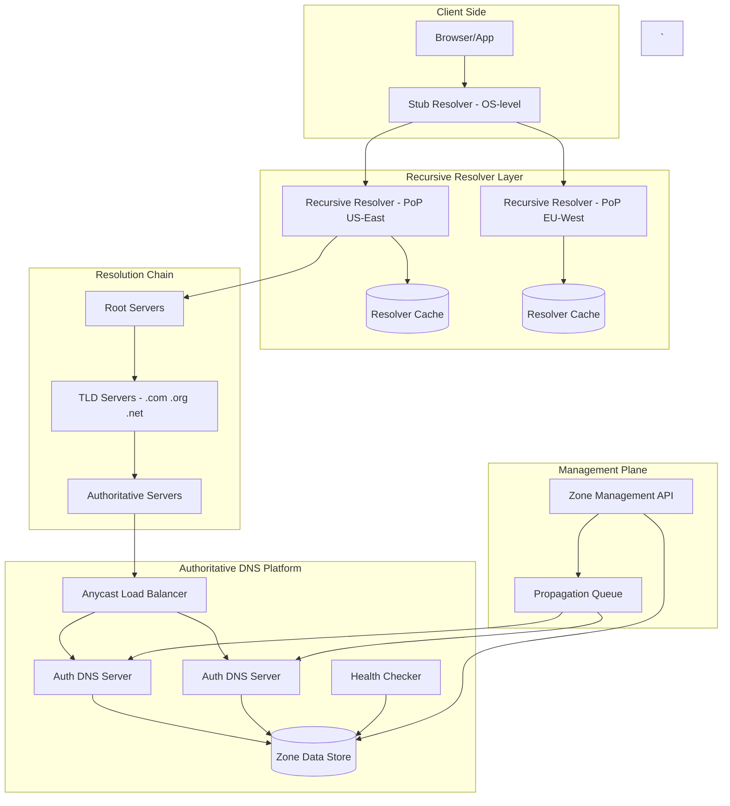
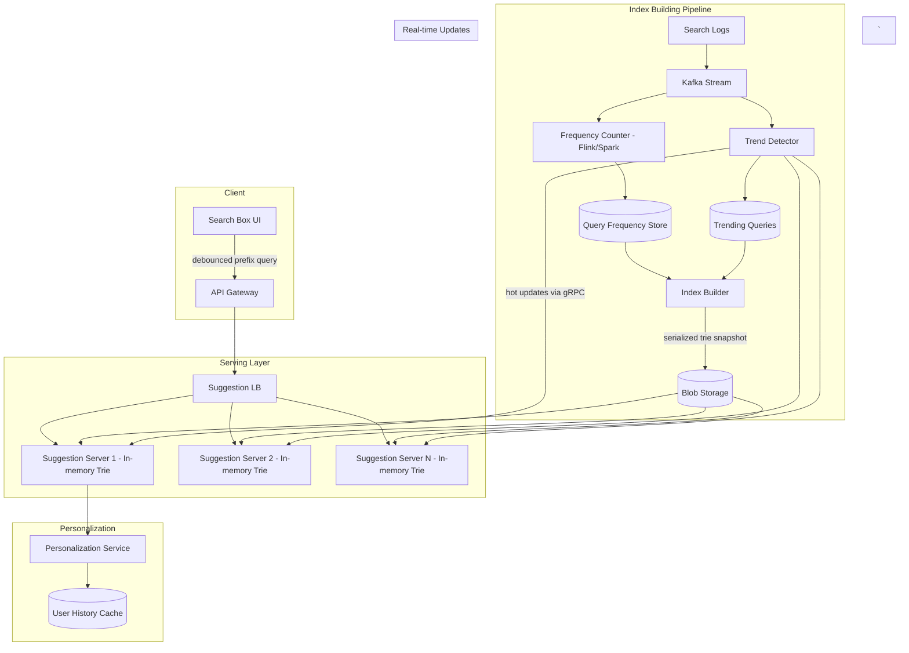
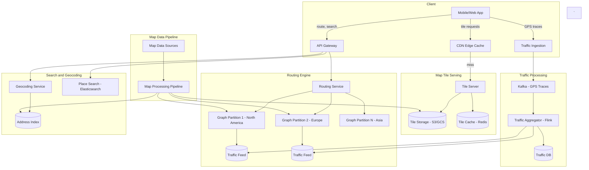
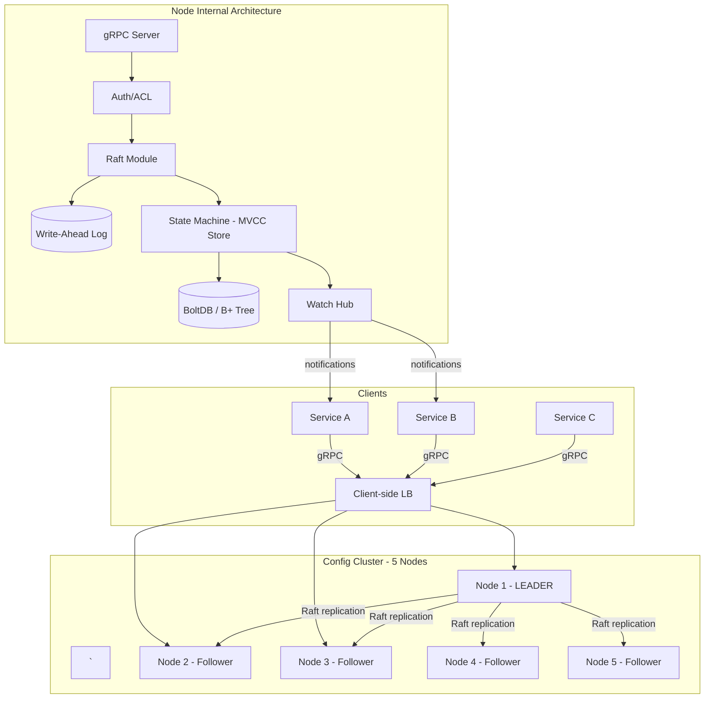
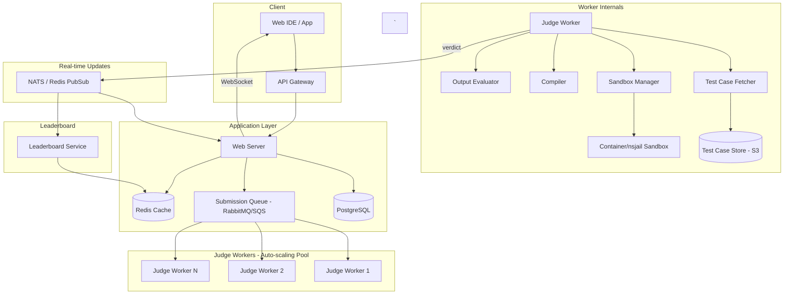
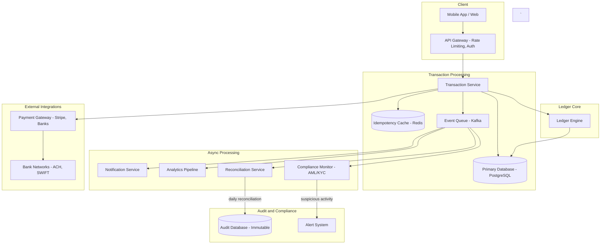
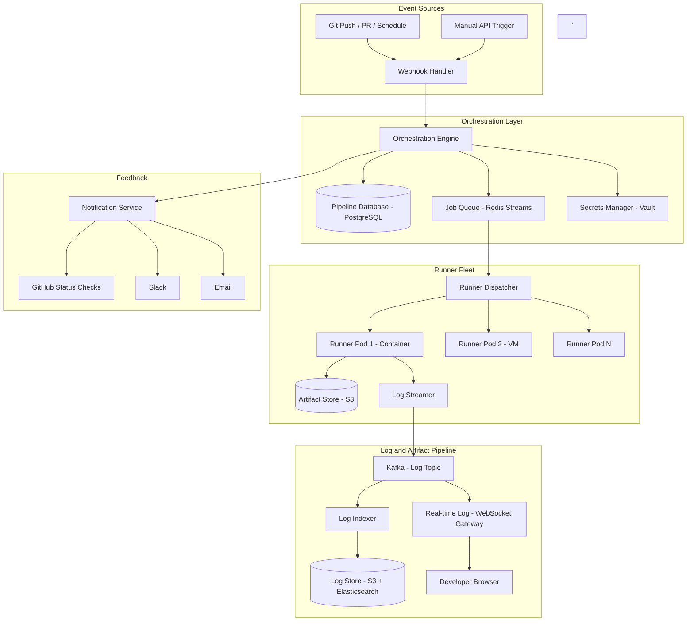

# Chapter 6: Observability, Location Services & Advanced Systems
`
> The invisible backbone — monitoring, discovering, navigating, and orchestrating the systems that run the world.
`
This chapter tackles systems that operate largely behind the scenes yet are mission-critical: the monitoring platforms that keep services healthy, the DNS infrastructure that maps names to addresses, the autocomplete engines that anticipate our intent, the mapping services that navigate us through the physical world, distributed configuration stores that coordinate clusters, online judges that evaluate code in milliseconds, digital wallets that move money safely, and CI/CD pipelines that ship software at scale.
`
---
## 1. Metrics Monitoring & Alerting System
`
### Problem Statement
`
Modern distributed systems generate enormous volumes of telemetry — CPU utilization, request latencies, error rates, queue depths, and thousands of custom business metrics. Without a centralized system to collect, store, query, and alert on these metrics, engineering teams are flying blind. Outages go undetected, capacity planning is guesswork, and debugging production issues becomes an archaeological expedition.
`
Systems like Datadog, Prometheus + Grafana, and New Relic have become indispensable. They ingest millions of data points per second from thousands of hosts, store them efficiently in time-series databases, enable flexible ad-hoc queries with sub-second latency, and trigger alerts when anomalies or threshold breaches occur. The challenge is building a system that handles this firehose of data while keeping query performance snappy and alert evaluation reliable.
`
A well-designed monitoring system must also support multi-tenancy (different teams see different dashboards), flexible aggregation (roll up per-host metrics to per-service or per-region), and long-term retention with automatic downsampling so that storage costs remain manageable even as the fleet grows.
`
### Use Cases
`
- Infrastructure monitoring: CPU, memory, disk, network across thousands of hosts
- Application performance monitoring (APM): request latency percentiles, error rates, throughput
- Custom business metrics: orders per minute, revenue per hour, active users
- Alerting on threshold breaches (e.g., p99 latency > 500ms for 5 minutes)
- Anomaly detection using historical baselines
- Dashboard visualization with real-time and historical views
- Capacity planning and trend analysis over weeks/months
- SLA/SLO compliance tracking and reporting
`
### Functional Requirements
`
- FR1: Agents on each host collect and push metrics at configurable intervals (default 10s)
- FR2: Support for multiple metric types: counter, gauge, histogram, summary
- FR3: Metric ingestion via push (agent-based) and pull (scrape) models
- FR4: Flexible query language supporting aggregation, filtering, grouping, and math operations
- FR5: Alert rules with configurable thresholds, windows, and notification channels (email, Slack, PagerDuty)
- FR6: Dashboard creation with drag-and-drop widgets, templating, and sharing
- FR7: Tag-based metric organization (host, service, region, environment)
- FR8: Automatic downsampling of old data (1s -> 1m -> 1h granularity)
`
### Non-Functional Requirements
`
- NFR1: Ingest at least 10 million data points per second across all tenants
- NFR2: Query latency p99 < 500ms for queries spanning up to 1 hour of data
- NFR3: Query latency p99 < 5s for queries spanning up to 30 days of data
- NFR4: Alert evaluation latency < 30 seconds from metric ingestion to alert firing
- NFR5: 99.95% availability for the ingestion pipeline (no data loss during brief outages)
- NFR6: 99.9% availability for the query and dashboard service
- NFR7: Data retention: raw data for 15 days, 1-minute rollups for 6 months, 1-hour rollups for 2 years
- NFR8: Horizontal scalability — adding nodes should linearly increase throughput
`
### Capacity Estimation
`
**Assumptions:**
- 100,000 hosts reporting metrics
- 500 unique metrics per host
- Collection interval: 10 seconds
- Average data point size: 32 bytes (8-byte timestamp + 8-byte value + 16-byte metric ID)
`
**Ingestion rate:**
- Total unique time series: 100,000 x 500 = 50 million time series
- Data points per second: 50,000,000 / 10 = 5 million data points/sec
- Bytes per second: 5,000,000 x 32 = 160 MB/s = ~13.8 TB/day
`
**Storage (with compression):**
- Time-series databases achieve ~1.5 bytes/point with compression (e.g., Gorilla encoding)
- Raw data (15 days): 5M pts/s x 86,400 s/day x 15 days x 1.5 bytes = ~9.7 TB
- 1-minute rollups (6 months): 50M series x 6 x 30 x 24 x 60 / 6 x 1.5 bytes = ~3.2 TB
- 1-hour rollups (2 years): 50M series x 2 x 365 x 24 / 360 x 1.5 bytes = ~0.36 TB
- **Total active storage: ~13.3 TB**
`
**Query throughput:**
- 5,000 dashboard users, each dashboard refreshes every 30s with 10 queries
- Peak QPS: 5,000 x 10 / 30 = ~1,667 queries/sec
`
### API Design
`
`http
# Ingest metrics (push model)
POST /api/v1/metrics/ingest
Content-Type: application/json
{
  "metrics": [
    {
      "name": "cpu.usage",
      "tags": {"host": "web-01", "region": "us-east-1", "service": "api"},
      "type": "gauge",
      "value": 72.5,
      "timestamp": 1700000000
    }
  ]
}
`
# Query metrics with aggregation
GET /api/v1/metrics/query?metric=cpu.usage&tags=service:api&from=1700000000&to=1700003600&step=60s&agg=avg&group_by=host
`
# Range query with expression
POST /api/v1/metrics/query_range
{
  "expr": "rate(http_requests_total{service='api'}[5m])",
  "start": "2024-01-01T00:00:00Z",
  "end": "2024-01-01T01:00:00Z",
  "step": "60s"
}
`
# Create alert rule
POST /api/v1/alerts/rules
{
  "name": "High API Latency",
  "expr": "avg(http_request_duration_seconds{service='api'}) > 0.5",
  "for": "5m",
  "severity": "critical",
  "annotations": {"summary": "API latency above 500ms"},
  "notify": ["slack:#oncall", "pagerduty:api-team"]
}
`
# List active alerts
GET /api/v1/alerts?state=firing&severity=critical
`
# WebSocket for real-time metric streaming
WS /api/v1/metrics/stream?metric=cpu.usage&tags=host:web-01
`
`
### Data Model
`
`sql
-- Time-series metadata (stored in relational DB or indexed store)
CREATE TABLE metric_metadata (
    metric_id       BIGINT PRIMARY KEY,
    metric_name     VARCHAR(255) NOT NULL,
    tags            JSONB NOT NULL,
    type            ENUM('counter', 'gauge', 'histogram', 'summary'),
    created_at      TIMESTAMP DEFAULT NOW(),
    last_seen_at    TIMESTAMP,
    UNIQUE(metric_name, tags)
);
CREATE INDEX idx_metric_name ON metric_metadata(metric_name);
CREATE INDEX idx_tags_gin ON metric_metadata USING GIN(tags);
`
-- Time-series data (stored in TSDB like TimescaleDB, InfluxDB, or custom)
-- Partitioned by time (daily chunks) and metric_id hash
CREATE TABLE metric_data (
    metric_id       BIGINT NOT NULL,
    timestamp       TIMESTAMP NOT NULL,
    value           DOUBLE PRECISION NOT NULL
) PARTITION BY RANGE (timestamp);
`
-- Downsampled rollup tables
CREATE TABLE metric_rollup_1m (
    metric_id   BIGINT NOT NULL,
    bucket      TIMESTAMP NOT NULL,
    min_val     DOUBLE PRECISION,
    max_val     DOUBLE PRECISION,
    avg_val     DOUBLE PRECISION,
    sum_val     DOUBLE PRECISION,
    count       BIGINT,
    PRIMARY KEY (metric_id, bucket)
);
`
CREATE TABLE metric_rollup_1h (
    metric_id   BIGINT NOT NULL,
    bucket      TIMESTAMP NOT NULL,
    min_val     DOUBLE PRECISION,
    max_val     DOUBLE PRECISION,
    avg_val     DOUBLE PRECISION,
    sum_val     DOUBLE PRECISION,
    count       BIGINT,
    PRIMARY KEY (metric_id, bucket)
);
`
-- Alert rules and state
CREATE TABLE alert_rules (
    rule_id         UUID PRIMARY KEY,
    name            VARCHAR(255) NOT NULL,
    expression      TEXT NOT NULL,
    for_duration    INTERVAL NOT NULL DEFAULT '5 minutes',
    severity        VARCHAR(50) NOT NULL,
    annotations     JSONB,
    notify_channels TEXT[] NOT NULL,
    enabled         BOOLEAN DEFAULT TRUE,
    created_by      VARCHAR(255),
    created_at      TIMESTAMP DEFAULT NOW()
);
`
CREATE TABLE alert_instances (
    instance_id     UUID PRIMARY KEY,
    rule_id         UUID REFERENCES alert_rules(rule_id),
    state           ENUM('pending', 'firing', 'resolved'),
    labels          JSONB NOT NULL,
    started_at      TIMESTAMP NOT NULL,
    resolved_at     TIMESTAMP,
    last_eval_at    TIMESTAMP NOT NULL,
    annotations     JSONB
);
CREATE INDEX idx_alert_state ON alert_instances(state, rule_id);
`
`
### High-Level Design
`
`mermaid
graph TB
    subgraph Hosts
        A1[Agent] --> |push| LB
        A2[Agent] --> |push| LB
        A3[Agent] --> |push| LB
    end
`
    subgraph Ingestion Layer
        LB[Load Balancer] --> GW1[Ingestion Gateway]
        LB --> GW2[Ingestion Gateway]
        GW1 --> KF[Kafka - Metrics Topic]
        GW2 --> KF
    end
`
    subgraph Processing Layer
        KF --> SW1[Stream Worker]
        KF --> SW2[Stream Worker]
        SW1 --> TSDB[(Time-Series DB)]
        SW2 --> TSDB
        SW1 --> RM[Rollup Manager]
        SW2 --> RM
        RM --> RDB[(Rollup Store)]
    end
`
    subgraph Query Layer
        QE[Query Engine] --> TSDB
        QE --> RDB
        QE --> Cache[(Query Cache)]
    end
`
    subgraph Alert Layer
        AE[Alert Evaluator] --> TSDB
        AE --> AR[(Alert Rule Store)]
        AE --> NM[Notification Manager]
        NM --> Slack[Slack]
        NM --> PD[PagerDuty]
        NM --> Email[Email]
    end
`
    subgraph Presentation
        UI[Dashboard UI] --> QE
        UI --> AE
    end
`
`
**Component Breakdown:**
`
- **Agents**: Lightweight daemons on each host collecting OS and application metrics. Support both push (StatsD-style UDP/TCP) and pull (Prometheus-compatible /metrics endpoint) models.
- **Ingestion Gateway**: Stateless HTTP/gRPC servers that validate, enrich (add default tags), and batch metrics before writing to Kafka. Rate limiting and back-pressure applied here.
- **Kafka**: Durable message bus that decouples ingestion from storage. Partitioned by metric_id hash for ordering guarantees per time series. Provides replay capability during TSDB outages.
- **Stream Workers**: Consume from Kafka, perform deduplication, and write to the time-series database. Also compute real-time aggregations for alerting.
- **Time-Series DB**: Optimized columnar store (e.g., custom engine inspired by Gorilla/InfluxDB). Data partitioned by time (daily chunks) with metric_id-based sharding.
- **Rollup Manager**: Background process that reads raw data and computes downsampled aggregates (1m, 1h) for older data. Drops raw partitions after TTL.
- **Query Engine**: Parses the query expression, fans out to relevant TSDB partitions, merges results, and applies final aggregation. Uses a query cache for repeated dashboard queries.
- **Alert Evaluator**: Periodically evaluates all active alert rules against current metric data. Manages alert state machine (pending -> firing -> resolved). Deduplicates notifications.
- **Notification Manager**: Dispatches alerts to configured channels with retry logic, rate limiting, and escalation policies.
`
### Deep Dive
`
#### Time-Series Storage & Compression
`
The core challenge is storing billions of data points efficiently. We use a technique inspired by Facebook's Gorilla paper:
`
**Delta-of-delta encoding for timestamps:** Sequential timestamps in a time series are highly regular (e.g., every 10s). Store the first timestamp fully, then store delta-of-deltas using variable-length encoding. Most deltas-of-deltas are zero (1 bit each).
`
**XOR encoding for values:** Consecutive values in a time series are often similar. XOR consecutive values — the result has many leading and trailing zeros. Store only the meaningful bits with a prefix code. Achieves ~1.37 bytes per data point vs. 16 bytes uncompressed.
`
**Block-based storage:** Data is organized into 2-hour blocks. Each block is immutable once sealed, enabling efficient compression and simple garbage collection. An in-memory head block handles recent writes.
`
**Downsampling pipeline:**
1. Raw data (10s granularity) retained for 15 days
2. A background job computes min/max/avg/sum/count per minute, stored in rollup_1m
3. After 6 months, 1m data is further rolled up to 1h
4. The query engine automatically selects the appropriate resolution based on the query time range
`
#### Anomaly Detection for Alerting
`
Beyond static thresholds, we support anomaly detection:
`
- **Exponential Moving Average (EMA)**: Computes a smoothed baseline. Alerts fire when the current value deviates by more than N standard deviations from the EMA.
- **Seasonal decomposition**: For metrics with daily/weekly patterns (e.g., traffic), we decompose into trend + seasonal + residual components. Alerts on the residual exceeding bounds.
- **Holt-Winters triple exponential smoothing**: Handles level, trend, and seasonality. Predicts expected range for the next evaluation window.
`
Alert state machine: inactive -> pending (condition true) -> firing (condition true for 'for' duration) -> resolved (condition false). This prevents flapping on noisy metrics.
`
### Bottlenecks & Mitigations
`
| Bottleneck | Mitigation |
|---|---|
| Write amplification during high cardinality | Tag cardinality limits per metric; reject unbounded tag values (e.g., request IDs) |
| Kafka consumer lag during ingestion spikes | Auto-scale consumer group; increase partitions; use batch writes to TSDB |
| Query fan-out on long time ranges | Automatic resolution selection (use rollups for ranges > 1 day); query result caching |
| Alert evaluation falling behind | Partition alert rules across evaluator shards; prioritize critical severity rules |
| Hot time-series (one metric gets extreme traffic) | Shard by metric_id; spread hot series across multiple TSDB nodes |
| Memory pressure from in-memory head blocks | Configurable head block size with early flush; off-heap memory mapping |
| Noisy alerting (alert storms) | Alert grouping, inhibition rules, and rate-limited notification dispatch |
`
### Key Takeaways
`
- Time-series data has unique access patterns (write-heavy, append-only, time-ordered reads) that demand specialized storage engines
- Gorilla-style compression achieves 10x reduction in storage; downsampling provides another 60x for historical data
- Decoupling ingestion from storage via Kafka ensures durability and allows independent scaling
- Alert evaluation is a real-time stream processing problem — treat it as such with dedicated compute
- Cardinality explosion is the #1 operational challenge; enforce limits at ingestion time
`
---
`
## 2. DNS System
`
### Problem Statement
`
The Domain Name System (DNS) is often called the phonebook of the internet. Every time a user types a URL, sends an email, or an application calls an API, a DNS lookup translates a human-readable domain name (e.g., www.example.com) into an IP address (e.g., 93.184.216.34). DNS handles over 1 trillion queries per day globally and must do so with extreme reliability — if DNS goes down, effectively the entire internet goes down for affected users.
`
Designing a DNS system involves building a hierarchical, distributed database with aggressive caching at every layer. The system must handle recursive resolution (walking the hierarchy from root to authoritative servers), support zone management for domain owners, implement caching with TTL-based invalidation, and leverage anycast networking to route queries to the nearest server. DNS must also defend against amplification attacks, cache poisoning, and handle DNSSEC validation.
`
Beyond basic resolution, modern DNS systems serve as a load balancing and traffic management layer — directing users to the nearest data center via GeoDNS, implementing failover by adjusting DNS records, and supporting service discovery in microservice architectures through SRV records.
`
### Use Cases
`
- Resolving domain names to IP addresses for web browsing
- Email routing via MX record lookups
- Load balancing across multiple data centers via weighted/geo-based DNS
- Service discovery in microservice architectures (SRV records, Consul DNS interface)
- CDN edge selection — directing users to the nearest PoP
- Failover and disaster recovery by updating DNS records
- Domain ownership verification via TXT records (e.g., for SSL certificate issuance)
- Reverse DNS lookups for email spam prevention and audit logging
`
### Functional Requirements
`
- FR1: Support all standard record types: A, AAAA, CNAME, MX, TXT, SRV, NS, SOA, PTR
- FR2: Recursive resolution with iterative fallback
- FR3: Zone management: create, update, delete DNS records with ACID semantics
- FR4: TTL-based caching at resolver level
- FR5: DNSSEC signing and validation for zone integrity
- FR6: Support for weighted, latency-based, and geo-based routing policies
- FR7: Health checking of endpoints to remove unhealthy IPs from responses
- FR8: Bulk zone import/export in standard zone file format
`
### Non-Functional Requirements
`
- NFR1: Resolution latency < 5ms for cached queries, < 100ms for recursive
- NFR2: 100%% availability target (DNS is critical infrastructure; use anycast + multi-region)
- NFR3: Handle 1 million queries per second per resolver cluster
- NFR4: Propagation of zone changes globally within 60 seconds
- NFR5: Withstand DDoS attacks up to 1 Tbps via anycast traffic distribution
- NFR6: Cache hit ratio > 90%% for recursive resolvers
- NFR7: DNSSEC validation adds < 10ms to resolution time
- NFR8: Consistent reads for zone management API; eventual consistency acceptable for DNS propagation
`
### Capacity Estimation
`
**For a managed DNS provider (like Route 53 or Cloudflare DNS):**
`
- 10 million hosted zones, average 50 records per zone = 500 million records
- Average record size: ~200 bytes -> total zone data: ~100 GB (fits in memory)
- Query volume: 1 million QPS globally
- Average UDP query size: 40 bytes; response: 200 bytes
- Bandwidth: 1M x 200 bytes = 200 MB/s = ~1.6 Gbps outbound
- With 20 anycast PoPs: ~50K QPS and 80 Mbps per PoP (easily handled)
- Storage for query logs: 1M QPS x 200 bytes x 86,400 = ~17 TB/day (sample at 1%% for analysis)
`
### API Design
`
```http
# Zone Management
POST /api/v1/zones
{
  "name": "example.com",
  "description": "Production zone"
}
`
# Create/Update DNS records
POST /api/v1/zones/{zone_id}/records
{
  "name": "www",
  "type": "A",
  "ttl": 300,
  "values": ["93.184.216.34", "93.184.216.35"],
  "routing_policy": {
    "type": "weighted",
    "weights": [70, 30]
  },
  "health_check_id": "hc-abc123"
}
`
# List records in a zone
GET /api/v1/zones/{zone_id}/records?type=A&name=www
`
# Update record set
PUT /api/v1/zones/{zone_id}/records/{record_id}
`
# Delete record
DELETE /api/v1/zones/{zone_id}/records/{record_id}
`
# Batch change (atomic)
POST /api/v1/zones/{zone_id}/changes
{
  "changes": [
    {"action": "UPSERT", "record": {"name": "api", "type": "A", "ttl": 60, "values": ["10.0.1.1"]}},
    {"action": "DELETE", "record": {"name": "old-api", "type": "CNAME"}}
  ]
}
`
# Health check management
POST /api/v1/health-checks
{
  "protocol": "HTTPS",
  "endpoint": "https://api.example.com/health",
  "interval_seconds": 30,
  "failure_threshold": 3
}
`
# DNS query (for testing/debugging via API)
GET /api/v1/resolve?name=www.example.com&type=A
```
`
### Data Model
`
```sql
CREATE TABLE zones (
    zone_id         UUID PRIMARY KEY,
    name            VARCHAR(255) UNIQUE NOT NULL,
    owner_id        UUID NOT NULL,
    description     TEXT,
    dnssec_enabled  BOOLEAN DEFAULT FALSE,
    serial          BIGINT DEFAULT 1,
    created_at      TIMESTAMP DEFAULT NOW(),
    updated_at      TIMESTAMP DEFAULT NOW()
);
CREATE INDEX idx_zone_name ON zones(name);
`
CREATE TABLE records (
    record_id       UUID PRIMARY KEY,
    zone_id         UUID REFERENCES zones(zone_id),
    name            VARCHAR(255) NOT NULL,
    fqdn            VARCHAR(512) NOT NULL,
    type            VARCHAR(10) NOT NULL,
    ttl             INT NOT NULL DEFAULT 300,
    rdata           JSONB NOT NULL,
    routing_policy  JSONB,
    health_check_id UUID,
    priority        INT,
    version         BIGINT DEFAULT 1,
    created_at      TIMESTAMP DEFAULT NOW(),
    updated_at      TIMESTAMP DEFAULT NOW()
);
CREATE INDEX idx_fqdn_type ON records(fqdn, type);
CREATE INDEX idx_zone_records ON records(zone_id);
`
CREATE TABLE health_checks (
    check_id        UUID PRIMARY KEY,
    protocol        VARCHAR(10) NOT NULL,
    endpoint        VARCHAR(512) NOT NULL,
    interval_sec    INT DEFAULT 30,
    timeout_sec     INT DEFAULT 10,
    failure_threshold INT DEFAULT 3,
    status          VARCHAR(20) DEFAULT 'healthy',
    last_check_at   TIMESTAMP,
    created_at      TIMESTAMP DEFAULT NOW()
);
`
CREATE TABLE zone_changes (
    change_id       UUID PRIMARY KEY,
    zone_id         UUID REFERENCES zones(zone_id),
    changes         JSONB NOT NULL,
    status          VARCHAR(20) DEFAULT 'pending',
    applied_at      TIMESTAMP,
    created_at      TIMESTAMP DEFAULT NOW()
);
```
`
### High-Level Design
`

`
**Component Breakdown:**
`
- **Stub Resolver**: OS-level resolver on the client machine. Sends recursive queries to the configured recursive resolver.
- **Recursive Resolver**: Deployed at anycast PoPs worldwide. Caches responses per TTL. Walks the DNS hierarchy for cache misses. Implements DNSSEC validation.
- **Anycast Network**: All resolver and authoritative server IPs are announced via BGP anycast. Clients are automatically routed to the nearest PoP. Provides DDoS resilience.
- **Authoritative DNS Servers**: Serve zone data for hosted domains. Stateless, read zone data from a distributed store. Deployed in every PoP.
- **Zone Data Store**: Distributed, replicated database holding all zone records.
- **Health Checker**: Continuously probes endpoints. Unhealthy IPs are omitted from DNS responses.
- **Management API**: RESTful API for zone and record management. Validates changes, increments SOA serial, and enqueues propagation.
`
### Deep Dive
`
#### Recursive Resolution Process
`
1. Client asks recursive resolver for `www.example.com A`
2. Resolver checks cache — **cache hit**: return immediately
3. **Cache miss**: Query a root server -> returns NS for `.com` TLD
4. Query `.com` TLD server -> returns NS for `example.com`
5. Query `example.com` authoritative server -> returns A record `93.184.216.34`
6. Resolver caches each response per its TTL and returns to client
`
Optimization: **Prefetching** — when a cached entry is within 10%% of its TTL expiry and gets a query, the resolver proactively refreshes it in the background.
`
#### Anycast Routing
`
All DNS servers advertise the same IP address (e.g., 1.1.1.1) from multiple geographic locations. BGP routing ensures each client packet reaches the nearest announcing node. Benefits:
- **Latency**: Clients automatically reach the nearest PoP
- **DDoS resilience**: Attack traffic is distributed across all PoPs
- **Failover**: If a PoP goes down, BGP reconverges within seconds
`
#### DNSSEC
`
DNS responses are signed with public-key cryptography to prevent cache poisoning:
- Zone owner generates a Zone Signing Key (ZSK) and signs all records (RRSIG records)
- A Key Signing Key (KSK) signs the ZSK; the KSK hash is registered with the parent zone as a DS record
- Resolvers validate the chain of trust from root to the queried zone
- Adds ~2-3 additional queries and ~5-10ms to resolution but prevents spoofing attacks
`
#### GeoDNS and Traffic Management
`
For routing policies:
- **Weighted**: Distribute responses according to configured weights (e.g., 70/30 split)
- **Geolocation**: Map client IP to geography using a GeoIP database; return region-specific records
- **Latency-based**: Measure latency from each PoP to each endpoint; return the lowest-latency endpoint
- **Failover**: Primary/secondary configuration; health checks determine which is active
`
### Bottlenecks & Mitigations
`
| Bottleneck | Mitigation |
|---|---|
| DDoS amplification attacks | Response Rate Limiting (RRL); truncate large UDP responses forcing TCP retry |
| Cache poisoning via forged responses | DNSSEC validation; randomize source port and query ID; DNS over HTTPS/TLS |
| Zone propagation delay across PoPs | Event-driven push with optimistic local cache invalidation |
| Hot zones causing uneven load | Shard zone data across authoritative servers; over-provision popular zones |
| Resolver memory for large cache | LRU eviction with TTL awareness; popular entries get priority retention |
| Thundering herd on single domain | Request coalescing — deduplicate in-flight queries for the same name |
`
### Key Takeaways
`
- DNS is a hierarchical distributed database with caching at every layer
- Anycast is the key enabler for both performance and DDoS resilience
- TTL-based caching is simple but effective; cache hit ratios > 90%% keep authoritative infrastructure manageable
- DNSSEC adds security but increases complexity; deployment requires careful key management
- DNS is increasingly used as a load balancing / traffic management layer, not just name resolution
`
---
## 3. Search Autocomplete / Typeahead
`
### Problem Statement
`
When a user starts typing in a search box, the system should instantly suggest completions — "how to" might suggest "how to tie a tie," "how to cook rice," "how to lose weight." This typeahead feature dramatically improves user experience by reducing typing effort, correcting misspellings, and guiding users toward popular queries. Google processes billions of such prefix queries daily with sub-50ms latency.
`
The challenge lies in building a system that can match prefixes against billions of possible completions, rank them by relevance (popularity, recency, personalization), and return the top suggestions in under 100 milliseconds. The ranking must account for trending queries (a celebrity name spikes during news events), personal history (a developer sees programming-related suggestions), and geographic relevance (weather queries are location-specific).
`
Furthermore, the system must update its suggestion corpus in near-real-time — when a new trending topic emerges, it should appear in autocomplete within minutes, not hours. The system must also handle offensive content filtering, ensuring harmful or inappropriate suggestions are suppressed.
`
### Use Cases
`
- Search engine query suggestions (Google, Bing)
- E-commerce product search autocomplete (Amazon, Shopify)
- Code editor autocomplete (IDE symbol suggestions)
- Address autocomplete in forms (Google Places)
- Email recipient autocomplete
- Social media hashtag and mention suggestions
- Music/video search suggestions (Spotify, YouTube)
- Command palette autocomplete in applications
`
### Functional Requirements
`
- FR1: Given a prefix string, return top-K (typically K=10) completions ranked by relevance
- FR2: Suggestions must update within 5 minutes of a query becoming trending
- FR3: Support personalized suggestions based on user search history
- FR4: Support locale-specific suggestions (language, region)
- FR5: Filter offensive, harmful, or legally restricted suggestions
- FR6: Handle typos with fuzzy matching (Levenshtein distance <= 2)
- FR7: Support multi-word prefix matching ("new york p" -> "new york pizza")
- FR8: Provide category-tagged suggestions (e.g., "apple" -> [company, fruit, music])
`
### Non-Functional Requirements
`
- NFR1: End-to-end latency p99 < 100ms (users perceive >200ms as lag)
- NFR2: Handle 500,000 prefix queries per second at peak
- NFR3: Corpus size: up to 5 billion unique queries
- NFR4: Availability 99.99%% — autocomplete is a critical UX feature
- NFR5: Suggestion freshness: trending queries appear within 5 minutes
- NFR6: Graceful degradation: if personalization fails, fall back to global suggestions
- NFR7: Must support incremental updates without rebuilding the entire index
- NFR8: Storage efficient — index should fit in memory for serving speed
`
### Capacity Estimation
`
**Corpus:**
- 5 billion unique query strings
- Average query length: 25 characters
- Raw corpus size: 5B x 25 bytes = 125 GB
`
**Trie index (in-memory):**
- Trie with shared prefixes compresses significantly
- With prefix compression: ~30 GB for the trie structure
- Top-K ranking data per node: ~20 GB additional
- **Total serving index: ~50 GB per replica (fits in a large server RAM)**
`
**Query volume:**
- 500K QPS peak
- With 20 serving replicas: 25K QPS per replica (easily handled)
- Average response size: 10 suggestions x 50 bytes = 500 bytes
- Bandwidth: 500K x 500 bytes = 250 MB/s
`
**Index updates:**
- Trending topic detection pipeline processes 100K QPS of search logs
- Trie updates: ~1000 insert/update operations per second
`
### API Design
`
```http
# Get autocomplete suggestions
GET /api/v1/suggest?q=how+to&limit=10&locale=en-US&lat=37.7749&lng=-122.4194
# Response:
{
  "query": "how to",
  "suggestions": [
    {"text": "how to tie a tie", "score": 0.95, "category": "lifestyle"},
    {"text": "how to screenshot on mac", "score": 0.91, "category": "tech"},
    {"text": "how to cook rice", "score": 0.88, "category": "cooking"},
    {"text": "how to lose weight", "score": 0.85, "category": "health"}
  ],
  "personalized": false
}
`
# Personalized suggestions (authenticated)
GET /api/v1/suggest?q=how+to&limit=10&locale=en-US
Authorization: Bearer <token>
`
# Report query (for learning from user selections)
POST /api/v1/suggest/feedback
{
  "prefix": "how to",
  "selected": "how to tie a tie",
  "position": 0,
  "session_id": "sess_abc123"
}
`
# Admin: Add/remove blocked suggestions
POST /api/v1/suggest/admin/blocklist
{
  "action": "add",
  "patterns": ["offensive phrase*", "harmful query"]
}
`
# Admin: Boost a suggestion
POST /api/v1/suggest/admin/boost
{
  "query": "election results 2024",
  "boost_factor": 2.0,
  "expires_at": "2024-11-10T00:00:00Z"
}
```
`
### Data Model
`
```sql
-- Query frequency tracking (used for offline index building)
CREATE TABLE query_frequencies (
    query_hash      BIGINT PRIMARY KEY,
    query_text      VARCHAR(500) NOT NULL,
    frequency       BIGINT NOT NULL DEFAULT 0,
    locale          VARCHAR(10) NOT NULL,
    last_seen_at    TIMESTAMP,
    category        VARCHAR(50),
    is_blocked      BOOLEAN DEFAULT FALSE,
    updated_at      TIMESTAMP DEFAULT NOW()
);
CREATE INDEX idx_query_prefix ON query_frequencies(query_text varchar_pattern_ops);
CREATE INDEX idx_locale_freq ON query_frequencies(locale, frequency DESC);
`
-- Trending queries (sliding window)
CREATE TABLE trending_queries (
    query_hash      BIGINT PRIMARY KEY,
    query_text      VARCHAR(500) NOT NULL,
    current_rate    DOUBLE PRECISION,
    baseline_rate   DOUBLE PRECISION,
    trend_score     DOUBLE PRECISION,
    detected_at     TIMESTAMP DEFAULT NOW()
);
`
-- User search history (for personalization)
CREATE TABLE user_search_history (
    user_id         UUID NOT NULL,
    query_text      VARCHAR(500) NOT NULL,
    searched_at     TIMESTAMP NOT NULL,
    click_position  INT,
    PRIMARY KEY (user_id, searched_at)
) PARTITION BY RANGE (searched_at);
`
-- Blocklist
CREATE TABLE suggestion_blocklist (
    pattern_id      UUID PRIMARY KEY,
    pattern         VARCHAR(500) NOT NULL,
    reason          VARCHAR(255),
    created_by      VARCHAR(255),
    created_at      TIMESTAMP DEFAULT NOW()
);
```
`
**In-Memory Trie Structure (serving layer):**
`
```
Trie Node:
{
  children: Map<char, TrieNode>,
  is_end_of_word: bool,
  top_k: [(query_text, score)]  // precomputed top-K at each prefix node
}
```
`
### High-Level Design
`

`
**Component Breakdown:**
`
- **Search Box UI**: Debounces keystrokes (fires request every 100-200ms), cancels in-flight requests when a new prefix arrives.
- **Suggestion Servers**: Each holds a full copy of the trie index in memory. Stateless and horizontally scalable. Lookup is O(L) where L is prefix length.
- **Personalization Service**: Maintains a per-user short-term history in Redis. Blends personal suggestions with global suggestions using a weighted scoring function.
- **Frequency Counter**: Stream processing job that maintains a sliding-window count of each query frequency.
- **Trend Detector**: Compares current query rates to historical baselines. Queries with rate > 3x baseline are flagged as trending. Pushes hot updates directly to serving nodes via gRPC.
- **Index Builder**: Periodic batch job (runs every 5-15 minutes) that builds a new trie with precomputed top-K at every node, serializes it, and pushes to blob storage.
`
### Deep Dive
`
#### Trie-Based Prefix Matching with Precomputed Top-K
`
A naive approach — traverse the trie to the prefix node, then DFS to find all completions and sort — is too slow for billion-entry corpora. Instead, we precompute:
`
At each trie node, maintain a **heap of top-K completions** (by score) that pass through that node. When a query arrives for prefix "how t":
1. Traverse trie: h -> o -> w -> (space) -> t (5 hops, O(L))
2. Read precomputed top_k list at node 't' — these are already sorted
3. Return immediately — no DFS needed
`
**Update cost**: When a query frequency changes, we update the top-K heaps along its path from leaf to root. Only K comparisons per node, and path length is bounded. Amortized O(L * K) per update.
`
**Memory optimization**: Instead of storing full query strings at every node, store references (offsets into a string pool). The string pool is memory-mapped from disk.
`
#### Scoring and Ranking
`
The suggestion score is a weighted combination:
```
score = w1 * log(global_frequency + 1)
      + w2 * recency_decay(last_seen)
      + w3 * trend_boost(current_rate / baseline_rate)
      + w4 * personalization_score(user, query)
      + w5 * geographic_relevance(user_location, query)
```
`
Typical weights: w1=0.4, w2=0.15, w3=0.2, w4=0.15, w5=0.1
`
#### Fuzzy Matching
`
For handling typos, we maintain a **BK-tree** (Burkhard-Keller tree) index alongside the trie. When the trie yields fewer than K results for a prefix, we query the BK-tree for strings within edit distance 2 of the prefix and merge results.
`
#### Offensive Content Filtering
`
A bloom filter of blocked phrase hashes sits in front of the suggestion response. Every suggestion is checked against the filter before returning. False positives are acceptable (suppress a valid suggestion) but false negatives are not.
`
### Bottlenecks & Mitigations
`
| Bottleneck | Mitigation |
|---|---|
| Trie index too large for single server RAM | Shard by first 2 characters of prefix (676 shards); each shard ~75MB |
| Stale suggestions (corpus lag) | Real-time hot-path for trending queries; batch rebuild every 15 min |
| Thundering herd on trending prefixes | Pre-warm caches; CDN edge caching for top 10K prefixes |
| Personalization service latency | Async fetch; return global results immediately, merge personal results if they arrive in time |
| Cross-language prefix matching | Separate tries per locale; transliteration index for multi-script languages |
| Suggestion poisoning (gaming the system) | Rate-limit per user/IP; anomaly detection on query frequency spikes |
`
### Key Takeaways
`
- Precomputing top-K at every trie node converts a potentially expensive fan-out into a constant-time lookup
- The system is naturally partitioned into a fast serving layer (read-only in-memory tries) and an async update pipeline
- Trending detection must be real-time to keep suggestions relevant during breaking events
- Client-side debouncing is critical — without it, query volume would be 5-10x higher
- Offensive content filtering is a must-have given the public-facing nature
`
---
## 4. Google Maps / Navigation System
`
### Problem Statement
`
A mapping and navigation system must render interactive maps of the entire world, compute optimal driving/walking/transit routes between any two points, provide real-time traffic conditions, estimate arrival times, and deliver turn-by-turn navigation instructions. Google Maps serves over 1 billion monthly active users and processes millions of routing requests per day.
`
The core technical challenges are: (1) storing and serving terabytes of geospatial data as interactive map tiles, (2) computing shortest paths on a road network graph with hundreds of millions of edges in real-time, (3) ingesting and incorporating live traffic data from millions of mobile devices, and (4) delivering smooth, responsive map interactions on bandwidth-constrained mobile devices.
`
The system touches nearly every area of computer science: graph algorithms for routing, computational geometry for map rendering, distributed systems for scale, machine learning for ETA prediction, and real-time stream processing for traffic aggregation.
`
### Use Cases
`
- Interactive map browsing with pan, zoom, and search
- Point-to-point routing with multiple transport modes (driving, walking, cycling, transit)
- Real-time traffic overlay showing congestion levels
- Turn-by-turn voice-guided navigation
- ETA estimation and route comparison
- Nearby place search (restaurants, gas stations, etc.)
- Offline map downloads for areas without connectivity
- Fleet management and logistics route optimization
`
### Functional Requirements
`
- FR1: Render map tiles at 20+ zoom levels covering the entire world
- FR2: Compute routes between any two points with driving, walking, cycling, and transit modes
- FR3: Display real-time traffic conditions on major roads
- FR4: Provide ETA estimates that account for current and predicted traffic
- FR5: Deliver turn-by-turn navigation instructions with lane guidance
- FR6: Support searching for places by name, category, or address with geocoding
- FR7: Reroute in real-time when the user deviates or traffic changes
- FR8: Provide offline map support for selected regions
`
### Non-Functional Requirements
`
- NFR1: Map tile load time < 200ms on 4G connections
- NFR2: Route computation latency < 500ms for routes up to 500km
- NFR3: Route computation latency < 2s for cross-country routes (>1000km)
- NFR4: Traffic data freshness: updates reflected within 2 minutes
- NFR5: 99.99%% availability for routing API
- NFR6: Support 100,000 concurrent navigation sessions per region
- NFR7: Map data updates (new roads, closures) propagated within 24 hours
- NFR8: ETA accuracy within 10%% of actual travel time for 90%% of routes
`
### Capacity Estimation
`
**Map tile storage:**
- 20 zoom levels; at zoom 18: 2^18 x 2^18 = ~68 billion tiles
- Not all tiles contain land/roads; effective tiles: ~20 billion
- Average vector tile size: 20 KB (compressed)
- Total tile storage: 20B x 20 KB = ~400 TB
- With CDN caching (top 5 zoom levels = 90%% of requests): origin serves < 10%% of traffic
`
**Road network graph:**
- ~500 million road segments (edges) globally
- ~300 million intersections (nodes)
- Edge data: 64 bytes (node IDs, distance, travel time, road class, one-way flag)
- Graph size: 500M x 64 bytes = ~32 GB (fits in memory on a large server)
`
**Routing QPS:**
- 10 million route requests per day = ~115 routes/sec average
- Peak: ~500 routes/sec
- With 10 routing servers per region, 6 regions: ~8 routes/sec per server
`
**Traffic data:**
- 50 million active devices reporting GPS traces
- Reports every 5 seconds: 10M GPS points/sec
- Point size: 32 bytes (lat, lng, speed, heading, timestamp)
- Ingest rate: 320 MB/s
`
### API Design
`
```http
# Get map tiles (vector)
GET /api/v1/tiles/{z}/{x}/{y}.mvt
# z=zoom level, x/y=tile coordinates
# Response: Protocol buffer encoded Mapbox Vector Tile
`
# Compute route
POST /api/v1/routes
{
  "origin": {"lat": 37.7749, "lng": -122.4194},
  "destination": {"lat": 34.0522, "lng": -118.2437},
  "mode": "driving",
  "departure_time": "2024-01-15T08:00:00-08:00",
  "alternatives": true,
  "avoid": ["tolls", "highways"]
}
# Response:
{
  "routes": [
    {
      "summary": "I-5 S",
      "distance_meters": 613000,
      "duration_seconds": 21600,
      "duration_in_traffic_seconds": 25200,
      "polyline": "encoded_polyline_string",
      "legs": [
        {
          "steps": [
            {
              "instruction": "Head south on Market St",
              "distance_meters": 500,
              "duration_seconds": 60,
              "maneuver": "turn-right",
              "polyline": "..."
            }
          ]
        }
      ]
    }
  ]
}
`
# Get traffic conditions for a bounding box
GET /api/v1/traffic?bbox=37.7,-122.5,37.8,-122.3&zoom=14
`
# Geocoding (address to coordinates)
GET /api/v1/geocode?address=1600+Amphitheatre+Parkway
`
# Reverse geocoding (coordinates to address)
GET /api/v1/reverse-geocode?lat=37.4220&lng=-122.0841
`
# Nearby places search
GET /api/v1/places/nearby?lat=37.7749&lng=-122.4194&radius=1000&type=restaurant&limit=20
`
# Real-time navigation session (WebSocket)
WS /api/v1/navigate/stream
# Client sends: GPS updates every second
# Server sends: updated ETA, reroute instructions, upcoming maneuvers
```
`
### Data Model
`
```sql
-- Road network graph (adjacency list representation)
CREATE TABLE nodes (
    node_id         BIGINT PRIMARY KEY,
    lat             DOUBLE PRECISION NOT NULL,
    lng             DOUBLE PRECISION NOT NULL,
    geohash         VARCHAR(12),
    elevation_m     REAL
);
CREATE INDEX idx_node_geohash ON nodes(geohash);
`
CREATE TABLE edges (
    edge_id         BIGINT PRIMARY KEY,
    from_node       BIGINT REFERENCES nodes(node_id),
    to_node         BIGINT REFERENCES nodes(node_id),
    distance_m      INT NOT NULL,
    base_travel_time_s INT NOT NULL,
    road_class      SMALLINT NOT NULL,
    speed_limit_kmh SMALLINT,
    is_one_way      BOOLEAN DEFAULT FALSE,
    toll            BOOLEAN DEFAULT FALSE,
    road_name       VARCHAR(255),
    geometry        GEOMETRY(LINESTRING, 4326)
);
CREATE INDEX idx_edge_from ON edges(from_node);
CREATE INDEX idx_edge_to ON edges(to_node);
`
-- Real-time traffic segments
CREATE TABLE traffic_segments (
    segment_id      BIGINT PRIMARY KEY,
    edge_id         BIGINT REFERENCES edges(edge_id),
    current_speed   REAL,
    free_flow_speed REAL,
    congestion      REAL,
    updated_at      TIMESTAMP NOT NULL
);
`
-- Places / Points of Interest
CREATE TABLE places (
    place_id        UUID PRIMARY KEY,
    name            VARCHAR(500) NOT NULL,
    category        VARCHAR(100),
    lat             DOUBLE PRECISION NOT NULL,
    lng             DOUBLE PRECISION NOT NULL,
    geohash         VARCHAR(12),
    address         TEXT,
    rating          REAL,
    review_count    INT DEFAULT 0,
    metadata        JSONB
);
CREATE INDEX idx_place_geohash ON places(geohash);
CREATE INDEX idx_place_name_trgm ON places USING GIN(name gin_trgm_ops);
```
`
### High-Level Design
`

`
**Component Breakdown:**
`
- **CDN**: Caches map tiles at edge locations worldwide. Map tiles are immutable for a given version — perfect for CDN caching.
- **Tile Server**: Renders vector tiles from processed map data. Vector tiles contain geometric primitives that the client renders with GPU acceleration.
- **Routing Service**: Accepts origin/destination, selects the appropriate graph partition(s), runs the routing algorithm, and assembles the response.
- **Graph Partitions**: Each region's road network graph is held in memory. Augmented with real-time traffic weights.
- **Traffic Aggregator**: Stream processor that ingests GPS traces, maps them to road segments (map matching), and computes average speeds per segment.
- **Geocoding Service**: Converts addresses to coordinates (and vice versa) using a specialized address index with fuzzy matching.
`
### Deep Dive
`
#### Graph Algorithms for Routing
`
**Dijkstra's algorithm** is correct but too slow for large graphs (explores millions of nodes for a long route).
`
**A* algorithm** adds a heuristic (straight-line distance to destination) to prioritize exploration. 2-5x faster than Dijkstra but still too slow for production.
`
**Contraction Hierarchies (CH)** — the production algorithm:
1. **Preprocessing**: Order nodes by "importance" (roughly, highway intersections > residential streets). Contract nodes bottom-up: for each node v, if the shortest path between any pair of v's neighbors goes through v, add a "shortcut" edge directly between those neighbors, then remove v.
2. **Result**: A hierarchy where the top level contains only major highway intersections connected by shortcut edges spanning hundreds of km.
3. **Query**: Run bidirectional Dijkstra — forward search from origin goes UP the hierarchy, backward search from destination goes UP the hierarchy, they meet at a high-level node. Query time: ~1ms for continental routes.
4. **Trade-off**: Preprocessing takes hours but the preprocessed graph supports sub-millisecond queries. Traffic updates require partial re-contraction (customizable CH).
`
**Traffic-aware routing**: Edge weights = base_travel_time * (free_flow_speed / current_speed). Traffic weights are updated every 1-2 minutes in the in-memory graph.
`
#### Map Tile Rendering
`
**Vector tiles** (Mapbox Vector Tile format):
- Map data is pre-processed into a quadtree of tiles at each zoom level
- Each tile contains geometry (road lines, building polygons, labels) in Protocol Buffer format
- Client-side rendering: the app uses GPU-accelerated rendering to draw tiles with customizable styles
- Advantages: small size (10-50 KB per tile), smooth zooming, client-side styling, offline support
- Tile generation pipeline: raw map data -> geometry simplification per zoom level -> tile cutting -> compression -> storage
`
#### ETA Prediction
`
Beyond simple distance/speed calculation, accurate ETAs use ML models:
- Features: route distance, road classes, time of day, day of week, historical traffic patterns, weather, events
- Model: gradient-boosted trees (XGBoost) trained on historical trip data
- Real-time adjustment: as the user drives, update ETA based on actual progress vs. predicted
- Segment-level predictions aggregated over the route, accounting for traffic signal delays and turn penalties
`
### Bottlenecks & Mitigations
`
| Bottleneck | Mitigation |
|---|---|
| Tile storage explosion at high zoom levels | Vector tiles (10x smaller than raster); generate tiles on-demand for low-traffic areas |
| Routing latency for long-distance routes | Contraction Hierarchies reduce query to ~1ms; partition graph by region |
| Traffic data staleness | Stream processing with 1-2 minute windows; interpolate between updates |
| GPS trace noise (inaccurate positions) | Hidden Markov Model for map matching; Kalman filtering for position smoothing |
| Cross-region route computation | Hierarchical partitioning: compute intra-partition paths, stitch at boundary nodes |
| Mobile bandwidth for map rendering | Vector tiles + aggressive CDN caching; prefetch tiles along predicted route |
`
### Key Takeaways
`
- Contraction Hierarchies are the algorithmic breakthrough that makes real-time routing feasible on continental-scale graphs
- Vector tiles are the modern standard — smaller, more flexible, and GPU-friendly compared to raster tiles
- Traffic is a streaming data problem: millions of GPS probes, map-matched and aggregated in near-real-time
- ETA prediction is ultimately an ML problem — simple speed/distance models are insufficient
- CDN caching is extremely effective for tiles since they are immutable for a given map version
`
---
## 5. Distributed Configuration Service
`
### Problem Statement
`
In a microservice architecture with thousands of services across multiple data centers, managing configuration is a critical challenge. Services need to discover each other's addresses, agree on feature flags, coordinate leader election, and share runtime configuration — all with strong consistency guarantees. A distributed configuration service like etcd, Apache ZooKeeper, or HashiCorp Consul provides this foundation.
`
The core abstraction is a strongly consistent, hierarchical key-value store that supports watches (real-time notifications on changes). Built on top of consensus protocols (typically Raft or ZAB), these systems guarantee that all clients see the same view of the configuration, even during network partitions and node failures. This consistency is critical — a split-brain scenario in leader election or inconsistent service discovery can cause cascading failures.
`
The challenge is providing strong consistency and linearizable reads while maintaining low latency and high availability. The CAP theorem tells us we must make trade-offs, and the art lies in choosing the right ones.
`
### Use Cases
`
- Service discovery: services register themselves and discover other services' endpoints
- Distributed leader election for singleton workers (e.g., cron scheduler)
- Feature flag management with instant propagation
- Database connection string management across services
- Distributed locking for coordination (e.g., ensuring only one migration runs)
- Configuration hot-reload without service restarts
- Secrets distribution (encrypted at rest and in transit)
- Cluster membership and health tracking
`
### Functional Requirements
`
- FR1: Key-value CRUD operations with hierarchical keys (e.g., /services/api/config/timeout)
- FR2: Watch API: clients subscribe to key prefixes and receive real-time change notifications
- FR3: Transactions: atomic compare-and-swap (CAS) operations for safe concurrent updates
- FR4: Leases: keys with TTL that auto-expire unless renewed (for ephemeral registrations)
- FR5: Leader election primitive: built-in support for campaign/resign/observe
- FR6: Distributed locking: acquire/release with automatic release on session death
- FR7: Range queries: list all keys under a prefix efficiently
- FR8: Multi-version concurrency control (MVCC): read historical versions of keys
`
### Non-Functional Requirements
`
- NFR1: Write latency p99 < 50ms (consensus round-trip)
- NFR2: Read latency p99 < 5ms for linearizable reads, < 1ms for serializable reads
- NFR3: Availability: survive failure of minority of nodes (e.g., 2 of 5)
- NFR4: Consistency: linearizable writes; configurable read consistency
- NFR5: Watch notification delivery within 100ms of write commit
- NFR6: Support up to 1 million keys with total data size < 8 GB
- NFR7: Handle 50,000 read QPS and 5,000 write QPS per cluster
- NFR8: Data durability: committed writes survive any single node failure
`
### Capacity Estimation
`
**Typical cluster:**
- 5 nodes (tolerates 2 failures)
- Key count: 500,000 keys
- Average key size: 50 bytes; average value size: 500 bytes
- Total data: 500K x 550 bytes = ~275 MB (easily fits in memory on every node)
- With MVCC (10 versions per key): ~2.75 GB
`
**Throughput:**
- Writes: 5,000/sec (each requires Raft consensus = 2 disk fsyncs on majority)
- Reads: 50,000/sec (served from leader for linearizable, any node for serializable)
- Watch connections: 100,000 concurrent watchers
`
**Network:**
- Raft heartbeat: every 100ms between all nodes
- Write replication: 5,000 writes/s x 550 bytes x 4 followers = ~11 MB/s
- Watch notifications: 5,000 changes/s fan out to matching watchers
`
### API Design
`
```http
# Set a key-value pair
PUT /api/v1/kv/services/api/config/timeout
{
  "value": "30s",
  "lease_id": "lease_abc123"
}
`
# Get a key (with optional revision for historical reads)
GET /api/v1/kv/services/api/config/timeout?revision=42&linearizable=true
`
# List keys under a prefix
GET /api/v1/kv/services/api/config/?keys_only=false&limit=100
`
# Delete a key
DELETE /api/v1/kv/services/api/config/timeout
`
# Atomic transaction (compare-and-swap)
POST /api/v1/txn
{
  "compare": [
    {"key": "/leader/scheduler", "target": "MOD_REVISION", "mod_revision": 100, "result": "EQUAL"}
  ],
  "success": [
    {"put": {"key": "/leader/scheduler", "value": "node-3", "lease": "lease_xyz"}}
  ],
  "failure": [
    {"get": {"key": "/leader/scheduler"}}
  ]
}
`
# Create a lease (TTL-based key expiration)
POST /api/v1/leases
{
  "ttl_seconds": 30
}
`
# Keep lease alive
POST /api/v1/leases/{lease_id}/keepalive
`
# Watch for changes (Server-Sent Events)
GET /api/v1/watch?prefix=/services/api/&start_revision=42
# Response stream:
# data: {"type": "PUT", "key": "/services/api/host1", "value": "10.0.1.5:8080", "mod_revision": 43}
# data: {"type": "DELETE", "key": "/services/api/host2", "mod_revision": 44}
`
# Leader election
POST /api/v1/election/scheduler/campaign
{
  "node_id": "node-3",
  "lease_id": "lease_abc123"
}
```
`
### Data Model
`
```sql
-- Key-value store with MVCC
CREATE TABLE kv_store (
    key             BYTEA NOT NULL,
    create_revision BIGINT NOT NULL,
    mod_revision    BIGINT NOT NULL,
    version         BIGINT NOT NULL,
    value           BYTEA,
    lease_id        BIGINT DEFAULT 0,
    PRIMARY KEY (key, mod_revision)
);
CREATE INDEX idx_kv_key ON kv_store(key);
CREATE INDEX idx_kv_revision ON kv_store(mod_revision);
CREATE INDEX idx_kv_lease ON kv_store(lease_id) WHERE lease_id != 0;
`
-- Revision history (WAL-like)
CREATE TABLE revisions (
    revision        BIGINT PRIMARY KEY,
    key             BYTEA NOT NULL,
    event_type      VARCHAR(10) NOT NULL,
    value           BYTEA,
    prev_revision   BIGINT,
    committed_at    TIMESTAMP DEFAULT NOW()
);
`
-- Leases
CREATE TABLE leases (
    lease_id        BIGINT PRIMARY KEY,
    ttl_seconds     INT NOT NULL,
    granted_at      TIMESTAMP NOT NULL,
    expires_at      TIMESTAMP NOT NULL,
    last_renewed_at TIMESTAMP
);
`
-- Raft state (persisted to disk)
CREATE TABLE raft_log (
    log_index       BIGINT PRIMARY KEY,
    term            BIGINT NOT NULL,
    entry_type      VARCHAR(20),
    data            BYTEA NOT NULL
);
`
CREATE TABLE raft_state (
    key             VARCHAR(50) PRIMARY KEY,
    value           BIGINT NOT NULL
);
```
`
### High-Level Design
`

`
**Component Breakdown:**
`
- **gRPC Server**: All client communication uses gRPC with bidirectional streaming for watches. TLS mutual authentication for security.
- **Auth/ACL**: Role-based access control. Clients authenticate with tokens; operations authorized against per-key ACL rules.
- **Raft Module**: Implements Raft consensus. The leader accepts writes, replicates to followers, commits once majority acknowledges. Leader election on failure within 1-2 seconds.
- **Write-Ahead Log (WAL)**: Durable, sequential log of all Raft entries. Fsynced to disk before acknowledging.
- **MVCC Store**: State machine that applies committed Raft entries. Maintains multiple versions of each key indexed by revision number.
- **Watch Hub**: Manages all active watch subscriptions. Fans out notifications when revisions commit.
`
### Deep Dive
`
#### Raft Consensus Protocol
`
Raft ensures all nodes agree on the order of operations:
`
1. **Leader Election**: Nodes start as followers. If a follower does not hear from the leader within an election timeout (randomized 150-300ms), it becomes a candidate and requests votes. A candidate receiving votes from a majority becomes the new leader.
`
2. **Log Replication**: The leader appends each write to its log and sends AppendEntries RPCs to all followers. Once a majority have acknowledged, the entry is committed and applied to the state machine.
`
3. **Safety**: Raft guarantees that committed entries are never lost. A candidate can only win election if its log is at least as up-to-date as a majority of nodes.
`
**Linearizable reads**: By default, a read must go through the leader, which verifies it is still the leader (via a heartbeat round) before responding. For lower-latency reads, clients can opt for "serializable" reads from any node (may be slightly stale).
`
#### Watch Mechanism
`
Watches are the key feature that enables real-time configuration updates:
`
1. Client opens a watch on prefix `/services/api/` starting from revision 42
2. The watch hub registers this subscription
3. When revision 43 commits with key `/services/api/host1`, the hub matches the prefix and pushes the event
4. If the client disconnects and reconnects, it resumes from its last seen revision — no events are lost (MVCC stores history)
5. Compaction: old revisions are periodically garbage collected. If a client tries to resume from a compacted revision, it receives a compaction error and must re-list all keys.
`
#### Service Discovery Pattern
`
```
1. Service starts and creates a lease (TTL=30s)
2. Service registers: PUT /services/api/{instance_id} with lease_id
3. Service sends keepalive every 10s to refresh the lease
4. Other services watch /services/api/ to discover instances
5. If a service crashes, its lease expires in 30s, key is auto-deleted, watchers are notified
```
`
### Bottlenecks & Mitigations
`
| Bottleneck | Mitigation |
|---|---|
| Leader becomes bottleneck for all writes | Writes are expected low-volume; for higher throughput, use learner nodes for reads |
| Large watch fan-out on popular prefixes | Coalesce notifications; batch events within a short window (10ms) |
| Raft log growth consuming disk | Periodic snapshotting: serialize state machine, truncate log entries before snapshot |
| Network partition causing split-brain | Raft majority requirement prevents split-brain; minority partition becomes read-only |
| Compaction blocking reads | Background compaction with rate limiting; separate compaction revision |
| Too many concurrent watches | Limit watches per client; use multiplexed watch streams |
`
### Key Takeaways
`
- Strong consistency (via Raft) is essential for configuration and coordination — eventual consistency leads to split-brain
- The watch mechanism transforms a key-value store into a configuration management platform
- Lease-based ephemeral keys elegantly solve service discovery and leader election
- MVCC enables historical reads and reliable watch resumption
- These systems are designed for small data volumes (<8 GB) with low write rates — they are not general-purpose databases
`
---
## 6. Online Coding Judge
`
### Problem Statement
`
An online coding judge (like LeetCode, HackerRank, or Codeforces) allows users to submit code solutions to programming problems and receive instant feedback on correctness and performance. The system must compile and execute user-submitted code in a secure sandbox, run it against a comprehensive test suite, compare outputs, and report results — all within seconds.
`
The security challenge is paramount: users submit arbitrary code that could attempt to access the filesystem, network, consume excessive resources, or exploit kernel vulnerabilities. The system must provide strict isolation — each submission runs in its own sandbox with limited CPU, memory, network access, and filesystem permissions. At the same time, the system must support dozens of programming languages with their respective compilers and runtimes.
`
During contests, the system faces extreme burst traffic — thousands of users submitting solutions simultaneously, each requiring dedicated compute resources. The system must queue and process submissions fairly, handle timeouts gracefully, and maintain consistent judging regardless of load.
`
### Use Cases
`
- Individual practice: solve problems across algorithms, data structures, system design
- Competitive programming contests with real-time leaderboards
- Technical interview assessments with proctoring
- Code katas and daily challenges
- Educational courses with auto-graded assignments
- Company-internal coding challenges for hiring
- Performance benchmarking: compare solution speed across submissions
- Collaborative problem-solving (pair programming in interviews)
`
### Functional Requirements
`
- FR1: Users submit code in 15+ programming languages (Python, Java, C++, Go, Rust, JavaScript, etc.)
- FR2: Code is compiled (if applicable) and executed against hidden test cases
- FR3: Each test case output is compared against expected output (exact match, float tolerance, or custom checker)
- FR4: Verdicts: Accepted, Wrong Answer, Time Limit Exceeded, Memory Limit Exceeded, Runtime Error, Compilation Error
- FR5: Display execution time and memory usage per test case
- FR6: Contest mode with start/end times, real-time leaderboard, and penalty scoring
- FR7: Problem creation with markdown description, constraints, sample I/O, and hidden test cases
- FR8: Code playground / REPL for testing with custom input before submitting
`
### Non-Functional Requirements
`
- NFR1: Submission-to-verdict latency < 10 seconds for 95%% of submissions
- NFR2: Support 10,000 concurrent submissions during peak contest times
- NFR3: Execution isolation: zero possibility of cross-submission interference
- NFR4: Sandboxed execution: no network access, limited filesystem, restricted syscalls
- NFR5: Fair judging: identical code should always produce the same verdict regardless of system load
- NFR6: 99.9%% availability for the submission and judging pipeline
- NFR7: Leaderboard updates within 5 seconds of verdict
- NFR8: Support problems with up to 100 test cases, individual test time limits up to 10 seconds
`
### Capacity Estimation
`
**Daily usage:**
- 500,000 submissions per day (average), 2 million during contests
- Average compilation time: 3 seconds; execution time: 2 seconds per test case
- Average 20 test cases per problem -> 40 seconds of execution per submission
- Total compute: 500K x 43s = ~21.5 million CPU-seconds/day = ~250 CPU-cores continuously
`
**Peak contest load:**
- 10,000 submissions in 5 minutes = 33 submissions/sec
- Each needs ~43 CPU-seconds -> 33 x 43 = ~1,420 concurrent CPU-cores needed
- With container startup overhead (2s): need ~1,500 worker cores during peak
`
**Storage:**
- Code submissions: 500K/day x 5 KB avg = 2.5 GB/day = ~900 GB/year
- Test case data: 50,000 problems x 100 test cases x 10 KB = ~50 GB
- Execution logs: 500K x 2 KB = 1 GB/day
`
### API Design
`
```http
# Submit code for a problem
POST /api/v1/problems/{problem_id}/submissions
{
  "language": "python3",
  "code": "def twoSum(nums, target):
    seen = {}
    for i, n in enumerate(nums):
        if target - n in seen:
            return [seen[target-n], i]
        seen[n] = i
    return []"
}
# Response: {"submission_id": "sub_abc123", "status": "queued"}
`
# Check submission status
GET /api/v1/submissions/{submission_id}
# Response:
{
  "submission_id": "sub_abc123",
  "status": "accepted",
  "language": "python3",
  "runtime_ms": 45,
  "memory_kb": 14200,
  "test_results": [
    {"test_case": 1, "status": "passed", "runtime_ms": 12, "memory_kb": 14000},
    {"test_case": 2, "status": "passed", "runtime_ms": 15, "memory_kb": 14200}
  ],
  "percentile": {"runtime": 85.3, "memory": 72.1}
}
`
# Run code with custom input (playground)
POST /api/v1/run
{
  "language": "python3",
  "code": "print(sum([1,2,3]))",
  "stdin": ""
}
# Response: {"stdout": "6\n", "stderr": "", "runtime_ms": 30, "exit_code": 0}
`
# Get problem details
GET /api/v1/problems/{problem_id}
`
# List problems with filters
GET /api/v1/problems?difficulty=medium&tags=array,hash-table&page=1&limit=20
`
# Contest endpoints
POST /api/v1/contests
GET /api/v1/contests/{contest_id}/leaderboard?page=1&limit=50
`
# WebSocket for real-time submission status
WS /api/v1/submissions/{submission_id}/stream
```
`
### Data Model
`
```sql
CREATE TABLE problems (
    problem_id      SERIAL PRIMARY KEY,
    title           VARCHAR(255) NOT NULL,
    slug            VARCHAR(255) UNIQUE NOT NULL,
    description     TEXT NOT NULL,
    difficulty      VARCHAR(10) NOT NULL,  -- easy, medium, hard
    time_limit_ms   INT NOT NULL DEFAULT 2000,
    memory_limit_kb INT NOT NULL DEFAULT 262144,
    tags            TEXT[],
    sample_input    TEXT,
    sample_output   TEXT,
    constraints     TEXT,
    author_id       UUID,
    is_published    BOOLEAN DEFAULT FALSE,
    created_at      TIMESTAMP DEFAULT NOW()
);
`
CREATE TABLE test_cases (
    test_id         SERIAL PRIMARY KEY,
    problem_id      INT REFERENCES problems(problem_id),
    input_data      TEXT NOT NULL,
    expected_output TEXT NOT NULL,
    is_sample       BOOLEAN DEFAULT FALSE,
    order_index     INT NOT NULL,
    score_weight    REAL DEFAULT 1.0
);
CREATE INDEX idx_tc_problem ON test_cases(problem_id, order_index);
`
CREATE TABLE submissions (
    submission_id   UUID PRIMARY KEY,
    user_id         UUID NOT NULL,
    problem_id      INT REFERENCES problems(problem_id),
    language        VARCHAR(20) NOT NULL,
    code            TEXT NOT NULL,
    status          VARCHAR(30) NOT NULL DEFAULT 'queued',
    runtime_ms      INT,
    memory_kb       INT,
    test_passed     INT DEFAULT 0,
    test_total      INT DEFAULT 0,
    verdict_detail  TEXT,
    contest_id      UUID,
    submitted_at    TIMESTAMP DEFAULT NOW(),
    judged_at       TIMESTAMP
);
CREATE INDEX idx_sub_user ON submissions(user_id, submitted_at DESC);
CREATE INDEX idx_sub_problem ON submissions(problem_id, status);
CREATE INDEX idx_sub_contest ON submissions(contest_id, user_id) WHERE contest_id IS NOT NULL;
`
CREATE TABLE contests (
    contest_id      UUID PRIMARY KEY,
    title           VARCHAR(255) NOT NULL,
    start_time      TIMESTAMP NOT NULL,
    end_time        TIMESTAMP NOT NULL,
    scoring_type    VARCHAR(20) NOT NULL,  -- icpc, ioi, custom
    problem_ids     INT[] NOT NULL,
    created_by      UUID NOT NULL,
    is_public       BOOLEAN DEFAULT TRUE
);
`
CREATE TABLE leaderboard (
    contest_id      UUID REFERENCES contests(contest_id),
    user_id         UUID NOT NULL,
    score           INT DEFAULT 0,
    penalty_time    INT DEFAULT 0,
    solved_count    INT DEFAULT 0,
    last_accepted   TIMESTAMP,
    PRIMARY KEY (contest_id, user_id)
);
CREATE INDEX idx_lb_ranking ON leaderboard(contest_id, score DESC, penalty_time ASC);
```
`
### High-Level Design
`

`
**Component Breakdown:**
`
- **Web Server**: Handles user authentication, problem browsing, code submission. Enqueues submissions to the message queue.
- **Submission Queue**: Decouples submission receipt from processing. Priority queuing ensures contest submissions are processed before practice ones.
- **Judge Workers**: Auto-scaling pool that dequeues submissions, compiles code, executes against test cases in sandboxes, and reports results.
- **Sandbox**: The critical security component. Each execution happens inside a container (or nsjail) with: no network, read-only filesystem (except /tmp), CPU time limit, memory limit (via cgroups), restricted syscalls (seccomp profile), PID namespace isolation.
- **Output Evaluator**: Compares actual output to expected output. Supports exact match, whitespace-insensitive match, float tolerance, and custom checker programs.
- **Leaderboard Service**: Listens for verdicts and updates contest standings using Redis sorted sets for efficient ranking.
`
### Deep Dive
`
#### Sandboxed Code Execution
`
Security is the most critical aspect. The execution sandbox uses defense in depth:
`
1. **Container isolation**: Each submission runs in a fresh container with a minimal filesystem image containing only the needed compiler/runtime. The container is destroyed after execution.
`
2. **nsjail / seccomp**: Within the container, nsjail applies:
   - **Namespace isolation**: Separate PID, network, mount, and user namespaces
   - **seccomp-bpf**: Whitelist of ~50 allowed syscalls (read, write, mmap, etc.). Blocks execve (except for the initial process), socket, connect
   - **Resource limits via cgroups**: CPU time limit (wall clock + CPU time), memory limit (hard OOM kill), max PID count
`
3. **Network**: Network namespace with no interfaces — no network access at all
`
4. **Filesystem**: Read-only root filesystem. A small tmpfs for /tmp. No access to host filesystem.
`
5. **Resource accounting**: cgroups track exact CPU time and peak memory usage, providing precise metrics for the verdict.
`
**Language support**: Each language has a pre-built container image:
- C/C++: GCC image, compile with `-O2 -Wall`, execute binary
- Python: CPython image, direct execution
- Java: JDK image, compile with javac, execute with memory-limited JVM
- Go: Go toolchain image, compile and execute
`
#### Judging Pipeline
`
```
1. Worker dequeues submission
2. Pull test cases from cache (or S3 on miss)
3. Compile: spawn sandbox with compiler, input=source code
   - Timeout: 30s; if exceeded -> Compilation Error
   - If compiler returns non-zero -> Compilation Error with message
4. For each test case (often in parallel for independent tests):
   a. Spawn sandbox with compiled binary, stdin=test input
   b. Set time limit (per problem) and memory limit
   c. Monitor: if killed by OOM -> Memory Limit Exceeded
   d. Monitor: if time exceeded -> Time Limit Exceeded
   e. If runtime error (non-zero exit, signal) -> Runtime Error
   f. Compare stdout to expected output -> Accepted or Wrong Answer
5. Aggregate results: AC only if all test cases pass
6. Publish verdict to message bus
```
`
#### Contest Leaderboard
`
**ICPC scoring**: Teams are ranked by (problems solved DESC, penalty time ASC). Penalty = sum of (time of acceptance + 20 min per wrong attempt) for each solved problem.
`
Redis sorted sets with composite scores:
```
ZADD leaderboard:{contest_id} {score * 1e9 - penalty} {user_id}
```
This gives descending score with ascending penalty as tiebreaker.
`
### Bottlenecks & Mitigations
`
| Bottleneck | Mitigation |
|---|---|
| Burst submissions during contests | Auto-scale worker pool based on queue depth; pre-warm containers |
| Container startup latency (2-5s) | Warm pool of pre-created containers per language; reuse with filesystem reset |
| Malicious code attempting resource exhaustion | Hard cgroup limits; watchdog process kills containers exceeding time |
| Test case data transfer to workers | Cache test cases locally on workers; use shared NFS or pre-loaded container volumes |
| Inconsistent judging under load (CPU throttling) | Dedicated CPU cores per sandbox (CPU pinning); never oversubscribe worker nodes |
| Leaderboard hotspot during contest end | Redis sorted sets with read replicas; snapshot leaderboard periodically for CDN |
`
### Key Takeaways
`
- Security is the number one design priority — defense in depth with containers, namespaces, seccomp, and cgroups
- The judging pipeline is embarrassingly parallel across test cases but sequential per submission
- Auto-scaling workers are essential for contest burst traffic; pre-warmed container pools reduce latency
- Fair judging requires dedicated CPU allocation — time limits are meaningless if CPU is throttled
- The submission queue is the key architectural pattern that absorbs traffic spikes
`
---
## 7. Digital Wallet / Ledger System
`
### Problem Statement
`
A digital wallet system (like Apple Pay, Google Pay, Venmo, or PayPal) enables users to store money, make payments, receive transfers, and view transaction history. At its core, this is a financial ledger system that must maintain absolute accuracy — every cent must be accounted for, and the system must never lose, duplicate, or fabricate money. The consequences of bugs in financial systems are severe: regulatory penalties, loss of user trust, and potential legal liability.
`
The fundamental accounting principle is **double-entry bookkeeping**: every transaction creates at least two entries — a debit from one account and a credit to another. The sum of all debits must equal the sum of all credits at all times. This invariant serves as both a correctness guarantee and an audit mechanism. Any violation indicates a bug that must be investigated immediately.
`
The system must handle concurrent transactions safely (two people paying from the same wallet simultaneously), prevent overdrafts, support multiple currencies, comply with financial regulations (KYC/AML), and provide real-time balance updates while maintaining a complete, immutable audit trail of every financial movement.
`
### Use Cases
`
- Peer-to-peer money transfers (send money to friends)
- Online and in-store payments via NFC or QR code
- Loading money from bank account or credit card
- Merchant payouts and settlement
- Multi-currency wallets with exchange rates
- Recurring payments and subscriptions
- Refunds and chargebacks
- Transaction history and spending analytics
- Reward points and cashback programs
`
### Functional Requirements
`
- FR1: Users can create wallets and link bank accounts or cards as funding sources
- FR2: Transfer money between wallets instantly (P2P transfers)
- FR3: Make payments to merchants with real-time balance deduction
- FR4: Load money into wallet from linked bank account
- FR5: View real-time balance and complete transaction history
- FR6: Support multiple currencies with conversion at transfer time
- FR7: Refund processing (full and partial) that reverses original transaction
- FR8: Idempotent transaction API — retries must not cause duplicate charges
`
### Non-Functional Requirements
`
- NFR1: Transaction processing latency < 500ms for P2P transfers
- NFR2: Zero tolerance for financial discrepancies — double-entry invariant must hold at all times
- NFR3: 99.999%% availability for payment processing (5 nines = ~5 min downtime/year)
- NFR4: Support 50,000 transactions per second at peak (e.g., during holiday shopping)
- NFR5: Strong consistency for balance reads (no stale reads that could allow overdraft)
- NFR6: Complete audit trail with immutable transaction log (append-only, no updates or deletes)
- NFR7: Idempotency: identical transaction requests produce the same result without duplicate processing
- NFR8: Compliance with PCI-DSS, SOX, and regional financial regulations
`
### Capacity Estimation
`
**Users and wallets:**
- 50 million active users
- Average 3 transactions/day per active user = 150 million transactions/day
- Peak TPS: 50,000 (during flash sales, holidays)
`
**Storage:**
- Transaction record: ~500 bytes (IDs, amounts, metadata, timestamps)
- Ledger entries: 2-4 entries per transaction x 200 bytes = ~800 bytes/tx
- Daily: 150M x 1.3 KB = ~195 GB/day
- Yearly: ~71 TB (must retain for 7+ years for compliance)
- Active balance data: 50M users x 100 bytes = ~5 GB (easily cached)
`
**Read patterns:**
- Balance checks: 10x transaction volume = 1.5B/day = ~17K QPS
- Transaction history: 500K requests/day = ~6 QPS (heavy reads, paginated)
`
### API Design
`
```http
# Create wallet
POST /api/v1/wallets
{
  "user_id": "usr_abc123",
  "currency": "USD",
  "type": "personal"
}
`
# Get wallet balance
GET /api/v1/wallets/{wallet_id}/balance
# Response: {"wallet_id": "wal_xyz", "currency": "USD", "available": 15042, "pending": 500, "unit": "cents"}
`
# Initiate transfer (P2P)
POST /api/v1/transfers
Idempotency-Key: txn_unique_key_123
{
  "from_wallet": "wal_sender",
  "to_wallet": "wal_receiver",
  "amount": 2500,
  "currency": "USD",
  "description": "Dinner split",
  "metadata": {"category": "food"}
}
# Response:
{
  "transfer_id": "txf_789",
  "status": "completed",
  "from_wallet": "wal_sender",
  "to_wallet": "wal_receiver",
  "amount": 2500,
  "currency": "USD",
  "created_at": "2024-01-15T20:30:00Z"
}
`
# Load funds from external source
POST /api/v1/wallets/{wallet_id}/load
Idempotency-Key: load_unique_key_456
{
  "amount": 10000,
  "currency": "USD",
  "source": {"type": "bank_account", "id": "ba_123"},
  "description": "Add funds"
}
`
# Get transaction history
GET /api/v1/wallets/{wallet_id}/transactions?from=2024-01-01&to=2024-01-31&limit=50&cursor=abc
`
# Refund a transaction
POST /api/v1/transfers/{transfer_id}/refund
Idempotency-Key: refund_unique_key_789
{
  "amount": 2500,
  "reason": "Item returned"
}
`
# Get ledger entries for audit
GET /api/v1/ledger/entries?account_id=wal_sender&from=2024-01-01&limit=100
```
`
### Data Model
`
```sql
-- Wallets (accounts)
CREATE TABLE wallets (
    wallet_id       UUID PRIMARY KEY,
    user_id         UUID NOT NULL,
    currency        CHAR(3) NOT NULL,
    type            VARCHAR(20) NOT NULL,
    status          VARCHAR(20) DEFAULT 'active',
    balance         BIGINT NOT NULL DEFAULT 0,
    pending_balance BIGINT NOT NULL DEFAULT 0,
    version         BIGINT NOT NULL DEFAULT 0,
    created_at      TIMESTAMP DEFAULT NOW(),
    updated_at      TIMESTAMP DEFAULT NOW(),
    CONSTRAINT positive_balance CHECK (balance >= 0)
);
CREATE INDEX idx_wallet_user ON wallets(user_id);
`
-- Transactions (business-level operations)
CREATE TABLE transactions (
    transaction_id  UUID PRIMARY KEY,
    idempotency_key VARCHAR(255) UNIQUE NOT NULL,
    type            VARCHAR(30) NOT NULL,
    status          VARCHAR(20) NOT NULL,
    from_wallet     UUID,
    to_wallet       UUID,
    amount          BIGINT NOT NULL,
    currency        CHAR(3) NOT NULL,
    description     TEXT,
    metadata        JSONB,
    reference_id    UUID,
    created_at      TIMESTAMP NOT NULL DEFAULT NOW(),
    completed_at    TIMESTAMP
);
CREATE INDEX idx_txn_from ON transactions(from_wallet, created_at DESC);
CREATE INDEX idx_txn_to ON transactions(to_wallet, created_at DESC);
CREATE INDEX idx_txn_idempotency ON transactions(idempotency_key);
`
-- Ledger entries (double-entry bookkeeping - IMMUTABLE, append-only)
CREATE TABLE ledger_entries (
    entry_id        BIGSERIAL PRIMARY KEY,
    transaction_id  UUID NOT NULL REFERENCES transactions(transaction_id),
    account_id      UUID NOT NULL,
    entry_type      CHAR(1) NOT NULL,    -- 'D' = debit, 'C' = credit
    amount          BIGINT NOT NULL,     -- always positive
    balance_after   BIGINT NOT NULL,     -- running balance snapshot
    currency        CHAR(3) NOT NULL,
    created_at      TIMESTAMP NOT NULL DEFAULT NOW()
);
CREATE INDEX idx_ledger_account ON ledger_entries(account_id, created_at DESC);
CREATE INDEX idx_ledger_txn ON ledger_entries(transaction_id);
`
-- Idempotency store
CREATE TABLE idempotency_keys (
    key             VARCHAR(255) PRIMARY KEY,
    response_code   INT NOT NULL,
    response_body   JSONB NOT NULL,
    created_at      TIMESTAMP DEFAULT NOW(),
    expires_at      TIMESTAMP DEFAULT NOW() + INTERVAL '24 hours'
);
```
`
### High-Level Design
`

`
**Component Breakdown:**
`
- **Transaction Service**: Orchestrates the transaction lifecycle. Validates inputs, checks balances, acquires locks, calls the ledger engine, and publishes events. Implements idempotency check at entry point.
- **Ledger Engine**: The heart of the system. Executes double-entry bookkeeping within a database transaction. Creates a debit entry on the sender and a credit entry on the receiver atomically.
- **Idempotency Cache**: Before processing, check if this idempotency key has been seen. If yes, return cached response. If no, process and cache the result.
- **Primary Database**: PostgreSQL with synchronous replication. All balance updates and ledger entries are written in a single ACID transaction.
- **Reconciliation Service**: Runs periodically to verify double-entry invariants: for every transaction, total debits = total credits.
`
### Deep Dive
`
#### Double-Entry Bookkeeping
`
Every financial movement is recorded as at least two ledger entries that sum to zero:
`
**P2P Transfer ($25 from Alice to Bob):**
`
| Entry | Account       | Type   | Amount  | Balance After |
|-------|---------------|--------|---------|---------------|
| 1     | Alice (wal_A) | DEBIT  | $25.00  | $75.00        |
| 2     | Bob (wal_B)   | CREDIT | $25.00  | $125.00       |
`
Invariant: Debit total ($25) = Credit total ($25)
`
**Fund Loading ($100 from bank to wallet):**
`
| Entry | Account             | Type   | Amount  | Balance After |
|-------|---------------------|--------|---------|---------------|
| 1     | External (system)   | DEBIT  | $100.00 | N/A           |
| 2     | Alice (wal_A)       | CREDIT | $100.00 | $200.00       |
`
The system account represents money flowing in/out of the platform.
`
#### Preventing Overdrafts with Optimistic Locking
`
```sql
BEGIN TRANSACTION;
`
-- Check balance and acquire optimistic lock
SELECT balance, version FROM wallets WHERE wallet_id = 'wal_sender' FOR UPDATE;
-- Returns: balance=10000, version=42
`
-- Verify sufficient funds
-- If balance < amount: ROLLBACK, return insufficient funds error
`
-- Debit sender
UPDATE wallets SET balance = balance - 2500, version = version + 1
WHERE wallet_id = 'wal_sender' AND version = 42;
-- If affected rows = 0: concurrent modification, ROLLBACK and retry
`
-- Credit receiver
UPDATE wallets SET balance = balance + 2500, version = version + 1
WHERE wallet_id = 'wal_receiver';
`
-- Create ledger entries
INSERT INTO ledger_entries (transaction_id, account_id, entry_type, amount, balance_after, currency)
VALUES ('txf_789', 'wal_sender', 'D', 2500, 7500, 'USD'),
       ('txf_789', 'wal_receiver', 'C', 2500, 12500, 'USD');
`
COMMIT;
```
`
The `SELECT ... FOR UPDATE` acquires a row-level lock, preventing concurrent modifications. Combined with the `version` check, this ensures no lost updates.
`
#### Idempotency Implementation
`
```
1. Client sends: POST /api/v1/transfers with Idempotency-Key: "txn_abc"
2. Server checks Redis: GET idempotency:txn_abc
   - If found: return cached response immediately (no processing)
   - If not found: proceed with processing
3. Process transaction (within DB transaction)
4. Store result: SET idempotency:txn_abc {response} EX 86400
5. Return response to client
```
`
Critical: the idempotency key check and the transaction processing must be coordinated. We use Redis SETNX (set-if-not-exists) as a distributed lock with a short TTL.
`
#### Reconciliation
`
Daily reconciliation jobs verify:
1. **Internal consistency**: For every transaction, SUM(debits) = SUM(credits)
2. **Balance consistency**: For every wallet, current balance = initial balance + SUM(credits) - SUM(debits)
3. **External consistency**: Total money loaded - total money withdrawn = sum of all wallet balances
4. **Anomaly detection**: Flag transactions with unusual patterns
`
### Bottlenecks & Mitigations
`
| Bottleneck | Mitigation |
|---|---|
| Hot wallet accounts (merchants) | Shard merchant balance across multiple sub-accounts; aggregate asynchronously |
| Database lock contention on popular wallets | Optimistic locking with retry; shard wallets across database partitions |
| Idempotency cache miss (Redis failure) | Fall back to database-level idempotency check using unique constraint on idempotency_key |
| Reconciliation job running for hours | Partition by date range; run incrementally; use materialized views for running totals |
| Cross-currency conversion rate consistency | Lock exchange rate at transaction time; store the rate used in transaction metadata |
| Compliance monitoring latency | Async pipeline via Kafka; real-time screening for blocked entities |
| Database failover causing in-flight transaction loss | Synchronous replication to standby; two-phase commit for external payment gateway calls |
`
### Key Takeaways
`
- Double-entry bookkeeping is not optional for financial systems — it provides the fundamental correctness invariant
- All amounts stored as integers in the smallest currency unit (cents) — never use floating point for money
- Idempotency is critical for any payment API — networks are unreliable and clients will retry
- Strong consistency (ACID transactions) is non-negotiable for balance updates
- Immutable ledger entries provide a complete audit trail; reconciliation catches any discrepancies
- The system must be designed for auditability from day one — financial regulations require it
`
---
## 8. Cloud-Native CI/CD Pipeline
`
### Problem Statement
`
A CI/CD (Continuous Integration / Continuous Delivery) pipeline system like GitHub Actions, GitLab CI, or Jenkins automates the process of building, testing, and deploying software. When a developer pushes code, the system automatically triggers a pipeline that compiles the code, runs tests, performs security scans, builds container images, and deploys to staging or production environments. This automation is critical for modern software development — it catches bugs early, ensures consistent build environments, and enables teams to ship multiple times per day.
`
The system must orchestrate complex workflows that are defined as directed acyclic graphs (DAGs) of jobs. Each job runs in an isolated environment (container or VM), has access to specific secrets and artifacts, and may depend on the success of other jobs. The system must manage a fleet of execution runners, handle concurrent pipelines across thousands of repositories, store build artifacts, and provide real-time logs and status updates to developers.
`
Scale is a major challenge: a large platform like GitHub Actions runs millions of pipeline executions daily, each potentially comprising dozens of jobs, each requiring a fresh execution environment. The system must also be secure — pipelines have access to deployment credentials and must be protected against supply-chain attacks and secrets leakage.
`
### Use Cases
`
- Automated test execution on every pull request
- Container image building and pushing to registries
- Multi-stage deployment (dev -> staging -> production) with approval gates
- Scheduled builds (nightly, weekly) for long-running test suites
- Infrastructure-as-code deployment (Terraform, Pulumi)
- Release automation with changelog generation and artifact publishing
- Security scanning (SAST, DAST, dependency vulnerability scanning)
- Matrix builds testing across multiple OS/language/version combinations
`
### Functional Requirements
`
- FR1: Define pipelines as code (YAML) with jobs, steps, dependencies, and conditions
- FR2: Trigger pipelines on events: push, pull request, schedule, manual, API call, or upstream pipeline completion
- FR3: Execute each job in an isolated environment (container or VM) with specified base image
- FR4: Support job dependencies (DAG execution), matrix strategies, and parallel execution
- FR5: Securely inject secrets (API keys, credentials) into job environments
- FR6: Upload and download build artifacts between jobs and across pipelines
- FR7: Stream real-time logs from running jobs to the developer browser
- FR8: Support approval gates for deployment stages (require human review before proceeding)
`
### Non-Functional Requirements
`
- NFR1: Pipeline trigger-to-start latency < 30 seconds (time until first job begins executing)
- NFR2: Support 100,000 concurrent pipeline runs across the platform
- NFR3: Job execution isolation: no cross-job filesystem, network, or process interference
- NFR4: Secrets must never appear in logs (automatic masking)
- NFR5: 99.95%% availability for pipeline orchestration
- NFR6: Build artifacts retained for 90 days with configurable retention
- NFR7: Log streaming with < 2-second latency from runner to browser
- NFR8: Horizontal scalability: adding runners linearly increases platform capacity
`
### Capacity Estimation
`
**Pipeline volume:**
- 5 million pipeline runs per day
- Average 6 jobs per pipeline = 30 million job executions/day
- Average job duration: 3 minutes
- Peak: 2x average = 10 million pipeline runs/day -> 60M jobs -> ~700 jobs/sec
`
**Compute (runners):**
- 30M jobs/day x 3 min avg = 90M minutes/day = 62,500 concurrent runners at steady state
- Peak (2x): 125,000 concurrent runners
- Each runner: 2 vCPU, 8 GB RAM (medium instance)
`
**Storage:**
- Build logs: 30M jobs x 500 KB avg = 15 TB/day = ~1.35 PB/90 days retention
- Artifacts: 5M pipelines x 30%% produce artifacts x 50 MB avg = 75 TB/day = ~6.75 PB/90 days
- Compressed (3:1): ~2.7 PB total for 90-day artifact + log retention
`
**Log streaming:**
- 700 concurrent new jobs/sec, each streaming logs
- Assume 50%% have an active viewer = 350 concurrent log streams
- Peak: ~10,000 concurrent log stream connections
`
### API Design
`
```http
# Trigger a pipeline run manually
POST /api/v1/repos/{owner}/{repo}/pipelines
{
  "ref": "refs/heads/main",
  "variables": {"DEPLOY_ENV": "staging"}
}
`
# List pipeline runs
GET /api/v1/repos/{owner}/{repo}/pipelines?status=running&branch=main&page=1&per_page=20
`
# Get pipeline run details
GET /api/v1/repos/{owner}/{repo}/pipelines/{run_id}
# Response:
{
  "run_id": "run_12345",
  "status": "in_progress",
  "trigger": "push",
  "ref": "refs/heads/main",
  "commit_sha": "abc123",
  "jobs": [
    {"job_id": "j1", "name": "build", "status": "completed", "conclusion": "success", "duration_s": 120},
    {"job_id": "j2", "name": "test", "status": "in_progress", "depends_on": ["j1"]},
    {"job_id": "j3", "name": "deploy", "status": "queued", "depends_on": ["j2"]}
  ],
  "created_at": "2024-01-15T10:00:00Z"
}
`
# Get job logs
GET /api/v1/repos/{owner}/{repo}/pipelines/{run_id}/jobs/{job_id}/logs
`
# Stream job logs in real-time (Server-Sent Events)
GET /api/v1/repos/{owner}/{repo}/pipelines/{run_id}/jobs/{job_id}/logs/stream
# Response: text/event-stream
# data: {"line": 1, "time": "10:01:00", "text": "Cloning repository..."}
# data: {"line": 2, "time": "10:01:02", "text": "Installing dependencies..."}
`
# Upload artifact
POST /api/v1/repos/{owner}/{repo}/pipelines/{run_id}/artifacts
Content-Type: multipart/form-data
# Fields: name, file, retention_days
`
# Download artifact
GET /api/v1/repos/{owner}/{repo}/pipelines/{run_id}/artifacts/{artifact_name}
`
# Approve a pending deployment
POST /api/v1/repos/{owner}/{repo}/pipelines/{run_id}/jobs/{job_id}/approve
{
  "comment": "Reviewed staging deploy, looks good"
}
`
# Cancel a pipeline run
POST /api/v1/repos/{owner}/{repo}/pipelines/{run_id}/cancel
```
`
**Pipeline YAML Definition Example:**
```yaml
name: CI/CD Pipeline
on:
  push:
    branches: [main]
  pull_request:
    branches: [main]
`
jobs:
  build:
    runs-on: ubuntu-latest
    steps:
      - uses: actions/checkout@v4
      - run: npm install
      - run: npm run build
      - uses: actions/upload-artifact@v4
        with:
          name: build-output
          path: dist/
`
  test:
    needs: build
    strategy:
      matrix:
        node-version: [18, 20, 22]
    runs-on: ubuntu-latest
    steps:
      - uses: actions/checkout@v4
      - uses: actions/download-artifact@v4
        with:
          name: build-output
      - run: npm test
`
  deploy:
    needs: test
    if: github.ref == 'refs/heads/main'
    environment: production
    runs-on: ubuntu-latest
    steps:
      - run: ./deploy.sh
        env:
          API_KEY: ${{ secrets.DEPLOY_KEY }}
```
`
### Data Model
`
```sql
CREATE TABLE pipeline_definitions (
    definition_id   UUID PRIMARY KEY,
    repo_id         UUID NOT NULL,
    file_path       VARCHAR(255) NOT NULL,
    name            VARCHAR(255) NOT NULL,
    trigger_config  JSONB NOT NULL,
    raw_yaml        TEXT NOT NULL,
    parsed_dag      JSONB NOT NULL,
    created_at      TIMESTAMP DEFAULT NOW(),
    updated_at      TIMESTAMP DEFAULT NOW(),
    UNIQUE(repo_id, file_path)
);
`
CREATE TABLE pipeline_runs (
    run_id          UUID PRIMARY KEY,
    definition_id   UUID REFERENCES pipeline_definitions(definition_id),
    repo_id         UUID NOT NULL,
    run_number      INT NOT NULL,
    status          VARCHAR(20) NOT NULL DEFAULT 'queued',
    conclusion      VARCHAR(20),
    trigger_event   VARCHAR(30) NOT NULL,
    ref             VARCHAR(255),
    commit_sha      CHAR(40),
    actor_id        UUID,
    variables       JSONB,
    created_at      TIMESTAMP NOT NULL DEFAULT NOW(),
    started_at      TIMESTAMP,
    completed_at    TIMESTAMP
);
CREATE INDEX idx_run_repo ON pipeline_runs(repo_id, created_at DESC);
CREATE INDEX idx_run_status ON pipeline_runs(status) WHERE status IN ('queued', 'in_progress');
`
CREATE TABLE jobs (
    job_id          UUID PRIMARY KEY,
    run_id          UUID REFERENCES pipeline_runs(run_id),
    name            VARCHAR(255) NOT NULL,
    status          VARCHAR(20) NOT NULL DEFAULT 'queued',
    conclusion      VARCHAR(20),
    runner_id       UUID,
    runner_image    VARCHAR(255),
    depends_on      UUID[],
    matrix_values   JSONB,
    environment     VARCHAR(100),
    requires_approval BOOLEAN DEFAULT FALSE,
    approved_by     UUID,
    started_at      TIMESTAMP,
    completed_at    TIMESTAMP,
    duration_s      INT
);
CREATE INDEX idx_job_run ON jobs(run_id);
CREATE INDEX idx_job_status ON jobs(status) WHERE status = 'queued';
CREATE INDEX idx_job_runner ON jobs(runner_id) WHERE runner_id IS NOT NULL;
`
CREATE TABLE job_steps (
    step_id         UUID PRIMARY KEY,
    job_id          UUID REFERENCES jobs(job_id),
    step_number     INT NOT NULL,
    name            VARCHAR(255),
    status          VARCHAR(20) DEFAULT 'pending',
    conclusion      VARCHAR(20),
    started_at      TIMESTAMP,
    completed_at    TIMESTAMP,
    log_url         VARCHAR(512)
);
`
CREATE TABLE artifacts (
    artifact_id     UUID PRIMARY KEY,
    run_id          UUID REFERENCES pipeline_runs(run_id),
    name            VARCHAR(255) NOT NULL,
    size_bytes      BIGINT NOT NULL,
    storage_path    VARCHAR(512) NOT NULL,
    retention_days  INT DEFAULT 90,
    expires_at      TIMESTAMP NOT NULL,
    created_at      TIMESTAMP DEFAULT NOW()
);
CREATE INDEX idx_artifact_run ON artifacts(run_id);
`
CREATE TABLE secrets (
    secret_id       UUID PRIMARY KEY,
    scope           VARCHAR(20) NOT NULL,
    scope_id        UUID NOT NULL,
    name            VARCHAR(255) NOT NULL,
    encrypted_value BYTEA NOT NULL,
    created_at      TIMESTAMP DEFAULT NOW(),
    updated_at      TIMESTAMP DEFAULT NOW(),
    UNIQUE(scope, scope_id, name)
);
```
`
### High-Level Design
`

`
**Component Breakdown:**
`
- **Webhook Handler**: Receives events from version control systems and cron scheduler. Matches events against pipeline trigger configurations and creates pipeline runs.
- **Orchestration Engine**: The brain of the system. Manages pipeline run lifecycle: parses YAML into a DAG, schedules jobs respecting dependencies, handles retries, cancellations, and approval gates.
- **Job Queue**: Redis Streams (or SQS) holding jobs ready for execution. Supports priority queuing — human-triggered jobs get higher priority than scheduled runs.
- **Runner Dispatcher**: Matches queued jobs to available runners based on labels (OS, architecture). Provisions on-demand from cloud provider APIs or assigns from a warm pool.
- **Runners**: Ephemeral compute environments (Kubernetes pods or VMs) that execute job steps. Each runner: clones the repo, downloads artifacts, executes steps, uploads artifacts, and streams logs.
- **Secrets Manager**: Vault-backed secrets injection. Secrets decrypted at the runner just before execution. Log masking ensures secrets do not appear in output.
- **Log Streamer**: Runners push log lines to Kafka. Real-time gateway serves WebSocket connections for live viewing. Indexer writes to long-term storage with full-text search.
`
### Deep Dive
`
#### DAG Execution Algorithm
`
The orchestration engine implements a DAG scheduler:
`
```
1. Parse YAML -> build job dependency graph
2. Validate: check for cycles (reject if found), check all references resolve
3. Initialize: all jobs with no dependencies -> status: "queued", add to ready queue
4. On job completion:
   a. If success: for each downstream job, check if ALL dependencies are now complete
      - If all deps complete and conditions met -> queue the downstream job
   b. If failure: mark all transitive dependents as "skipped" (unless configured to continue)
5. On all jobs terminal: mark pipeline run as completed
   - conclusion = "success" if all jobs succeeded or were skipped with allow-failure
   - conclusion = "failure" if any required job failed
```
`
**Matrix expansion**: A job with `matrix: {os: [ubuntu, windows], node: [18, 20]}` is expanded into 4 concrete jobs at parse time, each with specific matrix values. All matrix jobs run in parallel.
`
#### Runner Lifecycle
`
```
1. Dispatcher receives job from queue
2. Match job to runner pool (by labels: os, arch, size)
3. Provision runner:
   - Kubernetes: create Pod with specified container image
   - VM: launch from pre-baked AMI, cloud-init installs agent
4. Runner agent starts, polls for work, receives job definition
5. Execute steps sequentially:
   a. Clone repository at specified commit SHA
   b. Download artifacts from previous jobs (from S3)
   c. For each step: set up environment, run command, capture exit code
   d. Upload artifacts (if configured)
   e. Stream logs throughout
6. Report final status to orchestration engine
7. Runner is destroyed (ephemeral) or returned to warm pool (reusable)
```
`
**Warm pool optimization**: Pre-provision a pool of idle runners for popular configurations. When a job arrives, assign a warm runner (< 5s startup) instead of provisioning new infrastructure (30-120s). Idle runners are recycled after 10 minutes.
`
#### Secret Security
`
Secrets require defense in depth:
1. **At rest**: Encrypted with AES-256 in Vault, keys managed by HSM
2. **In transit**: TLS for all communication; secrets fetched over mTLS from Vault
3. **At runtime**: Injected as environment variables, never written to disk
4. **In logs**: Log masking: scan all log output for known secret values and replace with `***`
5. **Fork protection**: Secrets are NOT exposed to pipelines triggered from forked repositories
6. **Rotation**: Secrets can be rotated without modifying pipeline definitions
`
#### Log Streaming Architecture
`
Real-time log streaming is surprisingly challenging at scale:
`
1. Runner writes stdout/stderr line-by-line to a local buffer
2. Buffer flushes every 100ms (or 4KB, whichever comes first) to Kafka topic
3. Kafka topic partitioned by job_id for ordering
4. Real-time path: WebSocket gateway subscribes to relevant Kafka partition, pushes to browser
5. Persistence path: Log indexer consumer writes to S3 (chunked, compressed) and Elasticsearch (for search)
6. After job completes: log chunks in S3 are concatenated; Kafka consumer group offset is committed
`
### Bottlenecks & Mitigations
`
| Bottleneck | Mitigation |
|---|---|
| Runner provisioning latency (cold start) | Warm pool of pre-provisioned runners; cached container images at runner nodes |
| Orchestration engine becomes bottleneck | Shard pipeline runs across multiple orchestrators by repo_id hash |
| Artifact storage costs at petabyte scale | Tiered storage (hot -> cold after 30 days); compression; deduplication |
| Log storage explosion | Compress logs (gzip, ~10:1 ratio); structured format; retention policies with auto-deletion |
| Job queue starvation (large repos hogging runners) | Per-repo concurrency limits; fair-share scheduling across organizations |
| Secrets leakage through creative log output | Multi-layer masking: known values, base64 variants, and partial matches |
| Database hotspot from status updates | Batch status updates; use Redis for real-time status, async persist to PostgreSQL |
`
### Key Takeaways
`
- Pipeline-as-code (YAML) enables version-controlled, reviewable CI/CD definitions — treat pipelines as software
- DAG-based execution is essential for expressing complex build/test/deploy dependencies
- Ephemeral runners are critical for security (clean environment) and reliability (no state drift)
- Secret management is a first-class concern, not an afterthought — defense in depth is required
- The runner fleet is the largest cost center; warm pools and auto-scaling optimize cost vs. latency
- Log streaming is a distributed systems challenge in itself — Kafka provides the durability and fan-out needed
- CI/CD is the backbone of modern software delivery; its reliability directly impacts developer productivity
`
---
`
## Summary
`
This chapter explored eight systems that operate behind the scenes but are foundational to modern computing:
`
| System | Core Challenge | Key Technique |
|---|---|---|
| Metrics Monitoring | Ingesting millions of data points/sec | Gorilla time-series compression + downsampling |
| DNS | Ultra-low latency global resolution | Hierarchical caching + anycast |
| Search Autocomplete | Sub-100ms prefix matching on billions of strings | Trie with precomputed top-K |
| Google Maps | Real-time routing on continental-scale graphs | Contraction Hierarchies |
| Config Service | Strong consistency for coordination | Raft consensus + watches |
| Coding Judge | Secure execution of arbitrary code | Container sandboxing + seccomp + cgroups |
| Digital Wallet | Financial accuracy at scale | Double-entry bookkeeping + idempotency |
| CI/CD Pipeline | Orchestrating complex build workflows | DAG scheduling + ephemeral runners |
`
Each system demonstrates that domain-specific knowledge — whether it is time-series compression, graph algorithms, consensus protocols, or financial accounting principles — is just as important as generic distributed systems patterns. The best system designs emerge from deeply understanding the problem domain and choosing the right abstractions.
`